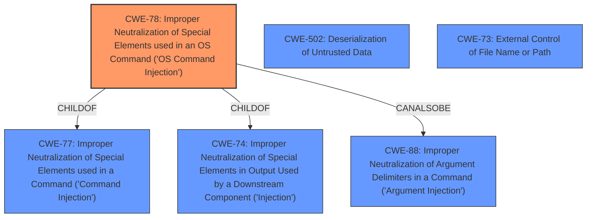

# Enhanced Analysis for CVE-2021-21372

# Summary
| CWE ID | CWE Name | Confidence | CWE Abstraction Level | CWE Vulnerability Mapping Label | CWE-Vulnerability Mapping Notes |
|---|---|---|---|---|---|
| CWE-78 | Improper Neutralization of Special Elements used in an OS Command ('OS Command Injection') | 1 | Base | Allowed | Primary CWE |
| CWE-502 | Deserialization of Untrusted Data | 0.7 | Base | Allowed | Secondary Candidate |
| CWE-73 | External Control of File Name or Path | 0.6 | Base | Allowed | Secondary Candidate |

## Evidence and Confidence

*   **Confidence Score:** 0.9
*   **Evidence Strength:** HIGH

## Relationship Analysis
The primary CWE is CWE-78, which has a ChildOf relationship with CWE-77 (Improper Neutralization of Special Elements used in a Command) and CWE-74 (Improper Neutralization of Special Elements in Output Used by a Downstream Component ('Injection')). It also has a CanAlsoBe relationship with CWE-88 (Improper Neutralization of Argument Delimiters in a Command ('Argument Injection')). The choice of CWE-78 as the primary is supported by the evidence that **arbitrary commands** are being executed.

CWE-502 and CWE-73 are secondary candidate CWEs because the vulnerability involves crafted package metadata, which could involve deserialization and external control of file names or paths.



## Vulnerability Chain
The vulnerability chain starts with the **improper handling of the `doCmd` function** within Nimble, leading to **command injection** via **malicious package metadata**. The final impact is the **execution of arbitrary commands**.

## Summary of Analysis
The initial analysis focused on the fact that the vulnerability allows an attacker to **execute arbitrary commands**. The "CVE Reference Links Content Summary" section confirms that the root cause includes "command injection via crafted package metadata." The "Vulnerability Description Key Phrases" mentions **"different use of Nimble doCmd"** leading to the ability to **"execute arbitrary commands"**.

The retriever results indicated that CWE-78 (Improper Neutralization of Special Elements used in an OS Command ('OS Command Injection')) is the most relevant CWE. Given the provided evidence, CWE-78 is the most appropriate primary mapping.

The graph relationships helped to understand the context of CWE-78 within the broader landscape of command injection and neutralization weaknesses.

The selected CWEs are at the optimal level of specificity because CWE-78 directly addresses the root cause of the vulnerability, which is the ability to inject and execute arbitrary OS commands.

Relevant CWE Information:

*   **CWE-78**: The product constructs all or part of an OS command using externally-influenced input from an upstream component, but it does not neutralize or incorrectly neutralizes special elements that could modify the intended OS command when it is sent to a downstream component. This perfectly aligns with the attacker crafting a malicious entry in the packages.json package list to trigger code execution.
*   **CWE-502**: The product deserializes untrusted data without sufficiently ensuring that the resulting data will be valid. This is a possible secondary CWE as the crafted package metadata could be deserialized.
*   **CWE-73**: The product allows user input to control or influence paths or file names that are used in filesystem operations. This is a possible secondary CWE as the crafted package metadata could influence file operations.

CWEs considered but not used:

*   CWE-23 (Relative Path Traversal): While path traversal could be a factor in some command injection scenarios, it is not the primary weakness described in the vulnerability.
*   CWE-88 (Improper Neutralization of Argument Delimiters in a Command ('Argument Injection')): While argument injection is related to command injection, the primary weakness is the ability to execute arbitrary commands, not just modify arguments.
*   CWE-61 (UNIX Symbolic Link (Symlink) Following): Symlink following is not mentioned in the description.
*   CWE-427 (Uncontrolled Search Path Element): Search path issues are not described.
*   CWE-22 (Improper Limitation of a Pathname to a Restricted Directory ('Path Traversal')): Path traversal is not the primary issue.
*   CWE-506 (Embedded Malicious Code): This is a Class level CWE, and is more about the intent, rather than a coding error.


## CWE Relationship Analysis

Current CWEs represent these abstraction levels: .


### Vulnerability Chain Analysis

**Chain starting from CWE-502:**
- 502 (Deserialization of Untrusted Data) - ROOT


**Chain starting from CWE-88:**
- 88 (Improper Neutralization of Argument Delimiters in a Command ('Argument Injection')) - ROOT


### CWE Relationship Diagram

```mermaid
graph TD
    classDef primary fill:#f96,stroke:#333,stroke-width:2px
    classDef secondary fill:#69f,stroke:#333
    classDef tertiary fill:#9e9,stroke:#333
```