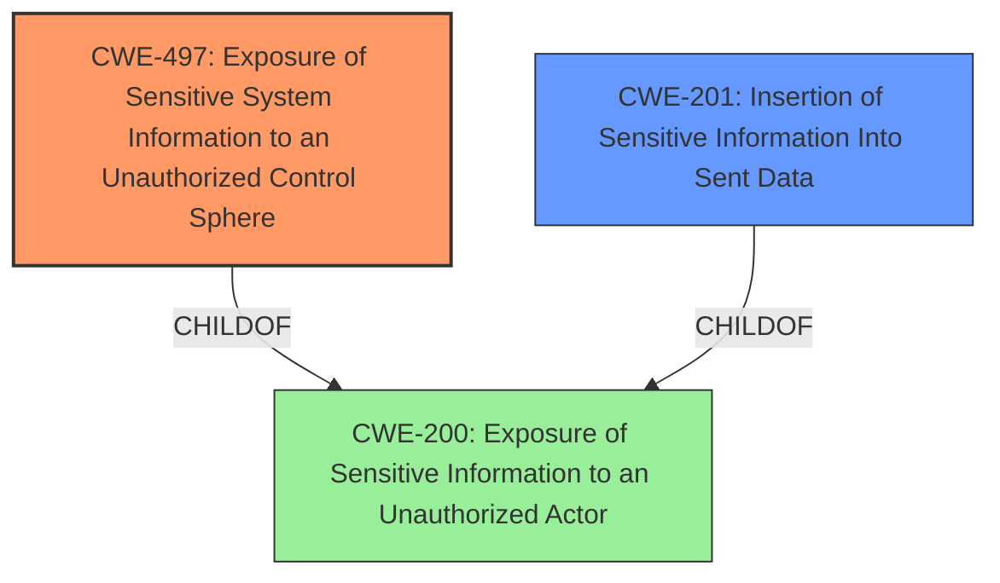

# Raw Analyzer Response for CVE-2021-21376

# Summary
| CWE ID | CWE Name | Confidence | CWE Abstraction Level | CWE Vulnerability Mapping Label | CWE-Vulnerability Mapping Notes |
|---|---|---|---|---|---|
| CWE-497 | Exposure of Sensitive System Information to an Unauthorized Control Sphere | 0.9 | Base | Allowed | Primary CWE. |
| CWE-201 | Insertion of Sensitive Information Into Sent Data | 0.7 | Base | Allowed | Secondary Candidate. |
| CWE-200 | Exposure of Sensitive Information to an Unauthorized Actor | 0.5 | Class | Discouraged | Secondary Candidate. |

## Evidence and Confidence

*   **Confidence Score:** 0.8
*   **Evidence Strength:** HIGH

## Relationship Analysis
The primary CWE selected is CWE-497, which is a Base level CWE and a child of CWE-200. CWE-201 is also considered because it is a base level CWE and a child of CWE-200. However, CWE-497 is selected as the primary CWE because it more specifically addresses the exposure of system information. CWE-200 is a class level CWE and is discouraged.

## Vulnerability Chain
The chain of events is as follows:
1.  The application **incorrectly** loads sensitive user information (user ID, name, group memberships) into the web client.
2.  This information is then **exposed** to the user through the web interface.

The root cause is the **unnecessary loading** of sensitive information, leading to its **exposure**.

## Summary of Analysis
The analysis indicates that the vulnerability is primarily due to the exposure of sensitive system information to an unauthorized control sphere, specifically the web client. The vulnerability description states that "OMERO.web before version 5.9.0 loads various information about the current user such as their id, name and the groups they are in, and these are available on the main webclient pages. This represents an **information exposure** vulnerability." The CVE Reference Links Content Summary states that "OMERO.web was exposing unnecessary session information, including user IDs, names, and group memberships, on the main webclient pages. Some of this loaded information was not actually used by the webclient." This aligns with CWE-497, which describes the product not properly preventing sensitive system-level information from being accessed by unauthorized actors.

The retriever results also list CWE-497 as the top combined result. The mapping guidance for CWE-497 states that it is at the Base level of abstraction, which is a preferred level of abstraction for mapping to the root causes of vulnerabilities, and its Usage is Allowed.

CWE-201, Insertion of Sensitive Information Into Sent Data, was considered because it also relates to the exposure of sensitive information. However, CWE-497 is a more precise fit because it specifically refers to the exposure of sensitive system information.

CWE-200, Exposure of Sensitive Information to an Unauthorized Actor, was also considered but it is a Class level CWE and is discouraged.

Therefore, CWE-497 is the most appropriate CWE for this vulnerability.
Relevant CWE Information:

# Enhanced Context (25 CWEs)

## CWE-497: Exposure of Sensitive System Information to an Unauthorized Control Sphere
**Abstraction:** Base
**Status:** Incomplete

### Description
The product does not properly prevent sensitive system-level information from being accessed by unauthorized actors who do not have the same level of access to the underlying system as the product does.

### Extended Description

Network-based products, such as web applications, often run on top of an operating system or similar environment. When the product communicates with outside parties, details about the underlying system are expected to remain hidden, such as path names for data files, other OS users, installed packages, the application environment, etc. This system information may be provided by the product itself, or buried within diagnostic or debugging messages. Debugging information helps an adversary learn about the system and form an attack plan.

An information exposure occurs when system data or debugging information leaves the program through an output stream or logging function that makes it accessible to unauthorized parties. Using other weaknesses, an attacker could cause errors to occur; the response to these errors can reveal detailed system information, along with other impacts. An attacker can use messages that reveal technologies, operating systems, and product versions to tune the attack against known vulnerabilities in these technologies. A product may use diagnostic methods that provide significant implementation details such as stack traces as part of its error handling mechanism.

### Alternative Terms
None

### Relationships
ChildOf -> CWE-200

### Mapping Guidance
**Usage:** Allowed
**Rationale:** This CWE entry is at the Base level of abstraction, which is a preferred level of abstraction for mapping to the root causes of vulnerabilities.
**Comments:** Carefully read both the name and description to ensure that this mapping is an appropriate fit. Do not try to 'force' a mapping to a lower-level Base/Variant simply to comply with this preferred level of abstraction.
**Reasons:**
- Acceptable-Use

### Observed Examples
- **CVE-2021-32638:** Code analysis product passes access tokens as a command-line parameter or through an environment variable, making them visible to other processes via the ps command.