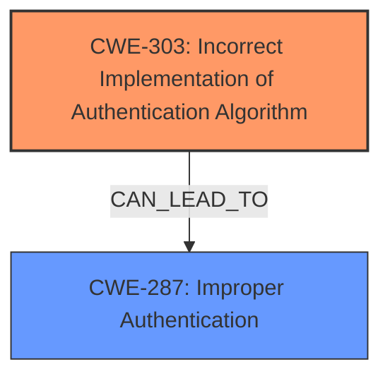

# Analysis for CVE-2021-21378

# Summary
| CWE ID | CWE Name | Confidence | CWE Abstraction Level | CWE Vulnerability Mapping Label | CWE-Vulnerability Mapping Notes |
|---|---|---|---|---|---|
| CWE-303 | Incorrect Implementation of Authentication Algorithm | 0.9 | Base | Primary | Allowed |
| CWE-287 | Improper Authentication | 0.6 | Class | Secondary | Discouraged |

## Evidence and Confidence

*   **Confidence Score:** 0.8
*   **Evidence Strength:** HIGH

## Relationship Analysis
The primary relationship influencing the decision is the hierarchical one. CWE-303 is a base-level CWE that provides a more specific description of the **mistake in implementation** than the class-level CWE-287, which is a parent. There is no direct chain relationship, but the **incorrect implementation** (CWE-303) leads to **improper authentication** (CWE-287) as a consequence.



## Vulnerability Chain
The vulnerability chain starts with the **incorrect implementation** of the JWT authentication filter, leading to the **authentication bypass** when a JWT token with an unknown issuer is presented.
  - **Root Cause:** CWE-303 (**Incorrect Implementation of Authentication Algorithm**)
  - **Weakness:** The `AnyVerifier` component incorrectly converting `JwtUnknownIssuer` to `JwtMissing`.
  - **Impact:** CWE-287 (**Improper Authentication**) - Bypassing authentication.

## Summary of Analysis
The initial assessment strongly points towards a flaw in the implementation of the authentication mechanism, specifically related to how JWT tokens with unknown issuers are handled. The evidence from the vulnerability description and the CVE Reference Links Content Summary clearly indicates a **mistake in implementation**.

> Envoy version 1.17.0 an attacker can bypass authentication by presenting a JWT token with an issuer that is not in the provider list when Envoys JWT Authentication filter is configured with the `allow_missing` requirement under `requires_any` due to a **mistake in implementation**.

The CVE Reference Links Content Summary supports this:

>The vulnerability stems from a flaw in the Envoy's JWT Authentication filter when used with the `allow_missing` requirement under a `requires_any` configuration. The `AnyVerifier` component, responsible for aggregating results from child verifiers, incorrectly converted a `JwtUnknownIssuer` error (indicating a JWT with an unrecognized issuer) into a `JwtMissing` error.

The graph relationships show that CWE-303 can lead to CWE-287. Therefore, CWE-303 is the more specific root cause, and CWE-287 is a secondary consequence.

CWE-303 is selected as the primary CWE because the root cause is an **incorrect implementation** of the authentication algorithm. This aligns perfectly with the description of CWE-303. The abstraction level is also optimal as it is a Base level CWE.

CWE-287 is considered but is a class-level CWE and less specific than CWE-303. Therefore it is a secondary CWE.

Relevant CWE Information:

# Enhanced Context (25 CWEs)

## CWE-303: Incorrect Implementation of Authentication Algorithm
**Abstraction Level**: Base
**Similarity Score**: 0.75
**Source**: dense

**Description**:
The requirements for the product dictate the use of an established authentication algorithm, but the implementation of the algorithm is incorrect.

**Mapping Guidance**:
- Usage: Allowed
- Rationale: This CWE entry is at the Base level of abstraction, which is a preferred level of abstraction for mapping to the root causes of vulnerabilities.

## CWE-287: Improper Authentication
**Abstraction Level:** Class
**Similarity Score**: 6481.93
**Source**: sparse

### Description
When an actor claims to have a given identity, the product does not prove or insufficiently proves that the claim is correct.

### Mapping Guidance
**Usage:** Discouraged
**Rationale:** This CWE entry might be misused when lower-level CWE entries are likely to be applicable. It is a level-1 Class (i.e., a child of a Pillar).
**Comments:** Consider children or descendants, beginning with CWE-1390: Weak Authentication or CWE-306: Missing Authentication for Critical Function.

# Enhanced Query for CVE-2021-21378

## Vulnerability Description
Envoy is a cloud-native high-performance edge/middle/service proxy. In Envoy version 1.17.0 an attacker can bypass authentication by presenting a JWT token with an issuer that is not in the provider list when Envoys JWT Authentication filter is configured with the `allow_missing` requirement under `requires_any` due to a **mistake in implementation**. Envoys JWT Authentication filter can be configured with the `allow_missing` requirement that will be satisfied if JWT is missing (JwtMissed error) and fail if JWT is presented or invalid. Due to a **mistake in implementation**, a JwtUnknownIssuer error was mistakenly converted to JwtMissed when `requires_any` was configured. So if `allow_missing` was configured under `requires_any`, an attacker can bypass authentication by presenting a JWT token with an issuer that is not in the provider list. Integrity may be impacted depending on configuration if the JWT token is used to protect against writes or modifications. This regression was introduced on 2020/11/12 in PR 13839 which fixed handling `allow_missing` under RequiresAny in a JwtRequirement (see issue 13458). The AnyVerifier aggregates the children verifiers results into a final status where JwtMissing is the default error. However, a JwtUnknownIssuer was mistakenly treated the same as a JwtMissing error and the resulting final aggregation was the default JwtMissing. As a result, `allow_missing` would allow a JWT token with an unknown issuer status. This is fixed in version 1.17.1 by PR 15194. The fix works by preferring JwtUnknownIssuer over a JwtMissing error, fixing the accidental conversion and bypass with `allow_missing`. A user could detect whether a bypass occurred if they have Envoy logs enabled with debug verbosity. Users can enable component level debug logs for JWT. The JWT filter logs will indicate that there is a request with a JWT token and a failure that the JWT token is missing.

### Vulnerability Description Key Phrases
- **rootcause:** **mistake in implementation**
- **impact:** bypass authentication
- **vector:** presenting a JWT token with an issuer that is not in the provider list
- **attacker:** attacker
- **product:** Envoy
- **version:** 1.17.0
- **component:** JWT Authentication filter

## CVE Reference Links Content Summary
```
{
  "vulnerability": {
    "root_cause": "The vulnerability stems from a flaw in the Envoy's JWT Authentication filter when used with the `allow_missing` requirement under a `requires_any` configuration. The `AnyVerifier` component, responsible for aggregating results from child verifiers, incorrectly converted a `JwtUnknownIssuer` error (indicating a JWT with an unrecognized issuer) into a `JwtMissing` error. This misinterpretation effectively bypassed authentication by treating tokens with the wrong issuer as if no token was present, thus satisfying the `allow_missing` condition.",
    "weaknesses": [
      "CWE-303: Incorrect Implementation of Authentication Algorithm"
    ],
    "impact": "An attacker can bypass authentication by presenting a JWT token with an issuer not listed in the allowed provider list. This can lead to unauthorized access to resources and may also impact integrity if the token is used to protect against write or modification actions.",
    "attack_vectors": "An attacker can send a request with a JWT token that has an issuer not configured in the JWT filter's provider list.",
    "required_capabilities": "The attacker does not need any special privileges or user interaction, as the vulnerability can be exploited by any client sending crafted requests.",
    "additional_details": "The vulnerability was introduced by PR #13839 and fixed by PR #15194. The vulnerable versions include Envoy 1.17.0. The fix prefers `JwtUnknownIssuer` over `JwtMissing`, thus correcting the error aggregation behavior and preventing the bypass. A temporary mitigation is provided by using RBAC with the jwt filter's metadata.",
    "cvss_score": "8.2 (High)",
    "affected_versions": [
      "1.17.0"
    ],
    "patched_versions": [
      "1.17.1"
    ]
  }
}
```

## Retriever Results

### Top Combined Results

| Rank | CWE ID | Name | Abstraction | Usage  | Retrievers | Individual Scores |
|------|--------|------|-------------|-------|------------|-------------------|
| 1 | 287 | Improper Authentication | Class | Discouraged | sparse | 2.090 |
| 2 | 347 | Improper Verification of Cryptographic Signature | Base | Allowed | sparse | 1.683 |
| 3 | 327 | Use of a Broken or Risky Cryptographic Algorithm | Class | Allowed-with-Review | sparse | 1.597 |
| 4 | 201 | Insertion of Sensitive Information Into Sent Data | Base | Allowed | sparse | 1.587 |
| 5 | 345 | Insufficient Verification of Data Authenticity | Class | Discouraged | sparse | 1.577 |
| 6 | 441 | Unintended Proxy or Intermediary ('Confused Deputy') | Class | Allowed-with-Review | dense | 0.492 |
| 7 | 226 | Sensitive Information in Resource Not Removed Before Reuse | Base | Allowed | graph | 0.002 |
| 8 | 863 | Incorrect Authorization | Class | Allowed-with-Review | sparse | 1.573 |
| 9 | 697 | Incorrect Comparison | Pillar | Discouraged | sparse | 1.538 |
| 10 | 1390 | Weak Authentication | Class | Allowed-with-Review | sparse | 1.537 |


# Complete CWE Specifications


## CWE-287: Improper Authentication
**Abstraction:** Class
**Status:** Draft

### Description
When an actor claims to have a given identity, the product does not prove or insufficiently proves that the claim is correct.

### Extended Description
Not provided

### Alternative Terms
authentification: An alternate term is "authentification", which appears to be most commonly used by people from non-English-speaking countries.
AuthN: "AuthN" is typically used as an abbreviation of "authentication" within the web application security community. It is also distinct from "AuthZ," which is an abbreviation of "authorization." The use of "Auth" as an abbreviation is discouraged, since it could be used for either authentication or authorization.
AuthC: "AuthC" is used as an abbreviation of "authentication," but it appears to used less frequently than "AuthN."

### Relationships
ChildOf -> CWE-284
ChildOf -> CWE-284

### Mapping Guidance
**Usage:** Discouraged
**Rationale:** This CWE entry might be misused when lower-level CWE entries are likely to be applicable. It is a level-1 Class (i.e., a child of a Pillar).
**Comments:** Consider children or descendants, beginning with CWE-1390: Weak Authentication or CWE-306: Missing Authentication for Critical Function.
**Reasons:**
- Frequent Misuse
**Suggested Alternatives:**
- CWE-1390: Weak Authentication
- CWE-306: Missing Authentication for Critical Function


### Additional Notes
**[Relationship]** This can be resultant from SQL injection vulnerabilities and other issues.

**[Maintenance]** The Taxonomy_Mappings to ISA/IEC 62443 were added in CWE 4.10, but they are still under review and might change in future CWE versions. These draft mappings were performed by members of the "Mapping CWE to 62443" subgroup of the CWE-CAPEC ICS/OT Special Interest Group (SIG), and their work is incomplete as of CWE 4.10. The mappings are included to facilitate discussion and review by the broader ICS/OT community, and they are likely to change in future CWE versions.


### Observed Examples
- **CVE-2022-35248:** Chat application skips validation when Central Authentication Service (CAS) is enabled, effectively removing the second factor from two-factor authentication
- **CVE-2022-36436:** Python-based authentication proxy does not enforce password authentication during the initial handshake, allowing the client to bypass authentication by specifying a 'None' authentication type.
- **CVE-2022-30034:** Chain: Web UI for a Python RPC framework does not use regex anchors to validate user login emails (CWE-777), potentially allowing bypass of OAuth (CWE-1390).


## CWE-347: Improper Verification of Cryptographic Signature
**Abstraction:** Base
**Status:** Draft

### Description
The product does not verify, or incorrectly verifies, the cryptographic signature for data.

### Extended Description
Not provided

### Alternative Terms
None

### Relationships
ChildOf -> CWE-345
ChildOf -> CWE-345

### Mapping Guidance
**Usage:** Allowed
**Rationale:** This CWE entry is at the Base level of abstraction, which is a preferred level of abstraction for mapping to the root causes of vulnerabilities.
**Comments:** Carefully read both the name and description to ensure that this mapping is an appropriate fit. Do not try to 'force' a mapping to a lower-level Base/Variant simply to comply with this preferred level of abstraction.
**Reasons:**
- Acceptable-Use


### Observed Examples
- **CVE-2002-1796:** Does not properly verify signatures for "trusted" entities.
- **CVE-2005-2181:** Insufficient verification allows spoofing.
- **CVE-2005-2182:** Insufficient verification allows spoofing.


## CWE-327: Use of a Broken or Risky Cryptographic Algorithm
**Abstraction:** Class
**Status:** Draft

### Description
The product uses a broken or risky cryptographic algorithm or protocol.

### Extended Description


Cryptographic algorithms are the methods by which data is scrambled to prevent observation or influence by unauthorized actors. Insecure cryptography can be exploited to expose sensitive information, modify data in unexpected ways, spoof identities of other users or devices, or other impacts.


It is very difficult to produce a secure algorithm, and even high-profile algorithms by accomplished cryptographic experts have been broken. Well-known techniques exist to break or weaken various kinds of cryptography. Accordingly, there are a small number of well-understood and heavily studied algorithms that should be used by most products. Using a non-standard or known-insecure algorithm is dangerous because a determined adversary may be able to break the algorithm and compromise whatever data has been protected.


Since the state of cryptography advances so rapidly, it is common for an algorithm to be considered "unsafe" even if it was once thought to be strong. This can happen when new attacks are discovered, or if computing power increases so much that the cryptographic algorithm no longer provides the amount of protection that was originally thought.


For a number of reasons, this weakness is even more challenging to manage with hardware deployment of cryptographic algorithms as opposed to software implementation. First, if a flaw is discovered with hardware-implemented cryptography, the flaw cannot be fixed in most cases without a recall of the product, because hardware is not easily replaceable like software. Second, because the hardware product is expected to work for years, the adversary's computing power will only increase over time.


### Alternative Terms
None

### Relationships
ChildOf -> CWE-693
PeerOf -> CWE-311

### Mapping Guidance
**Usage:** Allowed-with-Review
**Rationale:** This CWE entry is a Class and might have Base-level children that would be more appropriate
**Comments:** Examine children of this entry to see if there is a better fit
**Reasons:**
- Abstraction


### Additional Notes
**[Maintenance]** Since CWE 4.4, various cryptography-related entries, including CWE-327 and CWE-1240, have been slated for extensive research, analysis, and community consultation to define consistent terminology, improve relationships, and reduce overlap or duplication. As of CWE 4.6, this work is still ongoing.

**[Maintenance]** The Taxonomy_Mappings to ISA/IEC 62443 were added in CWE 4.10, but they are still under review and might change in future CWE versions. These draft mappings were performed by members of the "Mapping CWE to 62443" subgroup of the CWE-CAPEC ICS/OT Special Interest Group (SIG), and their work is incomplete as of CWE 4.10. The mappings are included to facilitate discussion and review by the broader ICS/OT community, and they are likely to change in future CWE versions.


### Observed Examples
- **CVE-2022-30273:** SCADA-based protocol supports a legacy encryption mode that uses Tiny Encryption Algorithm (TEA) in ECB mode, which leaks patterns in messages and cannot protect integrity
- **CVE-2022-30320:** Programmable Logic Controller (PLC) uses a protocol with a cryptographically insecure hashing algorithm for passwords.
- **CVE-2008-3775:** Product uses "ROT-25" to obfuscate the password in the registry.


## CWE-201: Insertion of Sensitive Information Into Sent Data
**Abstraction:** Base
**Status:** Draft

### Description
The code transmits data to another actor, but a portion of the data includes sensitive information that should not be accessible to that actor.

### Extended Description
Not provided

### Alternative Terms
None

### Relationships
ChildOf -> CWE-200
CanAlsoBe -> CWE-209
CanAlsoBe -> CWE-202

### Mapping Guidance
**Usage:** Allowed
**Rationale:** This CWE entry is at the Base level of abstraction, which is a preferred level of abstraction for mapping to the root causes of vulnerabilities.
**Comments:** Carefully read both the name and description to ensure that this mapping is an appropriate fit. Do not try to 'force' a mapping to a lower-level Base/Variant simply to comply with this preferred level of abstraction.
**Reasons:**
- Acceptable-Use


### Additional Notes
**[Other]** Sensitive information could include data that is sensitive in and of itself (such as credentials or private messages), or otherwise useful in the further exploitation of the system (such as internal file system structure).


### Observed Examples
- **CVE-2022-0708:** Collaboration platform does not clear team emails in a response, allowing leak of email addresses


## CWE-345: Insufficient Verification of Data Authenticity
**Abstraction:** Class
**Status:** Draft

### Description
The product does not sufficiently verify the origin or authenticity of data, in a way that causes it to accept invalid data.

### Extended Description
Not provided

### Alternative Terms
None

### Relationships
ChildOf -> CWE-693

### Mapping Guidance
**Usage:** Discouraged
**Rationale:** This CWE entry is a level-1 Class (i.e., a child of a Pillar). It might have lower-level children that would be more appropriate
**Comments:** Examine children of this entry to see if there is a better fit
**Reasons:**
- Abstraction


### Additional Notes
**[Relationship]** "origin validation" could fall under this.

**[Maintenance]** The specific ways in which the origin is not properly identified should be laid out as separate weaknesses. In some sense, this is more like a category.


### Observed Examples
- **CVE-2022-30260:** Distributed Control System (DCS) does not sign firmware images and only relies on insecure checksums for integrity checks
- **CVE-2022-30267:** Distributed Control System (DCS) does not sign firmware images and only relies on insecure checksums for integrity checks
- **CVE-2022-30272:** Remote Terminal Unit (RTU) does not use signatures for firmware images and relies on insecure checksums


## CWE-441: Unintended Proxy or Intermediary ('Confused Deputy')
**Abstraction:** Class
**Status:** Draft

### Description
The product receives a request, message, or directive from an upstream component, but the product does not sufficiently preserve the original source of the request before forwarding the request to an external actor that is outside of the product's control sphere. This causes the product to appear to be the source of the request, leading it to act as a proxy or other intermediary between the upstream component and the external actor.

### Extended Description


If an attacker cannot directly contact a target, but the product has access to the target, then the attacker can send a request to the product and have it be forwarded to the target. The request would appear to be coming from the product's system, not the attacker's system. As a result, the attacker can bypass access controls (such as firewalls) or hide the source of malicious requests, since the requests would not be coming directly from the attacker.


Since proxy functionality and message-forwarding often serve a legitimate purpose, this issue only becomes a vulnerability when:


  - The product runs with different privileges or on a different system, or otherwise has different levels of access than the upstream component;

  - The attacker is prevented from making the request directly to the target; and

  - The attacker can create a request that the proxy does not explicitly intend to be forwarded on the behalf of the requester. Such a request might point to an unexpected hostname, port number, hardware IP, or service. Or, the request might be sent to an allowed service, but the request could contain disallowed directives, commands, or resources.


### Alternative Terms
Confused Deputy: This weakness is sometimes referred to as the "Confused deputy" problem, in which an attacker misused the authority of one victim (the "confused deputy") when targeting another victim.

### Relationships
ChildOf -> CWE-610
CanPrecede -> CWE-668

### Mapping Guidance
**Usage:** Allowed-with-Review
**Rationale:** This CWE entry is a Class and might have Base-level children that would be more appropriate
**Comments:** Examine children of this entry to see if there is a better fit
**Reasons:**
- Abstraction


### Additional Notes
**[Relationship]** This weakness has a chaining relationship with CWE-668 (Exposure of Resource to Wrong Sphere) because the proxy effectively provides the attacker with access to the target's resources that the attacker cannot directly obtain.

**[Maintenance]** This could possibly be considered as an emergent resource.

**[Theoretical]** It could be argued that the "confused deputy" is a fundamental aspect of most vulnerabilities that require an active attacker. Even for common implementation issues such as buffer overflows, SQL injection, OS command injection, and path traversal, the vulnerable program already has the authorization to run code or access files. The vulnerability arises when the attacker causes the program to run unexpected code or access unexpected files.


### Observed Examples
- **CVE-1999-0017:** FTP bounce attack. The design of the protocol allows an attacker to modify the PORT command to cause the FTP server to connect to other machines besides the attacker's.
- **CVE-1999-0168:** RPC portmapper could redirect service requests from an attacker to another entity, which thinks the requests came from the portmapper.
- **CVE-2005-0315:** FTP server does not ensure that the IP address in a PORT command is the same as the FTP user's session, allowing port scanning by proxy.


## CWE-226: Sensitive Information in Resource Not Removed Before Reuse
**Abstraction:** Base
**Status:** Draft

### Description
The product releases a resource such as memory or a file so that it can be made available for reuse, but it does not clear or "zeroize" the information contained in the resource before the product performs a critical state transition or makes the resource available for reuse by other entities.

### Extended Description


When resources are released, they can be made available for reuse. For example, after memory is de-allocated, an operating system may make the memory available to another process, or disk space may be reallocated when a file is deleted. As removing information requires time and additional resources, operating systems do not usually clear the previously written information.


Even when the resource is reused by the same process, this weakness can arise when new data is not as large as the old data, which leaves portions of the old data still available. Equivalent errors can occur in other situations where the length of data is variable but the associated data structure is not. If memory is not cleared after use, the information may be read by less trustworthy parties when the memory is reallocated.


This weakness can apply in hardware, such as when a device or system switches between power, sleep, or debug states during normal operation, or when execution changes to different users or privilege levels.


### Alternative Terms
None

### Relationships
ChildOf -> CWE-459
ChildOf -> CWE-212
CanPrecede -> CWE-201

### Mapping Guidance
**Usage:** Allowed
**Rationale:** This CWE entry is at the Base level of abstraction, which is a preferred level of abstraction for mapping to the root causes of vulnerabilities.
**Comments:** Carefully read both the name and description to ensure that this mapping is an appropriate fit. Do not try to 'force' a mapping to a lower-level Base/Variant simply to comply with this preferred level of abstraction.
**Reasons:**
- Acceptable-Use


### Additional Notes
**[Relationship]** There is a close association between CWE-226 and CWE-212. The difference is partially that of perspective. CWE-226 is geared towards the final stage of the resource lifecycle, in which the resource is deleted, eliminated, expired, or otherwise released for reuse. Technically, this involves a transfer to a different control sphere, in which the original contents of the resource are no longer relevant. CWE-212, however, is intended for sensitive data in resources that are intentionally shared with others, so they are still active. This distinction is useful from the perspective of the CWE research view (CWE-1000).

**[Maintenance]** This entry needs modification to clarify the differences with CWE-212. The description also combines two problems that are distinct from the CWE research perspective: the inadvertent transfer of information to another sphere, and improper initialization/shutdown. Some of the associated taxonomy mappings reflect these different uses.

**[Research Gap]** This is frequently found for network packets, but it can also exist in local memory allocation, files, etc.


### Observed Examples
- **CVE-2019-3733:** Cryptography library does not clear heap memory before release
- **CVE-2003-0001:** Ethernet NIC drivers do not pad frames with null bytes, leading to infoleak from malformed packets.
- **CVE-2003-0291:** router does not clear information from DHCP packets that have been previously used


## CWE-863: Incorrect Authorization
**Abstraction:** Class
**Status:** Incomplete

### Description
The product performs an authorization check when an actor attempts to access a resource or perform an action, but it does not correctly perform the check.

### Extended Description
Not provided

### Alternative Terms
AuthZ: "AuthZ" is typically used as an abbreviation of "authorization" within the web application security community. It is distinct from "AuthN" (or, sometimes, "AuthC") which is an abbreviation of "authentication." The use of "Auth" as an abbreviation is discouraged, since it could be used for either authentication or authorization.

### Relationships
ChildOf -> CWE-285
ChildOf -> CWE-284

### Mapping Guidance
**Usage:** Allowed-with-Review
**Rationale:** This CWE entry is a Class and might have Base-level children that would be more appropriate
**Comments:** Examine children of this entry to see if there is a better fit
**Reasons:**
- Abstraction


### Additional Notes
**[Terminology]** 

Assuming a user with a given identity, authorization is the process of determining whether that user can access a given resource, based on the user's privileges and any permissions or other access-control specifications that apply to the resource.


### Observed Examples
- **CVE-2021-39155:** Chain: A microservice integration and management platform compares the hostname in the HTTP Host header in a case-sensitive way (CWE-178, CWE-1289), allowing bypass of the authorization policy (CWE-863) using a hostname with mixed case or other variations.
- **CVE-2019-15900:** Chain: sscanf() call is used to check if a username and group exists, but the return value of sscanf() call is not checked (CWE-252), causing an uninitialized variable to be checked (CWE-457), returning success to allow authorization bypass for executing a privileged (CWE-863).
- **CVE-2009-2213:** Gateway uses default "Allow" configuration for its authorization settings.


## CWE-697: Incorrect Comparison
**Abstraction:** Pillar
**Status:** Incomplete

### Description
The product compares two entities in a security-relevant context, but the comparison is incorrect, which may lead to resultant weaknesses.

### Extended Description


This Pillar covers several possibilities:


  - the comparison checks one factor incorrectly;

  - the comparison should consider multiple factors, but it does not check at least one of those factors at all;

  - the comparison checks the wrong factor.


### Alternative Terms
None

### Relationships
None

### Mapping Guidance
**Usage:** Discouraged
**Rationale:** This CWE entry is extremely high-level, a Pillar. However, sometimes this weakness is forced to be used due to the lack of in-depth weakness research. See Research Gaps.
**Comments:** Where feasible, consider children or descendants of this entry instead.
**Reasons:**
- Abstraction


### Additional Notes
**[Research Gap]** 

Weaknesses related to this Pillar appear to be under-studied, especially with respect to classification schemes. Input from academic and other communities could help identify and resolve gaps or organizational difficulties within CWE.


**[Maintenance]** This entry likely has some relationships with case sensitivity (CWE-178), but case sensitivity is a factor in other types of weaknesses besides comparison. Also, in cryptography, certain attacks are possible when certain comparison operations do not take place in constant time, causing a timing-related information leak (CWE-208).


### Observed Examples
- **CVE-2021-3116:** Chain: Python-based HTTP Proxy server uses the wrong boolean operators (CWE-480) causing an incorrect comparison (CWE-697) that identifies an authN failure if all three conditions are met instead of only one, allowing bypass of the proxy authentication (CWE-1390)
- **CVE-2020-15811:** Chain: Proxy uses a substring search instead of parsing the Transfer-Encoding header (CWE-697), allowing request splitting (CWE-113) and cache poisoning
- **CVE-2016-10003:** Proxy performs incorrect comparison of request headers, leading to infoleak


## CWE-1390: Weak Authentication
**Abstraction:** Class
**Status:** Incomplete

### Description
The product uses an authentication mechanism to restrict access to specific users or identities, but the mechanism does not sufficiently prove that the claimed identity is correct.

### Extended Description


Attackers may be able to bypass weak authentication faster and/or with less effort than expected.


### Alternative Terms
None

### Relationships
ChildOf -> CWE-287

### Mapping Guidance
**Usage:** Allowed-with-Review
**Rationale:** This CWE entry is a Class and might have Base-level children that would be more appropriate
**Comments:** Examine children of this entry to see if there is a better fit
**Reasons:**
- Abstraction


### Observed Examples
- **CVE-2022-30034:** Chain: Web UI for a Python RPC framework does not use regex anchors to validate user login emails (CWE-777), potentially allowing bypass of OAuth (CWE-1390).
- **CVE-2022-35248:** Chat application skips validation when Central Authentication Service (CAS) is enabled, effectively removing the second factor from two-factor authentication
- **CVE-2021-3116:** Chain: Python-based HTTP Proxy server uses the wrong boolean operators (CWE-480) causing an incorrect comparison (CWE-697) that identifies an authN failure if all three conditions are met instead of only one, allowing bypass of the proxy authentication (CWE-1390)

