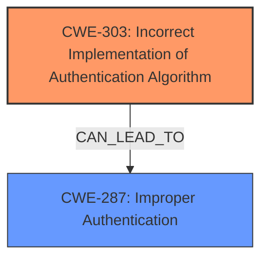

# Analysis Report for CVE-2021-21378

# Vulnerability Analysis Report: CVE-2021-21378

## Description


## Analysis (with Relationship Data)

# Summary
| CWE ID | CWE Name | Confidence | CWE Abstraction Level | CWE Vulnerability Mapping Label | CWE-Vulnerability Mapping Notes |
|---|---|---|---|---|---|
| CWE-303 | Incorrect Implementation of Authentication Algorithm | 0.9 | Base | Primary | Allowed |
| CWE-287 | Improper Authentication | 0.6 | Class | Secondary | Discouraged |

## Evidence and Confidence

*   **Confidence Score:** 0.8
*   **Evidence Strength:** HIGH

## Relationship Analysis
The primary relationship influencing the decision is the hierarchical one. CWE-303 is a base-level CWE that provides a more specific description of the **mistake in implementation** than the class-level CWE-287, which is a parent. There is no direct chain relationship, but the **incorrect implementation** (CWE-303) leads to **improper authentication** (CWE-287) as a consequence.



## Vulnerability Chain
The vulnerability chain starts with the **incorrect implementation** of the JWT authentication filter, leading to the **authentication bypass** when a JWT token with an unknown issuer is presented.
  - **Root Cause:** CWE-303 (**Incorrect Implementation of Authentication Algorithm**)
  - **Weakness:** The `AnyVerifier` component incorrectly converting `JwtUnknownIssuer` to `JwtMissing`.
  - **Impact:** CWE-287 (**Improper Authentication**) - Bypassing authentication.

## Summary of Analysis
The initial assessment strongly points towards a flaw in the implementation of the authentication mechanism, specifically related to how JWT tokens with unknown issuers are handled. The evidence from the vulnerability description and the CVE Reference Links Content Summary clearly indicates a **mistake in implementation**.

> Envoy version 1.17.0 an attacker can bypass authentication by presenting a JWT token with an issuer that is not in the provider list when Envoys JWT Authentication filter is configured with the `allow_missing` requirement under `requires_any` due to a **mistake in implementation**.

The CVE Reference Links Content Summary supports this:

>The vulnerability stems from a flaw in the Envoy's JWT Authentication filter when used with the `allow_missing` requirement under a `requires_any` configuration. The `AnyVerifier` component, responsible for aggregating results from child verifiers, incorrectly converted a `JwtUnknownIssuer` error (indicating a JWT with an unrecognized issuer) into a `JwtMissing` error.

The graph relationships show that CWE-303 can lead to CWE-287. Therefore, CWE-303 is the more specific root cause, and CWE-287 is a secondary consequence.

CWE-303 is selected as the primary CWE because the root cause is an **incorrect implementation** of the authentication algorithm. This aligns perfectly with the description of CWE-303. The abstraction level is also optimal as it is a Base level CWE.

CWE-287 is considered but is a class-level CWE and less specific than CWE-303. Therefore it is a secondary CWE.

Relevant CWE Information:

# Enhanced Context (25 CWEs)

## CWE-303: Incorrect Implementation of Authentication Algorithm
**Abstraction Level**: Base
**Similarity Score**: 0.75
**Source**: dense

**Description**:
The requirements for the product dictate the use of an established authentication algorithm, but the implementation of the algorithm is incorrect.

**Mapping Guidance**:
- Usage: Allowed
- Rationale: This CWE entry is at the Base level of abstraction, which is a preferred level of abstraction for mapping to the root causes of vulnerabilities.

## CWE-287: Improper Authentication
**Abstraction Level:** Class
**Similarity Score**: 6481.93
**Source**: sparse

### Description
When an actor claims to have a given identity, the product does not prove or insufficiently proves that the claim is correct.

### Mapping Guidance
**Usage:** Discouraged
**Rationale:** This CWE entry might be misused when lower-level CWE entries are likely to be applicable. It is a level-1 Class (i.e., a child of a Pillar).
**Comments:** Consider children or descendants, beginning with CWE-1390: Weak Authentication or CWE-306: Missing Authentication for Critical Function.


## CWE Relationship Analysis

Current CWEs represent these abstraction levels: .


### Vulnerability Chain Analysis

**Chain starting from CWE-306:**
- 306 (Missing Authentication for Critical Function) - ROOT


**Chain starting from CWE-287:**
- 287 (Improper Authentication) - ROOT


### CWE Relationship Diagram

```mermaid
graph TD
    classDef primary fill:#f96,stroke:#333,stroke-width:2px
    classDef secondary fill:#69f,stroke:#333
    classDef tertiary fill:#9e9,stroke:#333
```


*Report generated on 2025-04-02 10:07:44*
