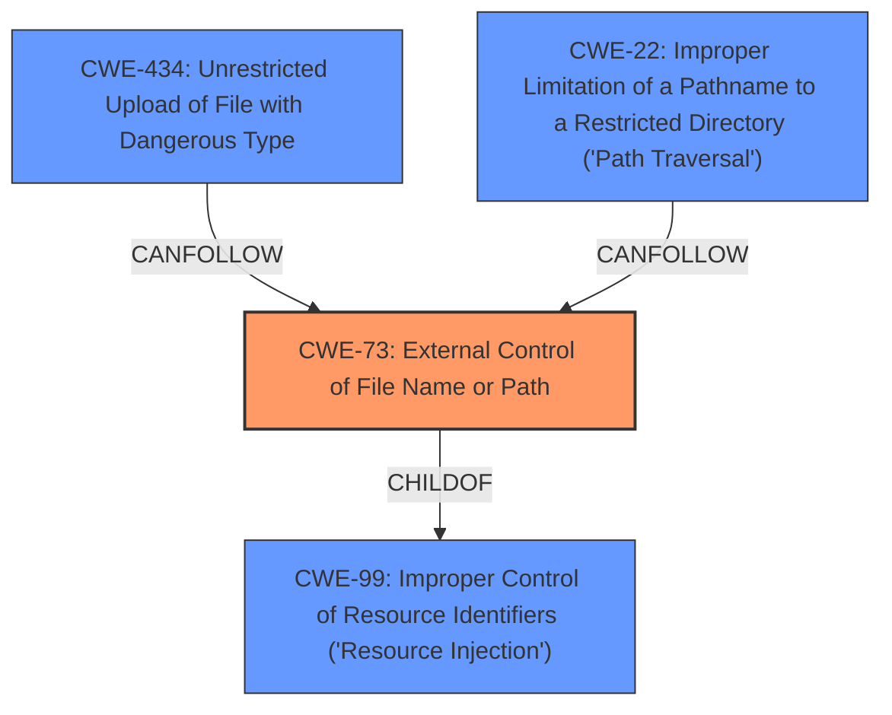

# Analysis for CVE-2021-21381

# Summary
| CWE ID | CWE Name | Confidence | CWE Abstraction Level | CWE Vulnerability Mapping Label | CWE-Vulnerability Mapping Notes |
|---|---|---|---|---|---|
| CWE-73 | External Control of File Name or Path | 0.9 | Base | Allowed | Primary CWE |
| CWE-434 | Unrestricted Upload of File with Dangerous Type | 0.6 | Base | Allowed | Secondary Candidate |
| CWE-22 | Improper Limitation of a Pathname to a Restricted Directory ('Path Traversal') | 0.5 | Base | Allowed | Secondary Candidate |
| CWE-99 | Improper Control of Resource Identifiers ('Resource Injection') | 0.4 | Class | Allowed-with-Review | Secondary Candidate |

## Evidence and Confidence

*   **Confidence Score:** 0.9
*   **Evidence Strength:** HIGH

## Relationship Analysis
The primary CWE is CWE-73, which describes the root cause of allowing user input to control file names or paths. CWE-434 and CWE-22 are related in that they can often follow CWE-73, as the ability to control file names or paths can lead to unrestricted uploads or path traversal vulnerabilities. CWE-99 is a broader class that encompasses CWE-73 but lacks the specificity needed for this particular case.

## Vulnerability Chain
The vulnerability chain starts with **external control of file names/paths** (CWE-73). This control allows an attacker to manipulate the `Exec` field of a Flatpak application's `.desktop` file using special tokens (`@@` and `@@u`). By injecting arbitrary file paths, the attacker can bypass intended file access restrictions, potentially leading to the application gaining access to unauthorized files. The final impact is the ability to read arbitrary files from the host system.

## Summary of Analysis
The analysis focuses on identifying the root cause of the vulnerability based on the provided description. The primary vulnerability is the **improper handling of external control over file names or paths** (CWE-73). The vulnerability description key phrases highlight this, stating the "**vulnerability in file forwarding feature**," which relies on manipulating file paths. The CVE reference links content summary confirms that the root cause is **insufficient input validation** of arguments in the `Exec` field of the `.desktop` file, allowing for **arbitrary file paths to be injected**. This directly aligns with the description of CWE-73, which states that "The product allows user input to control or influence paths or file names that are used in filesystem operations."

CWE-434 (Unrestricted Upload of File with Dangerous Type) was considered because the attacker is effectively "uploading" a malicious `.desktop` file, but the core issue isn't the type of file being uploaded but rather the manipulation of file paths within it. CWE-22 (Improper Limitation of a Pathname to a Restricted Directory ('Path Traversal')) was considered since the attacker is using path manipulation to access files outside the intended scope. CWE-99 (Improper Control of Resource Identifiers ('Resource Injection')) was also considered, but it is a broader class and not as specific as CWE-73 in this case.

The relationships between the CWEs influenced the selection. CWE-73 is at the Base level of abstraction, which is preferred, and it directly addresses the root cause. While CWE-434 and CWE-22 are potential consequences of CWE-73, mapping directly to the root cause provides a more accurate representation of the vulnerability.

The high confidence score (0.9) is based on the clear evidence from the vulnerability description, the CVE reference links content summary, and the alignment with the CWE-73 description.

Relevant CWE Information:

# Enhanced Context (25 CWEs)

## CWE-59: Improper Link Resolution Before File Access ('Link Following')
**Abstraction Level**: Base
**Similarity Score**: 0.77
**Source**: dense

**Description**:
The product attempts to access a file based on the filename, but it does not properly prevent that filename from identifying a link or shortcut that resolves to an unintended resource.

**Mapping Guidance**:
- Usage: Allowed
- Rationale: This CWE entry is at the Base level of abstraction, which is a preferred level of abstraction for mapping to the root causes of vulnerabilities.

## CWE-668: Exposure of Resource to Wrong Sphere
**Abstraction Level**: Class
**Similarity Score**: 0.77
**Source**: dense

**Description**:
The product exposes a resource to the wrong control sphere, providing unintended actors with inappropriate access to the resource.

**Mapping Guidance**:
- Usage: Discouraged
- Rationale: CWE-668 is high-level and is often misused as a catch-all when lower-level CWE IDs might be applicable. It is sometimes used for low-information vulnerability reports [REF-1287]. It is a level-1 Class (i.e., a child of a Pillar). It is not useful for trend analysis.

## CWE-41: Improper Resolution of Path Equivalence
**Abstraction Level**: Base
**Similarity Score**: 0.76
**Source**: dense

**Description**:
The product is vulnerable to file system contents disclosure through path equivalence. Path equivalence involves the use of special characters in file and directory names. The associated manipulations are intended to generate multiple names for the same object.

**Mapping Guidance**:
- Usage: Allowed
- Rationale: This CWE entry is at the Base level of abstraction, which is a preferred level of abstraction for mapping to the root causes of vulnerabilities.

## CWE-184: Incomplete List of Disallowed Inputs
**Abstraction Level**: Base
**Similarity Score**: 0.76
**Source**: dense

**Description**:
The product implements a protection mechanism that relies on a list of inputs (or properties of inputs) that are not allowed by policy or otherwise require other action to neutralize before additional processing takes place, but the list is incomplete.

**Mapping Guidance**:
- Usage: Allowed
- Rationale: This CWE entry is at the Base level of abstraction, which is a preferred level of abstraction for mapping to the root causes of vulnerabilities.

## CWE-639: Authorization Bypass Through User-Controlled Key
**Abstraction Level**: Base
**Similarity Score**: 0.76
**Source**: dense

**Description**:
The system's authorization functionality does not prevent one user from gaining access to another user's data or record by modifying the key value identifying the data.

**Mapping Guidance**:
- Usage: Allowed
- Rationale: This CWE entry is at the Base level of abstraction, which is a preferred level of abstraction for mapping to the root causes of vulnerabilities.

## CWE-74: Improper Neutralization of Special Elements in Output Used by a Downstream Component ('Injection')
**Abstraction Level**: Class
**Similarity Score**: 0.76
**Source**: dense

**Description**:
The product constructs all or part of a command, data structure, or record using externally-influenced input from an upstream component, but it does not neutralize or incorrectly neutralizes special elements that could modify how it is parsed or interpreted when it is sent to a downstream component.

**Mapping Guidance**:
- Usage: Discouraged
- Rationale: CWE-74 is high-level and often misused when lower-level weaknesses are more appropriate.

## CWE-807: Reliance on Untrusted Inputs in a Security Decision
**Abstraction Level**: Base
**Similarity Score**: 0.76
**Source**: dense

**Description**:
The product uses a protection mechanism that relies on the existence or values of an input, but the input can be modified by an untrusted actor in a way that bypasses the protection mechanism.

**Mapping Guidance**:
- Usage: Allowed
- Rationale: This CWE entry is at the Base level of abstraction, which is a preferred level of abstraction for mapping to the root causes of vulnerabilities.

## CWE-23: Relative Path Traversal
**Abstraction Level**: Base
**Similarity Score**: 0.76
**Source**: dense

**Description**:
The product uses external input to construct a pathname that should be within a restricted directory, but it does not properly neutralize sequences such as ".." that can resolve to a location that is outside of that directory.

**Mapping Guidance**:
- Usage: Allowed
- Rationale: This CWE entry is at the Base level of abstraction, which is a preferred level of abstraction for mapping to the root causes of vulnerabilities.