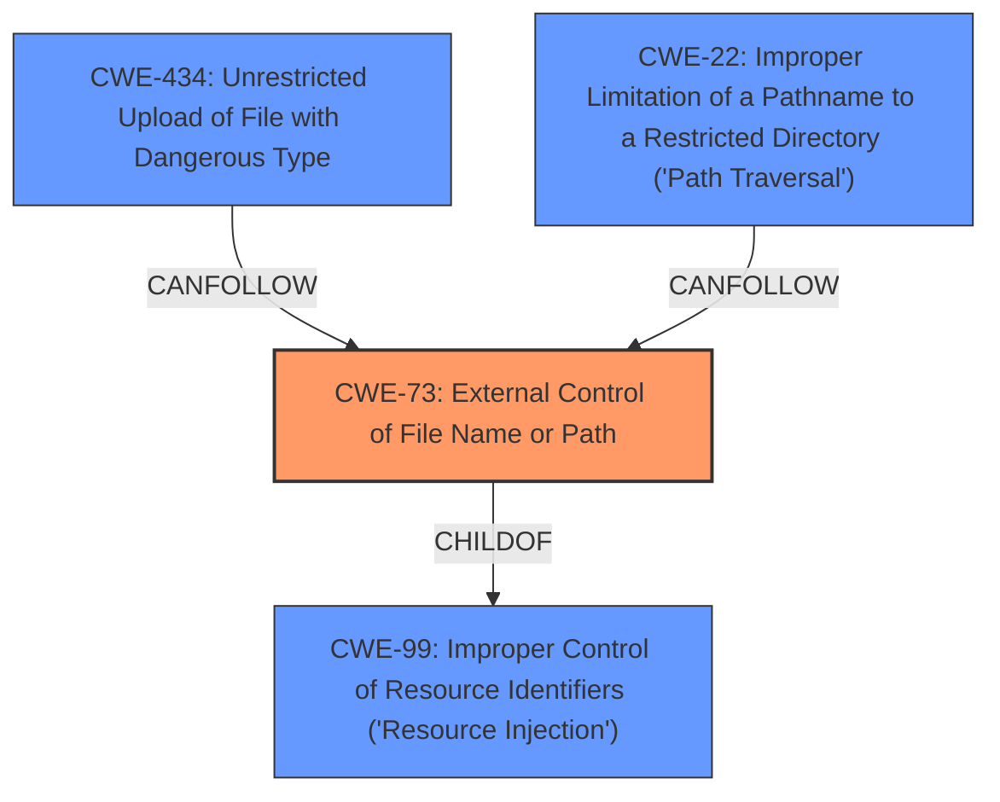

# Analysis for CVE-2021-21381

# Summary
| CWE ID | CWE Name | Confidence | CWE Abstraction Level | CWE Vulnerability Mapping Label | CWE-Vulnerability Mapping Notes |
|---|---|---|---|---|---|
| CWE-73 | External Control of File Name or Path | 0.9 | Base | Allowed | Primary CWE |
| CWE-434 | Unrestricted Upload of File with Dangerous Type | 0.6 | Base | Allowed | Secondary Candidate |
| CWE-22 | Improper Limitation of a Pathname to a Restricted Directory ('Path Traversal') | 0.5 | Base | Allowed | Secondary Candidate |
| CWE-99 | Improper Control of Resource Identifiers ('Resource Injection') | 0.4 | Class | Allowed-with-Review | Secondary Candidate |

## Evidence and Confidence

*   **Confidence Score:** 0.9
*   **Evidence Strength:** HIGH

## Relationship Analysis
The primary CWE is CWE-73, which describes the root cause of allowing user input to control file names or paths. CWE-434 and CWE-22 are related in that they can often follow CWE-73, as the ability to control file names or paths can lead to unrestricted uploads or path traversal vulnerabilities. CWE-99 is a broader class that encompasses CWE-73 but lacks the specificity needed for this particular case.

## Vulnerability Chain
The vulnerability chain starts with **external control of file names/paths** (CWE-73). This control allows an attacker to manipulate the `Exec` field of a Flatpak application's `.desktop` file using special tokens (`@@` and `@@u`). By injecting arbitrary file paths, the attacker can bypass intended file access restrictions, potentially leading to the application gaining access to unauthorized files. The final impact is the ability to read arbitrary files from the host system.

## Summary of Analysis
The analysis focuses on identifying the root cause of the vulnerability based on the provided description. The primary vulnerability is the **improper handling of external control over file names or paths** (CWE-73). The vulnerability description key phrases highlight this, stating the "**vulnerability in file forwarding feature**," which relies on manipulating file paths. The CVE reference links content summary confirms that the root cause is **insufficient input validation** of arguments in the `Exec` field of the `.desktop` file, allowing for **arbitrary file paths to be injected**. This directly aligns with the description of CWE-73, which states that "The product allows user input to control or influence paths or file names that are used in filesystem operations."

CWE-434 (Unrestricted Upload of File with Dangerous Type) was considered because the attacker is effectively "uploading" a malicious `.desktop` file, but the core issue isn't the type of file being uploaded but rather the manipulation of file paths within it. CWE-22 (Improper Limitation of a Pathname to a Restricted Directory ('Path Traversal')) was considered since the attacker is using path manipulation to access files outside the intended scope. CWE-99 (Improper Control of Resource Identifiers ('Resource Injection')) was also considered, but it is a broader class and not as specific as CWE-73 in this case.

The relationships between the CWEs influenced the selection. CWE-73 is at the Base level of abstraction, which is preferred, and it directly addresses the root cause. While CWE-434 and CWE-22 are potential consequences of CWE-73, mapping directly to the root cause provides a more accurate representation of the vulnerability.

The high confidence score (0.9) is based on the clear evidence from the vulnerability description, the CVE reference links content summary, and the alignment with the CWE-73 description.

Relevant CWE Information:

# Enhanced Context (25 CWEs)

## CWE-59: Improper Link Resolution Before File Access ('Link Following')
**Abstraction Level**: Base
**Similarity Score**: 0.77
**Source**: dense

**Description**:
The product attempts to access a file based on the filename, but it does not properly prevent that filename from identifying a link or shortcut that resolves to an unintended resource.

**Mapping Guidance**:
- Usage: Allowed
- Rationale: This CWE entry is at the Base level of abstraction, which is a preferred level of abstraction for mapping to the root causes of vulnerabilities.

## CWE-668: Exposure of Resource to Wrong Sphere
**Abstraction Level**: Class
**Similarity Score**: 0.77
**Source**: dense

**Description**:
The product exposes a resource to the wrong control sphere, providing unintended actors with inappropriate access to the resource.

**Mapping Guidance**:
- Usage: Discouraged
- Rationale: CWE-668 is high-level and is often misused as a catch-all when lower-level CWE IDs might be applicable. It is sometimes used for low-information vulnerability reports [REF-1287]. It is a level-1 Class (i.e., a child of a Pillar). It is not useful for trend analysis.

## CWE-41: Improper Resolution of Path Equivalence
**Abstraction Level**: Base
**Similarity Score**: 0.76
**Source**: dense

**Description**:
The product is vulnerable to file system contents disclosure through path equivalence. Path equivalence involves the use of special characters in file and directory names. The associated manipulations are intended to generate multiple names for the same object.

**Mapping Guidance**:
- Usage: Allowed
- Rationale: This CWE entry is at the Base level of abstraction, which is a preferred level of abstraction for mapping to the root causes of vulnerabilities.

## CWE-184: Incomplete List of Disallowed Inputs
**Abstraction Level**: Base
**Similarity Score**: 0.76
**Source**: dense

**Description**:
The product implements a protection mechanism that relies on a list of inputs (or properties of inputs) that are not allowed by policy or otherwise require other action to neutralize before additional processing takes place, but the list is incomplete.

**Mapping Guidance**:
- Usage: Allowed
- Rationale: This CWE entry is at the Base level of abstraction, which is a preferred level of abstraction for mapping to the root causes of vulnerabilities.

## CWE-639: Authorization Bypass Through User-Controlled Key
**Abstraction Level**: Base
**Similarity Score**: 0.76
**Source**: dense

**Description**:
The system's authorization functionality does not prevent one user from gaining access to another user's data or record by modifying the key value identifying the data.

**Mapping Guidance**:
- Usage: Allowed
- Rationale: This CWE entry is at the Base level of abstraction, which is a preferred level of abstraction for mapping to the root causes of vulnerabilities.

## CWE-74: Improper Neutralization of Special Elements in Output Used by a Downstream Component ('Injection')
**Abstraction Level**: Class
**Similarity Score**: 0.76
**Source**: dense

**Description**:
The product constructs all or part of a command, data structure, or record using externally-influenced input from an upstream component, but it does not neutralize or incorrectly neutralizes special elements that could modify how it is parsed or interpreted when it is sent to a downstream component.

**Mapping Guidance**:
- Usage: Discouraged
- Rationale: CWE-74 is high-level and often misused when lower-level weaknesses are more appropriate.

## CWE-807: Reliance on Untrusted Inputs in a Security Decision
**Abstraction Level**: Base
**Similarity Score**: 0.76
**Source**: dense

**Description**:
The product uses a protection mechanism that relies on the existence or values of an input, but the input can be modified by an untrusted actor in a way that bypasses the protection mechanism.

**Mapping Guidance**:
- Usage: Allowed
- Rationale: This CWE entry is at the Base level of abstraction, which is a preferred level of abstraction for mapping to the root causes of vulnerabilities.

## CWE-23: Relative Path Traversal
**Abstraction Level**: Base
**Similarity Score**: 0.76
**Source**: dense

**Description**:
The product uses external input to construct a pathname that should be within a restricted directory, but it does not properly neutralize sequences such as ".." that can resolve to a location that is outside of that directory.

**Mapping Guidance**:
- Usage: Allowed
- Rationale: This CWE entry is at the Base level of abstraction, which is a preferred level of abstraction for mapping to the root causes of vulnerabilities.

# Enhanced Query for CVE-2021-21381

## Vulnerability Description
Flatpak is a system for building, distributing, and running sandboxed desktop applications on Linux. In Flatpack since version 0.9.4 and before version 1.10.2 has a vulnerability in the file forwarding feature which can be used by an attacker to gain access to files that would not ordinarily be allowed by the apps permissions. By putting the special tokens `@@` and/or `@@u` in the Exec field of a Flatpak apps .desktop file, a malicious app publisher can trick flatpak into behaving as though the user had chosen to open a target file with their Flatpak app, which automatically makes that file available to the Flatpak app. This is fixed in version 1.10.2. A minimal solution is the first commit `Disallow @@ and @@U usage in desktop files`. The follow-up commits `dir Reserve the whole @@ prefix` and `dir Refuse to export .desktop files with suspicious uses of @@ tokens` are recommended, but not strictly required. As a workaround, avoid installing Flatpak apps from untrusted sources, or check the contents of the exported `.desktop` files in `exports/share/applications/*.desktop` (typically `~/.local/share/flatpak/exports/share/applications/*.desktop` and `/var/lib/flatpak/exports/share/applications/*.desktop`) to make sure that literal filenames do not follow `@@` or `@@u`.

### Vulnerability Description Key Phrases
- **rootcause:** **vulnerability in file forwarding feature**
- **impact:** gain access to unauthorized files
- **vector:** special tokens @@ and @@u
- **attacker:** malicious app publisher
- **product:** Flatpak
- **version:** 0.9.4 to 1.10.2

## CVE Reference Links Content Summary
Based on the provided information, here's a breakdown of the vulnerability described in CVE-2021-21381:

**Root Cause of Vulnerability:**

The vulnerability stems from the way Flatpak handles the `Exec` field in `.desktop` files, specifically how it processes special tokens related to file forwarding (`%F`, `%f`, `%U`, `%u`). Flatpak uses `@@` and `@@u` to encapsulate file arguments, which are then passed to the sandboxed application. However, it did not properly validate additional arguments, allowing an attacker to insert arbitrary file paths within these special tokens.

**Weaknesses/Vulnerabilities Present:**

-   **Insufficient Input Validation:** Flatpak failed to validate additional arguments in the `Exec` field, allowing attackers to inject arbitrary file paths encapsulated within `@@` tokens.
-   **File Forwarding Bypass:** The vulnerability abuses the intended "file forwarding" feature of Flatpak, which is meant to give sandboxed applications access to files a user has explicitly opened with it, but the vulnerability makes this access available to files not intended by the user.
-   **Sandbox Escape:** By exploiting this flaw, an attacker can cause the Flatpak application to gain access to files outside of its sandbox.

**Impact of Exploitation:**

-   **Arbitrary File Access:** An attacker can craft a malicious `.desktop` file that forces a Flatpak application to read arbitrary files from the host system (as seen in the PoC with `/etc/passwd`).
-   **Privilege Escalation**: While not a direct privilege escalation to root, an attacker can use this to obtain sensitive information, bypass file access restrictions, potentially leading to further compromise of user data or the system through other vulnerabilities.
-   **Malicious Application:** This vulnerability allows malicious app publishers to create apps that read user-accessible files outside of the sandbox.

**Attack Vectors:**

-   **Malicious `.desktop` File:** The primary attack vector is via a specially crafted `.desktop` file. This file is installed when a Flatpak application is installed.
-   **Unprivileged User:** The attacker does not need elevated privileges to exploit this vulnerability. It can be exploited by any user who can install a malicious application.

**Required Attacker Capabilities/Position:**

-   **Ability to Publish Flatpak Applications:** An attacker needs to be able to publish a malicious Flatpak application that includes a crafted `.desktop` file that contains the malicious payload.
-   **User Installation:** A user must install the malicious Flatpak application.

**Mitigation:**

-   **Input Sanitization:**  The vulnerability was addressed by disallowing `@@` and `@@u` tokens in the desktop file. Additionally, the entire `@@` prefix was reserved to avoid similar issues in the future. Finally, Flatpak will refuse to export any `.desktop` files containing these tokens, which will prevent the installation of malicious applications.
-   **Upgrade:** Updating Flatpak to version 1.10.2 or later, or a backported version containing the patch will mitigate the vulnerability.

**Additional Notes:**
- The vulnerability was assigned the CVE ID CVE-2021-21381.
- It was also assigned the Github Security Advisory GHSA-xgh4-387p-hqpp.
- Fixes were made to flatpak versions 1.10.2 and also backported to 1.8.x.
- Several downstream distributions like Debian and Fedora issued security advisories and updates for this issue.

## Retriever Results

### Top Combined Results

| Rank | CWE ID | Name | Abstraction | Usage  | Retrievers | Individual Scores |
|------|--------|------|-------------|-------|------------|-------------------|
| 1 | 99 | Improper Control of Resource Identifiers ('Resource Injection') | Class | Allowed-with-Review | sparse | 2.508 |
| 2 | 184 | Incomplete List of Disallowed Inputs | Base | Allowed | sparse | 1.393 |
| 3 | 923 | Improper Restriction of Communication Channel to Intended Endpoints | Class | Allowed-with-Review | sparse | 1.091 |
| 4 | 94 | Improper Control of Generation of Code ('Code Injection') | Base | Allowed-with-Review | sparse | 1.045 |
| 5 | 863 | Incorrect Authorization | Class | Allowed-with-Review | sparse | 1.042 |
| 6 | 277 | Insecure Inherited Permissions | Variant | Allowed | dense | 0.482 |
| 7 | 98 | Improper Control of Filename for Include/Require Statement in PHP Program ('PHP Remote File Inclusion') | Variant | Allowed | graph | 0.002 |
| 8 | 61 | UNIX Symbolic Link (Symlink) Following | Compound | Allowed | sparse | 1.040 |
| 9 | 732 | Incorrect Permission Assignment for Critical Resource | Class | Allowed-with-Review | sparse | 1.031 |
| 10 | 306 | Missing Authentication for Critical Function | Base | Allowed | sparse | 1.028 |

# Complete CWE Specifications

## CWE-99: Improper Control of Resource Identifiers ('Resource Injection')
**Abstraction:** Class
**Status:** Draft

### Description
The product receives input from an upstream component, but it does not restrict or incorrectly restricts the input before it is used as an identifier for a resource that may be outside the intended sphere of control.

### Extended Description

A resource injection issue occurs when the following two conditions are met:

  1. An attacker can specify the identifier used to access a system resource. For example, an attacker might be able to specify part of the name of a file to be opened or a port number to be used.

  1. By specifying the resource, the attacker gains a capability that would not otherwise be permitted. For example, the program may give the attacker the ability to overwrite the specified file, run with a configuration controlled by the attacker, or transmit sensitive information to a third-party server.

This may enable an attacker to access or modify otherwise protected system resources.

### Alternative Terms
Insecure Direct Object Reference: OWASP uses this term, although it is effectively the same as resource injection.

### Relationships
ChildOf -> CWE-74
PeerOf -> CWE-706
CanAlsoBe -> CWE-73

### Mapping Guidance
**Usage:** Allowed-with-Review
**Rationale:** This CWE entry is a Class and might have Base-level children that would be more appropriate
**Comments:** Examine children of this entry to see if there is a better fit
**Reasons:**
- Abstraction

### Additional Notes
**[Relationship]** Resource injection that involves resources stored on the filesystem goes by the name path manipulation (CWE-73).

**[Maintenance]** The relationship between CWE-99 and CWE-610 needs further investigation and clarification. They might be duplicates. CWE-99 "Resource Injection," as originally defined in Seven Pernicious Kingdoms taxonomy, emphasizes the "identifier used to access a system resource" such as a file name or port number, yet it explicitly states that the "resource injection" term does not apply to "path manipulation," which effectively identifies the path at which a resource can be found and could be considered to be one aspect of a resource identifier. Also, CWE-610 effectively covers any type of resource, whether that resource is at the system layer, the application layer, or the code layer.

### Observed Examples
- **CVE-2013-4787:** chain: mobile OS verifies cryptographic signature of file in an archive, but then installs a different file with the same name that is also listed in the archive.

## CWE-184: Incomplete List of Disallowed Inputs
**Abstraction:** Base
**Status:** Draft

### Description
The product implements a protection mechanism that relies on a list of inputs (or properties of inputs) that are not allowed by policy or otherwise require other action to neutralize before additional processing takes place, but the list is incomplete.

### Extended Description
Not provided

### Alternative Terms
Denylist / Deny List: This is used by CWE and CAPEC instead of other commonly-used terms. Its counterpart is allowlist.
Blocklist / Block List: This is often used by security tools such as firewalls, email or web gateways, proxies, etc.
Blacklist / Black List: This term is frequently used, but usage has been declining as organizations have started to adopt other terms.

### Relationships
ChildOf -> CWE-693
ChildOf -> CWE-1023
CanPrecede -> CWE-79
CanPrecede -> CWE-78
CanPrecede -> CWE-434
CanPrecede -> CWE-98

### Mapping Guidance
**Usage:** Allowed
**Rationale:** This CWE entry is at the Base level of abstraction, which is a preferred level of abstraction for mapping to the root causes of vulnerabilities.
**Comments:** Carefully read both the name and description to ensure that this mapping is an appropriate fit. Do not try to 'force' a mapping to a lower-level Base/Variant simply to comply with this preferred level of abstraction.
**Reasons:**
- Acceptable-Use

### Additional Notes
**[Relationship]** 

Multiple interpretation errors can indirectly introduce inputs that should be disallowed. For example, a list of dangerous shell metacharacters might not include a metacharacter that only has meaning in one particular shell, not all of them; or a check for XSS manipulations might ignore an unusual construct that is supported by one web browser, but not others.

### Observed Examples
- **CVE-2024-4315:** Chain: API for text generation using Large Language Models (LLMs) does not include the "\" Windows folder separator in its denylist (CWE-184) when attempting to prevent Local File Inclusion via path traversal (CWE-22), allowing deletion of arbitrary files on Windows systems.
- **CVE-2008-2309:** product uses a denylist to identify potentially dangerous content, allowing attacker to bypass a warning
- **CVE-2005-2782:** PHP remote file inclusion in web application that filters "http" and "https" URLs, but not "ftp".

## CWE-923: Improper Restriction of Communication Channel to Intended Endpoints
**Abstraction:** Class
**Status:** Incomplete

### Description
The product establishes a communication channel to (or from) an endpoint for privileged or protected operations, but it does not properly ensure that it is communicating with the correct endpoint.

### Extended Description

Attackers might be able to spoof the intended endpoint from a different system or process, thus gaining the same level of access as the intended endpoint.

While this issue frequently involves authentication between network-based clients and servers, other types of communication channels and endpoints can have this weakness.

### Alternative Terms
None

### Relationships
ChildOf -> CWE-284

### Mapping Guidance
**Usage:** Allowed-with-Review
**Rationale:** This CWE entry is a Class and might have Base-level children that would be more appropriate
**Comments:** Examine children of this entry to see if there is a better fit
**Reasons:**
- Abstraction

### Observed Examples
- **CVE-2022-30319:** S-bus functionality in a home automation product performs access control using an IP allowlist, which can be bypassed by a forged IP address.
- **CVE-2022-22547:** A troubleshooting tool exposes a web server on a random port between 9000-65535 that could be used for information gathering
- **CVE-2022-4390:** A WAN interface on a router has firewall restrictions enabled for IPv4, but it does not for IPv6, which is enabled by default

## CWE-94: Improper Control of Generation of Code ('Code Injection')
**Abstraction:** Base
**Status:** Draft

### Description
The product constructs all or part of a code segment using externally-influenced input from an upstream component, but it does not neutralize or incorrectly neutralizes special elements that could modify the syntax or behavior of the intended code segment.

### Extended Description

When a product allows a user's input to contain code syntax, it might be possible for an attacker to craft the code in such a way that it will alter the intended control flow of the product. Such an alteration could lead to arbitrary code execution.

Injection problems encompass a wide variety of issues -- all mitigated in very different ways. For this reason, the most effective way to discuss these weaknesses is to note the distinct features which classify them as injection weaknesses. The most important issue to note is that all injection problems share one thing in common -- i.e., they allow for the injection of control plane data into the user-controlled data plane. This means that the execution of the process may be altered by sending code in through legitimate data channels, using no other mechanism. While buffer overflows, and many other flaws, involve the use of some further issue to gain execution, injection problems need only for the data to be parsed. The most classic instantiations of this category of weakness are SQL injection and format string vulnerabilities.

### Alternative Terms
None

### Relationships
ChildOf -> CWE-74
ChildOf -> CWE-74
ChildOf -> CWE-913

### Mapping Guidance
**Usage:** Allowed-with-Review
**Rationale:** This entry is frequently misused for vulnerabilities with a technical impact of "code execution," which does not by itself indicate a root cause weakness, since dozens of weaknesses can enable code execution.
**Comments:** This weakness only applies when the product's functionality intentionally constructs all or part of a code segment. It could be that executing code could be the result of other weaknesses that do not involve the construction of code segments.
**Reasons:**
- Frequent Misuse
- Frequent Misinterpretation

### Observed Examples
- **CVE-2023-29374:** Math component in an LLM framework translates user input into a Python expression that is input into the Python exec() method, allowing code execution - one variant of a "prompt injection" attack.
- **CVE-2024-5565:** Python-based library uses an LLM prompt containing user input to dynamically generate code that is then fed as input into the Python exec() method, allowing code execution - one variant of a "prompt injection" attack.
- **CVE-2024-4181:** Framework for LLM applications allows eval injection via a crafted response from a hosting provider.

## CWE-863: Incorrect Authorization
**Abstraction:** Class
**Status:** Incomplete

### Description
The product performs an authorization check when an actor attempts to access a resource or perform an action, but it does not correctly perform the check.

### Extended Description
Not provided

### Alternative Terms
AuthZ: "AuthZ" is typically used as an abbreviation of "authorization" within the web application security community. It is distinct from "AuthN" (or, sometimes, "AuthC") which is an abbreviation of "authentication." The use of "Auth" as an abbreviation is discouraged, since it could be used for either authentication or authorization.

### Relationships
ChildOf -> CWE-285
ChildOf -> CWE-284

### Mapping Guidance
**Usage:** Allowed-with-Review
**Rationale:** This CWE entry is a Class and might have Base-level children that would be more appropriate
**Comments:** Examine children of this entry to see if there is a better fit
**Reasons:**
- Abstraction

### Additional Notes
**[Terminology]** 

Assuming a user with a given identity, authorization is the process of determining whether that user can access a given resource, based on the user's privileges and any permissions or other access-control specifications that apply to the resource.

### Observed Examples
- **CVE-2021-39155:** Chain: A microservice integration and management platform compares the hostname in the HTTP Host header in a case-sensitive way (CWE-178, CWE-1289), allowing bypass of the authorization policy (CWE-863) using a hostname with mixed case or other variations.
- **CVE-2019-15900:** Chain: sscanf() call is used to check if a username and group exists, but the return value of sscanf() call is not checked (CWE-252), causing an uninitialized variable to be checked (CWE-457), returning success to allow authorization bypass for executing a privileged (CWE-863).
- **CVE-2009-2213:** Gateway uses default "Allow" configuration for its authorization settings.

## CWE-277: Insecure Inherited Permissions
**Abstraction:** Variant
**Status:** Draft

### Description
A product defines a set of insecure permissions that are inherited by objects that are created by the program.

### Extended Description
Not provided

### Alternative Terms
None

### Relationships
ChildOf -> CWE-732

### Mapping Guidance
**Usage:** Allowed
**Rationale:** This CWE entry is at the Variant level of abstraction, which is a preferred level of abstraction for mapping to the root causes of vulnerabilities.
**Comments:** Carefully read both the name and description to ensure that this mapping is an appropriate fit. Do not try to 'force' a mapping to a lower-level Base/Variant simply to comply with this preferred level of abstraction.
**Reasons:**
- Acceptable-Use

### Observed Examples
- **CVE-2005-1841:** User's umask is used when creating temp files.
- **CVE-2002-1786:** Insecure umask for core dumps [is the umask preserved or assigned?].

## CWE-98: Improper Control of Filename for Include/Require Statement in PHP Program ('PHP Remote File Inclusion')
**Abstraction:** Variant
**Status:** Draft

### Description
The PHP application receives input from an upstream component, but it does not restrict or incorrectly restricts the input before its usage in "require," "include," or similar functions.

### Extended Description
In certain versions and configurations of PHP, this can allow an attacker to specify a URL to a remote location from which the product will obtain the code to execute. In other cases in association with path traversal, the attacker can specify a local file that may contain executable statements that can be parsed by PHP.

### Alternative Terms
Remote file include
RFI: The Remote File Inclusion (RFI) acronym is often used by vulnerability researchers.
Local file inclusion: This term is frequently used in cases in which remote download is disabled, or when the first part of the filename is not under the attacker's control, which forces use of relative path traversal (CWE-23) attack techniques to access files that may contain previously-injected PHP code, such as web access logs.

### Relationships
ChildOf -> CWE-706
ChildOf -> CWE-829
CanPrecede -> CWE-94
CanAlsoBe -> CWE-426

### Mapping Guidance
**Usage:** Allowed
**Rationale:** This CWE entry is at the Variant level of abstraction, which is a preferred level of abstraction for mapping to the root causes of vulnerabilities.
**Comments:** Carefully read both the name and description to ensure that this mapping is an appropriate fit. Do not try to 'force' a mapping to a lower-level Base/Variant simply to comply with this preferred level of abstraction.
**Reasons:**
- Acceptable-Use

### Additional Notes
**[Relationship]** 

This is frequently a functional consequence of other weaknesses. It is usually multi-factor with other factors (e.g. MAID), although not all inclusion bugs involve assumed-immutable data. Direct request weaknesses frequently play a role.

Can overlap directory traversal in local inclusion problems.

### Observed Examples
- **CVE-2004-0285:** Modification of assumed-immutable configuration variable in include file allows file inclusion via direct request.
- **CVE-2004-0030:** Modification of assumed-immutable configuration variable in include file allows file inclusion via direct request.
- **CVE-2004-0068:** Modification of assumed-immutable configuration variable in include file allows file inclusion via direct request.

## CWE-61: UNIX Symbolic Link (Symlink) Following
**Abstraction:** Compound
**Status:** Incomplete

### Description
The product, when opening a file or directory, does not sufficiently account for when the file is a symbolic link that resolves to a target outside of the intended control sphere. This could allow an attacker to cause the product to operate on unauthorized files.

### Extended Description
A product that allows UNIX symbolic links (symlink) as part of paths whether in internal code or through user input can allow an attacker to spoof the symbolic link and traverse the file system to unintended locations or access arbitrary files. The symbolic link can permit an attacker to read/write/corrupt a file that they originally did not have permissions to access.

### Alternative Terms
Symlink following
symlink vulnerability

### Relationships
ChildOf -> CWE-59
Requires -> CWE-362
Requires -> CWE-340
Requires -> CWE-386
Requires -> CWE-732

### Mapping Guidance
**Usage:** Allowed
**Rationale:** This is a well-known Composite of multiple weaknesses that must all occur simultaneously, although it is attack-oriented in nature.
**Comments:** While attack-oriented composites are supported in CWE, they have not been a focus of research. There is a chance that future research or CWE scope clarifications will change or deprecate them. Perform root-cause analysis to determine which weaknesses allow symlink following to occur, and map to those weaknesses. For example, predictable file names might be intended functionality, but creation in a directory with insecure permissions might not.
**Reasons:**
- Other

### Additional Notes
**[Research Gap]** 

Symlink vulnerabilities are regularly found in C and shell programs, but all programming languages can have this problem. Even shell programs are probably under-reported.

"Second-order symlink vulnerabilities" may exist in programs that invoke other programs that follow symlinks. They are rarely reported but are likely to be fairly common when process invocation is used [REF-493].

### Observed Examples
- **CVE-1999-1386:** Some versions of Perl follow symbolic links when running with the -e option, which allows local users to overwrite arbitrary files via a symlink attack.
- **CVE-2000-1178:** Text editor follows symbolic links when creating a rescue copy during an abnormal exit, which allows local users to overwrite the files of other users.
- **CVE-2004-0217:** Antivirus update allows local users to create or append to arbitrary files via a symlink attack on a logfile.

## CWE-732: Incorrect Permission Assignment for Critical Resource
**Abstraction:** Class
**Status:** Draft

### Description
The product specifies permissions for a security-critical resource in a way that allows that resource to be read or modified by unintended actors.

### Extended Description
When a resource is given a permission setting that provides access to a wider range of actors than required, it could lead to the exposure of sensitive information, or the modification of that resource by unintended parties. This is especially dangerous when the resource is related to program configuration, execution, or sensitive user data. For example, consider a misconfigured storage account for the cloud that can be read or written by a public or anonymous user.

### Alternative Terms
None

### Relationships
ChildOf -> CWE-285
ChildOf -> CWE-668

### Mapping Guidance
**Usage:** Allowed-with-Review
**Rationale:** While the name itself indicates an assignment of permissions for resources, this is often misused for vulnerabilities in which "permissions" are not checked, which is an "authorization" weakness (CWE-285 or descendants) within CWE's model [REF-1287].
**Comments:** Closely analyze the specific mistake that is allowing the resource to be exposed, and perform a CWE mapping for that mistake.
**Reasons:**
- Frequent Misuse

### Additional Notes
**[Maintenance]** The relationships between privileges, permissions, and actors (e.g. users and groups) need further refinement within the Research view. One complication is that these concepts apply to two different pillars, related to control of resources (CWE-664) and protection mechanism failures (CWE-693).

### Observed Examples
- **CVE-2022-29527:** Go application for cloud management creates a world-writable sudoers file that allows local attackers to inject sudo rules and escalate privileges to root by winning a race condition.
- **CVE-2009-3482:** Anti-virus product sets insecure "Everyone: Full Control" permissions for files under the "Program Files" folder, allowing attackers to replace executables with Trojan horses.
- **CVE-2009-3897:** Product creates directories with 0777 permissions at installation, allowing users to gain privileges and access a socket used for authentication.

## CWE-306: Missing Authentication for Critical Function
**Abstraction:** Base
**Status:** Draft

### Description
The product does not perform any authentication for functionality that requires a provable user identity or consumes a significant amount of resources.

### Extended Description
Not provided

### Alternative Terms
None

### Relationships
ChildOf -> CWE-287
ChildOf -> CWE-287

### Mapping Guidance
**Usage:** Allowed
**Rationale:** This CWE entry is at the Base level of abstraction, which is a preferred level of abstraction for mapping to the root causes of vulnerabilities.
**Comments:** Carefully read both the name and description to ensure that this mapping is an appropriate fit. Do not try to 'force' a mapping to a lower-level Base/Variant simply to comply with this preferred level of abstraction.
**Reasons:**
- Acceptable-Use

### Observed Examples
- **CVE-2022-31260:** Chain: a digital asset management program has an undisclosed backdoor in the legacy version of a PHP script (CWE-912) that could allow an unauthenticated user to export metadata (CWE-306)
- **CVE-2022-29951:** TCP-based protocol in Programmable Logic Controller (PLC) has no authentication.
- **CVE-2022-29952:** Condition Monitor firmware uses a protocol that does not require authentication.

