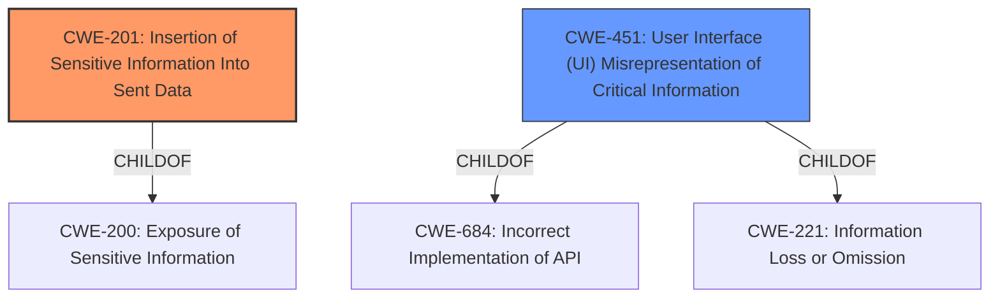

# Analysis Report for CVE-2021-21400

# Vulnerability Analysis Report: CVE-2021-21400

## Description


## Analysis (with Relationship Data)

# Summary
| CWE ID | CWE Name | Confidence | CWE Abstraction Level | CWE Vulnerability Mapping Label | CWE-Vulnerability Mapping Notes |
|---|---|---|---|---|---|
| CWE-201 | Insertion of Sensitive Information Into Sent Data | 0.9 | Base | Allowed | Primary CWE |
| CWE-451 | User Interface (UI) Misrepresentation of Critical Information | 0.6 | Class | Allowed-with-Review | Secondary Candidate |

## Evidence and Confidence

*   **Confidence Score:** 0.9
*   **Evidence Strength:** HIGH

## Relationship Analysis
The primary relationship considered was the parent-child relationship. CWE-201 stands out as a Base level CWE. CWE-451 could be a possible classification but given that CWE-451 is a Class and the evidence supports CWE-201, CWE-201 is the better choice.



## Vulnerability Chain
The vulnerability chain starts with **improper input focus management** leading to the **insertion of sensitive information into sent data**.

## Summary of Analysis
The primary assessment is based on the evidence that the application lock (applock) modal did not properly enforce focus on the input field, resulting in typed input being sent to the most recently used chat instead of the app lock input when the input field was not explicitly focused.

The chosen CWE, CWE-201, is the most specific and appropriate because the root cause leads directly to **sensitive information being sent where it shouldn't be.** This is highlighted in the CVE description: "Passphrases intended for the app lock could be sent as chat messages, potentially exposing sensitive information."

CWE-451 was considered because the UI element (input field) was misrepresented or not properly utilized, causing a user error. However, the core issue isn't misrepresentation, but rather the **exposure of sensitive data** due to **improper focus management**.

Relevant CWE Information:

# Enhanced Context (25 CWEs)
The following CWEs were identified as potentially relevant to this vulnerability:

## CWE-807: Reliance on Untrusted Inputs in a Security Decision
**Abstraction Level**: Base
**Similarity Score**: 0.76
**Source**: dense

**Description**:
The product uses a protection mechanism that relies on the existence or values of an input, but the input can be modified by an untrusted actor in a way that bypasses the protection mechanism.

**Mapping Guidance**:
- Usage: Allowed
- Rationale: This CWE entry is at the Base level of abstraction, which is a preferred level of abstraction for mapping to the root causes of vulnerabilities.

## CWE-201: Insertion of Sensitive Information Into Sent Data
**Abstraction:** Base
**Similarity Score**: 0.166 (sparse retriever)
**Source**: sparse

**Description**:
The code transmits data to another actor, but a portion of the data includes sensitive information that should not be accessible to that actor.

## CWE-451: User Interface (UI) Misrepresentation of Critical Information
**Abstraction:** Class
**Similarity Score**: 0.118 (sparse retriever)
**Source**: sparse

**Description**:
The user interface (UI) does not properly represent critical information to the user, allowing the information - or its source - to be obscured or spoofed. This is often a component in phishing attacks.

### CWE Selection:

**CWE-201: Insertion of Sensitive Information Into Sent Data**

*   **Match:** The core issue is that the passphrase, intended for app lock, is being sent as a chat message. This aligns directly with the CWE's description: "The code transmits data to another actor, but a portion of the data includes sensitive information that should not be accessible to that actor."
*   **Security Implication:** Exposure of sensitive information (passphrase) to unintended recipients (chat participants).
*   **Relationship:** ChildOf CWE-200 (Exposure of Sensitive Information).
*   **Mapping Guidance:** Allowed; Base level of abstraction.
*   **Confidence:** 0.9

**CWE-451: User Interface (UI) Misrepresentation of Critical Information**

*   **Match:** The input field not having focus could be seen as a misrepresentation of the UI, as the user might assume their input is going to the app lock.
*   **Security Implication:** User might be tricked into entering sensitive data in the wrong place.
*   **Relationship:** Class-level CWE, less specific than CWE-201.
*   **Mapping Guidance:** Allowed-with-Review; suggests examining child entries for a better fit.
*   **Confidence:** 0.6

**Rationale for Not Selecting Other CWEs:**

*   CWE-807, CWE-1289, CWE-303, CWE-1390, CWE-1391, CWE-653, CWE-799, CWE-274, CWE-358, CWE-863, CWE-287, CWE-226, CWE-212, CWE-1284, CWE-190, CWE-202, CWE-209, CWE-178, CWE-252, CWE-94: These CWEs relate to authentication, authorization, code injection, and other issues that are not directly relevant to the **specific weakness** of **sensitive information being sent to the wrong location** due to **improper input focus.** They don't accurately represent the **root cause** of this particular vulnerability.
*   CWE-407: Inefficient Algorithmic Complexity: This is not related to the described vulnerability.
*   CWE-95: Improper Neutralization of Directives in Dynamically Evaluated Code ('Eval Injection'): This is not related to the described vulnerability.
*   CWE-1385: Missing Origin Validation in WebSockets: This is not related to the described vulnerability.


## CWE Relationship Analysis

Current CWEs represent these abstraction levels: .


### Vulnerability Chain Analysis

**Chain starting from CWE-94:**
- 94 (Improper Control of Generation of Code ('Code Injection')) - ROOT


**Chain starting from CWE-799:**
- 799 (Improper Control of Interaction Frequency) - ROOT


### CWE Relationship Diagram

```mermaid
graph TD
    classDef primary fill:#f96,stroke:#333,stroke-width:2px
    classDef secondary fill:#69f,stroke:#333
    classDef tertiary fill:#9e9,stroke:#333
```


*Report generated on 2025-04-01 17:49:59*
