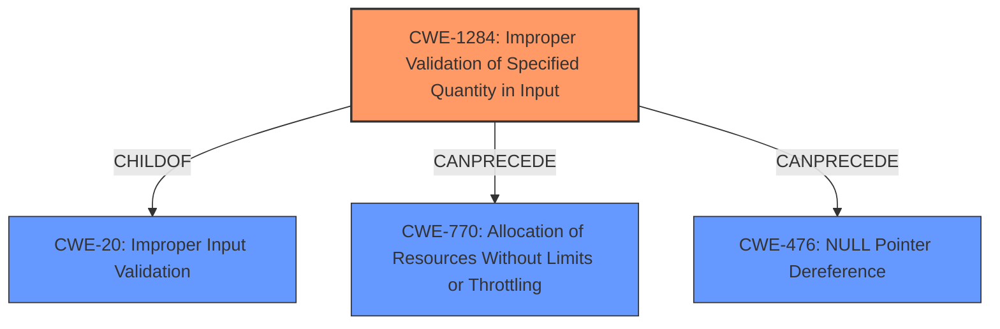

# Analysis for CVE-2021-21404

# Summary
| CWE ID   | CWE Name                                                     | Confidence | CWE Abstraction Level | CWE Vulnerability Mapping Label | CWE-Vulnerability Mapping Notes |
| :--------- | :----------------------------------------------------------- | :--------- | :---------------------- | :------------------------------ | :------------------------------ |
| CWE-1284 | Improper Validation of Specified Quantity in Input           | 0.9        | Base                    | Allowed                       | Primary CWE                     |
| CWE-770 | Allocation of Resources Without Limits or Throttling | 0.7        | Base                    | Allowed                       | Secondary                       |
| CWE-476 | NULL Pointer Dereference                                       | 0.6        | Base                    | Allowed                       | Secondary                       |

## Evidence and Confidence

*   **Confidence Score:** 0.8
*   **Evidence Strength:** HIGH

## Relationship Analysis
The primary CWE, CWE-1284, is a child of CWE-20 (Improper Input Validation). The vulnerability involves **improperly validating the quantity** (length field) in a message, leading to a crash. CWE-770 (Allocation of Resources Without Limits or Throttling) is considered as a possible weakness that could result if memory is allocated according to the negative length. CWE-476 (NULL Pointer Dereference) is also considered as a possible result of a negative length being passed to a function that uses that length to access a pointer. The relationships between these CWEs influence the selection by providing a hierarchy that shows how the root cause can lead to other potential weaknesses and vulnerabilities.

## Vulnerability Chain
The vulnerability chain starts with the **improper validation of the length field** in the relay message (CWE-1284). This can lead to the allocation of excessive resources (CWE-770), or a NULL Pointer Dereference (CWE-476), ultimately resulting in a crash of the Syncthing client or relay server.
- Missing: There isn't explicit evidence that an excessive resource allocation happened, or that a null pointer dereference happened. The crash is the only evidence of impact.

## Summary of Analysis
The initial analysis identified several potential CWEs based on the vulnerability description and retriever results. The primary focus was on the **improper validation of the negative length field**, which aligns well with CWE-1284 (Improper Validation of Specified Quantity in Input). The vulnerability description and CVE reference links content summary both indicate that the **lack of proper input validation** is the root cause. The CVE Reference Links Content Summary states: "The vulnerability lies in how the Syncthing relay protocol handles messages with a negative length field." and lists "Improper Input Validation" as a weakness.

The decision to select CWE-1284 is based on the evidence that the Syncthing relay protocol **does not properly validate the length field** of the relay message. This **lack of validation allows a malicious actor to send a message with a negative length field, leading to a crash**. CWE-1284 is a Base level CWE, which is the preferred level of abstraction.

CWE-770 is a plausible consequence if the **negative length** is used in memory allocation, causing excessive resource consumption. CWE-476 is a possible rootcause of the crash, if the **negative length** leads to an unexpected memory access.

The selected CWEs are at the optimal level of specificity, providing a clear understanding of the root cause and potential consequences of the vulnerability.

Relevant CWE Information:

# Enhanced Context (25 CWEs)

## CWE-1289: Improper Validation of Unsafe Equivalence in Input
**Abstraction Level**: Base
**Similarity Score**: 0.79
**Source**: dense

**Description**:
The product receives an input value that is used as a resource identifier or other type of reference, but it does not validate or incorrectly validates that the input is equivalent to a potentially-unsafe value.

**Mapping Guidance**:
- Usage: Allowed
- Rationale: This CWE entry is at the Base level of abstraction, which is a preferred level of abstraction for mapping to the root causes of vulnerabilities.

*Not selected*: This CWE is about equivalence, and there is no evidence of an equivalence issue.

## CWE-807: Reliance on Untrusted Inputs in a Security Decision
**Abstraction Level**: Base
**Similarity Score**: 0.76
**Source**: dense

**Description**:
The product uses a protection mechanism that relies on the existence or values of an input, but the input can be modified by an untrusted actor in a way that bypasses the protection mechanism.

**Mapping Guidance**:
- Usage: Allowed
- Rationale: This CWE entry is at the Base level of abstraction, which is a preferred level of abstraction for mapping to the root causes of vulnerabilities.

*Not selected*: This CWE is about relying on inputs in security decisions, and there is no evidence of that.

## CWE-918: Server-Side Request Forgery (SSRF)
**Abstraction Level**: Base
**Similarity Score**: 0.76
**Source**: dense

**Description**:
The web server receives a URL or similar request from an upstream component and retrieves the contents of this URL, but it does not sufficiently ensure that the request is being sent to the expected destination.

**Mapping Guidance**:
- Usage: Allowed
- Rationale: This CWE entry is at the Base level of abstraction, which is a preferred level of abstraction for mapping to the root causes of vulnerabilities.

*Not selected*: This CWE is about server side request forgery, and there is no evidence of that.

## CWE-703: Improper Check or Handling of Exceptional Conditions
**Abstraction Level**: Pillar
**Similarity Score**: 0.75
**Source**: dense

**Description**:
The product does not properly anticipate or handle exceptional conditions that rarely occur during normal operation of the product.

**Mapping Guidance**:
- Usage: Discouraged
- Rationale: This CWE entry is extremely high-level, a Pillar.

*Not selected*: This CWE is too abstract.

## CWE-617: Reachable Assertion
**Abstraction Level**: Base
**Similarity Score**: 0.75
**Source**: dense

**Description**:
The product contains an assert() or similar statement that can be triggered by an attacker, which leads to an application exit or other behavior that is more severe than necessary.

**Mapping Guidance**:
- Usage: Allowed
- Rationale: This CWE entry is at the Base level of abstraction, which is a preferred level of abstraction for mapping to the root causes of vulnerabilities.

*Possibly Selected*: This could happen if an assertion failed.

## CWE-113: Improper Neutralization of CRLF Sequences in HTTP Headers ('HTTP Request/Response Splitting')
**Abstraction Level**: Variant
**Similarity Score**: 0.75
**Source**: dense

**Description**:
The product receives data from an HTTP agent/component (e.g., web server, proxy, browser, etc.), but it does not neutralize or incorrectly neutralizes CR and LF characters before the data is included in outgoing HTTP headers.

**Mapping Guidance**:
- Usage: Allowed
- Rationale: This CWE entry is at the Variant level of abstraction, which is a preferred level of abstraction for mapping to the root causes of vulnerabilities.

*Not selected*: This CWE is specific to HTTP headers and does not apply to the described vulnerability.

## CWE-799: Improper Control of Interaction Frequency
**Abstraction Level**: Class
**Similarity Score**: 0.75
**Source**: dense

**Description**:
The product does not properly limit the number or frequency of interactions that it has with an actor, such as the number of incoming requests.

**Mapping Guidance**:
- Usage: Allowed-with-Review
- Rationale: This CWE entry is a Class and might have Base-level children that would be more appropriate

*Not selected*: This CWE is about limiting interaction frequency and is not relevant to the vulnerability.

## CWE-74: Improper Neutralization of Special Elements in Output Used by a Downstream Component ('Injection')
**Abstraction Level**: Class
**Similarity Score**: 0.75
**Source**: dense

**Description**:
The product constructs all or part of a command, data structure, or record using externally-influenced input from an upstream component, but it does not neutralize or incorrectly neutralizes special elements that could modify how it is parsed or interpreted when it is sent to a downstream component.

**Mapping