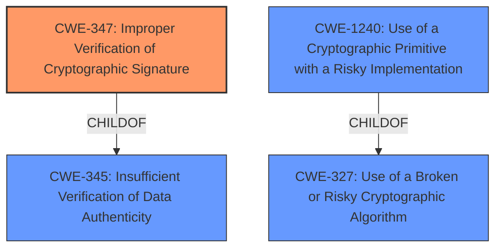

# Analysis for CVE-2021-21405

# Summary
| CWE ID | CWE Name | Confidence | CWE Abstraction Level | CWE Vulnerability Mapping Label | CWE-Vulnerability Mapping Notes |
|---|---|---|---|---|---|
| CWE-347 | Improper Verification of Cryptographic Signature | 0.9 | Base | Primary | Allowed |
| CWE-1240 | Use of a Cryptographic Primitive with a Risky Implementation | 0.7 | Base | Secondary | Allowed |

## Evidence and Confidence

*   **Confidence Score:** 0.8
*   **Evidence Strength:** HIGH

## Relationship Analysis
The primary CWE identified is CWE-347 (**Improper Verification of Cryptographic Signature**), which is a Base level CWE. It is related to CWE-345 (**Insufficient Verification of Data Authenticity**), a Class-level CWE, through a ChildOf relationship. CWE-1240 (**Use of a Cryptographic Primitive with a Risky Implementation**) is also a Base level CWE and is related to CWE-327 (**Use of a Broken or Risky Cryptographic Algorithm**), a Class-level CWE, through a ChildOf relationship.

## Vulnerability Chain
The vulnerability chain starts with the **BLS signature validation** using the `blst` library, which accepts signatures in two forms. This leads to **two different valid block CIDs available for each block**. The impact of this weakness is that miners can be punished for valid blocks.

## Summary of Analysis
The initial assessment, based on the vulnerability description and the CVE reference links, points to **improper handling of BLS signatures** within the Lotus implementation of Filecoin. The `blst` library's `VerifyCompressed` method accepts both serialized and compressed signatures, resulting in multiple valid signature representations for the same block. This, coupled with the inclusion of the block signature in the CID calculation, allows for potentially malicious manipulation leading to the punishment of miners.

The retriever results and the complete CWE specifications strongly suggest CWE-347 (**Improper Verification of Cryptographic Signature**) as the primary weakness. This is because the root cause lies in the fact that the system **does not properly verify the cryptographic signature**, which allows for signature malleability and leads to the acceptance of multiple valid signatures for the same data. The evidence supporting this is the fact that `VerifyCompressed` accepts two signature formats, and the system doesn't enforce a single format.

CWE-1240 (**Use of a Cryptographic Primitive with a Risky Implementation**) is also considered as a secondary CWE because the `blst` library's method `VerifyCompressed` has a risky implementation.

The selection of CWE-347 is at the optimal level of specificity because it directly addresses the root cause, which is the lack of proper verification of the cryptographic signature. Choosing a higher-level CWE like CWE-345 (**Insufficient Verification of Data Authenticity**) would be too general, while lower-level CWEs might not capture the specific cryptographic nature of the vulnerability. The MITRE mapping guidance supports the selection of Base-level CWEs when appropriate, and CWE-347 fits this criterion perfectly.

Relevant CWE Information:

# Enhanced Context (25 CWEs)
The following CWEs were identified as potentially relevant to this vulnerability:

## CWE-407: Inefficient Algorithmic Complexity
**Abstraction Level**: Class
**Similarity Score**: 0.75
**Source**: dense

**Description**:
An algorithm in a product has an inefficient worst-case computational complexity that may be detrimental to system performance and can be triggered by an attacker, typically using crafted manipulations that ensure that the worst case is being reached.

**Mapping Guidance**:
- Usage: Allowed-with-Review
- Rationale: This CWE entry is a Class and might have Base-level children that would be more appropriate

## CWE-345: Insufficient Verification of Data Authenticity
**Abstraction Level**: Class
**Similarity Score**: 0.74
**Source**: dense

**Description**:
The product does not sufficiently verify the origin or authenticity of data, in a way that causes it to accept invalid data.

**Mapping Guidance**:
- Usage: Discouraged
- Rationale: This CWE entry is a level-1 Class (i.e., a child of a Pillar). It might have lower-level children that would be more appropriate

## CWE-1240: Use of a Cryptographic Primitive with a Risky Implementation
**Abstraction Level**: Base
**Similarity Score**: 0.74
**Source**: dense

**Description**:
To fulfill the need for a cryptographic primitive, the product implements a cryptographic algorithm using a non-standard, unproven, or disallowed/non-compliant cryptographic implementation.

**Mapping Guidance**:
- Usage: Allowed
- Rationale: This CWE entry is at the Base level of abstraction, which is a preferred level of abstraction for mapping to the root causes of vulnerabilities.

## CWE-330: Use of Insufficiently Random Values
**Abstraction Level**: Class
**Similarity Score**: 0.74
**Source**: dense

**Description**:
The product uses insufficiently random numbers or values in a security context that depends on unpredictable numbers.

**Mapping Guidance**:
- Usage: Discouraged
- Rationale: This CWE entry is a level-1 Class (i.e., a child of a Pillar). It might have lower-level children that would be more appropriate

## CWE-1289: Improper Validation of Unsafe Equivalence in Input
**Abstraction Level**: Base
**Similarity Score**: 0.74
**Source**: dense

**Description**:
The product receives an input value that is used as a resource identifier or other type of reference, but it does not validate or incorrectly validates that the input is equivalent to a potentially-unsafe value.

**Mapping Guidance**:
- Usage: Allowed
- Rationale: This CWE entry is at the Base level of abstraction, which is a preferred level of abstraction for mapping to the root causes of vulnerabilities.

## CWE-668: Exposure of Resource to Wrong Sphere
**Abstraction Level**: Class
**Similarity Score**: 0.73
**Source**: dense

**Description**:
The product exposes a resource to the wrong control sphere, providing unintended actors with inappropriate access to the resource.

**Mapping Guidance**:
- Usage: Discouraged
- Rationale: CWE-668 is high-level and is often misused as a catch-all when lower-level CWE IDs might be applicable. It is sometimes used for low-information vulnerability reports [REF-1287]. It is a level-1 Class (i.e., a child of a Pillar). It is not useful for trend analysis.

## CWE-328: Use of Weak Hash
**Abstraction Level**: Base
**Similarity Score**: 0.73
**Source**: dense

**Description**:
The product uses an algorithm that produces a digest (output value) that does not meet security expectations for a hash function that allows an adversary to reasonably determine the original input (preimage attack), find another input that can produce the same hash (2nd preimage attack), or find multiple inputs that evaluate to the same hash (birthday attack).

**Mapping Guidance**:
- Usage: Allowed
- Rationale: This CWE entry is at the Base level of abstraction, which is a preferred level of abstraction for mapping to the root causes of vulnerabilities.

## CWE-799: Improper Control of Interaction Frequency
**Abstraction Level**: Class
**Similarity Score**: 0.73
**Source**: dense

**Description**:
The product does not properly limit the number or frequency of interactions that it has with an actor, such as the number of incoming requests.

**Mapping Guidance**:
- Usage: Allowed-with-Review
- Rationale: This CWE entry is a Class and might have Base-level children that would be more appropriate

## CWE-703: Improper Check or Handling of Exceptional Conditions
**Abstraction Level**: Pillar
**Similarity Score**: 0.73
**Source**: dense

**Description**:
The product does not properly anticipate or handle exceptional conditions that rarely occur during normal operation of the product.

**Mapping Guidance**:
- Usage: Discouraged
- Rationale: This CWE entry is extremely high-level, a Pillar.

## CWE-203: Observable Discrepancy
**Abstraction Level**: Base
**Similarity Score**: 0.73
**Source**: dense

**Description**:
The product behaves differently or sends different responses under different circumstances in a way that

# Enhanced Query for CVE-2021-21405

## Vulnerability Description
Lotus is an Implementation of the Filecoin protocol written in Go. BLS signature validation in lotus uses blst library method VerifyCompressed. This method accepts signatures in 2 forms serialized, and compressed, meaning that BLS signatures can be provided as either of 2 unique byte arrays. Lotus block validation functions perform a uniqueness check on provided blocks. Two blocks are considered distinct if the CIDs of their blockheader do not match. The CID method for blockheader includes the BlockSig of the block. The result of these issues is that it would be possible to punish miners for valid blocks, as there are **two different valid block CIDs available for each block**, even though this must be unique. By switching from the go based `blst` bindings over to the bindings in `filecoin-ffi`, the code paths now ensure that all signatures are compressed by size and the way they are deserialized. This happened in https//github.com/filecoin-project/lotus/pull/5393.

### Vulnerability Description Key Phrases
- **rootcause:** **BLS signature validation in lotus uses blst library method VerifyCompressed which accepts signatures in 2 forms serialized, and compressed**
- **weakness:** **two different valid block CIDs available for each block**
- **impact:** punish miners for valid blocks
- **product:** Lotus
- **component:** block validation functions

## CVE Reference Links Content Summary
Based on the provided information, here's an analysis of CVE-2021-21405:

**Root Cause:**

The vulnerability stems from the way BLS signatures are handled in the `lotus` implementation. The `blst` library's `VerifyCompressed` method accepts BLS signatures in two distinct formats: "serialized" and "compressed." Additionally, `lotus` block validation functions included the block signature (`BlockSig`) in the block header's CID calculation for uniqueness checks.

**Weaknesses/Vulnerabilities:**

1.  **Malleable Signatures:** The `blst` library allows signature verification using both serialized and compressed signature formats. This effectively means that for the same message and public key, two different valid signature byte arrays can be produced.
2.  **CID Calculation:** The `lotus` software used the block signature in its CID calculation. As a result, identical blocks with different signature representations (serialized or compressed) were treated as distinct blocks due to their differing CIDs.

**Impact of Exploitation:**

An attacker could exploit this "malleability" issue to:

*   **Punish miners for valid blocks:** Since two different CIDs could represent the same valid block, a malicious actor could potentially submit a valid block with one signature format, while other honest nodes would see the same block with the alternate signature representation and a different CID. This could lead to the miner being punished by the network as it appears like they are submitting a duplicate block.

**Attack Vectors:**

The attack vector involves manipulating the signature format (serialized or compressed) of valid blocks when they are submitted to the `lotus` network.

**Required Attacker Capabilities/Position:**

*   The attacker needs to be able to create valid blocks (i.e., be a miner or have access to a miner's keys)
*   The attacker needs to understand how block CIDs are calculated
*   The attacker needs to be able to create both serialized and compressed signatures for the same block

**Additional Details:**

*   The provided proof-of-concept (PoC) code demonstrates that the `VerifyCompressed` function will accept both serialized and compressed signature formats as valid.
*   The fix involved switching from the go-based `blst` bindings to the `filecoin-ffi` bindings, ensuring that all signatures are compressed by size and during deserialization.
*   The vulnerability was found in multiple places in the `lotus` code: `chain/sync.go`, `/chain/vm/syscalls.go`, and `/chain/sub/incoming.go`.

## Retriever Results

### Top Combined Results

| Rank | CWE ID | Name | Abstraction | Usage  | Retrievers | Individual Scores |
|------|--------|------|-------------|-------|------------|-------------------|
| 1 | 347 | Improper Verification of Cryptographic Signature | Base | Allowed | sparse | 1.603 |
| 2 | 1240 | Use of a Cryptographic Primitive with a Risky Implementation | Base | Allowed | sparse | 0.822 |
| 3 | 203 | Observable Discrepancy | Base | Allowed | sparse | 0.821 |
| 4 | 335 | Incorrect Usage of Seeds in Pseudo-Random Number Generator (PRNG) | Base | Allowed | sparse | 0.811 |
| 5 | 1284 | Improper Validation of Specified Quantity in Input | Base | Allowed | sparse | 0.804 |
| 6 | 483 | Incorrect Block Delimitation | Base | Allowed | dense | 0.345 |
| 7 | 835 | Loop with Unreachable Exit Condition ('Infinite Loop') | Base | Allowed | graph | 0.002 |
| 8 | 327 | Use of a Broken or Risky Cryptographic Algorithm | Class | Allowed-with-Review | sparse | 0.801 |
| 9 | 345 | Insufficient Verification of Data Authenticity | Class | Discouraged | sparse | 0.796 |
| 10 | 1333 | Inefficient Regular Expression Complexity | Base | Allowed | sparse | 0.793 |

# Complete CWE Specifications

## CWE-347: Improper Verification of Cryptographic Signature
**Abstraction:** Base
**Status:** Draft

### Description
The product does not verify, or incorrectly verifies, the cryptographic signature for data.

### Extended Description
Not provided

### Alternative Terms
None

### Relationships
ChildOf -> CWE-345
ChildOf -> CWE-345

### Mapping Guidance
**Usage:** Allowed
**Rationale:** This CWE entry is at the Base level of abstraction, which is a preferred level of abstraction for mapping to the root causes of vulnerabilities.
**Comments:** Carefully read both the name and description to ensure that this mapping is an appropriate fit. Do not try to 'force' a mapping to a lower-level Base/Variant simply to comply with this preferred level of abstraction.
**Reasons:**
- Acceptable-Use

### Observed Examples
- **CVE-2002-1796:** Does not properly verify signatures for "trusted" entities.
- **CVE-2005-2181:** Insufficient verification allows spoofing.
- **CVE-2005-2182:** Insufficient verification allows spoofing.

## CWE-1240: Use of a Cryptographic Primitive with a Risky Implementation
**Abstraction:** Base
**Status:** Draft

### Description
To fulfill the need for a cryptographic primitive, the product implements a cryptographic algorithm using a non-standard, unproven, or disallowed/non-compliant cryptographic implementation.

### Extended Description

Cryptographic protocols and systems depend on cryptographic primitives (and associated algorithms) as their basic building blocks. Some common examples of primitives are digital signatures, one-way hash functions, ciphers, and public key cryptography; however, the notion of "primitive" can vary depending on point of view. See "Terminology Notes" for further explanation of some concepts.

Cryptographic primitives are defined to accomplish one very specific task in a precisely defined and mathematically reliable fashion. For example, suppose that for a specific cryptographic primitive (such as an encryption routine), the consensus is that the primitive can only be broken after trying out N different inputs (where the larger the value of N, the stronger the cryptography). For an encryption scheme like AES-256, one would expect N to be so large as to be infeasible to execute in a reasonable amount of time.

If a vulnerability is ever found that shows that one can break a cryptographic primitive in significantly less than the expected number of attempts, then that primitive is considered weakened (or sometimes in extreme cases, colloquially it is "broken"). As a result, anything using this cryptographic primitive would now be considered insecure or risky. Thus, even breaking or weakening a seemingly small cryptographic primitive has the potential to render the whole system vulnerable, due to its reliance on the primitive. A historical example can be found in TLS when using DES. One would colloquially call DES the cryptographic primitive for transport encryption in this version of TLS. In the past, DES was considered strong, because no weaknesses were found in it; importantly, DES has a key length of 56 bits. Trying N=2^56 keys was considered impractical for most actors. Unfortunately, attacking a system with 56-bit keys is now practical via brute force, which makes defeating DES encryption practical. It is now practical for an adversary to read any information sent under this version of TLS and use this information to attack the system. As a result, it can be claimed that this use of TLS is weak, and that any system depending on TLS with DES could potentially render the entire system vulnerable to attack.

Cryptographic primitives and associated algorithms are only considered safe after extensive research and review from experienced cryptographers from academia, industry, and government entities looking for any possible flaws. Furthermore, cryptographic primitives and associated algorithms are frequently reevaluated for safety when new mathematical and attack techniques are discovered. As a result and over time, even well-known cryptographic primitives can lose their compliance status with the discovery of novel attacks that might either defeat the algorithm or reduce its robustness significantly.

If ad-hoc cryptographic primitives are implemented, it is almost certain that the implementation will be vulnerable to attacks that are well understood by cryptographers, resulting in the exposure of sensitive information and other consequences.

This weakness is even more difficult to manage for hardware-implemented deployment of cryptographic algorithms. First, because hardware is not patchable as easily as software, any flaw discovered after release and production typically cannot be fixed without a recall of the product. Secondly, the hardware product is often expected to work for years, during which time computation power available to the attacker only increases. Therefore, for hardware implementations of cryptographic primitives, it is absolutely essential that only strong, proven cryptographic primitives are used.

### Alternative Terms
None

### Relationships
ChildOf -> CWE-327

### Mapping Guidance
**Usage:** Allowed
**Rationale:** This CWE entry is at the Base level of abstraction, which is a preferred level of abstraction for mapping to the root causes of vulnerabilities.
**Comments:** Carefully read both the name and description to ensure that this mapping is an appropriate fit. Do not try to 'force' a mapping to a lower-level Base/Variant simply to comply with this preferred level of abstraction.
**Reasons:**
- Acceptable-Use

### Additional Notes
**[Terminology]** 

 Terminology for cryptography varies widely, from informal and colloquial to mathematically-defined, with different precision and formalism depending on whether the stakeholder is a developer, cryptologist, etc. Yet there is a need for CWE to be self-consistent while remaining understandable and acceptable to multiple audiences.

As of CWE 4.6, CWE terminology around "primitives" and "algorithms" is emerging as shown by the following example, subject to future consultation and agreement within the CWE and cryptography communities. Suppose one wishes to send encrypted data using a CLI tool such as OpenSSL. One might choose to use AES with a 256-bit key and require tamper protection (GCM mode, for instance). For compatibility's sake, one might also choose the ciphertext to be formatted to the PKCS#5 standard. In this case, the "cryptographic system" would be AES-256-GCM with PKCS#5 formatting. The "cryptographic function" would be AES-256 in the GCM mode of operation, and the "algorithm" would be AES. Colloquially, one would say that AES (and sometimes AES-256) is the "cryptographic primitive," because it is the algorithm that realizes the concept of symmetric encryption (without modes of operation or other protocol related modifications). In practice, developers and architects typically refer to base cryptographic algorithms (AES, SHA, etc.) as cryptographic primitives.

**[Maintenance]** Since CWE 4.4, various cryptography-related entries, including CWE-327 and CWE-1240, have been slated for extensive research, analysis, and community consultation to define consistent terminology, improve relationships, and reduce overlap or duplication. As of CWE 4.6, this work is still ongoing.

### Observed Examples
- **CVE-2020-4778:** software uses MD5, which is less safe than the default SHA-256 used by related products
- **CVE-2005-2946:** Default configuration of product uses MD5 instead of stronger algorithms that are available, simplifying forgery of certificates.
- **CVE-2019-3907:** identity card uses MD5 hash of a salt and password

## CWE-203: Observable Discrepancy
**Abstraction:** Base
**Status:** Incomplete

### Description
The product behaves differently or sends different responses under different circumstances in a way that is observable to an unauthorized actor, which exposes security-relevant information about the state of the product, such as whether a particular operation was successful or not.

### Extended Description
Discrepancies can take many forms, and variations may be detectable in timing, control flow, communications such as replies or requests, or general behavior. These discrepancies can reveal information about the product's operation or internal state to an unauthorized actor. In some cases, discrepancies can be used by attackers to form a side channel.

### Alternative Terms
Side Channel Attack: Observable Discrepancies are at the root of side channel attacks.

### Relationships
ChildOf -> CWE-200
ChildOf -> CWE-200

### Mapping Guidance
**Usage:** Allowed
**Rationale:** This CWE entry is at the Base level of abstraction, which is a preferred level of abstraction for mapping to the root causes of vulnerabilities.
**Comments:** Carefully read both the name and description to ensure that this mapping is an appropriate fit. Do not try to 'force' a mapping to a lower-level Base/Variant simply to comply with this preferred level of abstraction.
**Reasons:**
- Acceptable-Use

### Observed Examples
- **CVE-2020-8695:** Observable discrepancy in the RAPL interface for some Intel processors allows information disclosure.
- **CVE-2019-14353:** Crypto hardware wallet's power consumption relates to total number of pixels illuminated, creating a side channel in the USB connection that allows attackers to determine secrets displayed such as PIN numbers and passwords
- **CVE-2019-10071:** Java-oriented framework compares HMAC signatures using String.equals() instead of a constant-time algorithm, causing timing discrepancies

## CWE-335: Incorrect Usage of Seeds in Pseudo-Random Number Generator (PRNG)
**Abstraction:** Base
**Status:** Draft

### Description
The product uses a Pseudo-Random Number Generator (PRNG) but does not correctly manage seeds.

### Extended Description

 PRNGs are deterministic and, while their output appears random, they cannot actually create entropy. They rely on cryptographically secure and unique seeds for entropy so proper seeding is critical to the secure operation of the PRNG.

 Management of seeds could be broken down into two main areas: 

  -  (1) protecting seeds as cryptographic material (such as a cryptographic key); 

  -  (2) whenever possible, using a uniquely generated seed from a cryptographically secure source 

 PRNGs require a seed as input to generate a stream of numbers that are functionally indistinguishable from random numbers. While the output is, in many cases, sufficient for cryptographic uses, the output of any PRNG is directly determined by the seed provided as input. If the seed can be ascertained by a third party, the entire output of the PRNG can be made known to them. As such, the seed should be kept secret and should ideally not be able to be guessed. For example, the current time may be a poor seed. Knowing the approximate time the PRNG was seeded greatly reduces the possible key space. 

 Seeds do not necessarily need to be unique, but reusing seeds may open up attacks if the seed is discovered. 

### Alternative Terms
None

### Relationships
ChildOf -> CWE-330
ChildOf -> CWE-330

### Mapping Guidance
**Usage:** Allowed
**Rationale:** This CWE entry is at the Base level of abstraction, which is a preferred level of abstraction for mapping to the root causes of vulnerabilities.
**Comments:** Carefully read both the name and description to ensure that this mapping is an appropriate fit. Do not try to 'force' a mapping to a lower-level Base/Variant simply to comply with this preferred level of abstraction.
**Reasons:**
- Acceptable-Use

### Additional Notes
**[Maintenance]** As of CWE 4.5, terminology related to randomness, entropy, and predictability can vary widely. Within the developer and other communities, "randomness" is used heavily. However, within cryptography, "entropy" is distinct, typically implied as a measurement. There are no commonly-used definitions, even within standards documents and cryptography papers. Future versions of CWE will attempt to define these terms and, if necessary, distinguish between them in ways that are appropriate for different communities but do not reduce the usability of CWE for mapping, understanding, or other scenarios.

### Observed Examples
- **CVE-2020-7010:** Cloud application on Kubernetes generates passwords using a weak random number generator based on deployment time.
- **CVE-2019-11495:** server uses erlang:now() to seed the PRNG, which results in a small search space for potential random seeds
- **CVE-2018-12520:** Product's PRNG is not seeded for the generation of session IDs

## CWE-1284: Improper Validation of Specified Quantity in Input
**Abstraction:** Base
**Status:** Incomplete

### Description
The product receives input that is expected to specify a quantity (such as size or length), but it does not validate or incorrectly validates that the quantity has the required properties.

### Extended Description

Specified quantities include size, length, frequency, price, rate, number of operations, time, and others. Code may rely on specified quantities to allocate resources, perform calculations, control iteration, etc. When the quantity is not properly validated, then attackers can specify malicious quantities to cause excessive resource allocation, trigger unexpected failures, enable buffer overflows, etc.

### Alternative Terms
None

### Relationships
ChildOf -> CWE-20
ChildOf -> CWE-20
CanPrecede -> CWE-789

### Mapping Guidance
**Usage:** Allowed
**Rationale:** This CWE entry is at the Base level of abstraction, which is a preferred level of abstraction for mapping to the root causes of vulnerabilities.
**Comments:** Carefully read both the name and description to ensure that this mapping is an appropriate fit. Do not try to 'force' a mapping to a lower-level Base/Variant simply to comply with this preferred level of abstraction.
**Reasons:**
- Acceptable-Use

### Additional Notes
**[Maintenance]** This entry is still under development and will continue to see updates and content improvements.

### Observed Examples
- **CVE-2022-21668:** Chain: Python library does not limit the resources used to process images that specify a very large number of bands (CWE-1284), leading to excessive memory consumption (CWE-789) or an integer overflow (CWE-190).
- **CVE-2008-1440:** lack of validation of length field leads to infinite loop
- **CVE-2008-2374:** lack of validation of string length fields allows memory consumption or buffer over-read

## CWE-483: Incorrect Block Delimitation
**Abstraction:** Base
**Status:** Draft

### Description
The code does not explicitly delimit a block that is intended to contain 2 or more statements, creating a logic error.

### Extended Description
In some languages, braces (or other delimiters) are optional for blocks. When the delimiter is omitted, it is possible to insert a logic error in which a statement is thought to be in a block but is not. In some cases, the logic error can have security implications.

### Alternative Terms
None

### Relationships
ChildOf -> CWE-670

### Mapping Guidance
**Usage:** Allowed
**Rationale:** This CWE entry is at the Base level of abstraction, which is a preferred level of abstraction for mapping to the root causes of vulnerabilities.
**Comments:** Carefully read both the name and description to ensure that this mapping is an appropriate fit. Do not try to 'force' a mapping to a lower-level Base/Variant simply to comply with this preferred level of abstraction.
**Reasons:**
- Acceptable-Use

### Observed Examples
- **CVE-2014-1266:** incorrect indentation of "goto" statement makes it more difficult to detect an incorrect goto (Apple's "goto fail")

## CWE-835: Loop with Unreachable Exit Condition ('Infinite Loop')
**Abstraction:** Base
**Status:** Incomplete

### Description
The product contains an iteration or loop with an exit condition that cannot be reached, i.e., an infinite loop.

### Extended Description
Not provided

### Alternative Terms
None

### Relationships
ChildOf -> CWE-834
ChildOf -> CWE-834

### Mapping Guidance
**Usage:** Allowed
**Rationale:** This CWE entry is at the Base level of abstraction, which is a preferred level of abstraction for mapping to the root causes of vulnerabilities.
**Comments:** Carefully read both the name and description to ensure that this mapping is an appropriate fit. Do not try to 'force' a mapping to a lower-level Base/Variant simply to comply with this preferred level of abstraction.
**Reasons:**
- Acceptable-Use

### Observed Examples
- **CVE-2022-22224:** Chain: an operating system does not properly process malformed Open Shortest Path First (OSPF) Type/Length/Value Identifiers (TLV) (CWE-703), which can cause the process to enter an infinite loop (CWE-835)
- **CVE-2022-25304:** A Python machine communication platform did not account for receiving a malformed packet with a null size, causing the receiving function to never update the message buffer and be caught in an infinite loop.
- **CVE-2011-1027:** Chain: off-by-one error (CWE-193) leads to infinite loop (CWE-835) using invalid hex-encoded characters.

## CWE-327: Use of a Broken or Risky Cryptographic Algorithm
**Abstraction:** Class
**Status:** Draft

### Description
The product uses a broken or risky cryptographic algorithm or protocol.

### Extended Description

Cryptographic algorithms are the methods by which data is scrambled to prevent observation or influence by unauthorized actors. Insecure cryptography can be exploited to expose sensitive information, modify data in unexpected ways, spoof identities of other users or devices, or other impacts.

It is very difficult to produce a secure algorithm, and even high-profile algorithms by accomplished cryptographic experts have been broken. Well-known techniques exist to break or weaken various kinds of cryptography. Accordingly, there are a small number of well-understood and heavily studied algorithms that should be used by most products. Using a non-standard or known-insecure algorithm is dangerous because a determined adversary may be able to break the algorithm and compromise whatever data has been protected.

Since the state of cryptography advances so rapidly, it is common for an algorithm to be considered "unsafe" even if it was once thought to be strong. This can happen when new attacks are discovered, or if computing power increases so much that the cryptographic algorithm no longer provides the amount of protection that was originally thought.

For a number of reasons, this weakness is even more challenging to manage with hardware deployment of cryptographic algorithms as opposed to software implementation. First, if a flaw is discovered with hardware-implemented cryptography, the flaw cannot be fixed in most cases without a recall of the product, because hardware is not easily replaceable like software. Second, because the hardware product is expected to work for years, the adversary's computing power will only increase over time.

### Alternative Terms
None

### Relationships
ChildOf -> CWE-693
PeerOf -> CWE-311

### Mapping Guidance
**Usage:** Allowed-with-Review
**Rationale:** This CWE entry is a Class and might have Base-level children that would be more appropriate
**Comments:** Examine children of this entry to see if there is a better fit
**Reasons:**
- Abstraction

### Additional Notes
**[Maintenance]** Since CWE 4.4, various cryptography-related entries, including CWE-327 and CWE-1240, have been slated for extensive research, analysis, and community consultation to define consistent terminology, improve relationships, and reduce overlap or duplication. As of CWE 4.6, this work is still ongoing.

**[Maintenance]** The Taxonomy_Mappings to ISA/IEC 62443 were added in CWE 4.10, but they are still under review and might change in future CWE versions. These draft mappings were performed by members of the "Mapping CWE to 62443" subgroup of the CWE-CAPEC ICS/OT Special Interest Group (SIG), and their work is incomplete as of CWE 4.10. The mappings are included to facilitate discussion and review by the broader ICS/OT community, and they are likely to change in future CWE versions.

### Observed Examples
- **CVE-2022-30273:** SCADA-based protocol supports a legacy encryption mode that uses Tiny Encryption Algorithm (TEA) in ECB mode, which leaks patterns in messages and cannot protect integrity
- **CVE-2022-30320:** Programmable Logic Controller (PLC) uses a protocol with a cryptographically insecure hashing algorithm for passwords.
- **CVE-2008-3775:** Product uses "ROT-25" to obfuscate the password in the registry.

## CWE-345: Insufficient Verification of Data Authenticity
**Abstraction:** Class
**Status:** Draft

### Description
The product does not sufficiently verify the origin or authenticity of data, in a way that causes it to accept invalid data.

### Extended Description
Not provided

### Alternative Terms
None

### Relationships
ChildOf -> CWE-693

### Mapping Guidance
**Usage:** Discouraged
**Rationale:** This CWE entry is a level-1 Class (i.e., a child of a Pillar). It might have lower-level children that would be more appropriate
**Comments:** Examine children of this entry to see if there is a better fit
**Reasons:**
- Abstraction

### Additional Notes
**[Relationship]** "origin validation" could fall under this.

**[Maintenance]** The specific ways in which the origin is not properly identified should be laid out as separate weaknesses. In some sense, this is more like a category.

### Observed Examples
- **CVE-2022-30260:** Distributed Control System (DCS) does not sign firmware images and only relies on insecure checksums for integrity checks
- **CVE-2022-30267:** Distributed Control System (DCS) does not sign firmware images and only relies on insecure checksums for integrity checks
- **CVE-2022-30272:** Remote Terminal Unit (RTU) does not use signatures for firmware images and relies on insecure checksums

## CWE-1333: Inefficient Regular Expression Complexity
**Abstraction:** Base
**Status:** Draft

### Description
The product uses a regular expression with an inefficient, possibly exponential worst-case computational complexity that consumes excessive CPU cycles.

### Extended Description
Some regular expression engines have a feature called "backtracking". If the token cannot match, the engine "backtracks" to a position that may result in a different token that can match.
 Backtracking becomes a weakness if all of these conditions are met:

  - The number of possible backtracking attempts are exponential relative to the length of the input.

  - The input can fail to match the regular expression.

  - The input can be long enough.

 Attackers can create crafted inputs that intentionally cause the regular expression to use excessive backtracking in a way that causes the CPU consumption to spike. 

### Alternative Terms
ReDoS: ReDoS is an abbreviation of "Regular expression Denial of Service".
Regular Expression Denial of Service: While this term is attack-focused, this is commonly used to describe the weakness.
Catastrophic backtracking: This term is used to describe the behavior of the regular expression as a negative technical impact.

### Relationships
ChildOf -> CWE-407
ChildOf -> CWE-407

### Mapping Guidance
**Usage:** Allowed
**Rationale:** This CWE entry is at the Base level of abstraction, which is a preferred level of abstraction for mapping to the root causes of vulnerabilities.
**Comments:** Carefully read both the name and description to ensure that this mapping is an appropriate fit. Do not try to 'force' a mapping to a lower-level Base/Variant simply to comply with this preferred level of abstraction.
**Reasons:**
- Acceptable-Use

### Observed Examples
- **CVE-2020-5243:** server allows ReDOS with crafted User-Agent strings, due to overlapping capture groups that cause excessive backtracking.
- **CVE-2021-21317:** npm package for user-agent parser prone to ReDoS due to overlapping capture groups
- **CVE-2019-16215:** Markdown parser uses inefficient regex when processing a message, allowing users to cause CPU consumption and delay preventing processing of other messages.

