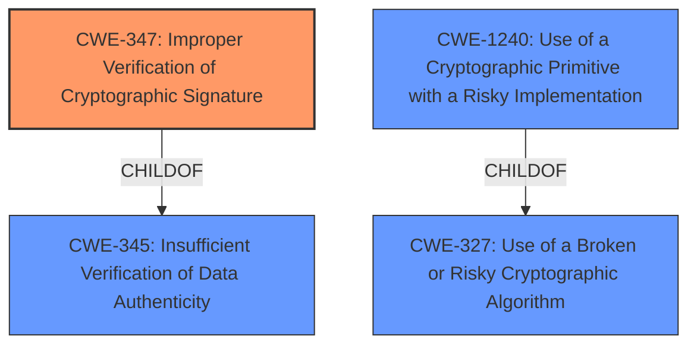

# Analysis Report for CVE-2021-21405

# Vulnerability Analysis Report: CVE-2021-21405

## Description


## Analysis (with Relationship Data)

# Summary
| CWE ID | CWE Name | Confidence | CWE Abstraction Level | CWE Vulnerability Mapping Label | CWE-Vulnerability Mapping Notes |
|---|---|---|---|---|---|
| CWE-347 | Improper Verification of Cryptographic Signature | 0.9 | Base | Primary | Allowed |
| CWE-1240 | Use of a Cryptographic Primitive with a Risky Implementation | 0.7 | Base | Secondary | Allowed |

## Evidence and Confidence

*   **Confidence Score:** 0.8
*   **Evidence Strength:** HIGH

## Relationship Analysis
The primary CWE identified is CWE-347 (**Improper Verification of Cryptographic Signature**), which is a Base level CWE. It is related to CWE-345 (**Insufficient Verification of Data Authenticity**), a Class-level CWE, through a ChildOf relationship. CWE-1240 (**Use of a Cryptographic Primitive with a Risky Implementation**) is also a Base level CWE and is related to CWE-327 (**Use of a Broken or Risky Cryptographic Algorithm**), a Class-level CWE, through a ChildOf relationship.



## Vulnerability Chain
The vulnerability chain starts with the **BLS signature validation** using the `blst` library, which accepts signatures in two forms. This leads to **two different valid block CIDs available for each block**. The impact of this weakness is that miners can be punished for valid blocks.

## Summary of Analysis
The initial assessment, based on the vulnerability description and the CVE reference links, points to **improper handling of BLS signatures** within the Lotus implementation of Filecoin. The `blst` library's `VerifyCompressed` method accepts both serialized and compressed signatures, resulting in multiple valid signature representations for the same block. This, coupled with the inclusion of the block signature in the CID calculation, allows for potentially malicious manipulation leading to the punishment of miners.

The retriever results and the complete CWE specifications strongly suggest CWE-347 (**Improper Verification of Cryptographic Signature**) as the primary weakness. This is because the root cause lies in the fact that the system **does not properly verify the cryptographic signature**, which allows for signature malleability and leads to the acceptance of multiple valid signatures for the same data. The evidence supporting this is the fact that `VerifyCompressed` accepts two signature formats, and the system doesn't enforce a single format.

CWE-1240 (**Use of a Cryptographic Primitive with a Risky Implementation**) is also considered as a secondary CWE because the `blst` library's method `VerifyCompressed` has a risky implementation.

The selection of CWE-347 is at the optimal level of specificity because it directly addresses the root cause, which is the lack of proper verification of the cryptographic signature. Choosing a higher-level CWE like CWE-345 (**Insufficient Verification of Data Authenticity**) would be too general, while lower-level CWEs might not capture the specific cryptographic nature of the vulnerability. The MITRE mapping guidance supports the selection of Base-level CWEs when appropriate, and CWE-347 fits this criterion perfectly.

Relevant CWE Information:

# Enhanced Context (25 CWEs)
The following CWEs were identified as potentially relevant to this vulnerability:

## CWE-407: Inefficient Algorithmic Complexity
**Abstraction Level**: Class
**Similarity Score**: 0.75
**Source**: dense

**Description**:
An algorithm in a product has an inefficient worst-case computational complexity that may be detrimental to system performance and can be triggered by an attacker, typically using crafted manipulations that ensure that the worst case is being reached.

**Mapping Guidance**:
- Usage: Allowed-with-Review
- Rationale: This CWE entry is a Class and might have Base-level children that would be more appropriate

## CWE-345: Insufficient Verification of Data Authenticity
**Abstraction Level**: Class
**Similarity Score**: 0.74
**Source**: dense

**Description**:
The product does not sufficiently verify the origin or authenticity of data, in a way that causes it to accept invalid data.

**Mapping Guidance**:
- Usage: Discouraged
- Rationale: This CWE entry is a level-1 Class (i.e., a child of a Pillar). It might have lower-level children that would be more appropriate

## CWE-1240: Use of a Cryptographic Primitive with a Risky Implementation
**Abstraction Level**: Base
**Similarity Score**: 0.74
**Source**: dense

**Description**:
To fulfill the need for a cryptographic primitive, the product implements a cryptographic algorithm using a non-standard, unproven, or disallowed/non-compliant cryptographic implementation.

**Mapping Guidance**:
- Usage: Allowed
- Rationale: This CWE entry is at the Base level of abstraction, which is a preferred level of abstraction for mapping to the root causes of vulnerabilities.

## CWE-330: Use of Insufficiently Random Values
**Abstraction Level**: Class
**Similarity Score**: 0.74
**Source**: dense

**Description**:
The product uses insufficiently random numbers or values in a security context that depends on unpredictable numbers.

**Mapping Guidance**:
- Usage: Discouraged
- Rationale: This CWE entry is a level-1 Class (i.e., a child of a Pillar). It might have lower-level children that would be more appropriate

## CWE-1289: Improper Validation of Unsafe Equivalence in Input
**Abstraction Level**: Base
**Similarity Score**: 0.74
**Source**: dense

**Description**:
The product receives an input value that is used as a resource identifier or other type of reference, but it does not validate or incorrectly validates that the input is equivalent to a potentially-unsafe value.

**Mapping Guidance**:
- Usage: Allowed
- Rationale: This CWE entry is at the Base level of abstraction, which is a preferred level of abstraction for mapping to the root causes of vulnerabilities.

## CWE-668: Exposure of Resource to Wrong Sphere
**Abstraction Level**: Class
**Similarity Score**: 0.73
**Source**: dense

**Description**:
The product exposes a resource to the wrong control sphere, providing unintended actors with inappropriate access to the resource.

**Mapping Guidance**:
- Usage: Discouraged
- Rationale: CWE-668 is high-level and is often misused as a catch-all when lower-level CWE IDs might be applicable. It is sometimes used for low-information vulnerability reports [REF-1287]. It is a level-1 Class (i.e., a child of a Pillar). It is not useful for trend analysis.

## CWE-328: Use of Weak Hash
**Abstraction Level**: Base
**Similarity Score**: 0.73
**Source**: dense

**Description**:
The product uses an algorithm that produces a digest (output value) that does not meet security expectations for a hash function that allows an adversary to reasonably determine the original input (preimage attack), find another input that can produce the same hash (2nd preimage attack), or find multiple inputs that evaluate to the same hash (birthday attack).

**Mapping Guidance**:
- Usage: Allowed
- Rationale: This CWE entry is at the Base level of abstraction, which is a preferred level of abstraction for mapping to the root causes of vulnerabilities.

## CWE-799: Improper Control of Interaction Frequency
**Abstraction Level**: Class
**Similarity Score**: 0.73
**Source**: dense

**Description**:
The product does not properly limit the number or frequency of interactions that it has with an actor, such as the number of incoming requests.

**Mapping Guidance**:
- Usage: Allowed-with-Review
- Rationale: This CWE entry is a Class and might have Base-level children that would be more appropriate

## CWE-703: Improper Check or Handling of Exceptional Conditions
**Abstraction Level**: Pillar
**Similarity Score**: 0.73
**Source**: dense

**Description**:
The product does not properly anticipate or handle exceptional conditions that rarely occur during normal operation of the product.

**Mapping Guidance**:
- Usage: Discouraged
- Rationale: This CWE entry is extremely high-level, a Pillar.

## CWE-203: Observable Discrepancy
**Abstraction Level**: Base
**Similarity Score**: 0.73
**Source**: dense

**Description**:
The product behaves differently or sends different responses under different circumstances in a way that


## CWE Relationship Analysis

Current CWEs represent these abstraction levels: .


### Vulnerability Chain Analysis

**Chain starting from CWE-703:**
- 703 (Improper Check or Handling of Exceptional Conditions) - ROOT


**Chain starting from CWE-1289:**
- 1289 (Improper Validation of Unsafe Equivalence in Input) - ROOT


### CWE Relationship Diagram

```mermaid
graph TD
    classDef primary fill:#f96,stroke:#333,stroke-width:2px
    classDef secondary fill:#69f,stroke:#333
    classDef tertiary fill:#9e9,stroke:#333
```


*Report generated on 2025-04-02 15:11:39*
