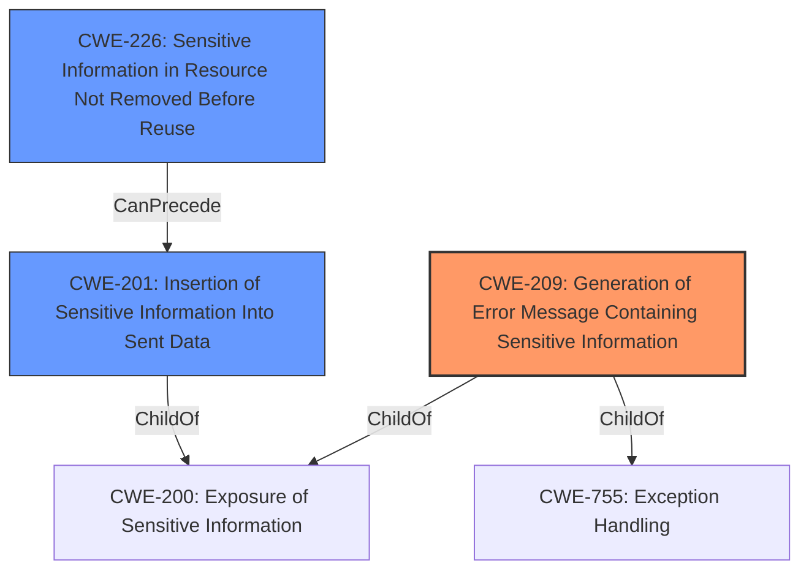

# Raw Analyzer Response for CVE-2021-21421

# Summary
| CWE ID | CWE Name | Confidence | CWE Abstraction Level | CWE Vulnerability Mapping Label | CWE-Vulnerability Mapping Notes |
|---|---|---|---|---|---|
| **CWE-209** | **Generation of Error Message Containing Sensitive Information** | 1.0 | Base | Primary | Allowed |
| CWE-201 | Insertion of Sensitive Information Into Sent Data | 0.7 | Base | Secondary | Allowed |
| CWE-226 | Sensitive Information in Resource Not Removed Before Reuse | 0.5 | Base | Secondary | Allowed |

## Evidence and Confidence

*   **Confidence Score:** 0.8
*   **Evidence Strength:** HIGH

## Relationship Analysis
The primary relationship influencing the decision is the hierarchical one. CWE-209 (Generation of Error Message Containing Sensitive Information) is a base class, which is generally preferred. While CWE-201 (Insertion of Sensitive Information Into Sent Data) is also a base class, CWE-209 more accurately captures the generation of an error message that reveals sensitive data. CWE-226 (Sensitive Information in Resource Not Removed Before Reuse) is also considered, but it's more relevant to resource re-allocation rather than error reporting.

## Vulnerability Chain
The vulnerability chain starts with the application failing to sanitize error messages, leading to the inclusion of the API key in those messages, and finally, exposing the API key to the end-user.
  - **Root Cause**: **Lack of Input Sanitization** in error message generation.
  - **Weakness**: Generation of error messages containing sensitive information.
  - **Impact**: Exposure of the API key.

## Summary of Analysis
The initial analysis focused on the **impact** of the vulnerability, which is the exposure of the API key. However, a closer look at the root cause, as described in the CVE Reference Links Content Summary, reveals that the `node-etsy-client` library was not properly sanitizing error messages. The evidence is specifically mentioned in the CVE Reference Links Content Summary: "The root cause is that the `node-etsy-client` library was not properly sanitizing error messages. When a network error occurred during an API request, the raw error object, which could contain the API key, was being passed to the application."

Based on this, CWE-209 (Generation of Error Message Containing Sensitive Information) is the most appropriate CWE. It accurately describes the scenario where the product generates an error message that includes sensitive information (the API key). The retriever results also list CWE-209 as the top candidate.

CWE-201 (Insertion of Sensitive Information Into Sent Data) was also considered as a secondary CWE, but it's less specific than CWE-209. CWE-201 describes the general case of sending sensitive data, while CWE-209 focuses on the specific context of error messages.

CWE-226 (Sensitive Information in Resource Not Removed Before Reuse) was considered because it deals with sensitive information in resources. However, the vulnerability is not related to resource reuse, but rather to the generation of error messages.

The selected CWEs are at the optimal level of specificity because they directly address the root cause and the immediate weakness.

Relevant CWE Information:

# Enhanced Context (25 CWEs)
The following CWEs were identified as potentially relevant to this vulnerability:

## CWE-1289: Improper Validation of Unsafe Equivalence in Input
**Abstraction Level**: Base
**Similarity Score**: 0.76
**Source**: dense

**Description**:
The product receives an input value that is used as a resource identifier or other type of reference, but it does not validate or incorrectly validates that the input is equivalent to a potentially-unsafe value.

**Mapping Guidance**:
- Usage: Allowed
- Rationale: This CWE entry is at the Base level of abstraction, which is a preferred level of abstraction for mapping to the root causes of vulnerabilities.

## CWE-226: Sensitive Information in Resource Not Removed Before Reuse
**Abstraction Level**: Base
**Similarity Score**: 0.76
**Source**: dense

**Description**:
The product releases a resource such as memory or a file so that it can be made available for reuse, but it does not clear or "zeroize" the information contained in the resource before the product performs a critical state transition or makes the resource available for reuse by other entities.

**Mapping Guidance**:
- Usage: Allowed
- Rationale: This CWE entry is at the Base level of abstraction, which is a preferred level of abstraction for mapping to the root causes of vulnerabilities.

## CWE-405: Asymmetric Resource Consumption (Amplification)
**Abstraction Level**: Class
**Similarity Score**: 0.76
**Source**: dense

**Description**:
The product does not properly control situations in which an adversary can cause the product to consume or produce excessive resources without requiring the adversary to invest equivalent work or otherwise prove authorization, i.e., the adversary's influence is "asymmetric."

**Mapping Guidance**:
- Usage: Allowed-with-Review
- Rationale: This CWE entry is a Class and might have Base-level children that would be more appropriate

## CWE-404: Improper Resource Shutdown or Release
**Abstraction Level**: Class
**Similarity Score**: 0.75
**Source**: dense

**Description**:
The product does not release or incorrectly releases a resource before it is made available for re-use.

**Mapping Guidance**:
- Usage: Allowed-with-Review
- Rationale: This CWE entry is a Class and might have Base-level children that would be more appropriate

## CWE-668: Exposure of Resource to Wrong Sphere
**Abstraction Level**: Class
**Similarity Score**: 0.75
**Source**: dense

**Description**:
The product exposes a resource to the wrong control sphere, providing unintended actors with inappropriate access to the resource.

**Mapping Guidance**:
- Usage: Discouraged
- Rationale: CWE-668 is high-level and is often misused as a catch-all when lower-level CWE IDs might be applicable. It is sometimes used for low-information vulnerability reports [REF-1287]. It is a level-1 Class (i.e., a child of a Pillar). It is not useful for trend analysis.

## CWE-799: Improper Control of Interaction Frequency
**Abstraction Level**: Class
**Similarity Score**: 0.74
**Source**: dense

**Description**:
The product does not properly limit the number or frequency of interactions that it has with an actor, such as the number of incoming requests.

**Mapping Guidance**:
- Usage: Allowed-with-Review
- Rationale: This CWE entry is a Class and might have Base-level children that would be more appropriate

## CWE-941: Incorrectly Specified Destination in a Communication Channel
**Abstraction Level**: Base
**Similarity Score**: 0.74
**Source**: dense

**Description**:
The product creates a communication channel to initiate an outgoing request to an actor, but it does not correctly specify the intended destination for that actor.

**Mapping Guidance**:
- Usage: Allowed
- Rationale: This CWE entry is at the Base level of abstraction, which is a preferred level of abstraction for mapping to the root causes of vulnerabilities.

## CWE-297: Improper Validation of Certificate with Host Mismatch
**Abstraction Level**: Variant
**Similarity Score**: 0.74
**Source**: dense

**Description**:
The product communicates with a host that provides a certificate, but the product does not properly ensure that the certificate is actually associated with that host.

**Mapping Guidance**:
- Usage: Allowed
- Rationale: This CWE entry is at the Variant level of abstraction, which is a preferred level of abstraction for mapping to the root causes of vulnerabilities.

## CWE-807: Reliance on Untrusted Inputs in a Security Decision
**Abstraction Level**: Base
**Similarity Score**: 0.74
**Source**: dense

**Description**:
The product uses a protection mechanism that relies on the existence or values of an input, but the input can be modified by an untrusted actor in a way that bypasses the protection mechanism.

**Mapping Guidance**:
- Usage: Allowed
- Rationale: This CWE entry is at the Base