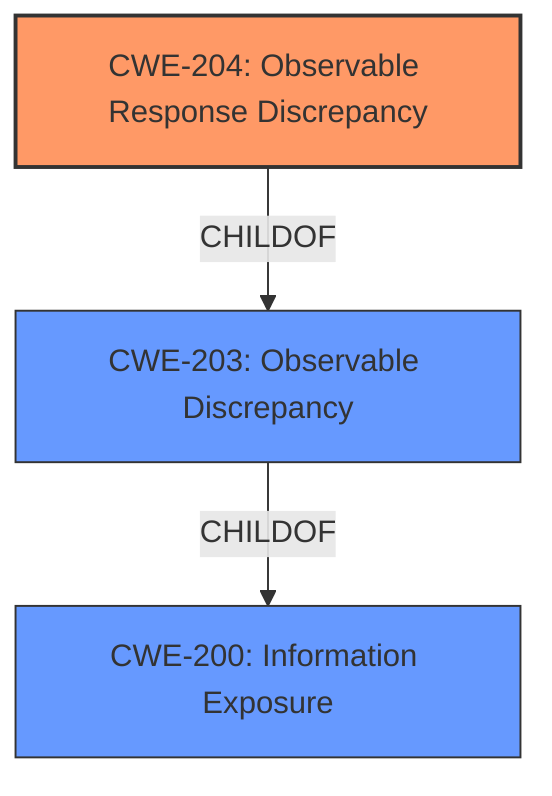

# Analysis for CVE-2021-21424

# Summary

| CWE ID | CWE Name | Confidence | CWE Abstraction Level | CWE Vulnerability Mapping Label | CWE-Vulnerability Mapping Notes |
|---|---|---|---|---|---|
| CWE-204 | Observable Response Discrepancy | 1 | Base | Allowed | Primary CWE |
| CWE-200 | Information Exposure | 0.7 | Class | Allowed | Secondary Candidate |

## Evidence and Confidence

*   **Confidence Score:** 1
*   **Evidence Strength:** HIGH

## Relationship Analysis
The primary CWE selected is CWE-204 (Observable Response Discrepancy), which is a child of CWE-203 (Observable Discrepancy) and CWE-200 (Information Exposure). The vulnerability lies in the different responses based on user existence, leading to user enumeration.
The other CWEs were considered but did not fit as accurately.

## Vulnerability Chain
The vulnerability chain starts with the **improper handling** of user existence checks, leading to **observable response discrepancies**, which ultimately results in **information exposure** through user enumeration.

## Summary of Analysis
The initial assessment identified the **different handling depending on whether the user existed or not when attempting to use the switch users functionality** as the root cause, leading to the impact of user enumeration. The final conclusion, supported by the evidence, is that CWE-204 (Observable Response Discrepancy) is the most accurate primary CWE, with CWE-200 (Information Exposure) as a broader, less specific secondary CWE.

The selection of CWE-204 is based on the specific **rootcause** of **different handling depending on whether the user existed or not when attempting to use the switch users functionality** leading to different responses which revealed information about existing users. The "CVE Reference Links Content Summary" section consistently points to the same root cause: "The vulnerability was caused by different exception messages depending on whether the user existed or not, which allowed for user enumeration." The vulnerability description also mentions that "We now ensure that 403s are returned whether the user exists or not if a user cannot switch to a user or if the user does not exist", which is a direct fix to the observable response discrepancy.

CWE-203 (Observable Discrepancy) was also considered, as CWE-204 is a child of CWE-203, but CWE-204 is a better fit because it specifies the discrepancy in the response.

CWE-639 (Authorization Bypass Through User-Controlled Key) was considered but deemed less appropriate, as the primary issue is not about bypassing authorization through a user-controlled key, but rather the ability to enumerate users due to **observable discrepancies** in the responses.

CWE-306 (Missing Authentication for Critical Function) was considered but deemed less appropriate, as the vulnerability is not related to a lack of authentication.

CWE-209 (Generation of Error Message Containing Sensitive Information) was considered, as it relates to error messages revealing information. However, the core issue is the **discrepancy** in how existing and non-existing users are handled, rather than the error message itself containing sensitive information.

CWE-287 (Improper Authentication) was considered but deemed too general. The issue is not about a failure in the authentication process itself, but rather the information leakage due to different responses based on user existence.

CWE-862 (Missing Authorization) and CWE-863 (Incorrect Authorization) were considered but deemed inappropriate, as the problem is not about missing or incorrect authorization checks, but about information leakage.

CWE-613 (Insufficient Session Expiration) and CWE-1275 (Sensitive Cookie with Improper SameSite Attribute) were considered due to their presence in the Retriever Results, but they are not relevant to the vulnerability described.

CWE-200 (Information Exposure) is a higher-level (Class) CWE that generally describes vulnerabilities where sensitive information is exposed. While it is relevant as a high level CWE, CWE-204 (Observable Response Discrepancy) more precisely captures the **rootcause** of the vulnerability.

The selected CWEs are at the optimal level of specificity, with CWE-204 providing a precise description of the vulnerability's **rootcause** and mechanism, and CWE-200 capturing the broader impact of information exposure.