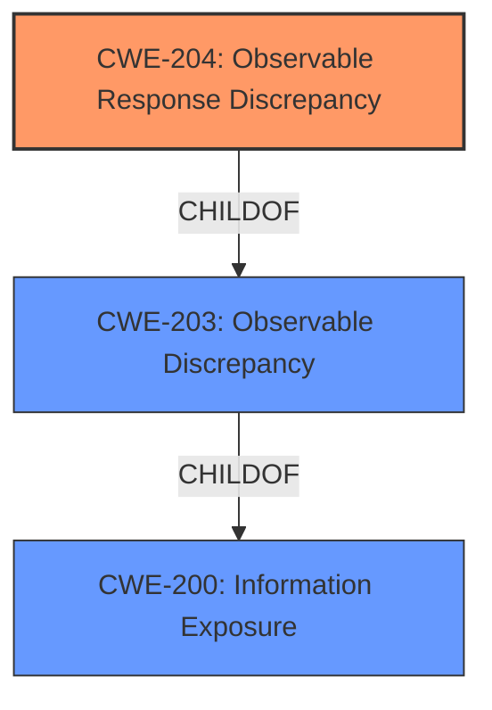

# Analysis for CVE-2021-21424

# Summary

| CWE ID | CWE Name | Confidence | CWE Abstraction Level | CWE Vulnerability Mapping Label | CWE-Vulnerability Mapping Notes |
|---|---|---|---|---|---|
| CWE-204 | Observable Response Discrepancy | 1 | Base | Allowed | Primary CWE |
| CWE-200 | Information Exposure | 0.7 | Class | Allowed | Secondary Candidate |

## Evidence and Confidence

*   **Confidence Score:** 1
*   **Evidence Strength:** HIGH

## Relationship Analysis
The primary CWE selected is CWE-204 (Observable Response Discrepancy), which is a child of CWE-203 (Observable Discrepancy) and CWE-200 (Information Exposure). The vulnerability lies in the different responses based on user existence, leading to user enumeration.
The other CWEs were considered but did not fit as accurately.



## Vulnerability Chain
The vulnerability chain starts with the **improper handling** of user existence checks, leading to **observable response discrepancies**, which ultimately results in **information exposure** through user enumeration.

## Summary of Analysis
The initial assessment identified the **different handling depending on whether the user existed or not when attempting to use the switch users functionality** as the root cause, leading to the impact of user enumeration. The final conclusion, supported by the evidence, is that CWE-204 (Observable Response Discrepancy) is the most accurate primary CWE, with CWE-200 (Information Exposure) as a broader, less specific secondary CWE.

The selection of CWE-204 is based on the specific **rootcause** of **different handling depending on whether the user existed or not when attempting to use the switch users functionality** leading to different responses which revealed information about existing users. The "CVE Reference Links Content Summary" section consistently points to the same root cause: "The vulnerability was caused by different exception messages depending on whether the user existed or not, which allowed for user enumeration." The vulnerability description also mentions that "We now ensure that 403s are returned whether the user exists or not if a user cannot switch to a user or if the user does not exist", which is a direct fix to the observable response discrepancy.

CWE-203 (Observable Discrepancy) was also considered, as CWE-204 is a child of CWE-203, but CWE-204 is a better fit because it specifies the discrepancy in the response.

CWE-639 (Authorization Bypass Through User-Controlled Key) was considered but deemed less appropriate, as the primary issue is not about bypassing authorization through a user-controlled key, but rather the ability to enumerate users due to **observable discrepancies** in the responses.

CWE-306 (Missing Authentication for Critical Function) was considered but deemed less appropriate, as the vulnerability is not related to a lack of authentication.

CWE-209 (Generation of Error Message Containing Sensitive Information) was considered, as it relates to error messages revealing information. However, the core issue is the **discrepancy** in how existing and non-existing users are handled, rather than the error message itself containing sensitive information.

CWE-287 (Improper Authentication) was considered but deemed too general. The issue is not about a failure in the authentication process itself, but rather the information leakage due to different responses based on user existence.

CWE-862 (Missing Authorization) and CWE-863 (Incorrect Authorization) were considered but deemed inappropriate, as the problem is not about missing or incorrect authorization checks, but about information leakage.

CWE-613 (Insufficient Session Expiration) and CWE-1275 (Sensitive Cookie with Improper SameSite Attribute) were considered due to their presence in the Retriever Results, but they are not relevant to the vulnerability described.

CWE-200 (Information Exposure) is a higher-level (Class) CWE that generally describes vulnerabilities where sensitive information is exposed. While it is relevant as a high level CWE, CWE-204 (Observable Response Discrepancy) more precisely captures the **rootcause** of the vulnerability.

The selected CWEs are at the optimal level of specificity, with CWE-204 providing a precise description of the vulnerability's **rootcause** and mechanism, and CWE-200 capturing the broader impact of information exposure.

# Enhanced Query for CVE-2021-21424

## Vulnerability Description
Symfony is a PHP framework for web and console applications and a set of reusable PHP components. The ability to enumerate users was possible without relevant permissions due to **different handling depending on whether the user existed or not when attempting to use the switch users functionality**. We now ensure that 403s are returned whether the user exists or not if a user cannot switch to a user or if the user does not exist. The patch for this issue is available for branch 3.4.

### Vulnerability Description Key Phrases
- **rootcause:** **different handling depending on whether the user existed or not when attempting to use the switch users functionality**
- **impact:** enumerate users without relevant permissions
- **product:** Symfony
- **version:** 3.4

## CVE Reference Links Content Summary
```
{
  "guidelines": "1. First verify if the content relates to the CVE specified based on the official description\n2. If the content does not relate to this CVE, respond with \"UNRELATED\"\n3. If no useful vulnerability information is found, respond with \"NOINFO\" \n4. For relevant content, extract:\n   - Root cause of vulnerability\n   - Weaknesses/vulnerabilities present\n   - Impact of exploitation\n   - Attack vectors\n   - Required attacker capabilities/position\n\nAdditional instructions:\n- Preserve original technical details and descriptions\n- Remove unrelated content\n- Translate non-English content to English\n- Note if the content provides more detail than the official CVE description",
  "response": {
    "CVE-2021-21424": [
      {
        "content": "title: \"CVE-2021-21424: Prevent user enumeration via response content in authentication mechanisms\"\nlink: https://symfony.com/cve-2021-21424\ncve: CVE-2021-21424\nbranches:\n 2.8.x:\n  time: 2021-05-12 08:00:00\n  versions: ['>=2.8.0', '<3.0.0']\n 3.0.x:\n  time: 2021-05-12 08:00:00\n  versions: ['>=3.0.0', '<3.1.0']\n 3.1.x:\n  time: 2021-05-12 08:00:00\n  versions: ['>=3.1.0', '<3.2.0']\n 3.2.x:\n  time: 2021-05-12 08:00:00\n  versions: ['>=3.2.0', '<3.3.0']\n 3.3.x:\n  time: 2021-05-12 08:00:00\n  versions: ['>=3.3.0', '<3.4.0']\n 3.4.x:\n  time: 2021-05-12 08:00:00\n  versions: ['>=3.4.0', '<3.4.49']\n 4.0.x:\n  time: 2021-05-12 08:00:00\n  versions: ['>=4.0.0', '<4.1.0']\n 4.1.x:\n  time: 2021-05-12 08:00:00\n  versions: ['>=4.1.0', '<4.2.0']\n 4.2.x:\n  time: 2021-05-12 08:00:00\n  versions: ['>=4.2.0', '<4.3.0']\n 4.3.x:\n  time: 2021-05-12 08:00:00\n  versions: ['>=4.3.0', '<4.4.0']\n 4.4.x:\n  time: 2021-05-12 08:00:00\n  versions: ['>=4.4.0', '<4.4.24']\n 5.0.x:\n  time: 2021-05-12 08:00:00\n  versions: ['>=5.0.0', '<5.1.0']\n 5.1.x:\n  time: 2021-05-12 08:00:00\n  versions: ['>=5.1.0', '<5.2.0']\n 5.2.x:\n  time: 2021-05-12 08:00:00\n  versions: ['>=5.2.0', '<5.2.9']\nreference: composer://symfony/symfony",
        "root_cause": "The vulnerability was caused by different exception messages depending on whether the user existed or not, which allowed for user enumeration. A timing attack was also possible.",
        "weaknesses": [
          "User enumeration",
          "Timing attack vulnerability"
        ],
        "impact": "An attacker can enumerate existing users on the system.",
        "attack_vectors": [
          "Authentication mechanisms",
          "Response body content"
        ],
        "required_capabilities": "An attacker can send authentication requests to the system."
      },
      {
        "content": "title: \"CVE-2021-21424: Prevent user enumeration via response content in authentication mechanisms\"\nlink: https://symfony.com/cve-2021-21424\ncve: CVE-2021-21424\nbranches:\n 5.1.x:\n  time: 2021-05-12 08:00:00\n  versions: ['>=5.1.0', '<5.2.0']\n 5.2.x:\n  time: 2021-05-12 08:00:00\n  versions: ['>=5.2.0', '<5.2.8']\nreference: composer://symfony/security-http",
        "root_cause": "The vulnerability was caused by different exception messages depending on whether the user existed or not, which allowed for user enumeration. A timing attack was also possible.",
         "weaknesses": [
          "User enumeration",
          "Timing attack vulnerability"
        ],
        "impact": "An attacker can enumerate existing users on the system.",
        "attack_vectors": [
          "Authentication mechanisms",
          "Response body content"
        ],
        "required_capabilities": "An attacker can send authentication requests to the system."
      },
       {
        "content": "title: \"CVE-2021-21424: Prevent user enumeration via response content in authentication mechanisms\"\nlink: https://symfony.com/cve-2021-21424\ncve: CVE-2021-21424\nbranches:\n 2.0.x:\n  time: 2021-05-12 08:00:00\n  versions: ['>=2.0.0', '<2.1.0']\n 2.1.x:\n  time: 2021-05-12 08:00:00\n  versions: ['>=2.1.0', '<2.2.0']\n 2.2.x:\n  time: 2021-05-12 08:00:00\n  versions: ['>=2.2.0', '<2.3.0']\n 2.3.x:\n  time: 2021-05-12 08:00:00\n  versions: ['>=2.3.0', '<2.4.0']\n 2.4.x:\n  time: 2021-05-12 08:00:00\n  versions: ['>=2.4.0', '<2.5.0']\n 2.5.x:\n  time: 2021-05-12 08:00:00\n  versions: ['>=2.5.0', '<2.6.0']\n 2.6.x:\n  time: 2021-05-12 08:00:00\n  versions: ['>=2.6.0', '<2.7.0']\n 2.7.x:\n  time: 2021-05-12 08:00:00\n  versions: ['>=2.7.0', '<2.8.0']\n 2.8.x:\n  time: 2021-05-12 08:00:00\n  versions: ['>=2.8.0', '<2.9.0']\n 2.9.x:\n  time: 2021-05-12 08:00:00\n  versions: ['>=2.9.0', '<2.10.0']\n 2.10.x:\n  time: 2021-05-12 08:00:00\n  versions: ['>=2.10.0', '<2.10.7']\n 2.11.x:\n  time: 2021-05-12 08:00:00\n  versions: ['>=2.11.0', '<2.11.3']\nreference: composer://lexik/jwt-authentication-bundle",
         "root_cause": "The vulnerability was caused by different exception messages depending on whether the user existed or not, which allowed for user enumeration. A timing attack was also possible.",
         "weaknesses": [
          "User enumeration",
          "Timing attack vulnerability"
        ],
        "impact": "An attacker can enumerate existing users on the system.",
        "attack_vectors": [
          "Authentication mechanisms",
          "Response body content"
        ],
        "required_capabilities": "An attacker can send authentication requests to the system."
      },
      {
        "content": "title: \"CVE-2021-21424: Prevent user enumeration via response content in authentication mechanisms\"\nlink: https://symfony.com/cve-2021-21424\ncve: CVE-2021-21424\nbranches:\n 1.27.x:\n  time: 2021-05-12 08:00:00\n  versions: ['>=1.27.0', '<1.28.0']\n 1.28.x:\n  time: 2021-05-12 08:00:00\n  versions: ['>=1.28.0', '<1.29.0']\n 1.29.x:\n   time: 2021-05-18 16:31:23\n   versions: ['>=1.29.0', '<1.29.2']\n 1.30.x:\n  time: 2021-05-12 08:00:00\n  versions: ['>=1.30.0', '<1.31.0']\n 1.31.x:\n  time: 2021-05-12 08:00:00\n  versions: ['>=1.31.0', '<1.31.1']\nreference: composer://symfony/maker-bundle",
        "root_cause": "The vulnerability was caused by different exception messages depending on whether the user existed or not, which allowed for user enumeration. A timing attack was also possible.",
         "weaknesses": [
          "User enumeration",
          "Timing attack vulnerability"
        ],
        "impact": "An attacker can enumerate existing users on the system.",
        "attack_vectors": [
          "Authentication mechanisms",
          "Response body content"
        ],
        "required_capabilities": "An attacker can send authentication requests to the system."
      },
       {
        "content": "title: \"CVE-2021-21424: Prevent user enumeration via response content in authentication mechanisms\"\nlink: https://symfony.com/cve-2021-21424\ncve: CVE-2021-21424\nbranches:\n 2.8.x:\n  time: 2021-05-12 08:00:00\n  versions: ['>=2.8.0', '<3.0.0']\n 3.0.x:\n  time: 2021-05-12 08:00:00\n  versions: ['>=3.0.0', '<3.1.0']\n 3.1.x:\n  time: 2021-05-12 08:00:00\n  versions: ['>=3.1.0', '<3.2.0']\n 3.2.x:\n  time: 2021-05-12 08:00:00\n  versions: ['>=3.2.0', '<3.3.0']\n 3.3.x:\n  time: 2021-05-12 08:00:00\n  versions: ['>=3.3.0', '<3.4.0']\n 3.4.x:\n  time: 2021-05-12 08:00:00\n  versions: ['>=3.4.0', '<3.4.48']\n 4.0.x:\n  time: 2021-05-12 08:00:00\n  versions: ['>=4.0.0', '<4.1.0']\n 4.1.x:\n  time: 2021-05-12 08:00:00\n  versions: ['>=4.1.0', '<4.2.0']\n 4.2.x:\n  time: 2021-05-12 08:00:00\n  versions: ['>=4.2.0', '<4.3.0']\n 4.3.x:\n  time: 2021-05-12 08:00:00\n  versions: ['>=4.3.0', '<4.4.0']\n 4.4.x:\n  time: 2021-05-12 08:00:00\n  versions: ['>=4.4.0', '<4.4.23']\n 5.0.x:\n  time: 2021-05-12 08:00:00\n  versions: ['>=5.0.0', '<5.1.0']\n 5.1.x:\n  time: 2021-05-12 08:00:00\n  versions: ['>=5.1.0', '<5.2.0']\n 5.2.x:\n  time: 2021-05-12 08:00:00\n  versions: ['>=5.2.0', '<5.2.8']\nreference: composer://symfony/security-guard",
        "root_cause": "The vulnerability was caused by different exception messages depending on whether the user existed or not, which allowed for user enumeration. A timing attack was also possible.",
         "weaknesses": [
          "User enumeration",
          "Timing attack vulnerability"
        ],
        "impact": "An attacker can enumerate existing users on the system.",
        "attack_vectors": [
          "Authentication mechanisms",
          "Response body content"
        ],
        "required_capabilities": "An attacker can send authentication requests to the system."
      },
        {
        "content": "title: \"CVE-2021-21424: Prevent user enumeration via response content in authentication mechanisms\"\nlink: https://symfony.com/cve-2021-21424\ncve: CVE-2021-21424\nbranches:\n 2.8.x:\n  time: 2021-05-12 08:00:00\n  versions: ['>=2.8.0', '<3.0.0']\n 3.0.x:\n  time: 2021-05-12 08:00:00\n  versions: ['>=3.0.0', '<3.1.0']\n 3.1.x:\n  time: 2021-05-12 08:00:00\n  versions: ['>=3.1.0', '<3.2.0']\n 3.2.x:\n  time: 2021-05-12 08:00:00\n  versions: ['>=3.2.0', '<3.3.0']\n 3.3.x:\n  time: 2021-05-12 08:00:00\n  versions: ['>=3.3.0', '<3.4.0']\n 3.4.x:\n  time: 2021-05-12 08:00:00\n  versions: ['>=3.4.0', '<3.4.49']\n 4.0.x:\n  time: 2021-05-12 08:00:00\n  versions: ['>=4.0.0', '<4.1.0']\n 4.1.x:\n  time: 2021-05-12 08:00:00\n  versions: ['>=4.1.0', '<4.2.0']\n 4.2.x:\n  time: 2021-05-12 08:00:00\n  versions: ['>=4.2.0', '<4.3.0']\n 4.3.x:\n  time: 2021-05-12 08:00:00\n  versions: ['>=4.3.0', '<4.4.0']\n 4.4.x:\n  time: 2021-05-12 08:00:00\n  versions: ['>=4.4.0', '<4.4.24']\nreference: composer://symfony/security",
         "root_cause": "The vulnerability was caused by different exception messages depending on whether the user existed or not, which allowed for user enumeration. A timing attack was also possible.",
         "weaknesses": [
          "User enumeration",
          "Timing attack vulnerability"
        ],
         "impact": "An attacker can enumerate existing users on the system.",
        "attack_vectors": [
          "Authentication mechanisms",
          "Response body content"
        ],
        "required_capabilities": "An attacker can send authentication requests to the system."
      },
      {
         "content": "```\n-------------------------------------------------------------------------\nDebian LTS Advisory DLA-3493-1                debian-lts@lists.debian.org\n<https://www.debian.org/lts/security/>                       Guilhem Moulin\nJuly 11, 2023                                 <https://wiki.debian.org/LTS>\n-------------------------------------------------------------------------\n\nPackage        : symfony\nVersion        : 3.4.22+dfsg-2+deb10u2\nCVE ID         : CVE-2021-21424 CVE-2022-24894 CVE-2022-24895\n\nMultiple security vulnerabilities were found in symfony, a PHP framework\nfor web and console applications and a set of reusable PHP components,\nwhich could lead to information disclosure or impersonation.\n\nCVE-2021-21424\n\n    James Isaac, Mathias Brodala and Laurent Minguet discovered that it\n    was possible to enumerate users without relevant permissions due to\n    different exception messages depending on whether the user existed\n    or not.  It was also possible to enumerate users by using a timing\n    attack, by comparing time elapsed when authenticating an existing\n    user and authenticating a non-existing user.\n\n    403s are now returned whether the user exists or not if a user\n    cannot switch to a user or if the user does not exist.\n\nCVE-2022-24894\n\n    Soner Sayakci discovered that when the Symfony HTTP cache system is\n    enabled, the response header might be stored with a `Set-Cookie`\n    header and returned to some other clients, thereby allowing an\n    attacker to retrieve the victim's session.\n\n    The `HttpStore` constructor now takes a parameter containing a list\n    of private headers that are removed from the HTTP response headers.\n    The default value for this parameter is `Set-Cookie`, but it can be\n    overridden or extended by the application.\n\nCVE-2022-24895\n\n    Marco Squarcina discovered that CSRF tokens aren't cleared upon\n    login, which could enable same-site attackers to bypass the CSRF\n    protection mechanism by performing an attack similar to a\n    session-fixation.\n\nFor Debian 10 buster, these problems have been fixed in version\n3.4.22+dfsg-2+deb10u2.\n\nWe recommend that you upgrade your symfony packages.\n\nFor the detailed security status of symfony please refer to\nits security tracker page at:\n<https://security-tracker.debian.org/tracker/symfony>\n\nFurther information about Debian LTS security advisories, how to apply\nthese updates to your system and frequently asked questions can be\nfound at: <https://wiki.debian.org/LTS>\n\n```",
        "root_cause": "The vulnerability was caused by different exception messages depending on whether the user existed or not, which allowed for user enumeration. A timing attack was also possible by measuring the time elapsed between authenticating an existing vs non existing user.",
         "weaknesses": [
          "User enumeration",
          "Timing attack vulnerability",
          "Information disclosure"
        ],
         "impact": "An attacker can enumerate existing users on the system.",
        "attack_vectors": [
           "Authentication mechanisms",
           "Response body content",
           "Timing attacks"
        ],
        "required_capabilities": "An attacker can send authentication requests to the system."
      },
        {
        "content": "--------------------------------------------------------------------------------\nFedora Update Notification\nFEDORA-2021-2d145b95f6\n2021-05-29 01:04:01.502352\n--------------------------------------------------------------------------------\n\nName : php-symfony4\nProduct : Fedora 34\nVersion : 4.4.24\nRelease : 1.fc34\nURL : <https://symfony.com>\nSummary : Symfony PHP framework (version 4)\nDescription :\nSymfony PHP framework (version 4).\n\nNOTE: Does not require PHPUnit bridge.\n\n--------------------------------------------------------------------------------\nUpdate Information:\n\n\\*\\*Version 4.4.24\\*\\* (2021-05-19) \\* security \\*\\*CVE-2021-21424\\*\\* [Security\\Core]\nFix user enumeration via response body on invalid credentials (chalasr) \\* bug\n#41230 [FrameworkBundle][Validator] Fix deprecations from Doctrine\nAnnotations+Cache (derrabus) \\* bug #41240 Fixed deprecation warnings about\npassing null as parameter (derrabus) \\* bug #41241 [Finder] Fix gitignore regex\nbuild with \"\\*\\*\" (mvorisek) \\* bug #41224 [HttpClient] fix adding query string to\nrelative URLs with scoped clients (nicolas-grekas) \\* bug #41233\n[DependencyInjection][ProxyManagerBridge] Don't call class_exists() on null\n(derrabus) \\* bug #41210 [Console] Fix Windows code page support (orkan) ----\n\\*\\*Version 4.4.23\\*\\* (2021-05-12) \\* security \\*\\*CVE-2021-21424\\*\\*\n[Security][Guard] Prevent user enumeration (chalasr) \\* bug #41176\n[DependencyInjection] fix dumping service-closure-arguments (nicolas-grekas) \\*\nbug #41168 WDT: Only load \"Sfjs\" if it is not present already (weaverryan) \\*\nbug #41147 [Inflector][String] wrong plural form of words ending by \"pectus\"\n(makraz) \\* bug #41160 [HttpClient] Don't prepare the request in\nScopingHttpClient (nicolas-grekas) \\* bug #40763 Fix/Rewrite .gitignore regex\nbuilder (mvorisek) \\* bug #40917 [Config][DependencyInjection] Uniformize\ntrailing slash handling (dunglas) \\* bug #40699 [PropertyInfo] Make\nReflectionExtractor correctly extract nullability (shiftby) \\* bug #40874\n[PropertyInfo] fix attribute namespace with recursive traits (soullivaneuh) \\*\nbug #41099 [Cache] Check if phpredis version is compatible with stream parameter\n(nicolassing) \\* bug #41072 [VarExporter] Add support of PHP enumerations\n(alexandre-daubois) \\* bug #41105 [Inflector][String] Fixed singularize `edges`\n\n...\n> `edge` (ruudk) \\* bug #41075 [ErrorHandler] Skip \"same vendor\" ``@method``\n\ndeprecations for `Symfony\\*` classes unless symfony/symfony is being tested\n(nicolas-grekas)\n--------------------------------------------------------------------------------",
        "root_cause": "The vulnerability was caused by different exception messages depending on whether the user existed or not, which allowed for user enumeration.",
         "weaknesses": [
          "User enumeration"
        ],
        "impact": "An attacker can enumerate existing users on the system.",
         "attack_vectors": [
          "Authentication mechanisms",
           "Response body content"
        ],
         "required_capabilities": "An attacker can send authentication requests to the system."
      },
      {
        "content": "--------------------------------------------------------------------------------\nFedora Update Notification\nFEDORA-2021-121edb82dd\n2021-05-28 01:10:41.955482\n--------------------------------------------------------------------------------\n\nName : php-symfony4\nProduct : Fedora 33\nVersion : 4.4.24\nRelease : 1.fc33\nURL : <https://symfony.com>\nSummary : Symfony PHP framework (version 4)\nDescription :\nSymfony PHP framework (version 4).\n\nNOTE: Does not require PHPUnit bridge.\n\n--------------------------------------------------------------------------------\nUpdate Information:\n\n\\*\\*Version 4.4.24\\*\\* (2021-05-19) \\* security \\*\\*CVE-2021-21424\\*\\* [Security\\Core]\nFix user enumeration via response body on invalid credentials (chalasr) \\* bug\n#41230 [FrameworkBundle][Validator] Fix deprecations from Doctrine\nAnnotations+Cache (derrabus) \\* bug #41240 Fixed deprecation warnings about\npassing null as parameter (derrabus) \\* bug #41241 [Finder] Fix gitignore regex\nbuild with \"\\*\\*\" (mvorisek) \\* bug #41224 [HttpClient] fix adding query string to\nrelative URLs with scoped clients (nicolas-grekas) \\* bug #41233\n[DependencyInjection][ProxyManagerBridge] Don't call class_exists() on null\n(derrabus) \\* bug #41210 [Console] Fix Windows code page support (orkan) ----\n\\*\\*Version 4.4.23\\*\\* (2021-05-12) \\* security \\*\\*CVE-2021-21424\\*\\*\n[Security][Guard] Prevent user enumeration (chalasr) \\* bug #41176\n[DependencyInjection] fix dumping service-closure-arguments (nicolas-grekas) \\*\nbug #41168 WDT: Only load \"Sfjs\" if it is not present already (weaverryan) \\*\nbug #41147 [Inflector][String] wrong plural form of words ending by \"pectus\"\n(makraz) \\* bug #41160 [HttpClient] Don't prepare the request in\nScopingHttpClient (nicolas-grekas) \\* bug #40763 Fix/Rewrite .gitignore regex\nbuilder (mvorisek) \\* bug #40917 [Config][DependencyInjection] Uniformize\ntrailing slash handling (dunglas) \\* bug #40699 [PropertyInfo] Make\nReflectionExtractor correctly extract nullability (shiftby) \\* bug #40874\n[PropertyInfo] fix attribute namespace with recursive traits (soullivaneuh) \\*\nbug #41099 [Cache] Check if phpredis version is compatible with stream parameter\n(nicolassing) \\* bug #41072 [VarExporter] Add support of PHP enumerations\n(alexandre-daubois) \\* bug #41105 [Inflector][String] Fixed singularize `edges`\n\n...\n> `edge` (ruudk) \\* bug #41075 [ErrorHandler] Skip \"same vendor\" ``@method``\n\ndeprecations for `Symfony\\*` classes unless symfony/symfony is being tested\n(nicolas-grekas)\n--------------------------------------------------------------------------------",
        "root_cause": "The vulnerability was caused by different exception messages depending on whether the user existed or not, which allowed for user enumeration.",
        "weaknesses": [
          "User enumeration"
        ],
       "impact": "An attacker can enumerate existing users on the system.",
        "attack_vectors": [
          "Authentication mechanisms",
           "Response body content"
        ],
         "required_capabilities": "An attacker can send authentication requests to the system."
      },
      {
        "content": "--------------------------------------------------------------------------------\nFedora Update Notification\nFEDORA-2021-f3ad34aa9f\n2021-05-28 01:10:41.955472\n--------------------------------------------------------------------------------\n\nName : php-symfony3\nProduct : Fedora 33\nVersion : 3.4.49\nRelease : 1.fc33\nURL : <https://symfony.com>\nSummary : Symfony PHP framework (version 3)\nDescription :\nSymfony PHP framework (version 3).\n\nNOTE: Does not require PHPUnit bridge.\n\n--------------------------------------------------------------------------------\nUpdate Information:\n\n\\*\\*Version 3.4.49\\*\\* (2021-05-19) \\* security \\*\\*CVE-2021-21424\\*\\* [Security\\Core]\nFix user enumeration via response body on invalid credentials (chalasr) ----\n\\*\\*Version 3.4.48\\*\\* (2021-05-12) \\* security \\*\\*CVE-2021-21424\\*\\*\n[Security][Guard] Prevent user enumeration (chalasr)\n--------------------------------------------------------------------------------",
        "root_cause": "The vulnerability was caused by different exception messages depending on whether the user existed or not, which allowed for user enumeration.",
        "weaknesses": [
          "User enumeration"
        ],
        "impact": "An attacker can enumerate existing users on the system.",
        "attack_vectors": [
          "Authentication mechanisms",
          "Response body content"
        ],
        "required_capabilities": "An attacker can send authentication requests to the system."
      },
       {
        "content": "--------------------------------------------------------------------------------\nFedora Update Notification\nFEDORA-2021-c57937ab9f\n2021-05-29 01:04:01.502342\n--------------------------------------------------------------------------------\n\nName : php-symfony3\nProduct : Fedora 34\nVersion : 3.4.49\nRelease : 1.fc34\nURL : <https://symfony.com>\nSummary : Symfony PHP framework (version 3)\nDescription :\nSymfony PHP framework (version 3).\n\nNOTE: Does not require PHPUnit bridge.\n\n--------------------------------------------------------------------------------\nUpdate Information:\n\n\\*\\*Version 3.4.49\\*\\* (2021-05-19) \\* security \\*\\*CVE-2021-21424\\*\\* [Security\\Core]\nFix user enumeration via response body on invalid credentials (chalasr) ----\n\\*\\*Version 3.4.48\\*\\* (2021-05-12) \\* security \\*\\*CVE-2021-21424\\*\\*\n[Security][Guard] Prevent user enumeration (chalasr)\n--------------------------------------------------------------------------------",
        "root_cause": "The vulnerability was caused by different exception messages depending on whether the user existed or not, which allowed for user enumeration.",
         "weaknesses": [
          "User enumeration"
        ],
         "impact": "An attacker can enumerate existing users on the system.",
         "attack_vectors": [
          "Authentication mechanisms",
          "Response body content"
        ],
        "required_capabilities":

## Retriever Results

### Top Combined Results

| Rank | CWE ID | Name | Abstraction | Usage  | Retrievers | Individual Scores |
|------|--------|------|-------------|-------|------------|-------------------|
| 1 | 203 | Observable Discrepancy | Base | Allowed | sparse | 0.698 |
| 2 | 204 | Observable Response Discrepancy | Base | Allowed | sparse | 0.540 |
| 3 | 639 | Authorization Bypass Through User-Controlled Key | Base | Allowed | sparse | 0.538 |
| 4 | 863 | Incorrect Authorization | Class | Allowed-with-Review | sparse | 0.535 |
| 5 | 613 | Insufficient Session Expiration | Base | Allowed | sparse | 0.534 |
| 6 | 286 | Incorrect User Management | Class | Allowed-with-Review | dense | 0.397 |
| 7 | 1275 | Sensitive Cookie with Improper SameSite Attribute | Variant | Allowed | graph | 0.002 |
| 8 | 862 | Missing Authorization | Class | Allowed-with-Review | sparse | 0.534 |
| 9 | 303 | Incorrect Implementation of Authentication Algorithm | Base | Allowed | sparse | 0.527 |
| 10 | 209 | Generation of Error Message Containing Sensitive Information | Base | Allowed | sparse | 0.527 |


# Complete CWE Specifications


## CWE-203: Observable Discrepancy
**Abstraction:** Base
**Status:** Incomplete

### Description
The product behaves differently or sends different responses under different circumstances in a way that is observable to an unauthorized actor, which exposes security-relevant information about the state of the product, such as whether a particular operation was successful or not.

### Extended Description
Discrepancies can take many forms, and variations may be detectable in timing, control flow, communications such as replies or requests, or general behavior. These discrepancies can reveal information about the product's operation or internal state to an unauthorized actor. In some cases, discrepancies can be used by attackers to form a side channel.

### Alternative Terms
Side Channel Attack: Observable Discrepancies are at the root of side channel attacks.

### Relationships
ChildOf -> CWE-200
ChildOf -> CWE-200

### Mapping Guidance
**Usage:** Allowed
**Rationale:** This CWE entry is at the Base level of abstraction, which is a preferred level of abstraction for mapping to the root causes of vulnerabilities.
**Comments:** Carefully read both the name and description to ensure that this mapping is an appropriate fit. Do not try to 'force' a mapping to a lower-level Base/Variant simply to comply with this preferred level of abstraction.
**Reasons:**
- Acceptable-Use


### Observed Examples
- **CVE-2020-8695:** Observable discrepancy in the RAPL interface for some Intel processors allows information disclosure.
- **CVE-2019-14353:** Crypto hardware wallet's power consumption relates to total number of pixels illuminated, creating a side channel in the USB connection that allows attackers to determine secrets displayed such as PIN numbers and passwords
- **CVE-2019-10071:** Java-oriented framework compares HMAC signatures using String.equals() instead of a constant-time algorithm, causing timing discrepancies


## CWE-204: Observable Response Discrepancy
**Abstraction:** Base
**Status:** Incomplete

### Description
The product provides different responses to incoming requests in a way that reveals internal state information to an unauthorized actor outside of the intended control sphere.

### Extended Description
This issue frequently occurs during authentication, where a difference in failed-login messages could allow an attacker to determine if the username is valid or not. These exposures can be inadvertent (bug) or intentional (design).

### Alternative Terms
None

### Relationships
ChildOf -> CWE-203

### Mapping Guidance
**Usage:** Allowed
**Rationale:** This CWE entry is at the Base level of abstraction, which is a preferred level of abstraction for mapping to the root causes of vulnerabilities.
**Comments:** Carefully read both the name and description to ensure that this mapping is an appropriate fit. Do not try to 'force' a mapping to a lower-level Base/Variant simply to comply with this preferred level of abstraction.
**Reasons:**
- Acceptable-Use


### Additional Notes
**[Relationship]** can overlap errors related to escalated privileges


### Observed Examples
- **CVE-2002-2094:** This, and others, use ".." attacks and monitor error responses, so there is overlap with directory traversal.
- **CVE-2001-1483:** Enumeration of valid usernames based on inconsistent responses
- **CVE-2001-1528:** Account number enumeration via inconsistent responses.


## CWE-639: Authorization Bypass Through User-Controlled Key
**Abstraction:** Base
**Status:** Incomplete

### Description
The system's authorization functionality does not prevent one user from gaining access to another user's data or record by modifying the key value identifying the data.

### Extended Description


Retrieval of a user record occurs in the system based on some key value that is under user control. The key would typically identify a user-related record stored in the system and would be used to lookup that record for presentation to the user. It is likely that an attacker would have to be an authenticated user in the system. However, the authorization process would not properly check the data access operation to ensure that the authenticated user performing the operation has sufficient entitlements to perform the requested data access, hence bypassing any other authorization checks present in the system.


For example, attackers can look at places where user specific data is retrieved (e.g. search screens) and determine whether the key for the item being looked up is controllable externally. The key may be a hidden field in the HTML form field, might be passed as a URL parameter or as an unencrypted cookie variable, then in each of these cases it will be possible to tamper with the key value.


One manifestation of this weakness is when a system uses sequential or otherwise easily-guessable session IDs that would allow one user to easily switch to another user's session and read/modify their data.


### Alternative Terms
Insecure Direct Object Reference / IDOR: The "Insecure Direct Object Reference" term, as described in the OWASP Top Ten, is broader than this CWE because it also covers path traversal (CWE-22). Within the context of vulnerability theory, there is a similarity between the OWASP concept and CWE-706: Use of Incorrectly-Resolved Name or Reference.
Broken Object Level Authorization / BOLA: BOLA is used in the 2019 OWASP API Security Top 10 and is said to be the same as IDOR.
Horizontal Authorization: "Horizontal Authorization" is used to describe situations in which two users have the same privilege level, but must be prevented from accessing each other's resources. This is fairly common when using key-based access to resources in a multi-user context.

### Relationships
ChildOf -> CWE-863
ChildOf -> CWE-863
ChildOf -> CWE-284

### Mapping Guidance
**Usage:** Allowed
**Rationale:** This CWE entry is at the Base level of abstraction, which is a preferred level of abstraction for mapping to the root causes of vulnerabilities.
**Comments:** Carefully read both the name and description to ensure that this mapping is an appropriate fit. Do not try to 'force' a mapping to a lower-level Base/Variant simply to comply with this preferred level of abstraction.
**Reasons:**
- Acceptable-Use


### Observed Examples
- **CVE-2021-36539:** An educational application does not appropriately restrict file IDs to a particular user. The attacker can brute-force guess IDs, indicating IDOR.


## CWE-863: Incorrect Authorization
**Abstraction:** Class
**Status:** Incomplete

### Description
The product performs an authorization check when an actor attempts to access a resource or perform an action, but it does not correctly perform the check.

### Extended Description
Not provided

### Alternative Terms
AuthZ: "AuthZ" is typically used as an abbreviation of "authorization" within the web application security community. It is distinct from "AuthN" (or, sometimes, "AuthC") which is an abbreviation of "authentication." The use of "Auth" as an abbreviation is discouraged, since it could be used for either authentication or authorization.

### Relationships
ChildOf -> CWE-285
ChildOf -> CWE-284

### Mapping Guidance
**Usage:** Allowed-with-Review
**Rationale:** This CWE entry is a Class and might have Base-level children that would be more appropriate
**Comments:** Examine children of this entry to see if there is a better fit
**Reasons:**
- Abstraction


### Additional Notes
**[Terminology]** 

Assuming a user with a given identity, authorization is the process of determining whether that user can access a given resource, based on the user's privileges and any permissions or other access-control specifications that apply to the resource.


### Observed Examples
- **CVE-2021-39155:** Chain: A microservice integration and management platform compares the hostname in the HTTP Host header in a case-sensitive way (CWE-178, CWE-1289), allowing bypass of the authorization policy (CWE-863) using a hostname with mixed case or other variations.
- **CVE-2019-15900:** Chain: sscanf() call is used to check if a username and group exists, but the return value of sscanf() call is not checked (CWE-252), causing an uninitialized variable to be checked (CWE-457), returning success to allow authorization bypass for executing a privileged (CWE-863).
- **CVE-2009-2213:** Gateway uses default "Allow" configuration for its authorization settings.


## CWE-613: Insufficient Session Expiration
**Abstraction:** Base
**Status:** Incomplete

### Description
According to WASC, "Insufficient Session Expiration is when a web site permits an attacker to reuse old session credentials or session IDs for authorization."

### Extended Description
Not provided

### Alternative Terms
None

### Relationships
ChildOf -> CWE-672
ChildOf -> CWE-672
CanPrecede -> CWE-287

### Mapping Guidance
**Usage:** Allowed
**Rationale:** This CWE entry is at the Base level of abstraction, which is a preferred level of abstraction for mapping to the root causes of vulnerabilities.
**Comments:** Carefully read both the name and description to ensure that this mapping is an appropriate fit. Do not try to 'force' a mapping to a lower-level Base/Variant simply to comply with this preferred level of abstraction.
**Reasons:**
- Acceptable-Use


### Additional Notes
**[Other]** The lack of proper session expiration may improve the likely success of certain attacks. For example, an attacker may intercept a session ID, possibly via a network sniffer or Cross-site Scripting attack. Although short session expiration times do not help if a stolen token is immediately used, they will protect against ongoing replaying of the session ID. In another scenario, a user might access a web site from a shared computer (such as at a library, Internet cafe, or open work environment). Insufficient Session Expiration could allow an attacker to use the browser's back button to access web pages previously accessed by the victim.


## CWE-286: Incorrect User Management
**Abstraction:** Class
**Status:** Incomplete

### Description
The product does not properly manage a user within its environment.

### Extended Description
Users can be assigned to the wrong group (class) of permissions resulting in unintended access rights to sensitive objects.

### Alternative Terms
None

### Relationships
ChildOf -> CWE-284

### Mapping Guidance
**Usage:** Allowed-with-Review
**Rationale:** This CWE entry is a Class and might have Base-level children that would be more appropriate
**Comments:** Examine children of this entry to see if there is a better fit
**Reasons:**
- Abstraction


### Additional Notes
**[Maintenance]** The relationships between privileges, permissions, and actors (e.g. users and groups) need further refinement within the Research view. One complication is that these concepts apply to two different pillars, related to control of resources (CWE-664) and protection mechanism failures (CWE-693).

**[Maintenance]** This item needs more work. Possible sub-categories include: user in wrong group, and user with insecure profile or "configuration". It also might be better expressed as a category than a weakness.


### Observed Examples
- **CVE-2022-36109:** Containerization product does not record a user's supplementary group ID, allowing bypass of group restrictions.
- **CVE-1999-1193:** Operating system assigns user to privileged wheel group, allowing the user to gain root privileges.


## CWE-1275: Sensitive Cookie with Improper SameSite Attribute
**Abstraction:** Variant
**Status:** Incomplete

### Description
The SameSite attribute for sensitive cookies is not set, or an insecure value is used.

### Extended Description
The SameSite attribute controls how cookies are sent for cross-domain requests. This attribute may have three values: 'Lax', 'Strict', or 'None'. If the 'None' value is used, a website may create a cross-domain POST HTTP request to another website, and the browser automatically adds cookies to this request. This may lead to Cross-Site-Request-Forgery (CSRF) attacks if there are no additional protections in place (such as Anti-CSRF tokens).

### Alternative Terms
None

### Relationships
ChildOf -> CWE-923
CanPrecede -> CWE-352

### Mapping Guidance
**Usage:** Allowed
**Rationale:** This CWE entry is at the Variant level of abstraction, which is a preferred level of abstraction for mapping to the root causes of vulnerabilities.
**Comments:** Carefully read both the name and description to ensure that this mapping is an appropriate fit. Do not try to 'force' a mapping to a lower-level Base/Variant simply to comply with this preferred level of abstraction.
**Reasons:**
- Acceptable-Use


### Observed Examples
- **CVE-2022-24045:** Web application for a room automation system has client-side JavaScript that sets a sensitive cookie without the SameSite security attribute, allowing the cookie to be sniffed


## CWE-862: Missing Authorization
**Abstraction:** Class
**Status:** Incomplete

### Description
The product does not perform an authorization check when an actor attempts to access a resource or perform an action.

### Extended Description
Not provided

### Alternative Terms
AuthZ: "AuthZ" is typically used as an abbreviation of "authorization" within the web application security community. It is distinct from "AuthN" (or, sometimes, "AuthC") which is an abbreviation of "authentication." The use of "Auth" as an abbreviation is discouraged, since it could be used for either authentication or authorization.

### Relationships
ChildOf -> CWE-285
ChildOf -> CWE-284

### Mapping Guidance
**Usage:** Allowed-with-Review
**Rationale:** This CWE entry is a Class and might have Base-level children that would be more appropriate
**Comments:** Examine children of this entry to see if there is a better fit
**Reasons:**
- Abstraction


### Additional Notes
**[Terminology]** Assuming a user with a given identity, authorization is the process of determining whether that user can access a given resource, based on the user's privileges and any permissions or other access-control specifications that apply to the resource.


### Observed Examples
- **CVE-2022-24730:** Go-based continuous deployment product does not check that a user has certain privileges to update or create an app, allowing adversaries to read sensitive repository information
- **CVE-2009-3168:** Web application does not restrict access to admin scripts, allowing authenticated users to reset administrative passwords.
- **CVE-2009-3597:** Web application stores database file under the web root with insufficient access control (CWE-219), allowing direct request.


## CWE-303: Incorrect Implementation of Authentication Algorithm
**Abstraction:** Base
**Status:** Draft

### Description
The requirements for the product dictate the use of an established authentication algorithm, but the implementation of the algorithm is incorrect.

### Extended Description
This incorrect implementation may allow authentication to be bypassed.

### Alternative Terms
None

### Relationships
ChildOf -> CWE-1390

### Mapping Guidance
**Usage:** Allowed
**Rationale:** This CWE entry is at the Base level of abstraction, which is a preferred level of abstraction for mapping to the root causes of vulnerabilities.
**Comments:** Carefully read both the name and description to ensure that this mapping is an appropriate fit. Do not try to 'force' a mapping to a lower-level Base/Variant simply to comply with this preferred level of abstraction.
**Reasons:**
- Acceptable-Use


### Observed Examples
- **CVE-2003-0750:** Conditional should have been an 'or' not an 'and'.


## CWE-209: Generation of Error Message Containing Sensitive Information
**Abstraction:** Base
**Status:** Draft

### Description
The product generates an error message that includes sensitive information about its environment, users, or associated data.

### Extended Description


The sensitive information may be valuable information on its own (such as a password), or it may be useful for launching other, more serious attacks. The error message may be created in different ways:


  - self-generated: the source code explicitly constructs the error message and delivers it

  - externally-generated: the external environment, such as a language interpreter, handles the error and constructs its own message, whose contents are not under direct control by the programmer

An attacker may use the contents of error messages to help launch another, more focused attack. For example, an attempt to exploit a path traversal weakness (CWE-22) might yield the full pathname of the installed application. In turn, this could be used to select the proper number of ".." sequences to navigate to the targeted file. An attack using SQL injection (CWE-89) might not initially succeed, but an error message could reveal the malformed query, which would expose query logic and possibly even passwords or other sensitive information used within the query.

### Alternative Terms
None

### Relationships
ChildOf -> CWE-200
ChildOf -> CWE-200
ChildOf -> CWE-755

### Mapping Guidance
**Usage:** Allowed
**Rationale:** This CWE entry is at the Base level of abstraction, which is a preferred level of abstraction for mapping to the root causes of vulnerabilities.
**Comments:** Carefully read both the name and description to ensure that this mapping is an appropriate fit. Do not try to 'force' a mapping to a lower-level Base/Variant simply to comply with this preferred level of abstraction.
**Reasons:**
- Acceptable-Use


### Observed Examples
- **CVE-2008-2049:** POP3 server reveals a password in an error message after multiple APOP commands are sent. Might be resultant from another weakness.
- **CVE-2007-5172:** Program reveals password in error message if attacker can trigger certain database errors.
- **CVE-2008-4638:** Composite: application running with high privileges (CWE-250) allows user to specify a restricted file to process, which generates a parsing error that leaks the contents of the file (CWE-209).

