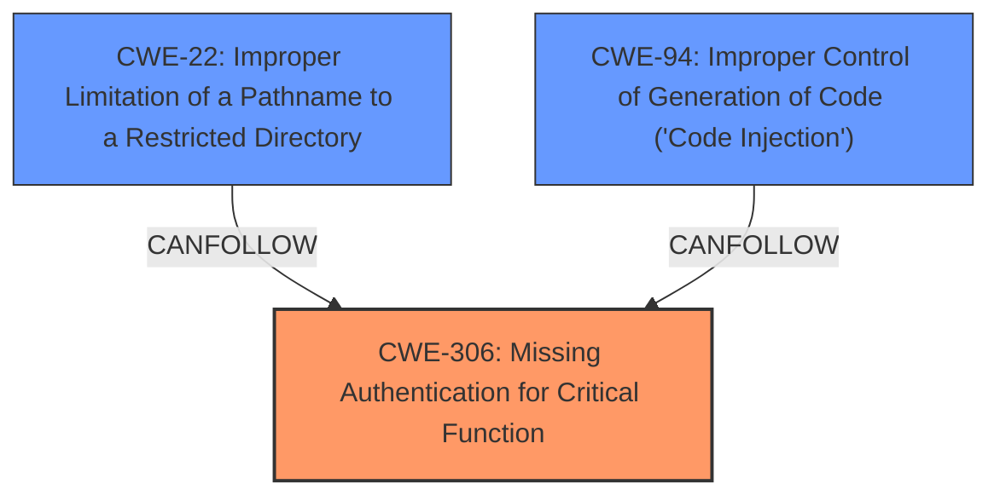

# Analysis for CVE-2021-21425

# Summary
| CWE ID | CWE Name | Confidence | CWE Abstraction Level | CWE Vulnerability Mapping Label | CWE-Vulnerability Mapping Notes |
|---|---|---|---|---|---|
| CWE-306 | Missing Authentication for Critical Function | 1.0 | Base | Allowed | Primary CWE |
| CWE-22 | Improper Limitation of a Pathname to a Restricted Directory ('Path Traversal') | 0.7 | Base | Allowed | Secondary CWE |
| CWE-94 | Improper Control of Generation of Code ('Code Injection') | 0.6 | Base | Allowed-with-Review | Secondary CWE |

## Evidence and Confidence

*   **Confidence Score:** 0.8
*   **Evidence Strength:** HIGH

## Relationship Analysis
The primary weakness is the **missing authentication** allowing unauthorized access to critical functions. This can lead to a chain of further weaknesses, potentially including **path traversal** if file paths are not properly validated when writing YAML files, and **code injection** if the modified YAML files are used to generate code.

## Vulnerability Chain
The vulnerability chain starts with **CWE-306 (Missing Authentication)**, which allows an attacker to access critical functions without proper credentials. This can then lead to:

1.  **CWE-22 (Improper Limitation of a Pathname to a Restricted Directory)**, if the attacker can manipulate file paths to write YAML files outside of the intended directories.
2.  **CWE-94 (Improper Control of Generation of Code)**, if the attacker can inject malicious code into the YAML files, which is then executed by the system.

## Summary of Analysis
The initial analysis pointed towards **CWE-306 (Missing Authentication)** as the primary root cause. The evidence from the "CVE Reference Links Content Summary" clearly states that the `taskSaveDefault` method within `AdminController` can be accessed without any authentication.

The **weakness** is **unauthenticated access to restricted functionality**, which directly aligns with **CWE-306**. This allows an attacker to **create arbitrary YAML files and modify existing YAML files**, leading to **configuration changes**, **hijacking an administrator account**, and potentially **executing operating system commands**.

The "CVE Reference Links Content Summary" also indicates that the `taskSaveDefault` method, when triggered, allows writing arbitrary content to YAML files by manipulating POST data and the `view` parameter in the URL. This suggests that **CWE-22 (Improper Limitation of a Pathname to a Restricted Directory)** might be present if the attacker can write files outside the intended directory.

Furthermore, the ability to execute operating system commands under the context of the web-server user suggests that the attacker can inject malicious code into the YAML files, which is then executed by the system. This aligns with **CWE-94 (Improper Control of Generation of Code)**.

Based on this analysis, **CWE-306** is the primary weakness, while **CWE-22** and **CWE-94** are secondary weaknesses that can be exploited as a consequence of the missing authentication.

The selected CWEs are at the optimal level of specificity, as they accurately represent the root cause and the potential consequences of the vulnerability.

Relevant CWE Information:

# Enhanced Context (25 CWEs)
The following CWEs were identified as potentially relevant to this vulnerability:

## CWE-74: Improper Neutralization of Special Elements in Output Used by a Downstream Component ('Injection')
**Abstraction Level**: Class
**Similarity Score**: 0.76
**Source**: dense

**Description**:
The product constructs all or part of a command, data structure, or record using externally-influenced input from an upstream component, but it does not neutralize or incorrectly neutralizes special elements that could modify how it is parsed or interpreted when it is sent to a downstream component.

**Mapping Guidance**:
- Usage: Discouraged
- Rationale: CWE-74 is high-level and often misused when lower-level weaknesses are more appropriate.

*   **Why Not Used:** While this could be related, the more specific CWE-94 is a better fit because it involves code injection.

## CWE-1336: Improper Neutralization of Special Elements Used in a Template Engine
**Abstraction Level**: Base
**Similarity Score**: 0.74
**Source**: dense

**Description**:
The product uses a template engine to insert or process externally-influenced input, but it does not neutralize or incorrectly neutralizes special elements or syntax that can be interpreted as template expressions or other code directives when processed by the engine.

**Mapping Guidance**:
- Usage: Allowed
- Rationale: This CWE entry is at the Base level of abstraction, which is a preferred level of abstraction for mapping to the root causes of vulnerabilities.

*   **Why Not Used:** While the YAML files could be considered templates, the primary issue is the lack of authentication, not the improper neutralization of special elements in a template engine.

## CWE-184: Incomplete List of Disallowed Inputs
**Abstraction Level**: Base
**Similarity Score**: 0.74
**Source**: dense

**Description**:
The product implements a protection mechanism that relies on a list of inputs (or properties of inputs) that are not allowed by policy or otherwise require other action to neutralize before additional processing takes place, but the list is incomplete.

**Mapping Guidance**:
- Usage: Allowed
- Rationale: This CWE entry is at the Base level of abstraction, which is a preferred level of abstraction for mapping to the root causes of vulnerabilities.

*   **Why Not Used:** The primary issue is not an incomplete list of disallowed inputs, but rather the lack of authentication to protect critical functions.

## CWE-915: Improperly Controlled Modification of Dynamically-Determined Object Attributes
**Abstraction Level**: Base
**Similarity Score**: 0.74
**Source**: dense

**Description**:
The product receives input from an upstream component that specifies multiple attributes, properties, or fields that are to be initialized or updated in an object, but it does not properly control which attributes can be modified.

**Mapping Guidance**:
- Usage: Allowed
- Rationale: This CWE entry is at the Base level of abstraction, which is a preferred level of abstraction for mapping to the root causes of vulnerabilities.

*   **Why Not Used:** While the vulnerability allows modification of object attributes, the root cause is the lack of authentication.

## CWE-917: Improper Neutralization of Special Elements used in an Expression Language Statement ('Expression Language Injection')
**Abstraction Level**: Base
**Similarity Score**: 0.74
**Source**: dense

**Description**:
The product constructs all or part of an expression language (EL) statement in a framework such as a Java Server Page (JSP) using externally-influenced input from an upstream component, but it does not neutralize or incorrectly neutralizes special elements that could modify the intended EL statement before it is executed.

**Mapping Guidance**:
- Usage: Allowed
- Rationale: This CWE entry is at the Base level of abstraction, which is a preferred level of abstraction for mapping to the root causes of vulnerabilities.

*   **Why Not Used:** While this could be related to code injection, the more specific CWE-94 is a better fit.

## CWE-80: Improper Neutralization of Script-Related HTML Tags in a Web Page (Basic XSS)
**Abstraction Level**: Variant
**Similarity Score**: 0.74
**Source**: dense

**Description**:
The product receives input from an upstream component, but it does not neutralize or incorrectly neutralizes special characters such as "<", ">", and "&" that could be interpreted as web-scripting elements when they are sent to a downstream component that processes web pages.

**Mapping Guidance**:
- Usage: Allowed
- Rationale: This CWE entry is at the Variant level of abstraction, which is a preferred level of abstraction for mapping to the root causes of vulnerabilities.

*   **Why Not Used:** The primary issue is not XSS, but rather the lack of authentication.

## CWE-472: External Control of Assumed-Immutable Web Parameter
**Abstraction Level**: Base
**Similarity Score**: 0.73
**Source**: dense

**Description**:
The web application does not sufficiently verify inputs that are assumed to be immutable but are actually externally controllable, such as hidden form fields.

**Mapping Guidance**:
- Usage: Allowed
- Rationale: This CWE entry is at the Base level of abstraction, which is a preferred level of abstraction for mapping to the root causes of vulnerabilities.

*   **Why Not Used:** The primary issue is not the external control of assumed-immutable web parameters, but rather the