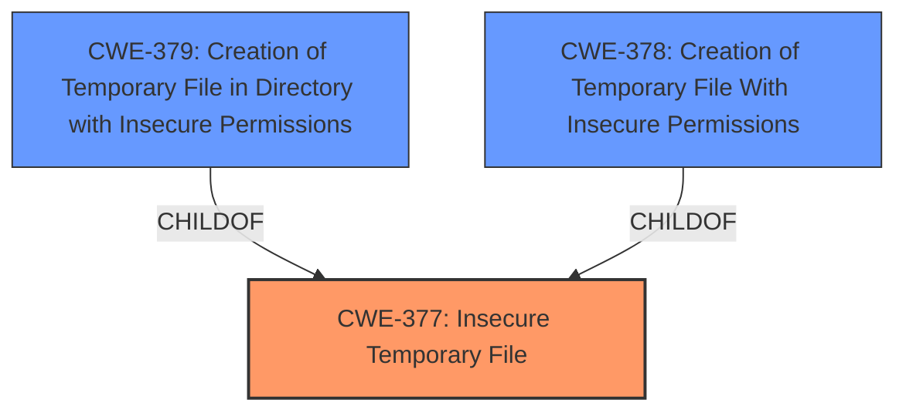

# Analysis for CVE-2021-21430

# Summary
| CWE ID  | CWE Name                                                                       | Confidence | CWE Abstraction Level | CWE Vulnerability Mapping Label | CWE-Vulnerability Mapping Notes |
| :-------- | :----------------------------------------------------------------------------- | :---------- | :---------------------- | :------------------------------ | :------------------------------ |
| CWE-377 | Insecure Temporary File                                                      | 0.9         | Class                   | Primary                           | Allowed-with-Review             |
| CWE-379 | Creation of Temporary File in Directory with Insecure Permissions | 0.8         | Base                    | Secondary                         | Allowed                         |
| CWE-378 | Creation of Temporary File With Insecure Permissions                       | 0.7         | Base                    | Secondary                         | Allowed                         |

## Evidence and Confidence

*   **Confidence Score:** 0.9
*   **Evidence Strength:** HIGH

## Relationship Analysis
The primary CWE is CWE-377 (Insecure Temporary File), a Class-level weakness. The more specific Base-level CWEs, CWE-379 (Creation of Temporary File in Directory with Insecure Permissions) and CWE-378 (Creation of Temporary File With Insecure Permissions), are also applicable and provide more granular detail. CWE-377 is a parent of both CWE-379 and CWE-378. Understanding this parent-child relationship helped to refine the classification from the general "Insecure Temporary File" to the more specific context of insecure permissions.

## Vulnerability Chain
The vulnerability chain starts with the use of `File.createTempFile`, which results in the creation of temporary files with insecure permissions. This **rootcause** leads to the potential exposure of sensitive data stored in these temporary files.

## Summary of Analysis
Initially, CWE-377 (Insecure Temporary File) was identified as the primary candidate based on the vulnerability description and retriever results. The description clearly states that the **rootcause** is "**using File.createTempFile**" which leads to "**impact:** create and use insecure temporary files". However, considering the CWE relationships, CWE-379 (Creation of Temporary File in Directory with Insecure Permissions) and CWE-378 (Creation of Temporary File With Insecure Permissions) were also deemed relevant as they provide more specific details about the insecure permissions associated with the temporary files.

The CVE Reference Links Content Summary confirms that the vulnerability stems from the use of `File.createTempFile`, resulting in temporary files with insecure default permissions. This aligns perfectly with CWE-377, CWE-378 and CWE-379.

The final decision was to map the vulnerability to CWE-377 as the primary CWE, with CWE-379 and CWE-378 as secondary CWEs to provide additional context regarding the insecure permissions. This multi-faceted approach provides a comprehensive understanding of the vulnerability.

Relevant CWE Information:

# Enhanced Context (25 CWEs)
The following CWEs were identified as potentially relevant to this vulnerability:

## CWE-74: Improper Neutralization of Special Elements in Output Used by a Downstream Component ('Injection')
**Abstraction Level**: Class
**Similarity Score**: 0.77
**Source**: dense

**Description**:
The product constructs all or part of a command, data structure, or record using externally-influenced input from an upstream component, but it does not neutralize or incorrectly neutralizes special elements that could modify how it is parsed or interpreted when it is sent to a downstream component.

**Mapping Guidance**:
- Usage: Discouraged
- Rationale: CWE-74 is high-level and often misused when lower-level weaknesses are more appropriate.

*Not Selected:* This CWE is not relevant as it deals with injection vulnerabilities, which are not present in this scenario.

## CWE-41: Improper Resolution of Path Equivalence
**Abstraction Level**: Base
**Similarity Score**: 0.76
**Source**: dense

**Description**:
The product is vulnerable to file system contents disclosure through path equivalence. Path equivalence involves the use of special characters in file and directory names. The associated manipulations are intended to generate multiple names for the same object.

**Mapping Guidance**:
- Usage: Allowed
- Rationale: This CWE entry is at the Base level of abstraction, which is a preferred level of abstraction for mapping to the root causes of vulnerabilities.

*Not Selected:* This CWE is not relevant as it deals with path equivalence issues, which are not the primary issue here.

## CWE-59: Improper Link Resolution Before File Access ('Link Following')
**Abstraction Level**: Base
**Similarity Score**: 0.76
**Source**: dense

**Description**:
The product attempts to access a file based on the filename, but it does not properly prevent that filename from identifying a link or shortcut that resolves to an unintended resource.

**Mapping Guidance**:
- Usage: Allowed
- Rationale: This CWE entry is at the Base level of abstraction, which is a preferred level of abstraction for mapping to the root causes of vulnerabilities.

*Not Selected:* While link following could be a secondary concern in some cases of insecure temporary files, the primary issue here is the insecure permissions, not necessarily the link resolution.

## CWE-73: External Control of File Name or Path
**Abstraction Level**: Base
**Similarity Score**: 0.76
**Source**: dense

**Description**:
The product allows user input to control or influence paths or file names that are used in filesystem operations.

**Mapping Guidance**:
- Usage: Allowed
- Rationale: This CWE entry is at the Base level of abstraction, which is a preferred level of abstraction for mapping to the root causes of vulnerabilities.

*Not Selected:* This CWE is not relevant as the filename or path is not externally controlled.

## CWE-184: Incomplete List of Disallowed Inputs
**Abstraction Level**: Base
**Similarity Score**: 0.75
**Source**: dense

**Description**:
The product implements a protection mechanism that relies on a list of inputs (or properties of inputs) that are not allowed by policy or otherwise require other action to neutralize before additional processing takes place, but the list is incomplete.

**Mapping Guidance**:
- Usage: Allowed
- Rationale: This CWE entry is at the Base level of abstraction, which is a preferred level of abstraction for mapping to the root causes of vulnerabilities.

*Not Selected:* This CWE is not relevant as there is no incomplete list of disallowed inputs involved in this vulnerability.

## CWE-330: Use of Insufficiently Random Values
**Abstraction Level**: Class
**Similarity Score**: 0.75
**Source**: dense

**Description**:
The product uses insufficiently random numbers or values in a security context that depends on unpredictable numbers.

**Mapping Guidance**:
- Usage: Discouraged
- Rationale: This CWE entry is a level-1 Class (i.e., a child of a Pillar). It might have lower-level children that would be more appropriate

*Not Selected:* While the predictability of the temporary file name could be a concern, the primary issue is the insecure permissions, not the randomness of the filename.

## CWE-427: Uncontrolled Search Path Element
**Abstraction Level**: Base
**Similarity Score**: 0.75
**Source**: dense

**Description**:
The product uses a fixed or controlled search path to find resources, but one or more locations in that path can be under the control of unintended actors.

**Mapping Guidance**:
- Usage: Allowed
- Rationale: This CWE entry is at the Base level of abstraction, which is a preferred level of abstraction for mapping to the root causes of vulnerabilities.

*Not Selected:* This CWE is not relevant as there is no uncontrolled search path element involved.

## CWE-1289: Improper Validation of Unsafe Equivalence in Input
**Abstraction Level**: Base
**Similarity Score**: 0.74
**Source**: dense

**Description**:
The product receives an input value that is used as a resource identifier or other type of reference, but it does not validate or incorrectly validates that the input is equivalent to a potentially-unsafe value.

**Mapping Guidance**:
- Usage: Allowed
- Rationale: This CWE entry is at the Base level of abstraction, which is a preferred level of abstraction for mapping to the root causes of vulnerabilities.

*Not Selected:* This CWE is not relevant as there is no improper validation of unsafe equivalence in input involved.

## CWE-23: Relative Path Traversal
**Abstraction Level**: Base
**Similarity Score**: 0.74
**Source**: dense

**Description**:
The product uses external input to construct a pathname that should be within a restricted directory, but it