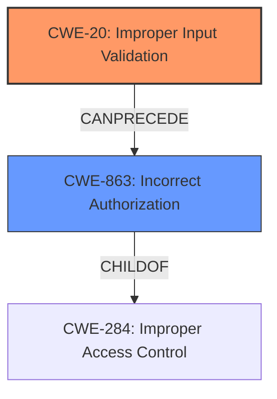

# Enhanced Analysis for CVE-2021-21431

# Summary
| CWE ID | CWE Name | Confidence | CWE Abstraction Level | CWE Vulnerability Mapping Label | CWE-Vulnerability Mapping Notes |
|---|---|---|---|---|---|
| CWE-20 | Improper Input Validation | 0.9 | Class | Primary | Allowed |
| CWE-863 | Incorrect Authorization | 0.7 | Class | Secondary | Allowed-with-Review |

## Evidence and Confidence

*   **Confidence Score:** 0.8
*   **Evidence Strength:** HIGH

## Relationship Analysis
The primary CWE, CWE-20, is a class-level weakness and does not have a specific base-level child that directly applies. It is a root cause that can lead to various impacts. CWE-863 is a class-level weakness. The relationship between the two shows that improper input validation can lead to incorrect authorization. There is also a relationship between CWE-20 and CWE-1284, which deals with improper validation of specified quantity in input. While the vulnerability involves multiple users, it is not related to the quantity, but to the injection of commands.



## Vulnerability Chain
The vulnerability chain starts with **improper input validation** (CWE-20), which leads to a bypass of restrictions and potentially **incorrect authorization** (CWE-863).

## Summary of Analysis
The initial analysis and criticism led to the conclusion that the primary weakness is **improper input validation** (CWE-20), as highlighted in the CVE reference summary: "The vulnerability stems from **improper input validation** within the `sopel-plugins.channelmgnt` plugin... The plugin failed to properly sanitize or validate the target user input". This allows attackers to bypass restrictions (incorrect authorization).

The graph relationships highlight how CWE-20 can lead to CWE-863. The selected CWEs are at the optimal level of specificity because CWE-20 directly represents the **root cause**, while CWE-863 represents a potential impact.

Relevant CWE Information:

# Enhanced Context (25 CWEs)
The following CWEs were identified as potentially relevant to this vulnerability:

## CWE-20: Improper Input Validation
The plugin did not adequately check for the presence of special characters (specifically commas `,` and hash symbols `#`) in the target user input. This lack of validation allowed for the possibility of injecting additional commands or parameters.

## CWE-863: Incorrect Authorization
On certain IRC servers, the improper input validation made it possible to bypass restrictions related to removing the bot using `kick` and `kickban` commands.


## CWE Relationship Analysis

Current CWEs represent these abstraction levels: .


### Vulnerability Chain Analysis

**Chain starting from CWE-20:**
- 20 (Improper Input Validation) - ROOT


**Chain starting from CWE-863:**
- 863 (Incorrect Authorization) - ROOT


### CWE Relationship Diagram

```mermaid
graph TD
    classDef primary fill:#f96,stroke:#333,stroke-width:2px
    classDef secondary fill:#69f,stroke:#333
    classDef tertiary fill:#9e9,stroke:#333
```