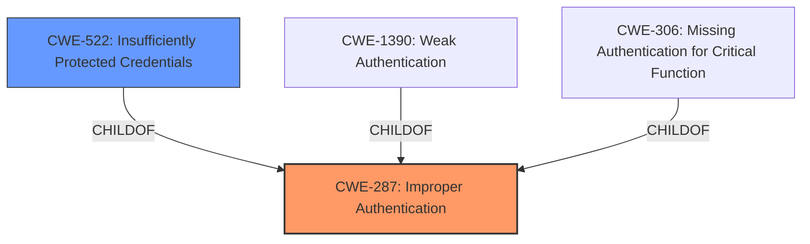

# Analysis Report for CVE-2021-21432

# Vulnerability Analysis Report: CVE-2021-21432

## Description


## Analysis (with Relationship Data)

# Summary
| CWE ID | CWE Name | Confidence | CWE Abstraction Level | CWE Vulnerability Mapping Label | CWE-Vulnerability Mapping Notes |
|---|---|---|---|---|---|
| CWE-287 | Improper Authentication | 0.9 | Class | Primary | Discouraged |
| CWE-522 | Insufficiently Protected Credentials | 0.8 | Class | Secondary | Allowed-with-Review |

## Evidence and Confidence

*   **Confidence Score:** 0.85
*   **Evidence Strength:** HIGH

## Relationship Analysis
The primary CWE is CWE-287 Improper Authentication, which is a Class-level CWE. Its children include CWE-1390 Weak Authentication and CWE-306 Missing Authentication for Critical Function. CWE-522 Insufficiently Protected Credentials is also a child of CWE-287, representing how the credentials are being protected. The relationships show a progression from a general authentication failure to specific weaknesses in credential protection.



## Vulnerability Chain
The chain of events is as follows:
1.  **Insecure Authentication:** The root cause is the **authentication mechanism** failing to properly validate the origin of the token.
2.  **Netrc Exposure:** This leads to the `~/.netrc` file being accessible.
3.  **Secret Exposure:** The attacker can then obtain secrets from the `~/.netrc` file.
4.  **Unauthorized API Access:** Finally, the attacker uses the stolen credentials to access the Vela API.

## Summary of Analysis
The initial assessment focused on the **insecure authentication mechanism** that led to the vulnerability. The evidence clearly points to a failure in validating the token's origin. The graph relationships highlight the connection between the general authentication failure (CWE-287) and the specific weakness in protecting credentials (CWE-522). The selected CWEs are at the optimal level of specificity, with CWE-287 capturing the core authentication flaw and CWE-522 detailing how the credentials were inadequately protected.

The vulnerability description states that an **authentication mechanism** added in version 0.7.0 enables a malicious user to obtain secrets. The CVE Reference Links Content Summary confirms that the server did not properly check if a provided token was created by Vela before using it to authorize a user. This constitutes **insecure authentication**. This allowed an attacker to use a valid GitHub Personal Access Token (PAT) to gain unauthorized access to the Vela API. The attacker must first gain administrative access to the Vela server, then create a malicious pipeline designed to output the contents of `~/.netrc` into the build logs, extract the token from the build logs, and finally use the compromised token to interact with any API endpoint accessible by the compromised user.

CWE-287 Improper Authentication is a Class-level CWE that describes a situation where the product does not sufficiently prove that a claimed identity is correct. Given the root cause description, this is the most appropriate CWE. While CWE-287 is discouraged, it's because lower-level CWEs may be more applicable. In this case, the "Insecure Authentication" weakness in the CVE details aligns well with CWE-287.

CWE-522 Insufficiently Protected Credentials is a Class-level CWE that describes a situation where the product transmits or stores authentication credentials, but it uses an insecure method that is susceptible to unauthorized interception and/or retrieval. In this case, the GitHub credentials were stored in the `~/.netrc` file, which was accessible within the build environment and allowed for secret exposure.

The retriever results also suggest CWE-306 Missing Authentication for Critical Function as a potential candidate. However, this CWE is more appropriate when there is a complete lack of authentication, rather than an improper implementation.

The descriptions for other CWEs such as CWE-212, CWE-74, CWE-319, CWE-668, CWE-639, CWE-807, CWE-226, CWE-23, CWE-345, CWE-1336, CWE-863, CWE-88, CWE-918, CWE-22, CWE-178, CWE-79, CWE-209, CWE-611, CWE-1289, CWE-202, CWE-917, CWE-1336, and CWE-94 do not fit the vulnerability description as closely as CWE-287 and CWE-522.


## CWE Relationship Analysis

Current CWEs represent these abstraction levels: .


### Vulnerability Chain Analysis

**Chain starting from CWE-94:**
- 94 (Improper Control of Generation of Code ('Code Injection')) - ROOT


**Chain starting from CWE-522:**
- 522 (Insufficiently Protected Credentials) - ROOT


### CWE Relationship Diagram

```mermaid
graph TD
    classDef primary fill:#f96,stroke:#333,stroke-width:2px
    classDef secondary fill:#69f,stroke:#333
    classDef tertiary fill:#9e9,stroke:#333
```


*Report generated on 2025-04-02 14:47:10*
