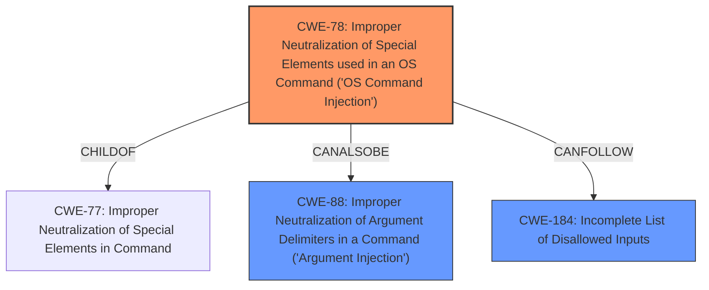

# Analysis Report for CVE-2021-21433

# Vulnerability Analysis Report: CVE-2021-21433

## Description


## Analysis (with Relationship Data)

# Summary
| CWE ID | CWE Name | Confidence | CWE Abstraction Level | CWE Vulnerability Mapping Label | CWE-Vulnerability Mapping Notes |
|---|---|---|---|---|---|
| **CWE-78** | **Improper Neutralization of Special Elements used in an OS Command ('OS Command Injection')** | 1.0 | Base | Primary | Allowed |
| CWE-88 | Improper Neutralization of Argument Delimiters in a Command ('Argument Injection') | 0.7 | Base | Secondary | Allowed |
| CWE-184 | Incomplete List of Disallowed Inputs | 0.5 | Base | Secondary | Allowed |

## Evidence and Confidence

*   **Confidence Score:** 0.9
*   **Evidence Strength:** HIGH

## Relationship Analysis
The primary CWE is CWE-78, which represents the direct **OS Command Injection**. CWE-88 is a potential secondary weakness if the arguments are not properly delimited. CWE-184 could also be considered, as the application's list of disallowed inputs might be incomplete.



## Vulnerability Chain
The vulnerability chain starts with the **lack of input sanitization**, leading to **command injection** and ultimately resulting in **remote code execution**.

## Summary of Analysis
The primary vulnerability is **CWE-78** (Improper Neutralization of Special Elements used in an OS Command ('OS Command Injection')). The evidence supporting this includes:

*   The **root cause** is "improper input validation in the `.dirsearch` and `.arjun` commands" and "the application allowed users to inject arbitrary commands".
*   The application "does not properly sanitize or validate user-provided input before passing it to the underlying system shell."
*   The **impact** is "Remote Code Execution (RCE): Successful exploitation allows an attacker to execute arbitrary code on the server."
*   The attack vectors involve "crafted input to the `.dirsearch` and `.arjun` commands through the Discord bot interface."

CWE-88 (Improper Neutralization of Argument Delimiters in a Command ('Argument Injection')) is a possible secondary weakness because the application may not properly delimit arguments. However, the primary issue is the lack of sanitization, which allows the injection in the first place.

CWE-184 (Incomplete List of Disallowed Inputs) is another possible secondary weakness. If the application uses a denylist for potentially dangerous inputs, but the list is incomplete, it could contribute to the vulnerability.

The selection of CWE-78 is based on direct evidence of command injection. This is at the optimal level of specificity (Base). The other CWEs are considered as contributing factors.

Relevant CWE Information:

# Enhanced Context (25 CWEs)
The following CWEs were identified as potentially relevant to this vulnerability:

## CWE-74: Improper Neutralization of Special Elements in Output Used by a Downstream Component ('Injection')
**Abstraction Level**: Class
**Similarity Score**: 0.78
**Source**: dense

**Description**:
The product constructs all or part of a command, data structure, or record using externally-influenced input from an upstream component, but it does not neutralize or incorrectly neutralizes special elements that could modify how it is parsed or interpreted when it is sent to a downstream component.

**Mapping Guidance**:
- Usage: Discouraged
- Rationale: CWE-74 is high-level and often misused when lower-level weaknesses are more appropriate.
**Why Not Used:** CWE-74 is too general. CWE-78 is more specific.

## CWE-184: Incomplete List of Disallowed Inputs
**Abstraction Level**: Base
**Similarity Score**: 0.78
**Source**: dense

**Description**:
The product implements a protection mechanism that relies on a list of inputs (or properties of inputs) that are not allowed by policy or otherwise require other action to neutralize before additional processing takes place, but the list is incomplete.

**Mapping Guidance**:
- Usage: Allowed
- Rationale: This CWE entry is at the Base level of abstraction, which is a preferred level of abstraction for mapping to the root causes of vulnerabilities.
**Why Potentially Used:** The application's list of disallowed inputs might be incomplete. It is a secondary consideration.

## CWE-138: Improper Neutralization of Special Elements
**Abstraction Level**: Class
**Similarity Score**: 0.77
**Source**: dense

**Description**:
The product receives input from an upstream component, but it does not neutralize or incorrectly neutralizes special elements that could be interpreted as control elements or syntactic markers when they are sent to a downstream component.

**Mapping Guidance**:
- Usage: Discouraged
- Rationale: This CWE entry is a level-1 Class (i.e., a child of a Pillar). It might have lower-level children that would be more appropriate
**Why Not Used:** CWE-138 is too general. CWE-78 is more specific.

## CWE-1289: Improper Validation of Unsafe Equivalence in Input
**Abstraction Level**: Base
**Similarity Score**: 0.77
**Source**: dense

**Description**:
The product receives an input value that is used as a resource identifier or other type of reference, but it does not validate or incorrectly validates that the input is equivalent to a potentially-unsafe value.

**Mapping Guidance**:
- Usage: Allowed
- Rationale: This CWE entry is at the Base level of abstraction, which is a preferred level of abstraction for mapping to the root causes of vulnerabilities.
**Why Not Used:** This CWE does not accurately describe the vulnerability.

## CWE-116: Improper Encoding or Escaping of Output
**Abstraction Level**: Class
**Similarity Score**: 0.76
**Source**: dense

**Description**:
The product prepares a structured message for communication with another component, but encoding or escaping of the data is either missing or done incorrectly. As a result, the intended structure of the message is not preserved.

**Mapping Guidance**:
- Usage: Allowed-with-Review
- Rationale: This CWE entry is a Class and might have Base-level children that would be more appropriate
**Why Not Used:** While encoding/escaping might be relevant, the core issue is the lack of sanitization.

## CWE-80: Improper Neutralization of Script-Related HTML Tags in a Web Page (Basic XSS)
**Abstraction Level**: Variant
**Similarity Score**: 0.75
**Source**: dense

**Description**:
The product receives input from an upstream component, but it does not neutralize or incorrectly neutralizes special characters such as "<", ">", and "&" that could be interpreted as web-scripting elements when they are sent to a downstream component that processes web pages.

**Mapping Guidance**:
- Usage: Allowed
- Rationale: This CWE entry is at the Variant level of abstraction, which is a preferred level of abstraction for mapping to the root causes of vulnerabilities.
**Why Not Used:** The vulnerability is not related to web-scripting elements or XSS.

## CWE-838: Inappropriate Encoding for Output Context
**Abstraction Level**: Base
**Similarity Score**: 0.75
**Source**: dense

**Description**:
The product uses or specifies an encoding when generating output to a downstream component, but the specified encoding is not the same as the encoding that is expected by the downstream component.

**Mapping Guidance**:
- Usage: Allowed
- Rationale: This CWE entry is at the Base level of abstraction, which is a preferred level of abstraction for mapping to the root causes of vulnerabilities.
**Why Not Used:** The vulnerability is not related to encoding issues.

## CWE-41: Improper Resolution of Path Equivalence
**Abstraction Level**: Base
**Similarity Score**: 0.75
**Source**: dense

**Description**:
The product is vulnerable to file system contents disclosure through path equivalence. Path equivalence involves the use of special characters in file and directory names. The associated manipulations are intended to generate multiple names for the same object.

**Mapping Guidance**:
- Usage: Allowed
- Rationale: This CWE entry is at the Base level of abstraction, which is a preferred level of abstraction for mapping to the root causes of vulnerabilities.
**Why Not Used:** The vulnerability is not related to path equivalence.

## CWE-807: Reliance on Untrusted Inputs in a Security Decision
**Abstraction Level**: Base
**Similarity Score**: 0.75
**


## CWE Relationship Analysis

Current CWEs represent these abstraction levels: .


### Vulnerability Chain Analysis

**Chain starting from CWE-838:**
- 838 (Inappropriate Encoding for Output Context) - ROOT


**Chain starting from CWE-88:**
- 88 (Improper Neutralization of Argument Delimiters in a Command ('Argument Injection')) - ROOT


### CWE Relationship Diagram

```mermaid
graph TD
    classDef primary fill:#f96,stroke:#333,stroke-width:2px
    classDef secondary fill:#69f,stroke:#333
    classDef tertiary fill:#9e9,stroke:#333
```


*Report generated on 2025-04-02 04:58:50*
