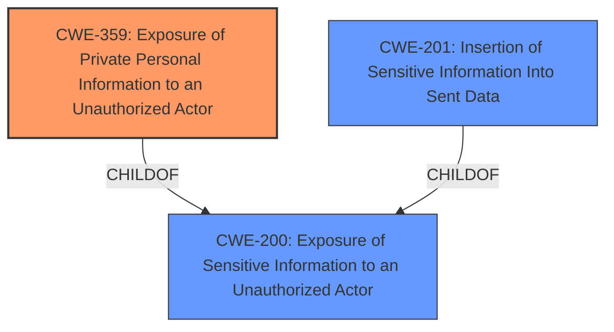

# Enhanced Analysis for CVE-2021-21435

# Summary
| CWE ID | CWE Name | Confidence | CWE Abstraction Level | CWE Vulnerability Mapping Label | CWE-Vulnerability Mapping Notes |
|---|---|---|---|---|---|
| CWE-359 | Exposure of Private Personal Information to an Unauthorized Actor | 0.9 | Base | Allowed | Primary CWE |
| CWE-200 | Exposure of Sensitive Information to an Unauthorized Actor | 0.7 | Class | Discouraged | Secondary Candidate |
| CWE-201 | Insertion of Sensitive Information Into Sent Data | 0.6 | Base | Allowed | Secondary Candidate |

## Evidence and Confidence

*   **Confidence Score:** 0.9
*   **Evidence Strength:** HIGH

## Relationship Analysis
The primary CWE is CWE-359, which is a child of CWE-200. This indicates a hierarchical relationship where CWE-359 is a more specific type of information exposure focusing on private personal information. The choice of CWE-359 is driven by the vulnerability description's explicit mention of "agent personal information" being exposed. CWE-201 (Insertion of Sensitive Information Into Sent Data) could be considered as a related weakness, as it describes how sensitive information ends up in the sent data.



## Vulnerability Chain
The vulnerability chain starts with the **improper handling of data** during PDF export, leading to the **insertion of Article Bcc fields and agent personal information** into the generated PDF, which results in the **exposure of private personal information** to the customer.

## Summary of Analysis
The primary weakness is the exposure of private personal information to an unauthorized actor, specifically the customer. This is due to the inclusion of Article Bcc fields and agent personal information when a customer prints a ticket (PDF) via the external interface.

The vulnerability description clearly states that "Article Bcc fields and agent personal information are shown when customer prints the ticket (PDF) via external interface." The **CVE Reference Links Content Summary** section highlights the root cause as "**improper handling of data during PDF export**," and the primary vulnerability as the "**exposure of sensitive information (Bcc fields and agent personal data) to unauthorized users (customers)**."

The choice of CWE-359 is supported by its description: "The product does not properly prevent a person's private, personal information from being accessed by actors who either (1) are not explicitly authorized to access the information or (2) do not have the implicit consent of the person about whom the information is collected." This aligns perfectly with the scenario where agent personal information is exposed to customers who are not authorized to access it.

CWE-200 is a broader class of information exposure, and while applicable, CWE-359 is more specific and therefore a better fit. CWE-201 describes the insertion of sensitive information into sent data, which can be considered a contributing factor, but the core issue is the exposure itself, making CWE-359 the primary weakness. The higher retriever score for CWE-359 also supports this decision.

The selected CWE is at the optimal level of specificity, as it directly addresses the exposure of private personal information. Choosing a higher-level CWE like CWE-200 would be too general, while a lower-level variant might not fully capture the essence of the vulnerability.

Relevant CWE Information:

# Enhanced Context (25 CWEs)
The following CWEs were identified as potentially relevant to this vulnerability:

## CWE-639: Authorization Bypass Through User-Controlled Key
**Abstraction Level**: Base
**Similarity Score**: 0.76
**Source**: dense

**Description**:
The system's authorization functionality does not prevent one user from gaining access to another user's data or record by modifying the key value identifying the data.

**Mapping Guidance**:
- Usage: Allowed
- Rationale: This CWE entry is at the Base level of abstraction, which is a preferred level of abstraction for mapping to the root causes of vulnerabilities.

*Not Selected:* This CWE is not applicable because the vulnerability isn't related to authorization bypass through user-controlled keys. The issue is about the exposure of information, not bypassing authorization checks.

## CWE-668: Exposure of Resource to Wrong Sphere
**Abstraction Level**: Class
**Similarity Score**: 0.76
**Source**: dense

**Description**:
The product exposes a resource to the wrong control sphere, providing unintended actors with inappropriate access to the resource.

**Mapping Guidance**:
- Usage: Discouraged
- Rationale: CWE-668 is high-level and is often misused as a catch-all when lower-level CWE IDs might be applicable. It is sometimes used for low-information vulnerability reports [REF-1287]. It is a level-1 Class (i.e., a child of a Pillar). It is not useful for trend analysis.

*Not Selected:* This CWE is too general. CWE-359 and CWE-200 are more specific.

## CWE-807: Reliance on Untrusted Inputs in a Security Decision
**Abstraction Level**: Base
**Similarity Score**: 0.76
**Source**: dense

**Description**:
The product uses a protection mechanism that relies on the existence or values of an input, but the input can be modified by an untrusted actor in a way that bypasses the protection mechanism.

**Mapping Guidance**:
- Usage: Allowed
- Rationale: This CWE entry is at the Base level of abstraction, which is a preferred level of abstraction for mapping to the root causes of vulnerabilities.

*Not Selected:* This CWE does not directly apply as the vulnerability does not involve a protection mechanism being bypassed due to reliance on untrusted inputs.

## CWE-74: Improper Neutralization of Special Elements in Output Used by a Downstream Component ('Injection')
**Abstraction Level**: Class
**Similarity Score**: 0.76
**Source**: dense

**Description**:
The product constructs all or part of a command, data structure, or record using externally-influenced input from an upstream component, but it does not neutralize or incorrectly neutralizes special elements that could modify how it is parsed or interpreted when it is sent to a downstream component.

**Mapping Guidance**:
- Usage: Discouraged
- Rationale: CWE-74 is high-level and often misused when lower-level weaknesses are more appropriate.

*Not Selected:* This CWE is not relevant because the vulnerability does not involve injection.

## CWE-472: External Control of Assumed-Immutable Web Parameter
**Abstraction Level**: Base
**Similarity Score**: 0.76
**Source**: dense

**Description**:
The web application does not sufficiently verify inputs that are assumed to be immutable but are actually externally controllable, such as hidden form fields.

**Mapping Guidance**:
- Usage: Allowed
- Rationale: This CWE entry is at the Base level of abstraction, which is a preferred level of abstraction for mapping to the root causes of vulnerabilities.

*Not Selected:* This CWE is not applicable because the vulnerability doesn't involve external control of assumed-immutable web parameters.

## CWE-226: Sensitive Information in Resource Not Removed Before Reuse
**Abstraction Level**: Base
**Similarity Score**: 0.75
**Source**: dense

**Description**:
The product releases a resource such as memory or a file so that it can be made available for reuse, but it does not clear or "zeroize" the information contained in the resource before the product performs a critical state transition or makes the resource available for reuse by other entities.

**Mapping Guidance**:
- Usage: Allowed
- Rationale: This CWE entry is at the Base level of abstraction, which is a preferred level of abstraction for mapping to the root causes of vulnerabilities.

*Not Selected:* Although there might be some relation, it's not a primary cause. This vulnerability is about the exposure of private information and not so much about reusing resources.

## CWE-212: Improper Removal of Sensitive Information Before Storage or Transfer
**Abstraction Level**: Base
**Similarity Score**: 0.75
**Source**: dense

**Description**:
The product stores, transfers, or shares a resource that contains sensitive information, but it does not properly remove that information before the product makes the resource available to unauthorized actors.

**Mapping Guidance**:
- Usage: Allowed
- Rationale: This CWE entry is at the Base level of abstraction, which is a preferred level of abstraction for mapping to the root causes of vulnerabilities.

*Not Selected:* This CWE is similar to CWE-359 and CWE-201, but the core issue is that the data should not have been included in the PDF in the first place.

## CWE-266: Incorrect Privilege Assignment


## CWE Relationship Analysis

Current CWEs represent these abstraction levels: .


### Vulnerability Chain Analysis

**Chain starting from CWE-201:**
- 201 (Insertion of Sensitive Information Into Sent Data) - ROOT


**Chain starting from CWE-807:**
- 807 (Reliance on Untrusted Inputs in a Security Decision) - ROOT


### CWE Relationship Diagram

```mermaid
graph TD
    classDef primary fill:#f96,stroke:#333,stroke-width:2px
    classDef secondary fill:#69f,stroke:#333
    classDef tertiary fill:#9e9,stroke:#333
```