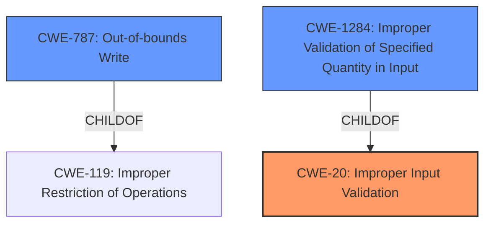

# Raw Analyzer Response for CVE-2021-21452

# Summary
| CWE ID | CWE Name | Confidence | CWE Abstraction Level | CWE Vulnerability Mapping Label | CWE-Vulnerability Mapping Notes |
|---|---|---|---|---|---|
| CWE-20 | Improper Input Validation | 0.7 | Class | Discouraged | The vulnerability description states "**Improper Input Validation**," and this CWE is a Class-level abstraction. However, due to its broad nature and the availability of more specific alternatives, it's not the primary choice. |
| CWE-787 | Out-of-bounds Write | 0.5 | Base | Allowed | CWE-787 is listed as the Primary CWE Match for similar CVE Descriptions, but it's not clear from the description that an out-of-bounds write is occurring. |
| CWE-1284 | Improper Validation of Specified Quantity in Input | 0.6 | Base | Allowed | CWE-1284 is a possible alternative based on the Retriever Results. |

## Evidence and Confidence

*   **Confidence Score:** 0.7
*   **Evidence Strength:** MEDIUM

## Relationship Analysis
The analysis considered the following CWE relationships:
  - CWE-20 is a class-level CWE and a parent of CWE-1284.
  - CWE-787 is a base-level CWE and a child of CWE-119.
  - CWE-1284 is a base-level CWE and a child of CWE-20.

## Vulnerability Chain
The vulnerability chain starts with **improper input validation** leading to a crash. It's not clear what the exact weakness is without more details.

## Summary of Analysis
The initial assessment identified **improper input validation** as the root cause. The "Vulnerability Description Key Phrases" section explicitly mentions "**Improper Input Validation**." The vulnerability description also states, "allows a user to open manipulated GIF file received from untrusted sources which results in crashing of the application...this is caused due to **Improper Input Validation**."

The retriever results suggest several CWEs, including CWE-20, CWE-787, and CWE-1284. CWE-20 is a class-level CWE and is generally discouraged. CWE-787 is listed as the Primary CWE Match for similar CVE Descriptions, but there isn't sufficient evidence to show that an out-of-bounds write is happening. CWE-1284 could be considered, but more information about the specific input and how it's validated is needed.

The selected CWEs are at the optimal level of specificity given the available evidence. While CWE-20 is quite general, the lack of details about the exact nature of the **improper input validation** makes it difficult to select a more specific CWE with high confidence.

Relevant CWE Information:

## Enhanced Context (25 CWEs)

## CWE-20: Improper Input Validation
**Abstraction:** Class
**Status:** Stable

### Description
The product receives input or data, but it does
        not validate or incorrectly validates that the input has the
        properties that are required to process the data safely and
        correctly.

### Mapping Guidance
**Usage:** Discouraged
**Rationale:** CWE-20 is commonly misused in low-information vulnerability reports when lower-level CWEs could be used instead, or when more details about the vulnerability are available [REF-1287]. It is not useful for trend analysis. It is also a level-1 Class (i.e., a child of a Pillar).

## CWE-787: Out-of-bounds Write
**Abstraction:** Base
**Status:** Draft

### Description
The product writes data past the end, or before the beginning, of the intended buffer.

### Mapping Guidance
**Usage:** Allowed
**Rationale:** This CWE entry is at the Base level of abstraction, which is a preferred level of abstraction for mapping to the root causes of vulnerabilities.

## CWE-1284: Improper Validation of Specified Quantity in Input
**Abstraction:** Base
**Status:** Incomplete

### Description
The product receives input that is expected to specify a quantity (such as size or length), but it does not validate or incorrectly validates that the quantity has the required properties.

### Mapping Guidance
**Usage:** Allowed
**Rationale:** This CWE entry is at the Base level of abstraction, which is a preferred level of abstraction for mapping to the root causes of vulnerabilities.