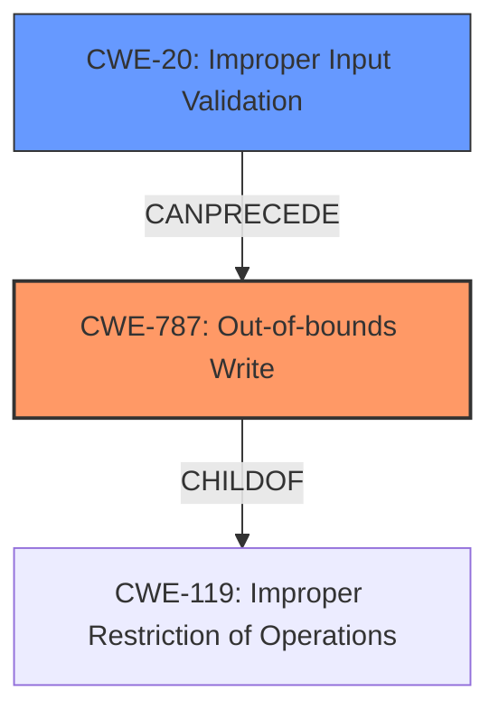

# Enhanced Analysis for CVE-2021-21455

# Summary
| CWE ID | CWE Name | Confidence | CWE Abstraction Level | CWE Vulnerability Mapping Label | CWE-Vulnerability Mapping Notes |
|---|---|---|---|---|---|
| CWE-787 | Out-of-bounds Write | 0.8 | Base | Allowed | Primary CWE |
| CWE-20 | Improper Input Validation | 0.6 | Class | Discouraged | Secondary Candidate |

## Evidence and Confidence

*   **Confidence Score:** 0.7
*   **Evidence Strength:** MEDIUM

## Relationship Analysis
The primary relationship impacting the decision is the ChildOf relationship between CWE-787 and CWE-119, and CWE-20 and CWE-119. While **Improper Input Validation** CWE-20 is present, the evidence supports that an out-of-bounds write occurs due to this improper validation. The base CWE is therefore CWE-787.



## Vulnerability Chain
The vulnerability chain starts with **Improper Input Validation** (CWE-20), which leads to an **Out-of-bounds Write** (CWE-787). The impact of this out-of-bounds write is the crashing of the application.

## Summary of Analysis
The initial assessment pointed towards CWE-787 as the primary candidate due to the vulnerability description highlighting **Improper Input Validation** as the root cause, leading to a crash. The presence of similar CVE descriptions with CWE-787 as the primary match further supports this selection.

The retriever results also list CWE-20, CWE-119, and CWE-787 as potential candidates. However, given the specificity of the vulnerability description, CWE-787 is deemed the most appropriate because it directly describes the **out-of-bounds write** that causes the crash.

The final decision is based on the evidence from the vulnerability description: "allows a user to open manipulated DIB file received from untrusted sources which results in crashing of the application and becoming temporarily unavailable... this is caused due to **Improper Input Validation**." This clearly indicates that the **improper validation** leads to a write outside the intended buffer, thus causing the application to crash.

CWE-787 is selected as the primary CWE because it represents the specific coding error that causes the vulnerability. It is at the base level of abstraction, which is the preferred level. CWE-20 is considered as a secondary CWE due to the **Improper Input Validation** but is not the direct cause of the crash; rather, it's a condition that allows CWE-787 to occur.

CWE-119 was considered, but it is too general. The description indicates a write out of bounds, so CWE-787 is more precise. Other CWEs like integer overflow (CWE-190) and memory allocation issues (CWE-789) were considered but discarded because the description does not explicitly mention any arithmetic operations or memory allocation problems. The description focuses on the **improper validation** of the DIB file, leading to a crash due to an **out-of-bounds write**.


## CWE Relationship Analysis

Current CWEs represent these abstraction levels: .


### Vulnerability Chain Analysis

**Chain starting from CWE-787:**
- 787 (Out-of-bounds Write) - ROOT


**Chain starting from CWE-190:**
- 190 (Integer Overflow or Wraparound) - ROOT


### CWE Relationship Diagram

```mermaid
graph TD
    classDef primary fill:#f96,stroke:#333,stroke-width:2px
    classDef secondary fill:#69f,stroke:#333
    classDef tertiary fill:#9e9,stroke:#333
```