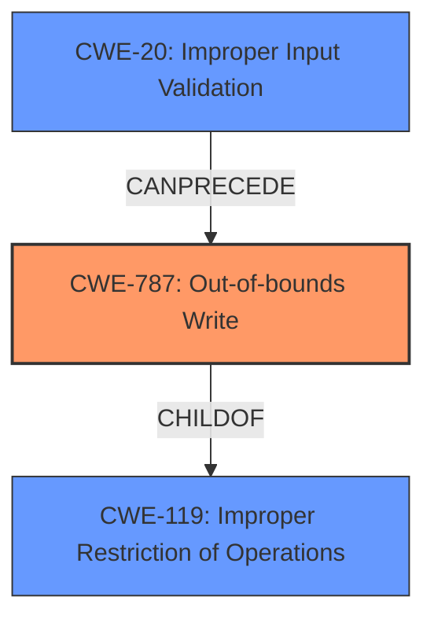

# Analysis Report for CVE-2021-21459

# Vulnerability Analysis Report: CVE-2021-21459

## Description


## Analysis (with Relationship Data)

# Summary
| CWE ID | CWE Name | Confidence | CWE Abstraction Level | CWE Vulnerability Mapping Label | CWE-Vulnerability Mapping Notes |
|---|---|---|---|---|---|
| CWE-787 | Out-of-bounds Write | 0.9 | Base | Allowed | Primary CWE |
| CWE-20 | Improper Input Validation | 0.6 | Class | Discouraged | Secondary Candidate |

## Evidence and Confidence

*   **Confidence Score:** 0.8
*   **Evidence Strength:** HIGH

## Relationship Analysis
The primary relationship that impacted my decision was the ChildOf relationship between CWE-787 **Out-of-bounds Write** and CWE-119 **Improper Restriction of Operations within the Bounds of a Memory Buffer**. CWE-787 is a more specific case of CWE-119, and given the evidence pointing towards a write operation outside the intended buffer, CWE-787 is the more appropriate choice. CWE-20 **Improper Input Validation** is a high-level class that can precede many other vulnerabilities, and in this case, the **improper input validation** leads directly to a potential out-of-bounds write.



## Vulnerability Chain
The vulnerability chain starts with the **improper input validation** (CWE-20), which allows a manipulated IFF file to be processed. This leads to an out-of-bounds write (CWE-787), resulting in the application crashing.

## Summary of Analysis
The initial assessment identified CWE-787 **Out-of-bounds Write** as the primary candidate based on the **improper input validation** allowing a manipulated IFF file to be processed, leading to the application crashing. The "CWE for similar CVE Descriptions" section lists CWE-787 as the Primary CWE Match. The vulnerability description explicitly mentions the application crashing, indicating a memory corruption issue due to writing data outside the intended buffer.

The relationship analysis reinforces the choice of CWE-787, as it's a more specific case of CWE-119. While CWE-20 **Improper Input Validation** is present, it is too general and only describes the cause, not the actual vulnerability. The evidence provided directly supports the out-of-bounds write, making CWE-787 the most accurate and specific classification.

The final decision is based on the evidence from the vulnerability description, which states that the **improper input validation** leads to the application crashing, suggesting memory corruption due to an out-of-bounds write. The choice of CWE-787 is at the optimal level of specificity, as it accurately describes the vulnerability mechanism.

Relevant CWE Information:
- **Vulnerability Description Key Phrases:**
  - **rootcause:** **Improper Input Validation**
  - **impact:** crashing of the application
  - **vector:** manipulated IFF file
- **CWE for similar CVE Descriptions**
  - **Primary CWE Match**
    - CWE-787


## CWE Relationship Analysis

Current CWEs represent these abstraction levels: .


### Vulnerability Chain Analysis

**Chain starting from CWE-787:**
- 787 (Out-of-bounds Write) - ROOT


**Chain starting from CWE-119:**
- 119 (Improper Restriction of Operations within the Bounds of a Memory Buffer) - ROOT


### CWE Relationship Diagram

```mermaid
graph TD
    classDef primary fill:#f96,stroke:#333,stroke-width:2px
    classDef secondary fill:#69f,stroke:#333
    classDef tertiary fill:#9e9,stroke:#333
```


*Report generated on 2025-04-01 21:47:46*
