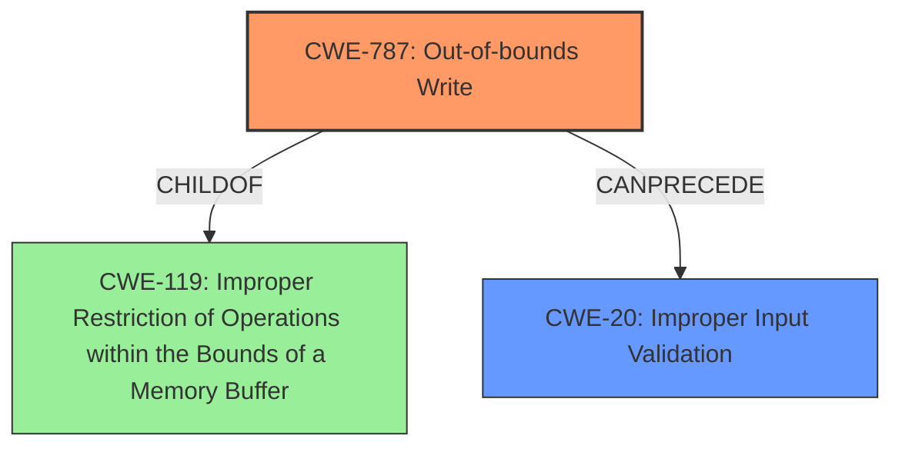

# Enhanced Analysis for CVE-2021-21463

# Summary
| CWE ID | CWE Name | Confidence | CWE Abstraction Level | CWE Vulnerability Mapping Label | CWE-Vulnerability Mapping Notes |
|---|---|---|---|---|---|
| CWE-787 | Out-of-bounds Write | 0.8 | Base | Allowed | Primary CWE |
| CWE-20 | Improper Input Validation | 0.6 | Class | Discouraged | Secondary Candidate |

## Evidence and Confidence

*   **Confidence Score:** 0.7
*   **Evidence Strength:** MEDIUM

## Relationship Analysis
The primary CWE is CWE-787 **Out-of-bounds Write**, which is a child of CWE-119 **Improper Restriction of Operations within the Bounds of a Memory Buffer**. CWE-20 **Improper Input Validation** can precede CWE-787, meaning the **improper input validation** could lead to an out-of-bounds write. The graph below illustrates these relationships.



## Vulnerability Chain
The vulnerability chain starts with **Improper Input Validation** (CWE-20) of a manipulated PCX file. This leads to an **Out-of-bounds Write** (CWE-787), resulting in the application crashing and becoming temporarily unavailable.

## Summary of Analysis
The initial analysis identified **Improper Input Validation** as the root cause. However, the description also indicates that a manipulated PCX file causes the application to crash. This points to a more specific weakness related to memory corruption.

The primary CWE match from similar CVE descriptions is CWE-787 **Out-of-bounds Write**, which aligns well with the application crashing due to a manipulated file. While the vulnerability description mentions **Improper Input Validation**, the crashing behavior suggests a memory corruption issue resulting from the invalid input. Therefore, CWE-787 is a more accurate primary classification.

CWE-20 **Improper Input Validation** is considered as a secondary weakness since the **improper input validation** sets the stage for the **out-of-bounds write**.

The selection of CWE-787 is at the optimal level of specificity because it directly describes the memory corruption issue leading to the application crash. While CWE-119 is a parent of CWE-787, it is a more general description of memory buffer errors. CWE-787 specifically describes the **out-of-bounds write**, which is the root cause.

Relevant CWE Information:
*   The vulnerability description states the root cause is due to "**Improper Input Validation**."
*   The "**impact**" of the vulnerability is the "crashing of the application."
*   The **Primary CWE Match** for similar CVE Descriptions is CWE-787 **Out-of-bounds Write**.
*   The **Top CWEs** are CWE-787 **Out-of-bounds Write**, CWE-20 **Improper Input Validation**, and CWE-119 **Improper Restriction of Operations within the Bounds of a Memory Buffer**.

I considered CWE-20 **Improper Input Validation** as a possible primary CWE, as the vulnerability description mentions "**Improper Input Validation**." However, CWE-20 is a Class-level CWE and is discouraged. It is also very general. The crash suggests a memory corruption issue caused by the **improperly validated** input, making CWE-787 a more precise fit.

I also considered CWE-119 **Improper Restriction of Operations within the Bounds of a Memory Buffer** as a possible primary CWE. However, CWE-119 is a more general description of memory buffer errors and is also discouraged. CWE-787 specifically describes the **out-of-bounds write**, which is the root cause.


## CWE Relationship Analysis

Current CWEs represent these abstraction levels: .


### Vulnerability Chain Analysis

**Chain starting from CWE-787:**
- 787 (Out-of-bounds Write) - ROOT


**Chain starting from CWE-119:**
- 119 (Improper Restriction of Operations within the Bounds of a Memory Buffer) - ROOT


### CWE Relationship Diagram

```mermaid
graph TD
    classDef primary fill:#f96,stroke:#333,stroke-width:2px
    classDef secondary fill:#69f,stroke:#333
    classDef tertiary fill:#9e9,stroke:#333
```