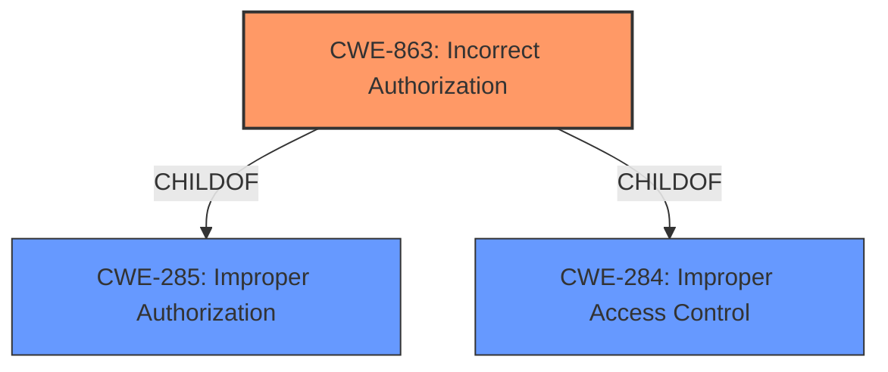

# Analysis Report for CVE-2021-21467

# Vulnerability Analysis Report: CVE-2021-21467

## Description


## Analysis (with Relationship Data)

# Summary
| CWE ID | CWE Name | Confidence | CWE Abstraction Level | CWE Vulnerability Mapping Label | CWE-Vulnerability Mapping Notes |
|---|---|---|---|---|---|
| CWE-863 | Incorrect Authorization | 0.9 | Class | Primary | Allowed-with-Review |
| CWE-285 | Improper Authorization | 0.7 | Class | Secondary | Discouraged |
| CWE-284 | Improper Access Control | 0.6 | Pillar | Secondary | Discouraged |

## Evidence and Confidence

*   **Confidence Score:** 0.9
*   **Evidence Strength:** HIGH

## Relationship Analysis
The primary CWE identified is CWE-863, "Incorrect Authorization," which is a Class-level CWE. It is a child of both CWE-285, "Improper Authorization," and CWE-284, "Improper Access Control," which are higher-level (Class and Pillar, respectively). Given the description explicitly mentions an **improper authorization check**, CWE-863 is a strong fit. While the description doesn't provide enough detail to pinpoint a more specific Base or Variant CWE, we can confidently classify it as an authorization issue.



## Vulnerability Chain
The vulnerability chain is straightforward:

1.  **Root Cause:** **Improper authorization check** (CWE-863).
2.  **Impact:** Escalation of privileges.

The description doesn't provide enough information to identify any other weaknesses in the chain.

## Summary of Analysis
The initial analysis focused on identifying the root cause of the vulnerability, which is clearly stated as an **improper authorization check**. The retriever results highlighted CWE-863, CWE-285, and CWE-284 as potential candidates.

*   The vulnerability description states: "SAP Banking Services (Generic Market Data) does not perform necessary authorization checks for an authenticated user, resulting in escalation of privileges. An unauthorized User is allowed to display restricted Business Partner Generic Market Data (GMD), due to **improper authorization check**."

CWE-863, "Incorrect Authorization," is the best fit because the product performs an authorization check, but it does so incorrectly. CWE-285 and CWE-284 are broader classifications. Although "Allowed-with-Review", the CWE-863 is chosen, because the description does not offer any more details for choosing a more specific Base-level CWE.

Relevant CWE Information:

# Enhanced Context (25 CWEs)
The following CWEs were identified as potentially relevant to this vulnerability:

## CWE-284: Improper Access Control
**Abstraction:** Pillar
**Similarity Score**: 0.80
**Source**: alternate_terms

**Description**:
The product does not restrict or incorrectly restricts access to a resource from an unauthorized actor.

**Mapping Guidance**:
- Usage: Discouraged
- Rationale: CWE-284 is extremely high-level, a Pillar. Its name, "Improper Access Control," is often misused in low-information vulnerability reports [REF-1287] or by active use of the OWASP Top Ten, such as "A01:2021-Broken Access Control". It is not useful for trend analysis.
**Comments:** Consider using descendants of CWE-284 that are more specific to the kind of access control involved, such as those involving authorization (Missing Authorization (CWE-862), Incorrect Authorization (CWE-863), Incorrect Permission Assignment for Critical Resource (CWE-732), etc.); authentication (Missing Authentication (CWE-306) or Weak Authentication (CWE-1390)); Incorrect User Management (CWE-286); Improper Restriction of Communication Channel to Intended Endpoints (CWE-923); etc.
**Reasons:**
- Frequent Misuse
- Abstraction
**Suggested Alternatives:**
- CWE-862: Missing Authorization
- CWE-863: Incorrect Authorization
- CWE-732: Incorrect Permission Assignment for Critical Resource
- CWE-306: Missing Authentication
- CWE-1390: Weak Authentication
- CWE-923: Improper Restriction of Communication Channel to Intended Endpoints

## CWE-862: Missing Authorization
**Abstraction:** Class
**Similarity Score**: 0.279
**Source**: sparse

**Description**:
The product does not perform an authorization check when an actor attempts to access a resource or perform an action.

**Mapping Guidance**:
**Usage:** Allowed-with-Review
**Rationale:** This CWE entry is a Class and might have Base-level children that would be more appropriate
**Comments:** Examine children of this entry to see if there is a better fit
**Reasons:**
- Abstraction

## CWE-285: Improper Authorization
**Abstraction:** Class
**Similarity Score**: 0.244
**Source**: sparse

**Description**:
The product does not perform or incorrectly performs an authorization check when an actor attempts to access a resource or perform an action.

**Mapping Guidance**:
**Usage:** Discouraged
**Rationale:** CWE-285 is high-level and lower-level CWEs can frequently be used instead. It is a level-1 Class (i.e., a child of a Pillar).
**Comments:** Look at CWE-285's children and consider mapping to CWEs such as CWE-862: Missing Authorization, CWE-863: Incorrect Authorization, CWE-732: Incorrect Permission Assignment for Critical Resource, or others.
**Reasons:**
- Abstraction
**Suggested Alternatives:**
- CWE-862: Missing Authorization
- CWE-863: Incorrect Authorization
- CWE-732: Incorrect Permission Assignment for Critical Resource

## CWE-863: Incorrect Authorization
**Abstraction:** Class
**Similarity Score**: 0.244
**Source**: sparse

**Description**:
The product performs an authorization check when an actor attempts to access a resource or perform an action, but it does not correctly perform the check.

**Mapping Guidance**:
**Usage:** Allowed-with-Review
**Rationale:** This CWE entry is a Class and might have Base-level children that would be more appropriate
**Comments:** Examine children of this entry to see if there is a better fit
**Reasons:**
- Abstraction

CWE-284 was considered but rejected because it is a high-level Pillar. CWE-862 was also considered but rejected because the vulnerability description states that an authorization check is performed, albeit incorrectly.
CWE-285 was considered as an alternative since CWE-863 is a child of it, but the description is more indicative of an incorrect check rather than a missing check, making CWE-863 the more appropriate choice.

The selection of CWE-863 is based on the direct evidence of an **improper authorization check** and the understanding of the relationships between authorization-related CWEs. The chosen CWE is at the optimal level of specificity given the available information.


## CWE Relationship Analysis

Current CWEs represent these abstraction levels: .


### Vulnerability Chain Analysis

**Chain starting from CWE-732:**
- 732 (Incorrect Permission Assignment for Critical Resource) - ROOT


**Chain starting from CWE-286:**
- 286 (Incorrect User Management) - ROOT


### CWE Relationship Diagram

```mermaid
graph TD
    classDef primary fill:#f96,stroke:#333,stroke-width:2px
    classDef secondary fill:#69f,stroke:#333
    classDef tertiary fill:#9e9,stroke:#333
```


*Report generated on 2025-04-01 17:10:17*
