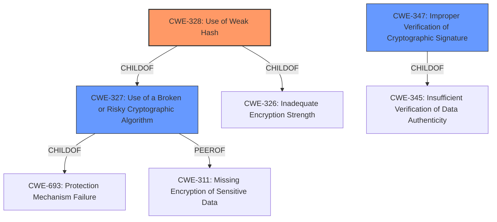

# Enhanced Analysis for CVE-2021-21474

# Summary
| CWE ID | CWE Name | Confidence | CWE Abstraction Level | CWE Vulnerability Mapping Label | CWE-Vulnerability Mapping Notes |
|---|---|---|---|---|---|
| CWE-328 | Use of Weak Hash | 1.0 | Base | Allowed | Primary CWE |
| CWE-347 | Improper Verification of Cryptographic Signature | 0.7 | Base | Allowed | Secondary Candidate |
| CWE-327 | Use of a Broken or Risky Cryptographic Algorithm | 0.6 | Class | Allowed-with-Review | Secondary Candidate |

## Evidence and Confidence

*   **Confidence Score:** 0.9
*   **Evidence Strength:** HIGH

## Relationship Analysis
The primary CWE, CWE-328, is a base-level CWE. It is child of CWE-326 and CWE-327. The secondary CWEs, CWE-347 is a base level CWE and child of CWE-345. CWE-327 is a class level CWE with parent CWE-693 and peer CWE-311.



## Vulnerability Chain
The vulnerability chain starts with the **use of MD5 digest** (CWE-328), which leads to **signature spoofing**, allowing an attacker to impersonate a user and read database contents. The root cause is the weak hash algorithm, MD5.

## Summary of Analysis
The analysis is based on the provided evidence, which includes the vulnerability description and the retriever results. The vulnerability description clearly states the **use of MD5 digest** as the **rootcause**, which aligns with CWE-328. The retriever results also list CWE-328 as the top combined result.

The graph relationships influenced the selection by providing context on the hierarchical structure of the CWEs. CWE-328 is a base-level CWE, which is the preferred level of abstraction for mapping to the root causes of vulnerabilities.

The selected CWEs are at the optimal level of specificity because they accurately represent the weakness described in the vulnerability description. CWE-328 is the most specific CWE that captures the **use of MD5 digest**, while CWE-347 captures the **improper verification of the cryptographic signature** and CWE-327 captures the risk associated with using a broken cryptographic algorithm.

Relevant CWE Information:

# Enhanced Context (25 CWEs)
The following CWEs were identified as potentially relevant to this vulnerability:

## CWE-1391: Use of Weak Credentials
**Abstraction Level**: Class
**Similarity Score**: 0.79
**Source**: dense

**Description**:
The product uses weak credentials (such as a default key or hard-coded password) that can be calculated, derived, reused, or guessed by an attacker.

**Mapping Guidance**:
- Usage: Allowed-with-Review
- Rationale: This CWE entry is a Class and might have Base-level children that would be more appropriate

**Why Not Used**: This CWE is not applicable because the vulnerability is not related to the use of weak credentials. It is related to the **use of a weak hash algorithm**.

## CWE-303: Incorrect Implementation of Authentication Algorithm
**Abstraction Level**: Base
**Similarity Score**: 0.79
**Source**: dense

**Description**:
The requirements for the product dictate the use of an established authentication algorithm, but the implementation of the algorithm is incorrect.

**Mapping Guidance**:
- Usage: Allowed
- Rationale: This CWE entry is at the Base level of abstraction, which is a preferred level of abstraction for mapping to the root causes of vulnerabilities.

**Why Not Used**: While the SAML token authentication involves an algorithm, the root cause is not an incorrect implementation but the **use of MD5**, a weak hash.

## CWE-328: Use of Weak Hash
**Abstraction Level**: Base
**Similarity Score**: 0.78
**Source**: dense

**Description**:
The product uses an algorithm that produces a digest (output value) that does not meet security expectations for a hash function that allows an adversary to reasonably determine the original input (preimage attack), find another input that can produce the same hash (2nd preimage attack), or find multiple inputs that evaluate to the same hash (birthday attack).

**Mapping Guidance**:
- Usage: Allowed
- Rationale: This CWE entry is at the Base level of abstraction, which is a preferred level of abstraction for mapping to the root causes of vulnerabilities.

**Why Used**: This CWE is applicable because the vulnerability is related to the **use of a weak hash algorithm (MD5)**. "SAP HANA Database, versions - 1.0, 2.0, accepts SAML tokens with MD5 digest". The **use of MD5** leads to signature spoofing and allows an attacker to impersonate a user and read database contents.

## CWE-302: Authentication Bypass by Assumed-Immutable Data
**Abstraction Level**: Base
**Similarity Score**: 0.77
**Source**: dense

**Description**:
The authentication scheme or implementation uses key data elements that are assumed to be immutable, but can be controlled or modified by the attacker.

**Mapping Guidance**:
- Usage: Allowed
- Rationale: This CWE entry is at the Base level of abstraction, which is a preferred level of abstraction for mapping to the root causes of vulnerabilities.

**Why Not Used**: While the attacker tampers with the SAML assertion, the **rootcause** is the **use of a weak hash**, not the assumption of immutable data.

## CWE-807: Reliance on Untrusted Inputs in a Security Decision
**Abstraction Level**: Base
**Similarity Score**: 0.77
**Source**: dense

**Description**:
The product uses a protection mechanism that relies on the existence or values of an input, but the input can be modified by an untrusted actor in a way that bypasses the protection mechanism.

**Mapping Guidance**:
- Usage: Allowed
- Rationale: This CWE entry is at the Base level of abstraction, which is a preferred level of abstraction for mapping to the root causes of vulnerabilities.

**Why Not Used**: While the SAML assertion is an untrusted input, the **rootcause** is the **use of a weak hash**, not the reliance on untrusted inputs.

## CWE-1390: Weak Authentication
**Abstraction Level**: Class
**Similarity Score**: 0.77
**Source**: dense

**Description**:
The product uses an authentication mechanism to restrict access to specific users or identities, but the mechanism does not sufficiently prove that the claimed identity is correct.

**Mapping Guidance**:
- Usage: Allowed-with-Review
- Rationale: This CWE entry is a Class and might have Base-level children that would be more appropriate

**Why Not Used**: This is a more general case of the problem. We have more specific **rootcause** which is the **use of a weak hash**.

## CWE-916: Use of Password Hash With Insufficient Computational Effort
**Abstraction Level**: Base
**Similarity Score**: 0.77
**Source**: dense

**Description**:
The product generates a hash for a password, but it uses a scheme that does not provide a sufficient level of computational effort that would make password cracking attacks infeasible or expensive.

**Mapping Guidance**:
- Usage: Allowed
- Rationale: This CWE entry is at the Base level of abstraction, which is a preferred level of abstraction for mapping to the root causes of vulnerabilities.

**Why Not Used**: This is specific to password hashing and it not related to the vulnerability which is about SAML tokens.

## CWE-345: Insufficient Verification of Data Authenticity
**Abstraction Level**: Class
**Similarity Score**: 0.77
**Source**: dense

**Description**:
The product does not sufficiently verify the origin or authenticity of data, in a way that causes it to accept invalid data.

**Mapping Guidance**:
- Usage: Discouraged
- Rationale: This CWE entry is a level-1 Class (i.


## CWE Relationship Analysis

Current CWEs represent these abstraction levels: .


### Vulnerability Chain Analysis

**Chain starting from CWE-303:**
- 303 (Incorrect Implementation of Authentication Algorithm) - ROOT


**Chain starting from CWE-916:**
- 916 (Use of Password Hash With Insufficient Computational Effort) - ROOT


### CWE Relationship Diagram

```mermaid
graph TD
    classDef primary fill:#f96,stroke:#333,stroke-width:2px
    classDef secondary fill:#69f,stroke:#333
    classDef tertiary fill:#9e9,stroke:#333
```