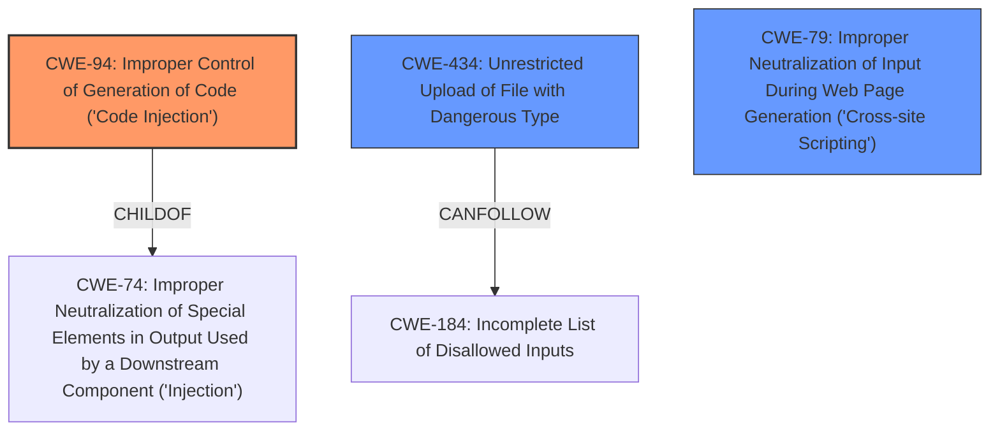

# Analysis for CVE-2021-21480

# Summary
| CWE ID | CWE Name | Confidence | CWE Abstraction Level | CWE Vulnerability Mapping Label | CWE-Vulnerability Mapping Notes |
|---|---|---|---|---|---|
| CWE-94 | Improper Control of Generation of Code ('Code Injection') | 0.9 | Base | Allowed-with-Review | Primary CWE |
| CWE-434 | Unrestricted Upload of File with Dangerous Type | 0.7 | Base | Allowed | Secondary Candidate |
| CWE-79 | Improper Neutralization of Input During Web Page Generation ('Cross-site Scripting') | 0.6 | Base | Allowed | Secondary Candidate |

## Evidence and Confidence

*   **Confidence Score:** 0.8
*   **Evidence Strength:** HIGH

## Relationship Analysis
The primary relationship influencing the CWE selection is the parent-child relationship. CWE-94 is a child of CWE-74 (Improper Neutralization of Special Elements in Output Used by a Downstream Component ('Injection')), but CWE-94 is more specific to code injection, making it a better fit. CWE-434 is related to file uploads, and its relationship to CWE-184 (Incomplete List of Disallowed Inputs) is also considered, as an incomplete denylist could contribute to the vulnerability. CWE-79 is more generally related to improper neutralization of input, but its relation to web page generation makes it less directly applicable than CWE-94 in this context.

## Vulnerability Chain
The vulnerability chain starts with the **weakness** of allowing users to **create dashboards and save them as JSP**.
1.  **Improper Input Handling:** The system **fails to properly validate or sanitize** user-provided input when creating dashboards (implicit).
2.  **Code Injection (CWE-94):** An attacker **injects malicious JSP code** into the request due to the **missing server-side validation**.
3.  **Remote Code Execution:** When a user opens the infected dashboard, the **injected malicious code gets executed** on the server.
4.  **Privilege Escalation:** The attacker gains **remote code execution in the server, which allows privilege escalation.**
5.  **System Compromise:** The attacker can read, modify, or delete sensitive files, compromising confidentiality, integrity, and availability.

## Summary of Analysis
The initial analysis focused on the ability to **inject malicious JSP code** into the system and achieve remote code execution. The key evidence is the lack of server-side validation allowing malicious JSP code to be injected into the request and forwarded to the server. "An attacker can intercept a request to the server, **inject malicious JSP code** in the request and forward to server." This strongly suggests **CWE-94 (Improper Control of Generation of Code ('Code Injection'))** as the primary weakness.

The retriever results and the additional information about the root cause of the vulnerability, which is a lack of server-side validation, further supports this classification. The relationships in the graph also highlight the importance of input validation and the potential for chaining vulnerabilities. The final decision is based on the evidence that the system constructs a code segment (the JSP dashboard) using externally influenced input without proper neutralization. CWE-94 is the most specific and accurate representation of this weakness, and it is at the appropriate base level of abstraction.

CWE-434 (Unrestricted Upload of File with Dangerous Type) was considered because the vulnerability involves saving dashboards as JSP files. However, the core issue is not the unrestricted upload of a dangerous file type, but the injection of malicious code within the file content. While uploading a JSP file contributes to the exploit, the primary weakness lies in the code injection.

CWE-79 (Improper Neutralization of Input During Web Page Generation ('Cross-site Scripting')) was considered because JSP is related to web page generation. However, the vulnerability is server-side code execution, not client-side scripting.