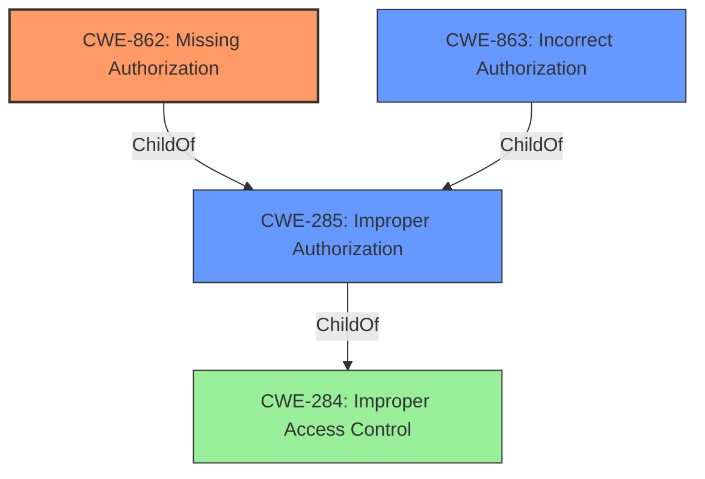

# Analysis Report for CVE-2021-21486

# Vulnerability Analysis Report: CVE-2021-21486

## Description


## Analysis (with Relationship Data)

# Summary
| CWE ID | CWE Name | Confidence | CWE Abstraction Level | CWE Vulnerability Mapping Label | CWE-Vulnerability Mapping Notes |
|---|---|---|---|---|---|
| CWE-862 | Missing Authorization | 1.0 | Class | Allowed-with-Review | Primary CWE |
| CWE-285 | Improper Authorization | 0.7 | Class | Discouraged | Secondary Candidate |
| CWE-863 | Incorrect Authorization | 0.7 | Class | Allowed-with-Review | Secondary Candidate |

## Evidence and Confidence

*   **Confidence Score:** 0.9
*   **Evidence Strength:** HIGH

## Relationship Analysis
The primary relationship that influenced my decision was the hierarchical structure with CWE-862 (Missing Authorization) and CWE-863 (Incorrect Authorization) being children of CWE-285 (Improper Authorization). The vulnerability description clearly states that the application "**does not perform necessary authorization checks**", which directly aligns with the definition of CWE-862. While CWE-863 (Incorrect Authorization) could also be considered, the **missing** aspect is more prominent in the description. CWE-285 is a high-level Class, and both CWE-862 and CWE-863 are more specific classes.



## Vulnerability Chain
The vulnerability chain starts with the **lack of authorization checks** (**root cause**) which leads to **escalation of privileges** (**impact**).

## Summary of Analysis
The initial assessment strongly pointed to CWE-862 (Missing Authorization) due to the explicit statement in the vulnerability description: "**does not perform necessary authorization checks**". This aligns precisely with the definition of CWE-862.

CWE-285 (Improper Authorization) and CWE-863 (Incorrect Authorization) were also considered, but the **missing** authorization check is a better fit than an **incorrect** authorization check.

The selected CWEs are at the optimal level of specificity because CWE-862 captures the root cause more accurately than its parent CWE-285 and sibling CWE-863. The evidence provided directly supports this classification.

Relevant CWE Information:

*   "SAP Enterprise Financial Services versions, 101, 102, 103, 104, 105, 600, 603, 604, 605, 606, 616, 617, 618, 800, **does not perform necessary authorization checks** for an authenticated user, resulting in escalation of privileges."

### CWE-862: Missing Authorization
The product **does not perform an authorization check** when an actor attempts to access a resource or perform an action. This aligns directly with the vulnerability description, where the application "**does not perform necessary authorization checks**". The security implication is that an attacker (authenticated user) can escalate privileges. CWE-862 is a child of CWE-285 (Improper Authorization) and CWE-284 (Improper Access Control). The MITRE mapping guidance suggests reviewing children of CWE-285, reinforcing the choice of CWE-862.

### CWE-285: Improper Authorization
The product **does not perform or incorrectly performs an authorization check** when an actor attempts to access a resource or perform an action. While this could be a higher-level classification, the description specifies the **lack of authorization**, making CWE-862 a more precise fit. The MITRE mapping guidance discourages using CWE-285 when more specific CWEs are available.

### CWE-863: Incorrect Authorization
The product performs an authorization check when an actor attempts to access a resource or perform an action, but it **does not correctly perform the check**. This is not the primary issue, as the vulnerability description emphasizes the **absence of authorization checks**.


## CWE Relationship Analysis

Current CWEs represent these abstraction levels: .


### Vulnerability Chain Analysis

**Chain starting from CWE-863:**
- 863 (Incorrect Authorization) - ROOT


**Chain starting from CWE-285:**
- 285 (Improper Authorization) - ROOT


### CWE Relationship Diagram

```mermaid
graph TD
    classDef primary fill:#f96,stroke:#333,stroke-width:2px
    classDef secondary fill:#69f,stroke:#333
    classDef tertiary fill:#9e9,stroke:#333
```


*Report generated on 2025-04-02 14:21:38*
