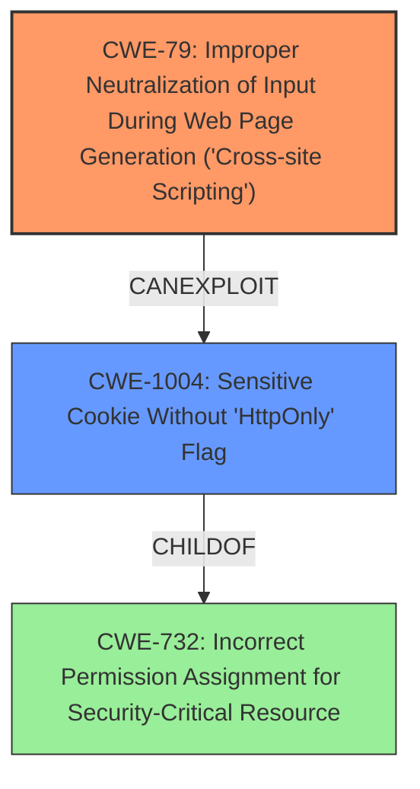

# Enhanced Analysis for CVE-2021-21494

# Summary
| CWE ID    | CWE Name                                                     | Confidence | CWE Abstraction Level | CWE Vulnerability Mapping Label | CWE-Vulnerability Mapping Notes |
| :-------- | :----------------------------------------------------------- | :--------- | :---------------------- | :------------------------------ | :---------------------------- |
| CWE-79    | Improper Neutralization of Input During Web Page Generation ('Cross-site Scripting') | 1.0        | Base                    | Allowed                       | Primary CWE                   |
| CWE-1004  | Sensitive Cookie Without 'HttpOnly' Flag                   | 1.0        | Variant                   | Allowed                       | Secondary CWE                 |

## Evidence and Confidence

*   **Confidence Score:** 1.0
*   **Evidence Strength:** HIGH

## Relationship Analysis
The primary weakness is CWE-79, which describes the root cause of the XSS vulnerability due to improper neutralization of input. CWE-1004 is a related secondary weakness, indicating the sensitive cookie lacks the HTTPOnly flag, exacerbating the impact of the XSS vulnerability. The hierarchical relationship is that CWE-79 can lead to the exploitation of session tokens because of the missing HTTPOnly flag (CWE-1004).



## Vulnerability Chain
The vulnerability chain starts with the **improper neutralization of input (CWE-79)** in the `tipo` parameter of `admin/logs_ajax.php`. This allows an attacker to inject malicious script into the web page. The injected script can then access the `centralmka2` cookie because it **lacks the HTTPOnly flag (CWE-1004)**. The attacker can then use this stolen session token to impersonate the admin.

## Summary of Analysis
The analysis is based on the vulnerability description and the provided CVE Reference Links Content Summary. The description explicitly states "**XSS** via the admin/logs_ajax.php tipo parameter. An attacker can leverage this to read the centralmka2 (session token) cookie, which is not set to HTTPOnly." The CVE Reference Links Content Summary confirms this:
    - Reflected XSS vulnerability in the "registro" parameter of the "logs_ajax.php" page.
    - The session token "centralmka2" cookie lacks the HTTPOnly flag.

The selection of CWE-79 and CWE-1004 is at the optimal level of specificity. CWE-79 accurately describes the **root cause** of the **cross-site scripting** vulnerability, while CWE-1004 specifies the missing HTTPOnly flag, which is a critical detail contributing to the impact of the vulnerability.

CWE-352 (Cross-Site Request Forgery (CSRF)) was considered, but it is not directly applicable as the vulnerability is an XSS, not a CSRF. CWE-434 (Unrestricted Upload of File with Dangerous Type) was also considered but is not applicable as this vulnerability does not involve file uploads. CWE-138 (Improper Neutralization of Special Elements) is too high-level, and CWE-79 is a more specific and accurate match. CWE-472 (External Control of Assumed-Immutable Web Parameter) doesn't fit as the vulnerability isn't directly related to tampering with assumed-immutable parameters. CWE-89 (Improper Neutralization of Special Elements used in an SQL Command ('SQL Injection')) is not applicable as there's no mention of SQL injection.


## CWE Relationship Analysis

Current CWEs represent these abstraction levels: .


### Vulnerability Chain Analysis

**Chain starting from CWE-732:**
- 732 (Incorrect Permission Assignment for Critical Resource) - ROOT


**Chain starting from CWE-79:**
- 79 (Improper Neutralization of Input During Web Page Generation ('Cross-site Scripting')) - ROOT


### CWE Relationship Diagram

```mermaid
graph TD
    classDef primary fill:#f96,stroke:#333,stroke-width:2px
    classDef secondary fill:#69f,stroke:#333
    classDef tertiary fill:#9e9,stroke:#333
```