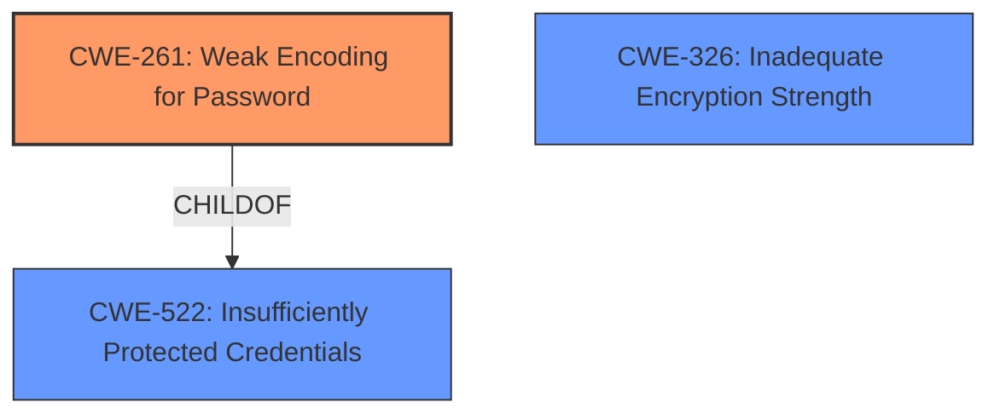

# Analysis for CVE-2021-21507

```markdown
# Summary
| CWE ID | CWE Name | Confidence | CWE Abstraction Level | CWE Vulnerability Mapping Label | CWE-Vulnerability Mapping Notes |
|---|---|---|---|---|---|
| CWE-261 | Weak Encoding for Password | 0.9 | Base | Allowed | Primary CWE |
| CWE-326 | Inadequate Encryption Strength | 0.7 | Class | Allowed-with-Review | Secondary Candidate |
| CWE-522 | Insufficiently Protected Credentials | 0.6 | Class | Allowed-with-Review | Secondary Candidate |

## Evidence and Confidence

*   **Confidence Score:** 0.9
*   **Evidence Strength:** HIGH

## Relationship Analysis
The primary CWE, CWE-261 **[CWE-261: Weak Encoding for Password]**, is a child of CWE-522 **[CWE-522: Insufficiently Protected Credentials]**, indicating that weak encoding is a specific type of credential protection issue. CWE-261 is also related to using weak cryptographic algorithms or inadequate encryption strength, as represented by the relationship to CWE-326 **[CWE-326: Inadequate Encryption Strength]**, though not directly linked in the graph. The choice of CWE-261 is preferred because it more accurately reflects the described **weakness**, which is about the trivial encoding of passwords rather than broader issues like broken algorithms or general credential protection.



## Vulnerability Chain
The chain starts with the **weak password encryption** (**ROOTCAUSE**), leading to the disclosure of user credentials (IMPACT). The attacker then leverages these disclosed credentials to access the vulnerable system with compromised privileges (IMPACT).

## Summary of Analysis
The primary assessment is based on the Dell security advisory for CVE-2021-21507. The advisory explicitly states the **root cause** as "**weak password encryption**". The advisory also notes that the impact is the disclosure of user credentials, which can then be used to access the system.

The selection of CWE-261 **[CWE-261: Weak Encoding for Password]** is based on the high retriever score and the alignment of its description with the provided vulnerability details. The advisory uses the term "**weak password encryption**", which directly corresponds to the concept of weak encoding.

CWE-326 **[CWE-326: Inadequate Encryption Strength]** and CWE-522 **[CWE-522: Insufficiently Protected Credentials]** were considered as potential mappings. However, CWE-261 **[CWE-261: Weak Encoding for Password]** is more specific than CWE-326 **[CWE-326: Inadequate Encryption Strength]**, as the encryption isn't necessarily weak in its algorithmic design, but rather in its application (trivial encoding). Also, CWE-261 **[CWE-261: Weak Encoding for Password]** is more specific than CWE-522 **[CWE-522: Insufficiently Protected Credentials]**, because we specifically know it is a **weak encoding** issue.
```