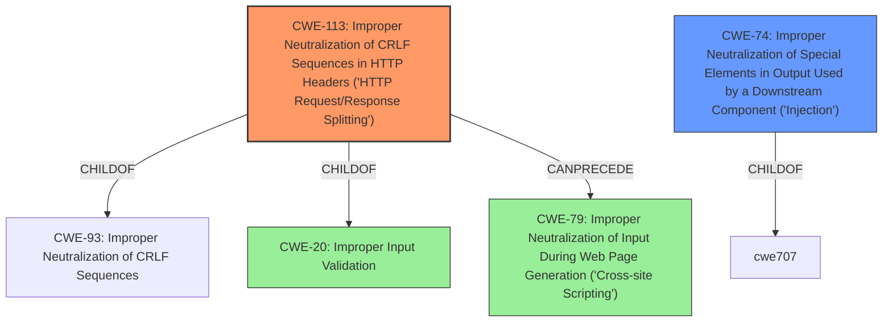

# Raw Analyzer Response for CVE-2021-21510

# Summary
| CWE ID | CWE Name | Confidence | CWE Abstraction Level | CWE Vulnerability Mapping Label | CWE-Vulnerability Mapping Notes |
|---|---|---|---|---|---|
| CWE-113 | Improper Neutralization of CRLF Sequences in HTTP Headers ('HTTP Request/Response Splitting') | 0.9 | Variant | Primary | Allowed |
| CWE-74 | Improper Neutralization of Special Elements in Output Used by a Downstream Component ('Injection') | 0.7 | Class | Secondary | Discouraged |

## Evidence and Confidence

*   **Confidence Score:** 0.8
*   **Evidence Strength:** HIGH

## Relationship Analysis
The primary CWE selected is CWE-113, which is a Variant of CWE-93 (Improper Neutralization of CRLF Sequences) and CWE-20 (Improper Input Validation). It can precede CWE-79 (Cross-Site Scripting), meaning that HTTP Request/Response Splitting can lead to XSS. The secondary CWE is CWE-74, which is a Class and a parent of CWE-113. Choosing CWE-113 provides a more specific classification of the vulnerability.

## Vulnerability Chain
The vulnerability chain begins with the **improper handling of the Host header**, leading to **host header injection**. This can then lead to web-cache poisoning or trigger redirections.

## Summary of Analysis
Initially, CWE-74 (Improper Neutralization of Special Elements in Output Used by a Downstream Component ('Injection')) was considered due to the **host header injection** vulnerability. However, CWE-113 (Improper Neutralization of CRLF Sequences in HTTP Headers ('HTTP Request/Response Splitting')) is a more specific variant that better describes the **lack of proper input sanitization of the "Host" header**. The **"Host header injection"** vulnerability allows an attacker to inject arbitrary values into the Host header, potentially leading to web-cache poisoning or triggering redirects.

The analysis relies heavily on the provided **Vulnerability Description Key Phrases** and **CVE Reference Links Content Summary**, specifically the root cause information about the **lack of proper sanitization of the Host header**.

CWE-113 is chosen because it is at the Variant level of abstraction, providing a more precise characterization of the vulnerability than the more general Class CWE-74.

Relevant CWE Information:

# Enhanced Context (25 CWEs)

## CWE-74: Improper Neutralization of Special Elements in Output Used by a Downstream Component ('Injection')
**Abstraction Level**: Class
**Similarity Score**: 0.79
**Source**: dense

**Description**:
The product constructs all or part of a command, data structure, or record using externally-influenced input from an upstream component, but it does not neutralize or incorrectly neutralizes special elements that could modify how it is parsed or interpreted when it is sent to a downstream component.

**Mapping Guidance**:
- Usage: Discouraged
- Rationale: CWE-74 is high-level and often misused when lower-level weaknesses are more appropriate.

## CWE-113: Improper Neutralization of CRLF Sequences in HTTP Headers ('HTTP Request/Response Splitting')
**Abstraction Level**: Variant
**Similarity Score**: 9128.92
**Source**: sparse

**Description**:
The product receives data from an HTTP agent/component (e.g., web server, proxy, browser, etc.), but it does not neutralize or incorrectly neutralizes CR and LF characters before the data is included in outgoing HTTP headers.

**Mapping Guidance**:
- Usage: Allowed
- Rationale: This CWE entry is at the Variant level of abstraction, which is a preferred level of abstraction for mapping to the root causes of vulnerabilities.

## CWE-230: Improper Handling of Missing Values
**Abstraction Level**: Variant
**Similarity Score**: 0.191
**Source**: sparse

**Description**:
The product does not handle or incorrectly handles when a parameter, field, or argument name is specified, but the associated value is missing, i.e. it is empty, blank, or null.

## CWE-79: Improper Neutralization of Input During Web Page Generation ('Cross-site Scripting')
**Abstraction Level**: Base
**Similarity Score**: 9076.03
**Source**: sparse

**Description**:
The product does not neutralize or incorrectly neutralizes user-controllable input before it is placed in output that is used as a web page that is served to other users.

## CWE-290: Authentication Bypass by Spoofing
**Abstraction Level**: Base
**Similarity Score**: 0.190
**Source**: sparse

**Description**:
This attack-focused weakness is caused by incorrectly implemented authentication schemes that are subject to spoofing attacks.