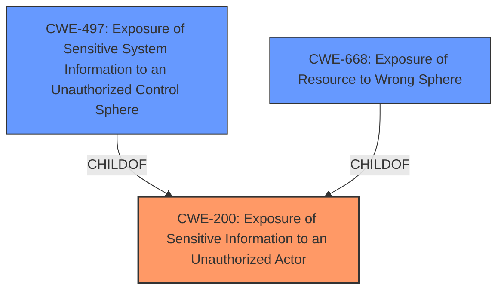

# Raw Analyzer Response for CVE-2021-21534

# Summary
| CWE ID | CWE Name | Confidence | CWE Abstraction Level | CWE Vulnerability Mapping Label | CWE-Vulnerability Mapping Notes |
|---|---|---|---|---|---|
| CWE-200 | Exposure of Sensitive Information to an Unauthorized Actor | 0.8 | Class | Primary | Discouraged |
| CWE-497 | Exposure of Sensitive System Information to an Unauthorized Control Sphere | 0.6 | Base | Secondary | Allowed |
| CWE-668 | Exposure of Resource to Wrong Sphere | 0.5 | Class | Secondary | Discouraged |

## Evidence and Confidence

*   **Confidence Score:** 0.7
*   **Evidence Strength:** MEDIUM

## Relationship Analysis
The primary CWE selected is CWE-200 which is a Class level CWE. The relationships show that CWE-200 has children like CWE-497 (Exposure of Sensitive System Information to an Unauthorized Control Sphere) and CWE-668 (Exposure of Resource to Wrong Sphere). While CWE-497 is more specific, the evidence suggests that the exposure isn't necessarily limited to *system* information. Thus, CWE-200 is the most appropriate primary. CWE-668 is also a child of CWE-200 and represents a more general case of exposing resources, but is also considered too broad and discouraged.

## Vulnerability Chain
The vulnerability chain starts with the **information exposure flaw** in the Dell Hybrid Client software, leading to a local unauthenticated attacker gaining access to sensitive information via the local API. The root cause is the **incorrect handling of sensitive information** within the local API, and the impact is the exposure of this information.

## Summary of Analysis
The initial assessment focused on identifying the root cause of the vulnerability. The key phrase "information exposure" and the CVE Reference Links Content Summary indicating "information exposure through the local API" strongly suggest CWE-200 (Exposure of Sensitive Information to an Unauthorized Actor). However, CWE-200 is a Class-level CWE and the mapping guidance discourages its use, suggesting alternatives like CWE-497 and CWE-668.

Despite the discouragement of CWE-200, it remains the most accurate high-level representation of the vulnerability. CWE-497 is more specific, focusing on system information, which might be applicable. CWE-668 is too generic.

The final decision is based on balancing the need for specificity with the available evidence. CWE-200 captures the essence of the vulnerability, while acknowledging that more specific information about the nature of the exposed information would allow for a more precise CWE assignment.

Relevant CWE Information:

# Enhanced Context (25 CWEs)

## CWE-312: Cleartext Storage of Sensitive Information
**Abstraction Level**: Base
**Similarity Score**: 0.76
**Source**: dense

**Description**:
The product stores sensitive information in cleartext within a resource that might be accessible to another control sphere.

**Mapping Guidance**:
- Usage: Allowed
- Rationale: This CWE entry is at the Base level of abstraction, which is a preferred level of abstraction for mapping to the root causes of vulnerabilities.

**Why Not Used**: This CWE is not relevant as the vulnerability is about information exposure via the local API, not specifically about cleartext storage.

## CWE-538: Insertion of Sensitive Information into Externally-Accessible File or Directory
**Abstraction Level**: Base
**Similarity Score**: 0.76
**Source**: dense

**Description**:
The product places sensitive information into files or directories that are accessible to actors who are allowed to have access to the files, but not to the sensitive information.

**Mapping Guidance**:
- Usage: Allowed
- Rationale: This CWE entry is at the Base level of abstraction, which is a preferred level of abstraction for mapping to the root causes of vulnerabilities.

**Why Not Used**: This CWE is not relevant as the vulnerability is not specifically related to insertion into files or directories. The vulnerability description mentions exposure through the local API.

## CWE-226: Sensitive Information in Resource Not Removed Before Reuse
**Abstraction Level**: Base
**Similarity Score**: 0.75
**Source**: dense

**Description**:
The product releases a resource such as memory or a file so that it can be made available for reuse, but it does not clear or "zeroize" the information contained in the resource before the product performs a critical state transition or makes the resource available for reuse by other entities.

**Mapping Guidance**:
- Usage: Allowed
- Rationale: This CWE entry is at the Base level of abstraction, which is a preferred level of abstraction for mapping to the root causes of vulnerabilities.

**Why Not Used**: This CWE is not directly applicable as the vulnerability is about general information exposure, not specifically about the failure to remove sensitive information before resource reuse.

## CWE-668: Exposure of Resource to Wrong Sphere
**Abstraction Level**: Class
**Similarity Score**: 0.74
**Source**: dense

**Description**:
The product exposes a resource to the wrong control sphere, providing unintended actors with inappropriate access to the resource.

**Mapping Guidance**:
- Usage: Discouraged
- Rationale: CWE-668 is high-level and is often misused as a catch-all when lower-level CWE IDs might be applicable. It is sometimes used for low-information vulnerability reports [REF-1287]. It is a level-1 Class (i.e., a child of a Pillar). It is not useful for trend analysis.

**Why Considered**: This CWE was considered as it relates to exposing a resource to the wrong control sphere.
**Why Not Used**: Although potentially relevant, this is a very general class and the mapping guidance discourages its use. The vulnerability description is more specifically about information exposure, making CWE-200 a better fit.

## CWE-497: Exposure of Sensitive System Information to an Unauthorized Control Sphere
**Abstraction Level**: Base
**Similarity Score**: 0.74
**Source**: dense

**Description**:
The product does not properly prevent sensitive system-level information from being accessed by unauthorized actors who do not have the same level of access to the underlying system as the product does.

**Mapping Guidance**:
- Usage: Allowed
- Rationale: This CWE entry is at the Base level of abstraction, which is a preferred level of abstraction for mapping to the root causes of vulnerabilities.

**Why Considered**: This CWE was considered as it specifically relates to sensitive system-level information exposure.
**Why Used**: While CWE-200 is the primary, this CWE is still relevant because the affected component is the local API.

## CWE-319: Cleartext Transmission of Sensitive Information
**Abstraction Level**: Base
**Similarity Score**: 0.74
**Source**: dense

**Description**:
The product transmits sensitive or security-critical data in cleartext in a communication channel that can be sniffed by unauthorized actors.

**Mapping Guidance**:
- Usage: Allowed
- Rationale: This CWE entry is at the Base level of abstraction, which is a preferred level of abstraction for mapping to the root causes of vulnerabilities.

**Why Not Used**: This CWE is not relevant as the vulnerability is about exposure through the local API, not specifically about cleartext transmission.

## CWE-1391: Use of Weak Credentials
**Abstraction Level**: Class
**Similarity Score**: 0.73
**Source**: dense

**Description**:
The product uses weak credentials (such as a default key or hard-coded password) that can be calculated, derived, reused, or guessed by an attacker.

**Mapping Guidance**:
- Usage: Allowed-with-Review
- Rationale: This CWE entry is a Class and might have Base-level children that would be more appropriate

**Why Not Used**: This CWE is not relevant as the vulnerability is about general information exposure, not specifically related to weak credentials.

## CWE-212: Improper Removal of Sensitive Information Before Storage or Transfer
**Abstraction Level**: Base
**Similarity Score**: 0.73
**Source**: dense

**Description**:
The product stores, transfers, or shares a resource that contains sensitive information, but it does not properly remove that information before the product makes the resource available to unauthorized actors.

**Mapping Guidance**:
- Usage: Allowed
- Rationale: This CWE entry is at the Base level of abstraction, which is a preferred level of abstraction for mapping to the root causes of vulnerabilities.

**Why Not Used**: This CWE is not directly applicable as the vulnerability is about general information exposure, not specifically about the failure to remove sensitive information before storage or transfer.

## CWE-