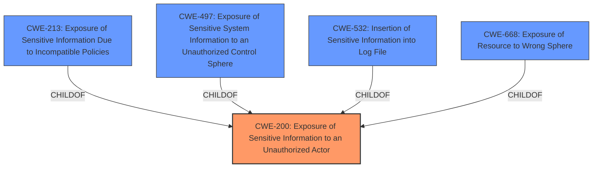

# Enhanced Analysis for CVE-2021-21536

# Summary
| CWE ID  | CWE Name                                                        | Confidence | CWE Abstraction Level | CWE Vulnerability Mapping Label | CWE-Vulnerability Mapping Notes |
| ------- | --------------------------------------------------------------- | ---------- | --------------------- | ------------------------------- | ----------------------------- |
| CWE-200 | Exposure of Sensitive Information to an Unauthorized Actor      | 0.9        | Class                 | Primary                         | Discouraged                   |

## Evidence and Confidence

*   **Confidence Score:** 0.9
*   **Evidence Strength:** MEDIUM

## Relationship Analysis
The primary relationship influencing the decision is that CWE-200 is a Class-level CWE and a parent of several more specific CWEs. The challenge is determining if a more specific CWE applies.



## Vulnerability Chain
The vulnerability chain is as follows:
1.  The **root cause** is an unspecified **information exposure vulnerability**.
2.  A local unauthenticated attacker can **register the client to a server**.
3.  The attacker can then **view sensitive information**.

## Summary of Analysis
The vulnerability description states that "Dell Hybrid Client versions prior to 1.5 contain an **information exposure vulnerability**. A local unauthenticated attacker may exploit this vulnerability in order to register the client to a server in order to **view sensitive information**." The CVE Reference Links Content Summary confirms that the **root cause** of the vulnerability is an **"information exposure vulnerability,"** and the **weakness** allows an attacker to "register a client to a server in order to **view sensitive information**."

CWE-200 (Exposure of Sensitive Information to an Unauthorized Actor) is a Class-level CWE that describes a product exposing sensitive information to an actor that is not explicitly authorized to have access to that information. This aligns with the provided description, as the attacker is able to **view sensitive information** after registering a client to the server, which they should not be able to do.

The mapping guidance for CWE-200 is "Discouraged" because it is commonly misused to represent the loss of confidentiality, which is a technical impact and not a root cause error. However, in this case, the vulnerability is explicitly described as an **"information exposure vulnerability"**, making CWE-200 an appropriate initial mapping. Further analysis to identify a more specific CWE is necessary.

Several other CWEs were considered but ultimately not chosen because the provided information is not specific enough to warrant their use. CWE-213 (Exposure of Sensitive Information Due to Incompatible Policies) was considered, but there's no evidence of incompatible policies being the root cause. CWE-497 (Exposure of Sensitive System Information to an Unauthorized Control Sphere) was considered, but there's no specific mention of system-level information being exposed. CWE-532 (Insertion of Sensitive Information into Log File) was considered, but the vulnerability description doesn't indicate that sensitive information is being written to a log file. CWE-668 (Exposure of Resource to Wrong Sphere) was also considered, but this is a very general class and the description does not offer enough evidence to choose a lower level CWE that is more specific.

Given the information available, CWE-200 is the most appropriate CWE. However, the evidence is not strong, as more details about the root cause could lead to a more specific CWE. Therefore, the confidence level is 0.9.

Relevant CWE Information:


## CWE Relationship Analysis

Current CWEs represent these abstraction levels: .


### Vulnerability Chain Analysis

**Chain starting from CWE-497:**
- 497 (Exposure of Sensitive System Information to an Unauthorized Control Sphere) - ROOT


**Chain starting from CWE-200:**
- 200 (Exposure of Sensitive Information to an Unauthorized Actor) - ROOT


### CWE Relationship Diagram

```mermaid
graph TD
    classDef primary fill:#f96,stroke:#333,stroke-width:2px
    classDef secondary fill:#69f,stroke:#333
    classDef tertiary fill:#9e9,stroke:#333
```