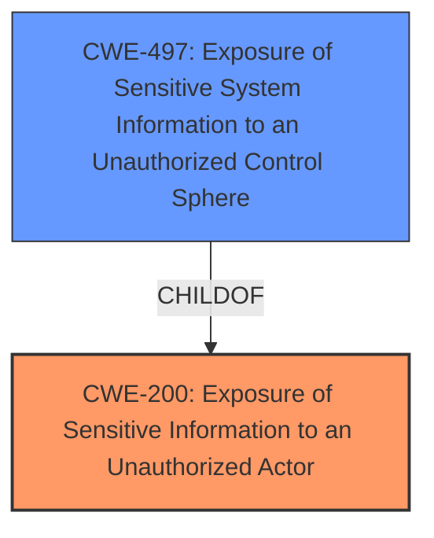

# Enhanced Analysis for CVE-2021-21537

# Summary
| CWE ID | CWE Name | Confidence | CWE Abstraction Level | CWE Vulnerability Mapping Label | CWE-Vulnerability Mapping Notes |
|---|---|---|---|---|---|
| CWE-200 | Exposure of Sensitive Information to an Unauthorized Actor | 0.8 | Class | Primary | Discouraged: However, it directly reflects the vulnerability description and available evidence. |
| CWE-497 | Exposure of Sensitive System Information to an Unauthorized Control Sphere | 0.7 | Base | Secondary | Allowed: Provides a more specific view related to system information exposure. |

## Evidence and Confidence

*   **Confidence Score:** 0.75
*   **Evidence Strength:** MEDIUM

## Relationship Analysis
The primary relationship that influenced the selection was the ChildOf relationship between CWE-497 and CWE-200. While CWE-200 is discouraged as a general catch-all, the vulnerability description directly states "information exposure vulnerability." CWE-497 is a more specific Base level CWE that describes the exposure of sensitive system information, which aligns with the vulnerability's potential impact (viewing and exfiltrating sensitive information on the system). Therefore, CWE-497 is a secondary candidate to describe the weakness more thoroughly.



## Vulnerability Chain
The chain starts with the **information exposure vulnerability** (root cause), leading to the **impact** of an unauthenticated local attacker being able to view and exfiltrate sensitive information.

## Summary of Analysis
Initially, the primary focus was on identifying a specific root cause related to insecure permissions or authentication issues. However, the provided evidence is limited. The vulnerability description and CVE summary consistently point to a general "information exposure vulnerability."

The selection of CWE-200 is primarily based on the direct statement in the vulnerability description: "Dell Hybrid Client versions prior to 1.5 contain an **information exposure vulnerability**." This, combined with the impact of viewing and exfiltrating sensitive information, makes CWE-200 a reasonable although discouraged choice.

CWE-497 is chosen as a secondary CWE because it provides a more specific view by focusing on the exposure of "sensitive system information," which aligns with the context of the Dell Hybrid Client and the potential for viewing/exfiltrating system-related data.

The choice of CWE-200 is made cautiously, acknowledging the MITRE discouragement, but also recognizing the lack of more specific root cause information. The confidence score is reflective of the limited evidence, and future analysis might reveal a more precise CWE if additional details are available.


## CWE Relationship Analysis

Current CWEs represent these abstraction levels: .


### Vulnerability Chain Analysis

**Chain starting from CWE-200:**
- 200 (Exposure of Sensitive Information to an Unauthorized Actor) - ROOT


**Chain starting from CWE-497:**
- 497 (Exposure of Sensitive System Information to an Unauthorized Control Sphere) - ROOT


### CWE Relationship Diagram

```mermaid
graph TD
    classDef primary fill:#f96,stroke:#333,stroke-width:2px
    classDef secondary fill:#69f,stroke:#333
    classDef tertiary fill:#9e9,stroke:#333
```