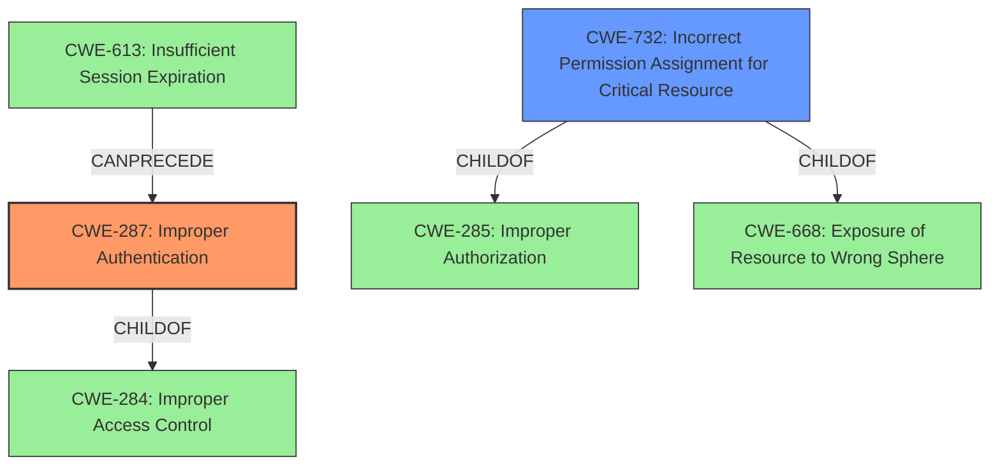

# Raw Analyzer Response for CVE-2021-21544

# Summary
| CWE ID | CWE Name | Confidence | CWE Abstraction Level | CWE Vulnerability Mapping Label | CWE-Vulnerability Mapping Notes |
|---|---|---|---|---|---|
| CWE-287 | Improper Authentication | 0.9 | Class | Primary | Discouraged |
| CWE-732 | Incorrect Permission Assignment for Critical Resource | 0.6 | Class | Secondary | Allowed-with-Review |

## Evidence and Confidence

*   **Confidence Score:** 0.9
*   **Evidence Strength:** HIGH

## Relationship Analysis
The primary relationship considered was the ChildOf relationship. CWE-287 is a child of CWE-284 (Improper Access Control), but CWE-287 is more specific, relating directly to authentication failures. Although CWE-287 is a Class-level CWE, it is used here because the vulnerability description explicitly mentions "improper authentication vulnerability." CWE-732 is related to incorrect assignment of permissions, which could be a contributing factor, but is less directly implicated. The CanPrecede relationship of CWE-613 (Insufficient Session Expiration) to CWE-287 suggests that session management issues can lead to authentication bypasses, but this is not explicit in the description.

## Vulnerability Chain
The vulnerability chain starts with **improper authentication**, which allows an attacker to manipulate the username field.

## Summary of Analysis
The analysis heavily relies on the provided evidence, particularly the "Vulnerability Description Key Phrases" and "CVE Reference Links Content Summary." The key phrase " **improper authentication vulnerability**" directly points to CWE-287.

The "CVE Reference Links Content Summary" states:
- **Root cause of vulnerability**: Improper authentication.
- **Weaknesses/vulnerabilities present**: The iDRAC9 software **does not properly validate user input** when setting comments, allowing manipulation of the username field.
- **Impact of exploitation**: A malicious user with high privileges can manipulate the username field in the comment section and set the value to any user.

This evidence supports the selection of CWE-287. The description also mentions that the iDRAC9 software **does not properly validate user input**. While input validation issues can lead to various vulnerabilities, in this case, the lack of proper validation directly contributes to the **improper authentication** process.

The Retriever Results also list CWE-287 as the top candidate, although it is a Class. The mapping guidance for CWE-287 discourages its use when lower-level CWE entries are applicable, suggesting CWE-1390 (Weak Authentication) or CWE-306 (Missing Authentication for Critical Function) as alternatives. However, the description doesn't specify whether the authentication is weak or entirely missing, but rather that it's "improper." The manipulation of the username field suggests a bypass of authentication checks rather than a complete lack of authentication, supporting CWE-287.

CWE-732 was considered because manipulation of the username could be construed as incorrect permission assignment. However, the primary issue is the **improper authentication** that enables the manipulation in the first place.

The selected CWE is at the optimal level of specificity because it directly addresses the root cause described in the vulnerability description: **improper authentication**.
Relevant CWE Information:

# Enhanced Context (25 CWEs)

## CWE-798: Use of Hard-coded Credentials
**Abstraction Level**: Base
**Similarity Score**: 0.79
**Source**: dense

**Description**:
The product contains hard-coded credentials, such as a password or cryptographic key.

**Mapping Guidance**:
- Usage: Allowed
- Rationale: This CWE entry is at the Base level of abstraction, which is a preferred level of abstraction for mapping to the root causes of vulnerabilities.

## CWE-807: Reliance on Untrusted Inputs in a Security Decision
**Abstraction Level**: Base
**Similarity Score**: 0.79
**Source**: dense

**Description**:
The product uses a protection mechanism that relies on the existence or values of an input, but the input can be modified by an untrusted actor in a way that bypasses the protection mechanism.

**Mapping Guidance**:
- Usage: Allowed
- Rationale: This CWE entry is at the Base level of abstraction, which is a preferred level of abstraction for mapping to the root causes of vulnerabilities.

## CWE-1391: Use of Weak Credentials
**Abstraction Level**: Class
**Similarity Score**: 0.79
**Source**: dense

**Description**:
The product uses weak credentials (such as a default key or hard-coded password) that can be calculated, derived, reused, or guessed by an attacker.

**Mapping Guidance**:
- Usage: Allowed-with-Review
- Rationale: This CWE entry is a Class and might have Base-level children that would be more appropriate

## CWE-312: Cleartext Storage of Sensitive Information
**Abstraction Level**: Base
**Similarity Score**: 0.77
**Source**: dense

**Description**:
The product stores sensitive information in cleartext within a resource that might be accessible to another control sphere.

**Mapping Guidance**:
- Usage: Allowed
- Rationale: This CWE entry is at the Base level of abstraction, which is a preferred level of abstraction for mapping to the root causes of vulnerabilities.

## CWE-345: Insufficient Verification of Data Authenticity
**Abstraction Level**: Class
**Similarity Score**: 0.77
**Source**: dense

**Description**:
The product does not sufficiently verify the origin or authenticity of data, in a way that causes it to accept invalid data.

**Mapping Guidance**:
- Usage: Discouraged
- Rationale: This CWE entry is a level-1 Class (i.e., a child of a Pillar). It might have lower-level children that would be more appropriate

## CWE-912: Hidden Functionality
**Abstraction Level**: Class
**Similarity Score**: 0.77
**Source**: dense

**Description**:
The product contains functionality that is not documented, not part of the specification, and not accessible through an interface or command sequence that is obvious to the product's users or administrators.

**Mapping Guidance**:
- Usage: Allowed-with-Review
- Rationale: This CWE entry is a Class and might have Base-level children that would be more appropriate

## CWE-303: Incorrect Implementation of Authentication Algorithm
**Abstraction Level**: Base
**Similarity Score**: 0.77
**Source**: dense

**Description**:
The requirements for the product dictate the use of an established authentication algorithm, but the implementation of the algorithm is incorrect.

**Mapping Guidance**:
- Usage: Allowed
- Rationale: This CWE entry is at the Base level of abstraction, which is a preferred level of abstraction for mapping to the root causes of vulnerabilities.

## CWE-319: Cleartext Transmission of Sensitive Information
**Abstraction Level**: Base
**Similarity Score**: 0.77
**Source**: dense

**Description**:
The product transmits sensitive or security-critical data in cleartext in a communication channel that can be sniffed by unauthorized actors.

**Mapping Guidance**:
- Usage: Allowed
- Rationale: This CWE entry is at the Base level of abstraction, which is a preferred level of abstraction for mapping to the root causes of vulnerabilities.

## CWE-288: Authentication Bypass Using an Alternate Path or Channel
**Abstraction Level**: Base
**Similarity Score**: 0.77
**Source**: dense

**Description**:
The product requires authentication, but the product has an alternate path or channel that does not require authentication.

**Mapping Guidance**:
- Usage: Allowed
- Rationale: This CWE entry is at the Base level of abstraction, which is a preferred level of abstraction for mapping to the root causes of vulnerabilities.

## CWE-280: Improper Handling of Insufficient Permissions or Privileges 
**Abstraction Level**: Base
**Similarity Score**: 0.77
**Source**: dense

**Description**:
The product does not handle or incorrectly handles when it has insufficient privileges to access resources or functionality as specified by their permissions. This may cause it to follow unexpected code paths that may leave the product