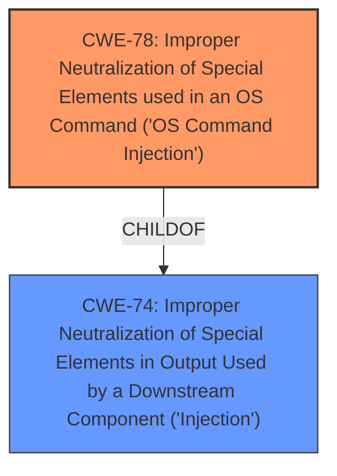

# Analysis for CVE-2021-21550

# Summary
| CWE ID | CWE Name | Confidence | CWE Abstraction Level | CWE Vulnerability Mapping Label | CWE-Vulnerability Mapping Notes |
|---|---|---|---|---|---|
| CWE-78 | Improper Neutralization of Special Elements used in an OS Command ('OS Command Injection') | 1.0 | Base | Allowed | Primary CWE |

## Evidence and Confidence

*   **Confidence Score:** 1.0
*   **Evidence Strength:** HIGH

## Relationship Analysis
The primary relationship that influenced my decision was the ChildOf relationship between CWE-78 and CWE-74, indicating that OS Command Injection is a specific type of injection. However, since the description clearly mentions OS command, CWE-78 is the most appropriate and specific choice.

## Vulnerability Chain
The vulnerability chain starts with the **improper neutralization of special elements** within the OS command, leading to privilege escalation.
  - **Root Cause:** CWE-78 - Improper Neutralization of Special Elements used in an OS Command ('OS Command Injection')
  - **Impact:** Privilege escalation

## Summary of Analysis
The analysis is based on the provided evidence, which includes the vulnerability description and the CVE Reference Links Content Summary. The vulnerability description clearly states an **improper neutralization of special elements** used in an OS command, aligning directly with CWE-78.

> Dell EMC PowerScale OneFS 8.1.0-9.1.0 contain an **improper neutralization of special elements** used in an OS command vulnerability.

The CVE Reference Links Content Summary reinforces this:

> "Root cause of vulnerability": "Improper neutralization of special elements used in an OS command."

CWE-78 is at the Base level of abstraction, which is the preferred level, and its description matches the vulnerability details closely. The retriever results also list CWE-78 as the top candidate.

Other CWEs considered but not used:

*   CWE-89 (Improper Neutralization of Special Elements used in an SQL Command ('SQL Injection')): While also an "Improper Neutralization" weakness, it is specific to SQL commands, which is not the case here.
*   CWE-74 (Improper Neutralization of Special Elements in Output Used by a Downstream Component ('Injection')): This is a more general class of injection vulnerabilities. While applicable, CWE-78 is more specific to the OS command context.
*   CWE-1336 (Improper Neutralization of Special Elements Used in a Template Engine): This is specific to template engines, which are not mentioned in the description.
*   CWE-269 (Improper Privilege Management): The description mentions privilege escalation as an impact, not as the root cause. The root cause is the **improper neutralization of special elements**.