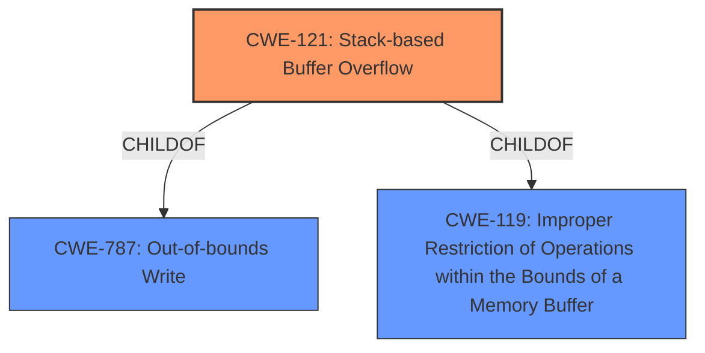

# Raw Analyzer Response for CVE-2021-21554

# Summary
| CWE ID  | CWE Name                                                                        | Confidence | CWE Abstraction Level | CWE Vulnerability Mapping Label | CWE-Vulnerability Mapping Notes |
| :-------- | :------------------------------------------------------------------------------ | :---------- | :----------------------- | :-------------------------------- | :-------------------------------- |
| CWE-121   | Stack-based Buffer Overflow                                                     | 1          | Variant                  | Primary                           | Allowed                           |
| CWE-119   | Improper Restriction of Operations within the Bounds of a Memory Buffer        | 0.75       | Class                    | Secondary                         | Discouraged                      |
| CWE-787   | Out-of-bounds Write                                                           | 0.75       | Base                     | Secondary                         | Allowed                           |

## Evidence and Confidence

*   **Confidence Score:** 0.9
*   **Evidence Strength:** HIGH

## Relationship Analysis
The primary CWE is CWE-121, which is a Variant of CWE-787 (Out-of-bounds Write) and CWE-119 (Improper Restriction of Operations within the Bounds of a Memory Buffer).
CWE-119 is a more general class of weakness, while CWE-121 specifies the overflow occurs on the stack.
CWE-787 is the base class of out-of-bounds write vulnerabilities.
The selection of CWE-121 is based on the vulnerability description explicitly stating a **stack-based buffer overflow**.

## Vulnerability Chain
The vulnerability chain starts with a **stack-based buffer overflow** (CWE-121), which can lead to denial of service, arbitrary code execution, or information disclosure. The root cause is the **improper** handling of input that allows writing beyond the allocated buffer on the stack.

## Summary of Analysis
The initial analysis identified the **stack-based buffer overflow** as the primary weakness. The retriever results suggested CWE-119 and CWE-190, but the explicit mention of "stack-based" in the vulnerability description and CVE summary makes CWE-121 the most accurate choice. CWE-121 is a Variant of CWE-787 and CWE-119, providing a more specific classification than the more general CWE-119.

The evidence supporting this decision is:

*   The vulnerability description states: "Dell PowerEdge ... BIOS contain a **stack-based buffer overflow** vulnerability..."
*   The CVE Reference Links Content Summary confirms: "root_cause": "Stack-based buffer overflow", "weaknesses": ["Stack-based buffer overflow"]

Therefore, selecting CWE-121 is the most appropriate and specific classification, with a high confidence score.

Relevant CWE Information:

# Enhanced Context (25 CWEs)

## CWE-1289: Improper Validation of Unsafe Equivalence in Input
**Abstraction Level**: Base
**Similarity Score**: 0.76
**Source**: dense

**Description**:
The product receives an input value that is used as a resource identifier or other type of reference, but it does not validate or incorrectly validates that the input is equivalent to a potentially-unsafe value.
Not Selected: This CWE isn't relevant because the vulnerability doesn't involve unsafe equivalence. The core issue is a buffer overflow, not an equivalence problem.

## CWE-131: Incorrect Calculation of Buffer Size
**Abstraction Level**: Base
**Similarity Score**: 0.76
**Source**: dense

**Description**:
The product does not correctly calculate the size to be used when allocating a buffer, which could lead to a buffer overflow.
Not Selected: While incorrect buffer size calculation could contribute to a buffer overflow, the description explicitly mentions a **stack-based buffer overflow**, making CWE-121 more specific and appropriate.

## CWE-191: Integer Underflow (Wrap or Wraparound)
**Abstraction Level**: Base
**Similarity Score**: 0.76
**Source**: dense

**Description**:
The product subtracts one value from another, such that the result is less than the minimum allowable integer value, which produces a value that is not equal to the correct result.
Not Selected: Integer underflow is not the root cause. The vulnerability is a buffer overflow.

## CWE-805: Buffer Access with Incorrect Length Value
**Abstraction Level**: Base
**Similarity Score**: 0.76
**Source**: dense

**Description**:
The product uses a sequential operation to read or write a buffer, but it uses an incorrect length value that causes it to access memory that is outside of the bounds of the buffer.
Not Selected: While related to buffer overflows, CWE-121 is more specific because the overflow is **stack-based**.

## CWE-125: Out-of-bounds Read
**Abstraction Level**: Base
**Similarity Score**: 0.75
**Source**: dense

**Description**:
The product reads data past the end, or before the beginning, of the intended buffer.
Not Selected: The vulnerability is a **buffer overflow**, which involves writing past the buffer, not reading.

## CWE-129: Improper Validation of Array Index
**Abstraction Level**: Variant
**Similarity Score**: 0.74
**Source**: dense

**Description**:
The product uses untrusted input when calculating or using an array index, but the product does not validate or incorrectly validates the index to ensure the index references a valid position within the array.
Not Selected: Although related to out-of-bounds access, the description explicitly mentions a **stack-based buffer overflow**, not specifically an array index issue.

## CWE-606: Unchecked Input for Loop Condition
**Abstraction Level**: Base
**Similarity Score**: 0.74
**Source**: dense

**Description**:
The product does not properly check inputs that are used for loop conditions, potentially leading to a denial of service or other consequences because of excessive looping.
Not Selected: This is not related to the described vulnerability.

## CWE-1288: Improper Validation of Consistency within Input
**Abstraction Level**: Base
**Similarity Score**: 0.74
**Source**: dense

**Description**:
The product receives a complex input with multiple elements or fields that must be consistent with each other, but it does not validate or incorrectly validates that the input is actually consistent.
Not Selected: This CWE is irrelevant as the vulnerability focuses on buffer overflows, not input consistency.

## CWE-124: Buffer Underwrite ('Buffer Underflow')
**Abstraction Level**: Base
**Similarity Score**: 0.74
**Source**: dense

**Description**:
The product writes to a buffer using an index or pointer that references a memory location prior to the beginning of the buffer.
Not Selected: The vulnerability involves writing *past* the end of the buffer (overflow), not before the beginning (underflow).

## CWE-197: Numeric Truncation Error
**Abstraction Level**: Base
**Similarity Score**: 0.74
**Source**: dense

**Description**:
Truncation errors occur when a primitive is cast to a primitive of a smaller size and data is lost in the conversion.
Not Selected: This is not related to the described vulnerability.

## CWE-190: Integer Overflow or Wraparound
**Abstraction Level**: Base
**Similarity Score**: 7385.69
**Source**: sparse

**Description**:
The product performs a calculation that can
         produce an integer overflow or wraparound when the logic
         assumes that the resulting value will always be larger than
         the original value. This occurs when an integer value is
         incremented to a value that is too large to store in the
         associated representation. When this occurs, the value may
         become a very small or negative number.
Not Selected: While integer overflows can sometimes lead to buffer overflows, the description explicitly mentions a **stack-based buffer overflow**, making CWE-121 more directly applicable.

## CWE-1284: Improper Validation of Specified Quantity in Input
**Abstraction Level**: Base
**Similarity Score**: 6908.41
**Source**: sparse

**Description**:
The product receives input that is expected to specify a quantity (such as size or length), but it does not validate or incorrectly validates that the quantity has the required properties.
Not Selected: While this could contribute to a buffer overflow, the explicit **stack-based buffer overflow** in the description makes CWE-121 a better fit.

## CWE-119: Improper Restriction of Operations within the Bounds of a Memory Buffer
**Abstraction Level**: Class
**Similarity Score**: 6822.66
**Source**: sparse

**Description**:
The