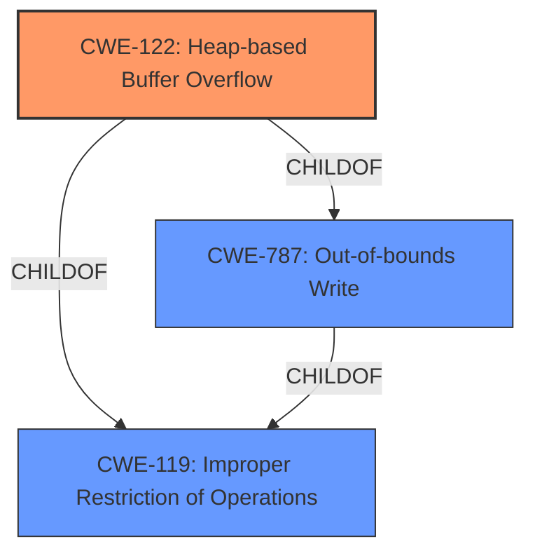

# Raw Analyzer Response for CVE-2021-21555

# Summary
| CWE ID  | CWE Name                                                      | Confidence | CWE Abstraction Level | CWE Vulnerability Mapping Label | CWE-Vulnerability Mapping Notes |
| :-------- | :------------------------------------------------------------ | :--------- | :---------------------- | :------------------------------ | :------------------------------ |
| CWE-122   | Heap-based Buffer Overflow                                    | 0.9        | Variant               | Primary CWE                    | Allowed                       |
| CWE-787   | Out-of-bounds Write                                           | 0.7        | Base                    | Secondary CWE                   |                                 |
| CWE-119   | Improper Restriction of Operations within the Bounds of a Memory Buffer | 0.6        | Class                   | Secondary CWE                   | Discouraged                   |

## Evidence and Confidence

*   **Confidence Score:** 0.9
*   **Evidence Strength:** HIGH

## Relationship Analysis
The primary CWE is CWE-122, which is a variant of CWE-787 and CWE-119. CWE-787 is a base CWE describing out-of-bounds writes, and CWE-119 is a class CWE providing a general description of improper memory buffer operation restrictions. Choosing CWE-122 offers the most specific description of the vulnerability.

## Vulnerability Chain
The vulnerability chain starts with a **heap-based buffer overflow** (CWE-122) due to an unspecified error in the BIOS when NVDIMM-N is installed, leading to denial of service, arbitrary code execution, or information disclosure. The root cause is the **improper handling of memory allocation** on the heap.

## Summary of Analysis
The initial assessment identified CWE-787 as the top match based on similar CVE descriptions, and the retriever results suggested CWE-119, CWE-190, CWE-122, and CWE-125. However, after a detailed review and consideration of the specific vulnerability details, CWE-122 (Heap-based Buffer Overflow) was selected as the primary CWE.

The vulnerability description clearly states a "**heap-based buffer overflow**". The CVE Reference Links Content Summary confirms this with the line: `"root_cause": "Heap-based buffer overflow vulnerability in the BIOS."` and `"weaknesses": ["Heap-based buffer overflow"]`. This evidence strongly supports the selection of CWE-122 as the most accurate representation of the vulnerability.

CWE-787 (Out-of-bounds Write) is the base CWE for CWE-122, but CWE-122 provides more specific information about the location of the buffer (heap). CWE-119 (Improper Restriction of Operations within the Bounds of a Memory Buffer) is a more general class CWE, and the mapping guidance discourages its use when more specific CWEs are available.

Other CWEs like CWE-190 (Integer Overflow or Wraparound), CWE-125 (Out-of-bounds Read) and CWE-805 (Buffer Access with Incorrect Length Value) were considered but deemed less relevant as the primary issue is an out-of-bounds write specifically on the heap, not an integer overflow or a read operation.

The final selection of CWE-122 is at the optimal level of specificity (Variant) as it directly corresponds to the **heap-based buffer overflow** described in the vulnerability.

Relevant CWE Information:

# Enhanced Context (25 CWEs)

## CWE-805: Buffer Access with Incorrect Length Value
**Abstraction Level**: Base
**Similarity Score**: 0.77
**Source**: dense

**Description**:
The product uses a sequential operation to read or write a buffer, but it uses an incorrect length value that causes it to access memory that is outside of the bounds of the buffer.

**Mapping Guidance**:
- Usage: Allowed
- Rationale: This CWE entry is at the Base level of abstraction, which is a preferred level of abstraction for mapping to the root causes of vulnerabilities.

## CWE-191: Integer Underflow (Wrap or Wraparound)
**Abstraction Level**: Base
**Similarity Score**: 0.76
**Source**: dense

**Description**:
The product subtracts one value from another, such that the result is less than the minimum allowable integer value, which produces a value that is not equal to the correct result.

**Mapping Guidance**:
- Usage: Allowed
- Rationale: This CWE entry is at the Base level of abstraction, which is a preferred level of abstraction for mapping to the root causes of vulnerabilities.

## CWE-193: Off-by-one Error
**Abstraction Level**: Base
**Similarity Score**: 0.76
**Source**: dense

**Description**:
A product calculates or uses an incorrect maximum or minimum value that is 1 more, or 1 less, than the correct value.

**Mapping Guidance**:
- Usage: Allowed
- Rationale: This CWE entry is at the Base level of abstraction, which is a preferred level of abstraction for mapping to the root causes of vulnerabilities.

## CWE-131: Incorrect Calculation of Buffer Size
**Abstraction Level**: Base
**Similarity Score**: 0.76
**Source**: dense

**Description**:
The product does not correctly calculate the size to be used when allocating a buffer, which could lead to a buffer overflow.

**Mapping Guidance**:
- Usage: Allowed
- Rationale: This CWE entry is at the Base level of abstraction, which is a preferred level of abstraction for mapping to the root causes of vulnerabilities.

## CWE-124: Buffer Underwrite ('Buffer Underflow')
**Abstraction Level**: Base
**Similarity Score**: 0.76
**Source**: dense

**Description**:
The product writes to a buffer using an index or pointer that references a memory location prior to the beginning of the buffer.

**Mapping Guidance**:
- Usage: Allowed
- Rationale: This CWE entry is at the Base level of abstraction, which is a preferred level of abstraction for mapping to the root causes of vulnerabilities.

## CWE-197: Numeric Truncation Error
**Abstraction Level**: Base
**Similarity Score**: 0.75
**Source**: dense

**Description**:
Truncation errors occur when a primitive is cast to a primitive of a smaller size and data is lost in the conversion.

**Mapping Guidance**:
- Usage: Allowed
- Rationale: This CWE entry is at the Base level of abstraction, which is a preferred level of abstraction for mapping to the root causes of vulnerabilities.

## CWE-1289: Improper Validation of Unsafe Equivalence in Input
**Abstraction Level**: Base
**Similarity Score**: 0.74
**Source**: dense

**Description**:
The product receives an input value that is used as a resource identifier or other type of reference, but it does not validate or incorrectly validates that the input is equivalent to a potentially-unsafe value.

**Mapping Guidance**:
- Usage: Allowed
- Rationale: This CWE entry is at the Base level of abstraction, which is a preferred level of abstraction for mapping to the root causes of vulnerabilities.

## CWE-127: Buffer Under-read
**Abstraction Level**: Variant
**Similarity Score**: 0.74
**Source**: dense

**Description**:
The product reads from a buffer using buffer access mechanisms such as indexes or pointers that reference memory locations prior to the targeted buffer.

**Mapping Guidance**:
- Usage: Allowed
- Rationale: This CWE entry is at the Variant level of abstraction, which is a preferred level of abstraction for mapping to the root causes of vulnerabilities.

## CWE-786: Access of Memory Location Before Start of Buffer
**Abstraction Level**: Base
**Similarity Score**: 0.74
**Source**: dense

**Description**:
The product reads or writes to a buffer using an index or pointer that references a memory location prior to the beginning of the buffer.

**Mapping Guidance**:
- Usage: Discouraged
- Rationale: The CWE entry might be misused when lower-level CWE entries might be available. It also overlaps existing CWE entries and might be deprecated in the future.

## CWE-681: Incorrect Conversion between Numeric Types
**Abstraction Level**: Base
**Similarity Score**: 0.73
**Source**: dense

**Description**:
When converting from one data type to another, such as long to integer, data can be omitted or translated in a way that produces unexpected values. If the resulting values are used in a sensitive context, then dangerous behaviors may occur.

**Mapping Guidance**:
- Usage: Allowed
- Rationale: This