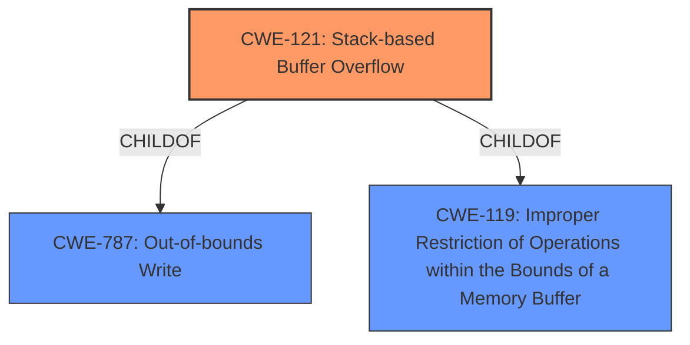

# Analysis for CVE-2021-21556

# Summary
| CWE ID  | CWE Name                                                      | Confidence | CWE Abstraction Level | CWE Vulnerability Mapping Label | CWE-Vulnerability Mapping Notes |
| :-------- | :------------------------------------------------------------ | :--------- | :---------------------- | :------------------------------ | :------------------------------ |
| CWE-121   | Stack-based Buffer Overflow                                   | 1          | Variant                 | Primary CWE                     | Allowed                       |
| CWE-119   | Improper Restriction of Operations within the Bounds of a Memory Buffer | 0.7        | Class                   | Secondary CWE                   | Discouraged                    |

## Evidence and Confidence

*   **Confidence Score:** 1
*   **Evidence Strength:** HIGH

## Relationship Analysis
The primary CWE selected is CWE-121, which is a Variant of CWE-787 (Out-of-bounds Write) and CWE-119 (Improper Restriction of Operations within the Bounds of a Memory Buffer). This hierarchy guided the selection of the most specific CWE possible. CWE-119 is a class-level CWE and is too general to be the primary CWE.

## Vulnerability Chain
The chain of events leading to the vulnerability includes a **stack-based buffer overflow** due to a **weakness** in the BIOS, potentially leading to denial of service, arbitrary code execution, or information disclosure. The root cause is the **stack-based buffer overflow** itself.

## Summary of Analysis
The analysis is based on the provided evidence, which includes a clear description of a **stack-based buffer overflow** vulnerability. The vulnerability description explicitly states: "Dell PowerEdge ... Server BIOS contain a **stack-based buffer overflow** vulnerability...". This statement provides strong support for selecting CWE-121 (Stack-based Buffer Overflow) as the primary CWE. The retriever results and similar CVE descriptions also support this selection. CWE-121 is a variant-level CWE, providing a more specific classification than its parent CWEs, such as CWE-119 (Improper Restriction of Operations within the Bounds of a Memory Buffer). Therefore, CWE-121 is the optimal level of specificity for this vulnerability.

Relevant CWE Information:

# Enhanced Context (25 CWEs)

## CWE-119: Improper Restriction of Operations within the Bounds of a Memory Buffer
**Abstraction:** Class
**Similarity Score**: 0.800 (Retriever Result)

### Description
The product performs operations on a memory buffer, but it reads from or writes to a memory location outside the buffer's intended boundary. This may result in read or write operations on unexpected memory locations that could be linked to other variables, data structures, or internal program data.

### Mapping Guidance
**Usage:** Discouraged
**Rationale:** CWE-119 is commonly misused in low-information vulnerability reports when lower-level CWEs could be used instead, or when more details about the vulnerability are available.

## CWE-121: Stack-based Buffer Overflow
**Abstraction:** Variant
**Similarity Score**: 0.357 (Retriever Result)

### Description
A stack-based buffer overflow condition is a condition where the buffer being overwritten is allocated on the stack (i.e., is a local variable or, rarely, a parameter to a function).

### Mapping Guidance
**Usage:** Allowed
**Rationale:** This CWE entry is at the Variant level of abstraction, which is a preferred level of abstraction for mapping to the root causes of vulnerabilities.