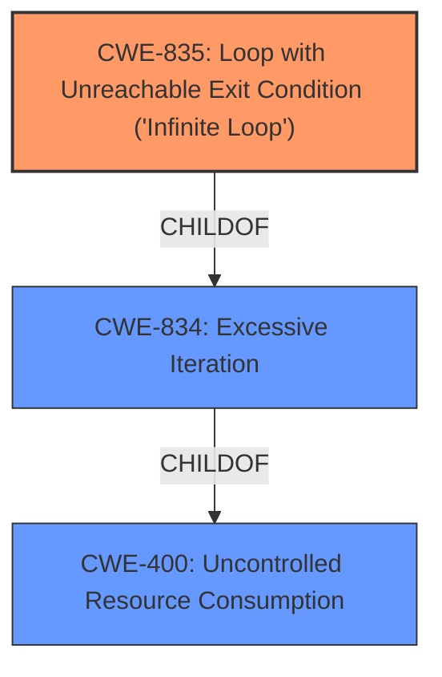

# Raw Analyzer Response for CVE-2021-21565

# Summary
| CWE ID | CWE Name | Confidence | CWE Abstraction Level | CWE Vulnerability Mapping Label | CWE-Vulnerability Mapping Notes |
|---|---|---|---|---|---|
| CWE-835 | Loop with Unreachable Exit Condition ('Infinite Loop') | 0.8 | Base | Allowed | Primary CWE |
| CWE-400 | Uncontrolled Resource Consumption | 0.6 | Class | Discouraged | Secondary Candidate |
| CWE-834 | Excessive Iteration | 0.6 | Class | Discouraged | Secondary Candidate |

## Evidence and Confidence

*   **Confidence Score:** 0.8
*   **Evidence Strength:** HIGH

## Relationship Analysis
The primary relationship that influenced the decision was the parent-child relationship between CWE-834 (Excessive Iteration) and CWE-835 (Loop with Unreachable Exit Condition). Given the vulnerability description explicitly mentions a "loop" and the root cause being an "error condition that may be triggered to loop", CWE-835 is a more specific and accurate representation of the weakness. While CWE-400 (Uncontrolled Resource Consumption) is also relevant due to the DoS impact, it is a higher-level class.

## Vulnerability Chain
The vulnerability chain starts with an **error condition** in the SmartConnect component, which leads to an **infinite loop**, resulting in **excessive CPU consumption** and ultimately a **Denial of Service (DoS)**.
  - Root Cause: **Error condition that may be triggered to loop**
  - Weakness: CWE-835 Loop with Unreachable Exit Condition ('Infinite Loop')
  - Impact: Denial of Service

## Summary of Analysis
The initial analysis considered CWE-400 due to the Denial of Service impact, as well as the "Top CWEs" from similar CVE descriptions. However, after a deeper examination of the vulnerability description and the retriever results, it became clear that the core weakness is the **error condition that may be triggered to loop**. This aligns more directly with CWE-835 (Loop with Unreachable Exit Condition ('Infinite Loop')), which is a more specific "Base" level CWE than the Class-level CWE-400. The decision is heavily based on the provided evidence, specifically the "Vulnerability Description Key Phrases" which identify the **loop** as the primary weakness.

The selection of CWE-835 is at the optimal level of specificity because it directly addresses the **root cause** of the vulnerability, namely the presence of an infinite loop. While other CWEs like CWE-400 and CWE-834 are related, they are either too general (CWE-400) or represent a broader category (CWE-834) that doesn't fully capture the specific nature of the "infinite loop" vulnerability.

Relevant CWE Information:

# Enhanced Context (25 CWEs)

## CWE-404: Improper Resource Shutdown or Release
**Abstraction Level**: Class
**Similarity Score**: 0.76
**Source**: dense

**Description**:
The product does not release or incorrectly releases a resource before it is made available for re-use.

**Mapping Guidance**:
- Usage: Allowed-with-Review
- Rationale: This CWE entry is a Class and might have Base-level children that would be more appropriate

*Not Selected:* This CWE is not applicable because the vulnerability is due to an infinite loop, not a resource leak.

## CWE-668: Exposure of Resource to Wrong Sphere
**Abstraction Level**: Class
**Similarity Score**: 0.76
**Source**: dense

**Description**:
The product exposes a resource to the wrong control sphere, providing unintended actors with inappropriate access to the resource.

**Mapping Guidance**:
- Usage: Discouraged
- Rationale: CWE-668 is high-level and is often misused as a catch-all when lower-level CWE IDs might be applicable. It is sometimes used for low-information vulnerability reports [REF-1287]. It is a level-1 Class (i.e., a child of a Pillar). It is not useful for trend analysis.

*Not Selected:* This CWE is not applicable because the vulnerability is not about exposing resources to the wrong sphere.

## CWE-667: Improper Locking
**Abstraction Level**: Class
**Similarity Score**: 0.76
**Source**: dense

**Description**:
The product does not properly acquire or release a lock on a resource, leading to unexpected resource state changes and behaviors.

**Mapping Guidance**:
- Usage: Allowed-with-Review
- Rationale: This CWE entry is a Class and might have Base-level children that would be more appropriate

*Not Selected:* This CWE is not applicable because the vulnerability is due to an infinite loop, not a locking issue.

## CWE-226: Sensitive Information in Resource Not Removed Before Reuse
**Abstraction Level**: Base
**Similarity Score**: 0.76
**Source**: dense

**Description**:
The product releases a resource such as memory or a file so that it can be made available for reuse, but it does not clear or "zeroize" the information contained in the resource before the product performs a critical state transition or makes the resource available for reuse by other entities.

**Mapping Guidance**:
- Usage: Allowed
- Rationale: This CWE entry is at the Base level of abstraction, which is a preferred level of abstraction for mapping to the root causes of vulnerabilities.

*Not Selected:* This CWE is not applicable because the vulnerability is not about sensitive information remaining in resources.

## CWE-664: Improper Control of a Resource Through its Lifetime
**Abstraction Level**: Pillar
**Similarity Score**: 0.75
**Source**: dense

**Description**:
The product does not maintain or incorrectly maintains control over a resource throughout its lifetime of creation, use, and release.

**Mapping Guidance**:
- Usage: Discouraged
- Rationale: This CWE entry is high-level when lower-level children are available.

*Not Selected:* This CWE is too high-level and CWE-835 is a better fit.

## CWE-41: Improper Resolution of Path Equivalence
**Abstraction Level**: Base
**Similarity Score**: 0.75
**Source**: dense

**Description**:
The product is vulnerable to file system contents disclosure through path equivalence. Path equivalence involves the use of special characters in file and directory names. The associated manipulations are intended to generate multiple names for the same object.

**Mapping Guidance**:
- Usage: Allowed
- Rationale: This CWE entry is at the Base level of abstraction, which is a preferred level of abstraction for mapping to the root causes of vulnerabilities.

*Not Selected:* This CWE is not applicable because the vulnerability is not about file system path equivalence.

## CWE-754: Improper Check for Unusual or Exceptional Conditions
**Abstraction Level**: Class
**Similarity Score**: 0.74
**Source**: dense

**Description**:
The product does not check or incorrectly checks for unusual or exceptional conditions that are not expected to occur frequently during day to day operation of the product.

**Mapping Guidance**:
- Usage: Allowed-with-Review
- Rationale: This CWE entry is a Class and might have Base-level children that would be more appropriate

*Not Selected:* While the vulnerability involves an "error condition," CWE-835 is a more precise description of the issue (the resultant loop).

## CWE-755: Improper Handling of Exceptional Conditions
**Abstraction Level**: Class
**Similarity Score**: 0.74
**Source**: dense

**Description**:
The product does not handle or incorrectly handles an exceptional condition.

**Mapping Guidance**:
- Usage: Discouraged
- Rationale: This CWE entry is a level-1 Class (i.e., a child of a Pillar). It might have lower-level children that would be more appropriate

*Not Selected:* Similar to CWE-754, CWE-835 provides a more specific classification.

## CWE-653: Improper Isolation or Compartmentalization
**Abstraction Level**: Class
**Similarity Score**: 0.74
**Source**: dense

**Description**:
The product does not properly compartmentalize or isolate functionality, processes, or resources that require different privilege levels, rights, or permissions.

**Mapping Guidance**:
- Usage: Allowed
- Rationale: This CWE entry is at the Base level of abstraction, which is a preferred level of abstraction for mapping to the root causes of vulnerabilities.

*Not Selected:* This CWE is not applicable because the vulnerability is not about isolation or compartmentalization issues.

## CWE-799: Improper