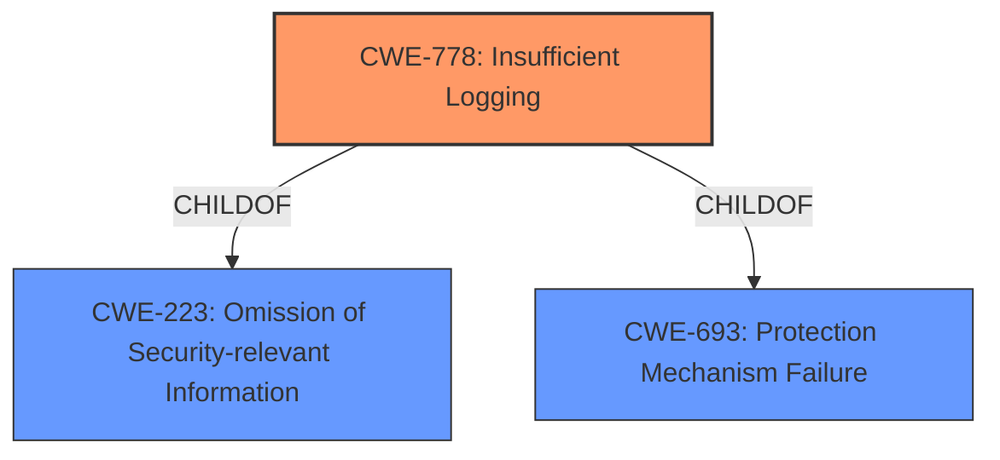

# Analysis Report for CVE-2021-21568

# Vulnerability Analysis Report: CVE-2021-21568

## Description


## Analysis (with Relationship Data)

# Summary
| CWE ID | CWE Name | Confidence | CWE Abstraction Level | CWE Vulnerability Mapping Label | CWE-Vulnerability Mapping Notes |
|---|---|---|---|---|---|
| CWE-778 | Insufficient Logging | 1.0 | Base | Allowed | Primary CWE |

## Evidence and Confidence

*   **Confidence Score:** 1.0
*   **Evidence Strength:** HIGH

## Relationship Analysis
The primary relationship considered was the ChildOf relationship, specifically how CWE-778 is a child of CWE-223 and CWE-693. While these parent CWEs provide a broader context, CWE-778 directly addresses the **insufficient logging** issue described in the vulnerability. The base abstraction level of CWE-778 is appropriate, providing a specific and actionable classification.



## Vulnerability Chain
The vulnerability chain starts with the **insufficient logging**, which results in un-audited and un-trackable configuration changes. The root cause is the lack of proper logging mechanisms.

## Summary of Analysis
The analysis is based on the provided evidence, specifically the vulnerability description, key phrases, and CVE reference summary, all of which point to **insufficient logging** as the root cause.

The vulnerability description states: "Dell EMC PowerScale OneFS versions 8.2.x - 9.2.x contain an **insufficient logging** vulnerability. An authenticated user with ISI_PRIV_LOGIN_PAPI could make un-audited and un-trackable configuration changes to settings that their roles have privileges to change."

The "Vulnerability Description Key Phrases" section explicitly identifies "**insufficient logging**" as the root cause. The CVE Reference Links Content Summary confirms this by stating the root cause as "**Insufficient logging** of configuration changes."

The Retriever Results also supports this, with CWE-778, Insufficient Logging, being the top combined result.

CWE-778 is at the optimal level of specificity because it directly addresses the **insufficient logging** weakness that allows authenticated users to make un-audited and un-trackable configuration changes. The MITRE mapping guidance allows for this CWE, as it's a Base level of abstraction.

CWE-280, Improper Handling of Insufficient Permissions or Privileges, was considered, but it is not as directly relevant as CWE-778. While the vulnerability involves an authenticated user with specific privileges, the core issue is the lack of logging, not the improper handling of permissions.

CWE-532, Insertion of Sensitive Information into Log File, was also considered, but it's not applicable since the problem is the lack of logging, not the insertion of sensitive data into logs.


## CWE Relationship Analysis

Current CWEs represent these abstraction levels: .


### Vulnerability Chain Analysis

**Chain starting from CWE-778:**
- 778 (Insufficient Logging) - ROOT


**Chain starting from CWE-532:**
- 532 (Insertion of Sensitive Information into Log File) - ROOT


### CWE Relationship Diagram

```mermaid
graph TD
    classDef primary fill:#f96,stroke:#333,stroke-width:2px
    classDef secondary fill:#69f,stroke:#333
    classDef tertiary fill:#9e9,stroke:#333
```


*Report generated on 2025-04-01 21:58:00*
