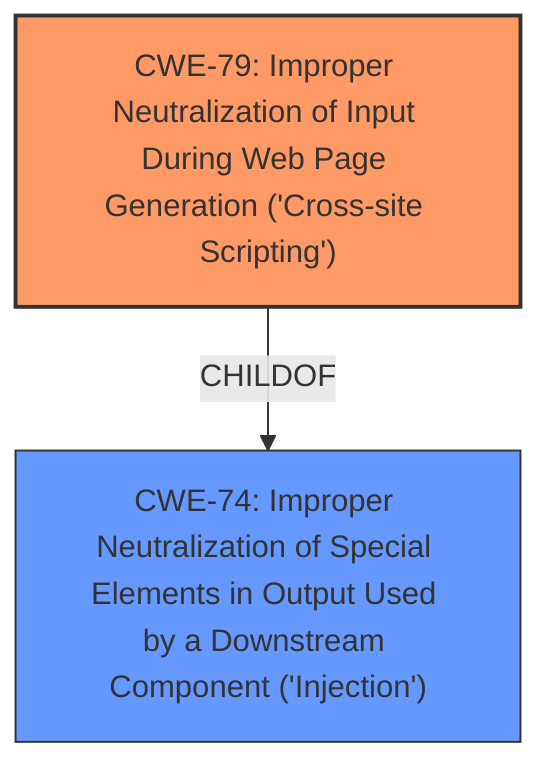

# Enhanced Analysis for CVE-2021-21580

# Summary
| CWE ID | CWE Name | Confidence | CWE Abstraction Level | CWE Vulnerability Mapping Label | CWE-Vulnerability Mapping Notes |
|---|---|---|---|---|---|
| CWE-79 | Improper Neutralization of Input During Web Page Generation ('Cross-site Scripting') | 0.9 | Base | Allowed | Primary CWE |
| CWE-74 | Improper Neutralization of Special Elements in Output Used by a Downstream Component ('Injection') | 0.6 | Class | Discouraged | Secondary Candidate |

## Evidence and Confidence

*   **Confidence Score:** 0.8
*   **Evidence Strength:** HIGH

## Relationship Analysis
The primary relationship influencing the decision is that CWE-79 is a child of CWE-74. The choice between them depends on the specificity of the vulnerability. CWE-79 is chosen because the vulnerability specifically involves the generation of a web page, thus narrowing down the broader category of injection flaws.



## Vulnerability Chain
The chain starts with a malicious URL injecting text. This leads to **Content spoofing / Text injection** due to **improper neutralization** of the injected text. The final impact is phishing users into believing that the message is legitimate.

## Summary of Analysis
The initial analysis focused on identifying the root cause of the vulnerability, which is **content spoofing/text injection** via a malicious URL. The evidence from the vulnerability description states: "Dell EMC iDRAC8 versions prior to 2.80.80.80 & Dell EMC iDRAC9 versions prior to 5.00.00.00 contain a **Content spoofing / Text injection**, where a malicious URL can inject text to present a customized message on the application that can phish users into believing that the message is legitimate."

The retriever results suggested several CWEs, including CWE-74 (Improper Neutralization of Special Elements in Output Used by a Downstream Component ('Injection')) and CWE-79 (Improper Neutralization of Input During Web Page Generation ('Cross-site Scripting')).

CWE-74 is a broader class of injection vulnerabilities. However, the vulnerability description specifically mentions that the injected text is used to present a customized message on the *application*, implying a web page context. Therefore, CWE-79, which is a child of CWE-74, is a more specific and accurate representation of the vulnerability.

CWE-79 directly addresses the scenario where user-controllable input is not properly neutralized before being placed in output that is used as a web page. This aligns perfectly with the vulnerability description, where a malicious URL injects text that is then displayed on the application, potentially misleading users.

The decision to select CWE-79 is based on the evidence provided in the vulnerability description and the hierarchical relationship between CWE-74 and CWE-79. CWE-79 is at the optimal level of specificity because it accurately captures the web page context of the injection vulnerability, making it the most appropriate classification.

Relevant CWE Information:

# Enhanced Context (25 CWEs)

## CWE-74: Improper Neutralization of Special Elements in Output Used by a Downstream Component ('Injection')
**Abstraction Level**: Class
**Similarity Score**: 0.78
**Source**: dense

**Description**:
The product constructs all or part of a command, data structure, or record using externally-influenced input from an upstream component, but it does not neutralize or incorrectly neutralizes special elements that could modify how it is parsed or interpreted when it is sent to a downstream component.

**Mapping Guidance**:
- Usage: Discouraged
- Rationale: CWE-74 is high-level and often misused when lower-level weaknesses are more appropriate.

## CWE-79: Improper Neutralization of Input During Web Page Generation ('Cross-site Scripting')
**Abstraction Level**: Base
**Similarity Score**: 7396.77
**Source**: sparse

**Description**:
The product does not neutralize or incorrectly neutralizes user-controllable input before it is placed in output that is used as a web page that is served to other users.

**Mapping Guidance**:
- Usage: Allowed
- Rationale: This CWE entry is at the Base level of abstraction, which is a preferred level of abstraction for mapping to the root causes of vulnerabilities.


## CWE Relationship Analysis

Current CWEs represent these abstraction levels: .


### Vulnerability Chain Analysis

**Chain starting from CWE-79:**
- 79 (Improper Neutralization of Input During Web Page Generation ('Cross-site Scripting')) - ROOT


**Chain starting from CWE-74:**
- 74 (Improper Neutralization of Special Elements in Output Used by a Downstream Component ('Injection')) - ROOT


### CWE Relationship Diagram

```mermaid
graph TD
    classDef primary fill:#f96,stroke:#333,stroke-width:2px
    classDef secondary fill:#69f,stroke:#333
    classDef tertiary fill:#9e9,stroke:#333
```