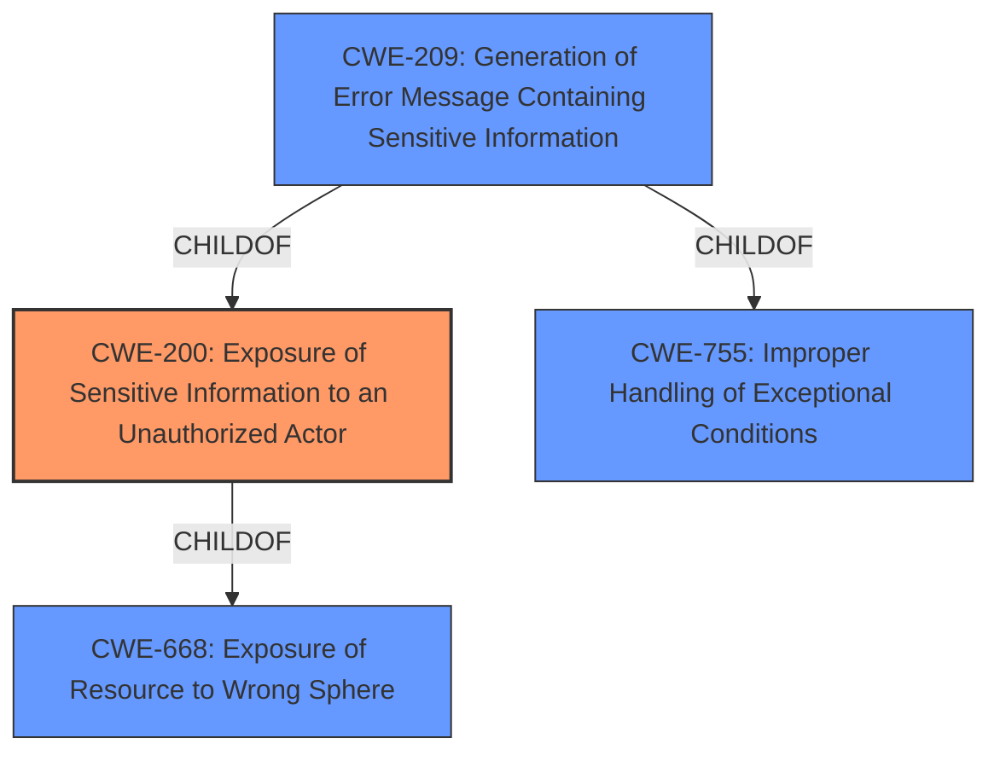

# Analysis Report for CVE-2021-21587

# Vulnerability Analysis Report: CVE-2021-21587

## Description


## Analysis (with Relationship Data)

# Summary
| CWE ID | CWE Name | Confidence | CWE Abstraction Level | CWE Vulnerability Mapping Label | CWE-Vulnerability Mapping Notes |
|---|---|---|---|---|---|
| **CWE-200** | **Exposure of Sensitive Information to an Unauthorized Actor** | 0.9 | Class | Primary | Discouraged |
| CWE-209 | Generation of Error Message Containing Sensitive Information | 0.7 | Base | Secondary | Allowed |

## Evidence and Confidence

*   **Confidence Score:** 0.9
*   **Evidence Strength:** HIGH

## Relationship Analysis
The primary CWE selected is CWE-200, which has a ChildOf relationship to CWE-668. CWE-209 is also considered since the vulnerability involves the generation of error messages containing sensitive information. The vulnerability results in the exposure of sensitive information (full path), making CWE-200 a reasonable fit despite being a Class-level CWE. The relationship between CWE-209 and CWE-200 is that CWE-209 can be a more specific instance of CWE-200.



## Vulnerability Chain
The chain of events is as follows:
1.  A full path disclosure vulnerability exists.
2.  A local unauthenticated attacker exploits this vulnerability.
3.  The attacker obtains the path of files and folders.
The root cause is the **full path disclosure vulnerability**, leading to the impact of **exposing sensitive information**.

## Summary of Analysis
Initially, several CWEs were considered, including CWE-22, CWE-23, CWE-73, and CWE-209, due to the "path" component in the vulnerability description ("full path disclosure"). However, after analyzing the vulnerability description and the CVE Reference Links Content Summary, the core issue is the **exposure of sensitive information**, specifically the full path of files and folders.
The vulnerability description clearly states a "**full path disclosure** vulnerability" in Dell Wyse Management Suite, allowing a local unauthenticated attacker to "**obtain the path of files and folders**".
The CVE Reference Links Content Summary reinforces this by stating: "**Root cause of vulnerability**: The Dell Wyse Management Suite versions 3.2 and earlier have a **full path disclosure vulnerability**." and "**Weaknesses/vulnerabilities present**: Full Path Disclosure (FPD)." and "**Impact of exploitation**: A local, unauthenticated attacker can **obtain the path of files and folders**."

Given that the **root cause** is the **disclosure of sensitive information** (full path), CWE-200 (Exposure of Sensitive Information to an Unauthorized Actor) is the most appropriate primary CWE. Although CWE-200 is a Class-level CWE and is discouraged, the vulnerability's core characteristic aligns with its description.
CWE-209 (Generation of Error Message Containing Sensitive Information) is considered as a secondary CWE since full path disclosure often occurs through error messages. However, without explicit information about error messages, it is a less confident match than CWE-200.

The selected CWEs are at an appropriate level of specificity, reflecting the nature of the vulnerability based on the available evidence.


## CWE Relationship Analysis

Current CWEs represent these abstraction levels: .


### Vulnerability Chain Analysis

**Chain starting from CWE-73:**
- 73 (External Control of File Name or Path) - ROOT


**Chain starting from CWE-200:**
- 200 (Exposure of Sensitive Information to an Unauthorized Actor) - ROOT


### CWE Relationship Diagram

```mermaid
graph TD
    classDef primary fill:#f96,stroke:#333,stroke-width:2px
    classDef secondary fill:#69f,stroke:#333
    classDef tertiary fill:#9e9,stroke:#333
```


*Report generated on 2025-04-01 23:11:04*
