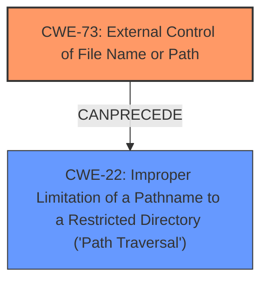

# Enhanced Analysis for CVE-2021-21605

# Summary
| CWE ID | CWE Name | Confidence | CWE Abstraction Level | CWE Vulnerability Mapping Label | CWE-Vulnerability Mapping Notes |
|---|---|---|---|---|---|
| CWE-73 | External Control of File Name or Path | 0.9 | Base | Allowed | Primary CWE |
| CWE-22 | Improper Limitation of a Pathname to a Restricted Directory ('Path Traversal') | 0.8 | Base | Allowed | Secondary Candidate |

## Evidence and Confidence

*   **Confidence Score:** 0.9
*   **Evidence Strength:** HIGH

## Relationship Analysis
The primary CWE identified is CWE-73 **[External Control of File Name or Path]**, which is a Base level CWE. The vulnerability description indicates that users with Agent/Configure permission can choose agent names that cause Jenkins to override the global `config.xml` file, directly aligning with the concept of external control over file paths.

CWE-22 **[Improper Limitation of a Pathname to a Restricted Directory ('Path Traversal')]** is considered as a secondary CWE because the CVE description mentions that the vulnerability allows for path traversal by including characters in the agent name that could lead to overwriting the global `config.xml` file.

The relationship between CWE-73 and CWE-22 is that CWE-73 can precede CWE-22. This means that external control of a file name or path (CWE-73) can lead to path traversal (CWE-22) if proper validation is not performed.



## Vulnerability Chain
The vulnerability chain starts with the **[External Control of File Name or Path]** (CWE-73), followed by **[Improper Limitation of a Pathname to a Restricted Directory ('Path Traversal')]** (CWE-22), leading to the impact of overriding the global `config.xml` file.
1.  **Root Cause:** The root cause is the **inadequate validation** of agent names, allowing external control over file paths (CWE-73).
2.  **Weakness:** Path traversal vulnerability (CWE-22).
3.  **Impact:** Overwriting of the global `config.xml` file.

## Summary of Analysis
The initial assessment identified CWE-73 **[External Control of File Name or Path]** as the primary weakness due to the vulnerability stemming from insufficient validation of agent names, allowing users to control the file path. The CVE summary explicitly mentions this **external control**, stating that users with Agent/Configure permission can choose agent names that cause Jenkins to override the global `config.xml` file.

The inclusion of CWE-22 **[Improper Limitation of a Pathname to a Restricted Directory ('Path Traversal')]** is justified because the CVE summary notes that the vulnerability allows for **path traversal** by including characters in the agent name. This is a direct consequence of the **improper** handling of pathnames.

The final decision is based on the provided evidence, specifically the CVE Reference Links Content Summary, which explicitly mentions both external control of file names and path traversal. The graph relationship analysis further supports this decision, as CWE-73 can precede CWE-22.

The selected CWEs are at the optimal level of specificity because they directly address the root cause and the immediate consequence of the vulnerability. CWE-73 is a Base level CWE, which is preferred for mapping root causes, and CWE-22 is also a Base level CWE that accurately describes the path traversal aspect of the vulnerability.

Relevant CWE Information:
- **CWE-73 [External Control of File Name or Path]**: This CWE is selected because the vulnerability allows users to control the file path through agent names. The description of CWE-73 states, "The product allows user input to control or influence paths or file names that are used in filesystem operations," which perfectly matches the vulnerability.
- **CWE-22 [Improper Limitation of a Pathname to a Restricted Directory ('Path Traversal')]**: This CWE is selected because the vulnerability allows for path traversal, which is a direct consequence of the external control of file names. The description of CWE-22 states, "The product uses external input to construct a pathname...but the product does not properly neutralize special elements within the pathname that can cause the pathname to resolve to a location that is outside of the restricted directory," which aligns with the path traversal aspect of the vulnerability.

CWEs considered but not used:
- CWE-863 **[Incorrect Authorization]** was considered because the vulnerability requires "Agent/Configure" permission, but the core issue is not an authorization flaw but rather the **lack of validation** of agent names leading to path traversal.
- CWE-276 **[Incorrect Default Permissions]** was not selected because the vulnerability is not directly related to default file permissions but rather the **inadequate validation** of agent names.


## CWE Relationship Analysis

Current CWEs represent these abstraction levels: .


### Vulnerability Chain Analysis

**Chain starting from CWE-22:**
- 22 (Improper Limitation of a Pathname to a Restricted Directory ('Path Traversal')) - ROOT


**Chain starting from CWE-276:**
- 276 (Incorrect Default Permissions) - ROOT


### CWE Relationship Diagram

```mermaid
graph TD
    classDef primary fill:#f96,stroke:#333,stroke-width:2px
    classDef secondary fill:#69f,stroke:#333
    classDef tertiary fill:#9e9,stroke:#333
```