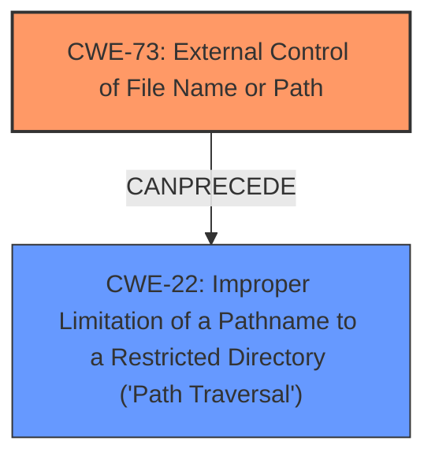

# Analysis for CVE-2021-21605

# Summary
| CWE ID | CWE Name | Confidence | CWE Abstraction Level | CWE Vulnerability Mapping Label | CWE-Vulnerability Mapping Notes |
|---|---|---|---|---|---|
| CWE-73 | External Control of File Name or Path | 0.9 | Base | Allowed | Primary CWE |
| CWE-22 | Improper Limitation of a Pathname to a Restricted Directory ('Path Traversal') | 0.8 | Base | Allowed | Secondary Candidate |

## Evidence and Confidence

*   **Confidence Score:** 0.9
*   **Evidence Strength:** HIGH

## Relationship Analysis
The primary CWE identified is CWE-73 **[External Control of File Name or Path]**, which is a Base level CWE. The vulnerability description indicates that users with Agent/Configure permission can choose agent names that cause Jenkins to override the global `config.xml` file, directly aligning with the concept of external control over file paths.

CWE-22 **[Improper Limitation of a Pathname to a Restricted Directory ('Path Traversal')]** is considered as a secondary CWE because the CVE description mentions that the vulnerability allows for path traversal by including characters in the agent name that could lead to overwriting the global `config.xml` file.

The relationship between CWE-73 and CWE-22 is that CWE-73 can precede CWE-22. This means that external control of a file name or path (CWE-73) can lead to path traversal (CWE-22) if proper validation is not performed.



## Vulnerability Chain
The vulnerability chain starts with the **[External Control of File Name or Path]** (CWE-73), followed by **[Improper Limitation of a Pathname to a Restricted Directory ('Path Traversal')]** (CWE-22), leading to the impact of overriding the global `config.xml` file.
1.  **Root Cause:** The root cause is the **inadequate validation** of agent names, allowing external control over file paths (CWE-73).
2.  **Weakness:** Path traversal vulnerability (CWE-22).
3.  **Impact:** Overwriting of the global `config.xml` file.

## Summary of Analysis
The initial assessment identified CWE-73 **[External Control of File Name or Path]** as the primary weakness due to the vulnerability stemming from insufficient validation of agent names, allowing users to control the file path. The CVE summary explicitly mentions this **external control**, stating that users with Agent/Configure permission can choose agent names that cause Jenkins to override the global `config.xml` file.

The inclusion of CWE-22 **[Improper Limitation of a Pathname to a Restricted Directory ('Path Traversal')]** is justified because the CVE summary notes that the vulnerability allows for **path traversal** by including characters in the agent name. This is a direct consequence of the **improper** handling of pathnames.

The final decision is based on the provided evidence, specifically the CVE Reference Links Content Summary, which explicitly mentions both external control of file names and path traversal. The graph relationship analysis further supports this decision, as CWE-73 can precede CWE-22.

The selected CWEs are at the optimal level of specificity because they directly address the root cause and the immediate consequence of the vulnerability. CWE-73 is a Base level CWE, which is preferred for mapping root causes, and CWE-22 is also a Base level CWE that accurately describes the path traversal aspect of the vulnerability.

Relevant CWE Information:
- **CWE-73 [External Control of File Name or Path]**: This CWE is selected because the vulnerability allows users to control the file path through agent names. The description of CWE-73 states, "The product allows user input to control or influence paths or file names that are used in filesystem operations," which perfectly matches the vulnerability.
- **CWE-22 [Improper Limitation of a Pathname to a Restricted Directory ('Path Traversal')]**: This CWE is selected because the vulnerability allows for path traversal, which is a direct consequence of the external control of file names. The description of CWE-22 states, "The product uses external input to construct a pathname...but the product does not properly neutralize special elements within the pathname that can cause the pathname to resolve to a location that is outside of the restricted directory," which aligns with the path traversal aspect of the vulnerability.

CWEs considered but not used:
- CWE-863 **[Incorrect Authorization]** was considered because the vulnerability requires "Agent/Configure" permission, but the core issue is not an authorization flaw but rather the **lack of validation** of agent names leading to path traversal.
- CWE-276 **[Incorrect Default Permissions]** was not selected because the vulnerability is not directly related to default file permissions but rather the **inadequate validation** of agent names.

# Enhanced Query for CVE-2021-21605

## Vulnerability Description
Jenkins 2.274 and earlier, LTS 2.263.1 and earlier allows users with Agent/Configure permission to choose agent names that cause Jenkins to override the global `config.xml` file.

### Vulnerability Description Key Phrases
- **impact:** override global config.xml file
- **vector:** choosing agent names
- **attacker:** users with Agent/Configure permission
- **product:** Jenkins
- **version:** 2.274 and earlier, LTS 2.263.1 and earlier

## CVE Reference Links Content Summary
The provided content is related to CVE-2021-21605.

**Root cause of vulnerability:**
The vulnerability stems from insufficient validation of agent names, allowing users with Agent/Configure permission to choose agent names that can cause Jenkins to override unrelated `config.xml` files. Specifically, the vulnerability allows for path traversal by including characters in the agent name that could lead to the overwriting of the global `config.xml` file.

**Weaknesses/vulnerabilities present:**
- Path traversal vulnerability via agent names.
- Inadequate validation of user-provided agent names.

**Impact of exploitation:**
- Overwriting of the global `config.xml` file.
- Jenkins restarting with unsafe legacy defaults after a restart.

**Attack vectors:**
- Attackers must have Agent/Configure permission.
- Attackers can inject malicious agent names through the Jenkins UI or API.

**Required attacker capabilities/position:**
- Attacker must have "Agent/Configure" permissions in Jenkins.
- The attacker needs to be able to manipulate or specify the agent name.

## Retriever Results

### Top Combined Results

| Rank | CWE ID | Name | Abstraction | Usage  | Retrievers | Individual Scores |
|------|--------|------|-------------|-------|------------|-------------------|
| 1 | 256 | Plaintext Storage of a Password | Base | Allowed | sparse | 0.078 |
| 2 | 522 | Insufficiently Protected Credentials | Class | Allowed-with-Review | sparse | 0.069 |
| 3 | 862 | Missing Authorization | Class | Allowed-with-Review | sparse | 0.064 |
| 4 | 538 | Insertion of Sensitive Information into Externally-Accessible File or Directory | Base | Allowed | sparse | 0.064 |
| 5 | 260 | Password in Configuration File | Base | Allowed | sparse | 0.062 |
| 6 | 276 | Incorrect Default Permissions | Base | Allowed | dense | 0.331 |
| 7 | 379 | Creation of Temporary File in Directory with Insecure Permissions | Base | Allowed | graph | 0.001 |
| 8 | 863 | Incorrect Authorization | Class | Allowed-with-Review | sparse | 0.057 |
| 9 | 73 | External Control of File Name or Path | Base | Allowed | sparse | 0.055 |
| 10 | 838 | Inappropriate Encoding for Output Context | Base | Allowed | sparse | 0.052 |


# Complete CWE Specifications


## CWE-256: Plaintext Storage of a Password
**Abstraction:** Base
**Status:** Incomplete

### Description
Storing a password in plaintext may result in a system compromise.

### Extended Description
Password management issues occur when a password is stored in plaintext in an application's properties, configuration file, or memory. Storing a plaintext password in a configuration file allows anyone who can read the file access to the password-protected resource. In some contexts, even storage of a plaintext password in memory is considered a security risk if the password is not cleared immediately after it is used.

### Alternative Terms
None

### Relationships
ChildOf -> CWE-522

### Mapping Guidance
**Usage:** Allowed
**Rationale:** This CWE entry is at the Base level of abstraction, which is a preferred level of abstraction for mapping to the root causes of vulnerabilities.
**Comments:** Carefully read both the name and description to ensure that this mapping is an appropriate fit. Do not try to 'force' a mapping to a lower-level Base/Variant simply to comply with this preferred level of abstraction.
**Reasons:**
- Acceptable-Use


### Observed Examples
- **CVE-2022-30275:** Remote Terminal Unit (RTU) uses a driver that relies on a password stored in plaintext.


## CWE-522: Insufficiently Protected Credentials
**Abstraction:** Class
**Status:** Incomplete

### Description
The product transmits or stores authentication credentials, but it uses an insecure method that is susceptible to unauthorized interception and/or retrieval.

### Extended Description
Not provided

### Alternative Terms
None

### Relationships
ChildOf -> CWE-1390
ChildOf -> CWE-287
ChildOf -> CWE-668

### Mapping Guidance
**Usage:** Allowed-with-Review
**Rationale:** This CWE entry is a Class and might have Base-level children that would be more appropriate
**Comments:** Examine children of this entry to see if there is a better fit
**Reasons:**
- Abstraction


### Observed Examples
- **CVE-2022-30018:** A messaging platform serializes all elements of User/Group objects, making private information available to adversaries
- **CVE-2022-29959:** Initialization file contains credentials that can be decoded using a "simple string transformation"
- **CVE-2022-35411:** Python-based RPC framework enables pickle functionality by default, allowing clients to unpickle untrusted data.


## CWE-862: Missing Authorization
**Abstraction:** Class
**Status:** Incomplete

### Description
The product does not perform an authorization check when an actor attempts to access a resource or perform an action.

### Extended Description
Not provided

### Alternative Terms
AuthZ: "AuthZ" is typically used as an abbreviation of "authorization" within the web application security community. It is distinct from "AuthN" (or, sometimes, "AuthC") which is an abbreviation of "authentication." The use of "Auth" as an abbreviation is discouraged, since it could be used for either authentication or authorization.

### Relationships
ChildOf -> CWE-285
ChildOf -> CWE-284

### Mapping Guidance
**Usage:** Allowed-with-Review
**Rationale:** This CWE entry is a Class and might have Base-level children that would be more appropriate
**Comments:** Examine children of this entry to see if there is a better fit
**Reasons:**
- Abstraction


### Additional Notes
**[Terminology]** Assuming a user with a given identity, authorization is the process of determining whether that user can access a given resource, based on the user's privileges and any permissions or other access-control specifications that apply to the resource.


### Observed Examples
- **CVE-2022-24730:** Go-based continuous deployment product does not check that a user has certain privileges to update or create an app, allowing adversaries to read sensitive repository information
- **CVE-2009-3168:** Web application does not restrict access to admin scripts, allowing authenticated users to reset administrative passwords.
- **CVE-2009-3597:** Web application stores database file under the web root with insufficient access control (CWE-219), allowing direct request.


## CWE-538: Insertion of Sensitive Information into Externally-Accessible File or Directory
**Abstraction:** Base
**Status:** Draft

### Description
The product places sensitive information into files or directories that are accessible to actors who are allowed to have access to the files, but not to the sensitive information.

### Extended Description
Not provided

### Alternative Terms
None

### Relationships
ChildOf -> CWE-200

### Mapping Guidance
**Usage:** Allowed
**Rationale:** This CWE entry is at the Base level of abstraction, which is a preferred level of abstraction for mapping to the root causes of vulnerabilities.
**Comments:** Carefully read both the name and description to ensure that this mapping is an appropriate fit. Do not try to 'force' a mapping to a lower-level Base/Variant simply to comply with this preferred level of abstraction.
**Reasons:**
- Acceptable-Use


### Additional Notes
**[Maintenance]** Depending on usage, this could be a weakness or a category. Further study of all its children is needed, and the entire sub-tree may need to be clarified. The current organization is based primarily on the exposure of sensitive information as a consequence, instead of as a primary weakness.

**[Maintenance]** There is a close relationship with CWE-552, which is more focused on weaknesses. As a result, it may be more appropriate to convert CWE-538 to a category.


### Observed Examples
- **CVE-2018-1999036:** SSH password for private key stored in build log


## CWE-260: Password in Configuration File
**Abstraction:** Base
**Status:** Incomplete

### Description
The product stores a password in a configuration file that might be accessible to actors who do not know the password.

### Extended Description
This can result in compromise of the system for which the password is used. An attacker could gain access to this file and learn the stored password or worse yet, change the password to one of their choosing.

### Alternative Terms
None

### Relationships
ChildOf -> CWE-522

### Mapping Guidance
**Usage:** Allowed
**Rationale:** This CWE entry is at the Base level of abstraction, which is a preferred level of abstraction for mapping to the root causes of vulnerabilities.
**Comments:** Carefully read both the name and description to ensure that this mapping is an appropriate fit. Do not try to 'force' a mapping to a lower-level Base/Variant simply to comply with this preferred level of abstraction.
**Reasons:**
- Acceptable-Use


### Observed Examples
- **CVE-2022-38665:** A continuous delivery pipeline management tool stores an unencypted password in a configuration file.


## CWE-276: Incorrect Default Permissions
**Abstraction:** Base
**Status:** Draft

### Description
During installation, installed file permissions are set to allow anyone to modify those files.

### Extended Description
Not provided

### Alternative Terms
None

### Relationships
ChildOf -> CWE-732
ChildOf -> CWE-732

### Mapping Guidance
**Usage:** Allowed
**Rationale:** This CWE entry is at the Base level of abstraction, which is a preferred level of abstraction for mapping to the root causes of vulnerabilities.
**Comments:** Carefully read both the name and description to ensure that this mapping is an appropriate fit. Do not try to 'force' a mapping to a lower-level Base/Variant simply to comply with this preferred level of abstraction.
**Reasons:**
- Acceptable-Use


### Observed Examples
- **CVE-2005-1941:** Executables installed world-writable.
- **CVE-2002-1713:** Home directories installed world-readable.
- **CVE-2001-1550:** World-writable log files allow information loss; world-readable file has cleartext passwords.


## CWE-379: Creation of Temporary File in Directory with Insecure Permissions
**Abstraction:** Base
**Status:** Incomplete

### Description
The product creates a temporary file in a directory whose permissions allow unintended actors to determine the file's existence or otherwise access that file.

### Extended Description
On some operating systems, the fact that the temporary file exists may be apparent to any user with sufficient privileges to access that directory. Since the file is visible, the application that is using the temporary file could be known. If one has access to list the processes on the system, the attacker has gained information about what the user is doing at that time. By correlating this with the applications the user is running, an attacker could potentially discover what a user's actions are. From this, higher levels of security could be breached.

### Alternative Terms
None

### Relationships
ChildOf -> CWE-377

### Mapping Guidance
**Usage:** Allowed
**Rationale:** This CWE entry is at the Base level of abstraction, which is a preferred level of abstraction for mapping to the root causes of vulnerabilities.
**Comments:** Carefully read both the name and description to ensure that this mapping is an appropriate fit. Do not try to 'force' a mapping to a lower-level Base/Variant simply to comply with this preferred level of abstraction.
**Reasons:**
- Acceptable-Use


### Observed Examples
- **CVE-2022-27818:** A hotkey daemon written in Rust creates a domain socket file underneath /tmp, which is accessible by any user.
- **CVE-2021-21290:** A Java-based application for a rapid-development framework uses File.createTempFile() to create a random temporary file with insecure default permissions.


## CWE-863: Incorrect Authorization
**Abstraction:** Class
**Status:** Incomplete

### Description
The product performs an authorization check when an actor attempts to access a resource or perform an action, but it does not correctly perform the check.

### Extended Description
Not provided

### Alternative Terms
AuthZ: "AuthZ" is typically used as an abbreviation of "authorization" within the web application security community. It is distinct from "AuthN" (or, sometimes, "AuthC") which is an abbreviation of "authentication." The use of "Auth" as an abbreviation is discouraged, since it could be used for either authentication or authorization.

### Relationships
ChildOf -> CWE-285
ChildOf -> CWE-284

### Mapping Guidance
**Usage:** Allowed-with-Review
**Rationale:** This CWE entry is a Class and might have Base-level children that would be more appropriate
**Comments:** Examine children of this entry to see if there is a better fit
**Reasons:**
- Abstraction


### Additional Notes
**[Terminology]** 

Assuming a user with a given identity, authorization is the process of determining whether that user can access a given resource, based on the user's privileges and any permissions or other access-control specifications that apply to the resource.


### Observed Examples
- **CVE-2021-39155:** Chain: A microservice integration and management platform compares the hostname in the HTTP Host header in a case-sensitive way (CWE-178, CWE-1289), allowing bypass of the authorization policy (CWE-863) using a hostname with mixed case or other variations.
- **CVE-2019-15900:** Chain: sscanf() call is used to check if a username and group exists, but the return value of sscanf() call is not checked (CWE-252), causing an uninitialized variable to be checked (CWE-457), returning success to allow authorization bypass for executing a privileged (CWE-863).
- **CVE-2009-2213:** Gateway uses default "Allow" configuration for its authorization settings.


## CWE-73: External Control of File Name or Path
**Abstraction:** Base
**Status:** Draft

### Description
The product allows user input to control or influence paths or file names that are used in filesystem operations.

### Extended Description


This could allow an attacker to access or modify system files or other files that are critical to the application.


Path manipulation errors occur when the following two conditions are met:

```
		1. An attacker can specify a path used in an operation on the filesystem.
		2. By specifying the resource, the attacker gains a capability that would not otherwise be permitted.
```
For example, the program may give the attacker the ability to overwrite the specified file or run with a configuration controlled by the attacker.

### Alternative Terms
None

### Relationships
ChildOf -> CWE-642
ChildOf -> CWE-610
ChildOf -> CWE-20
CanPrecede -> CWE-22
CanPrecede -> CWE-41
CanPrecede -> CWE-98
CanPrecede -> CWE-434
CanPrecede -> CWE-59

### Mapping Guidance
**Usage:** Allowed
**Rationale:** This CWE entry is at the Base level of abstraction, which is a preferred level of abstraction for mapping to the root causes of vulnerabilities.
**Comments:** Carefully read both the name and description to ensure that this mapping is an appropriate fit. Do not try to 'force' a mapping to a lower-level Base/Variant simply to comply with this preferred level of abstraction.
**Reasons:**
- Acceptable-Use


### Additional Notes
**[Maintenance]** CWE-114 is a Class, but it is listed a child of CWE-73 in view 1000. This suggests some abstraction problems that should be resolved in future versions.

**[Relationship]** 

The external control of filenames can be the primary link in chains with other file-related weaknesses, as seen in the CanPrecede relationships. This is because software systems use files for many different purposes: to execute programs, load code libraries, to store application data, to store configuration settings, record temporary data, act as signals or semaphores to other processes, etc.


However, those weaknesses do not always require external control. For example, link-following weaknesses (CWE-59) often involve pathnames that are not controllable by the attacker at all.


The external control can be resultant from other issues. For example, in PHP applications, the register_globals setting can allow an attacker to modify variables that the programmer thought were immutable, enabling file inclusion (CWE-98) and path traversal (CWE-22). Operating with excessive privileges (CWE-250) might allow an attacker to specify an input filename that is not directly readable by the attacker, but is accessible to the privileged program. A buffer overflow (CWE-119) might give an attacker control over nearby memory locations that are related to pathnames, but were not directly modifiable by the attacker.


### Observed Examples
- **CVE-2022-45918:** Chain: a learning management tool debugger uses external input to locate previous session logs (CWE-73) and does not properly validate the given path (CWE-20), allowing for filesystem path traversal using "../" sequences (CWE-24)
- **CVE-2008-5748:** Chain: external control of values for user's desired language and theme enables path traversal.
- **CVE-2008-5764:** Chain: external control of user's target language enables remote file inclusion.


## CWE-838: Inappropriate Encoding for Output Context
**Abstraction:** Base
**Status:** Incomplete

### Description
The product uses or specifies an encoding when generating output to a downstream component, but the specified encoding is not the same as the encoding that is expected by the downstream component.

### Extended Description


This weakness can cause the downstream component to use a decoding method that produces different data than what the product intended to send. When the wrong encoding is used - even if closely related - the downstream component could decode the data incorrectly. This can have security consequences when the provided boundaries between control and data are inadvertently broken, because the resulting data could introduce control characters or special elements that were not sent by the product. The resulting data could then be used to bypass protection mechanisms such as input validation, and enable injection attacks.


While using output encoding is essential for ensuring that communications between components are accurate, the use of the wrong encoding - even if closely related - could cause the downstream component to misinterpret the output.


For example, HTML entity encoding is used for elements in the HTML body of a web page. However, a programmer might use entity encoding when generating output for that is used within an attribute of an HTML tag, which could contain functional Javascript that is not affected by the HTML encoding.


While web applications have received the most attention for this problem, this weakness could potentially apply to any type of product that uses a communications stream that could support multiple encodings.


### Alternative Terms
None

### Relationships
ChildOf -> CWE-116
ChildOf -> CWE-116

### Mapping Guidance
**Usage:** Allowed
**Rationale:** This CWE entry is at the Base level of abstraction, which is a preferred level of abstraction for mapping to the root causes of vulnerabilities.
**Comments:** Carefully read both the name and description to ensure that this mapping is an appropriate fit. Do not try to 'force' a mapping to a lower-level Base/Variant simply to comply with this preferred level of abstraction.
**Reasons:**
- Acceptable-Use


### Observed Examples
- **CVE-2009-2814:** Server does not properly handle requests that do not contain UTF-8 data; browser assumes UTF-8, allowing XSS.

