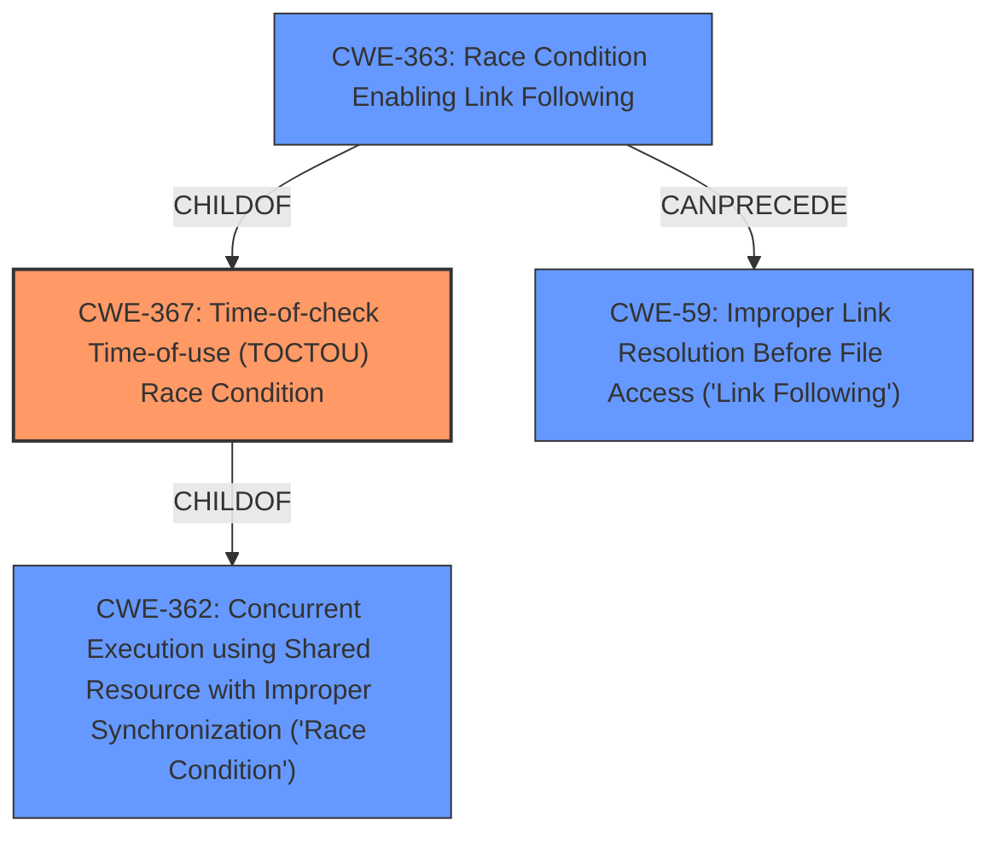

# Analysis for CVE-2021-21615

# Summary
| CWE ID | CWE Name | Confidence | CWE Abstraction Level | CWE Vulnerability Mapping Label | CWE-Vulnerability Mapping Notes |
|---|---|---|---|---|---|
| CWE-367 | Time-of-check Time-of-use (TOCTOU) Race Condition | 1.0 | Base | Allowed | Primary CWE |
| CWE-59 | Improper Link Resolution Before File Access ('Link Following') | 0.7 | Base | Allowed | Secondary Candidate |

## Evidence and Confidence

*   **Confidence Score:** 0.9
*   **Evidence Strength:** HIGH

## Relationship Analysis
The primary CWE selected is CWE-367, which is a Base level CWE. The vulnerability description clearly indicates a Time-of-check Time-of-use (**TOCTOU**) **race condition**. CWE-367 is a child of CWE-362 (Concurrent Execution using Shared Resource with Improper Synchronization ('Race Condition')), but CWE-367 is more specific and accurately represents the weakness. CWE-59 is a possible secondary candidate since the **TOCTOU** condition is related to symbolic links.

## Vulnerability Chain
The vulnerability chain starts with the **TOCTOU race condition** (CWE-367), which allows for the possibility of following symbolic links to read arbitrary files.

## Summary of Analysis
The initial analysis strongly points towards CWE-367 due to the explicit mention of a **TOCTOU race condition**. The CVE Reference Links Content Summary confirms this, stating that the vulnerability is caused by a **TOCTOU race condition** when handling symbolic links. The ability to read arbitrary files is the impact of this vulnerability.

The selection of CWE-367 is based on the following evidence:
*   The vulnerability description explicitly mentions a **TOCTOU race condition**.
*   The CVE Reference Links Content Summary confirms the **TOCTOU race condition** as the root cause.

The retriever results list CWE-367 as the second-best match. The retriever also lists CWE-59 (Improper Link Resolution Before File Access ('Link Following')) and CWE-363 (Race Condition Enabling Link Following), which are related to the use of symbolic links in the attack. Since the root cause is a **TOCTOU race condition**, CWE-367 is chosen as the primary CWE. CWE-59 is added as a secondary candidate to show the impact of the **TOCTOU race condition** which allows symbolic links to be followed.

The final decision is to select CWE-367 as the primary CWE because it accurately captures the root cause of the vulnerability.

# Relevant CWE Information:

# Enhanced Context (25 CWEs)

## CWE-367: Time-of-check Time-of-use (TOCTOU) Race Condition
**Abstraction Level**: Base
**Similarity Score**: 0.79
**Source**: dense

**Description**:
The product checks the state of a resource before using that resource, but the resource's state can change between the check and the use in a way that invalidates the results of the check. This can cause the product to perform invalid actions when the resource is in an unexpected state.

**Mapping Guidance**:
- Usage: Allowed
- Rationale: This CWE entry is at the Base level of abstraction, which is a preferred level of abstraction for mapping to the root causes of vulnerabilities.