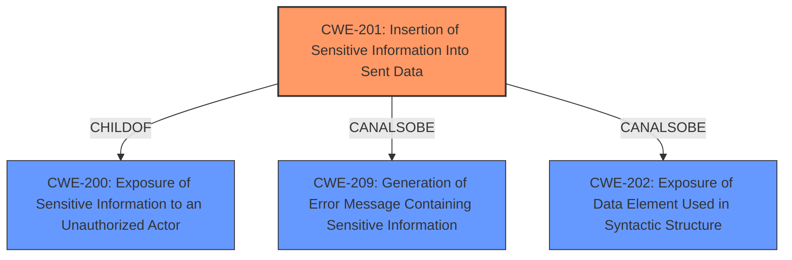

# Analysis for CVE-2021-21621

# Summary
| CWE ID | CWE Name | Confidence | CWE Abstraction Level | CWE Vulnerability Mapping Label | CWE-Vulnerability Mapping Notes |
|---|---|---|---|---|---|
| CWE-201 | Insertion of Sensitive Information Into Sent Data | 1 | Base | Allowed | Primary CWE |

## Evidence and Confidence

*   **Confidence Score:** 1
*   **Evidence Strength:** HIGH

## Relationship Analysis
The primary relationship that impacted my decision was the ChildOf relationship between CWE-201 and CWE-200. While CWE-200 is a broader class, CWE-201 offers a more specific description of the weakness. The CanPrecede and CanFollow relationships of CWE-201 to other CWEs provide context for potential vulnerability chains, but were not directly applicable in this case.

## Vulnerability Chain
The chain of root cause and weaknesses for this vulnerability is relatively simple:
  1. **Root Cause:** **serialized user authentication** included in the support bundle. (CWE-201)
  2. **Impact:** Inclusion of the session ID, which allows an attacker to impersonate the user.

## Summary of Analysis
The initial analysis identified CWE-201 as the most relevant CWE based on the vulnerability description and the provided information. The **rootcause** is the **serialized user authentication**, and the impact is including the session ID, which allows the attacker to impersonate the user.
The "CVE Reference Links Content Summary" confirms this: "The Support Core Plugin includes serialized user authentication information in the support bundle, which can include the session ID of the user who created it."

The selection of CWE-201 is primarily based on the following evidence:
  - Vulnerability Description Key Phrases: "**serialized user authentication**"
  - CVE Reference Links Content Summary: "The Support Core Plugin includes serialized user authentication information in the support bundle, which can include the session ID of the user who created it."

CWE-201 is at the optimal level of specificity because it directly addresses the **insertion of sensitive information** (the serialized user authentication including session ID) into data (the support bundle) that is sent to another actor.

**CWEs Considered But Not Used:**

*   **CWE-863: Incorrect Authorization**: This CWE was considered because the vulnerability involves potentially bypassing authorization by impersonating a user. However, the **root cause** is not an incorrect authorization check, but rather the exposure of sensitive information that *could* lead to authorization bypass. Therefore, CWE-863 is not the primary weakness.
*   **CWE-256: Plaintext Storage of a Password**: This CWE was considered since a session ID can be considered a credential, but it's not a password.
*   **CWE-522: Insufficiently Protected Credentials**: Similar to CWE-256, this could be considered. However, CWE-201 is still more specific, as it addresses how the credentials got exposed.
*   **CWE-306: Missing Authentication for Critical Function**: This is not a missing authentication issue.
*   **CWE-226: Sensitive Information in Resource Not Removed Before Reuse**: While the session ID is sensitive information, this CWE doesn't apply to the insertion of the information, but rather to not removing it from resources.
*   **CWE-359: Exposure of Private Personal Information to an Unauthorized Actor**: This CWE is too general.
*   **CWE-200: Exposure of Sensitive Information to an Unauthorized Actor**: This CWE is a class-level CWE, and CWE-201 is a more specific base-level CWE that accurately describes the vulnerability.
*   **CWE-579: J2EE Bad Practices: Non-serializable Object Stored in Session**: This is too specific to J2EE and does not fit the vulnerability description.