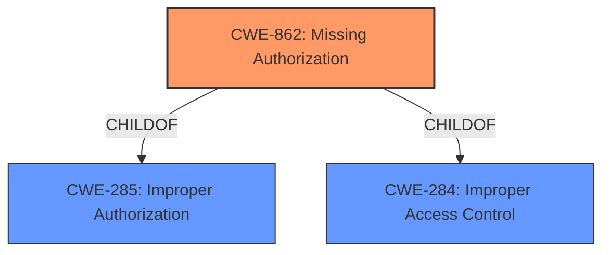

# Analysis Report for CVE-2021-21625

# Vulnerability Analysis Report: CVE-2021-21625

## Description


## Analysis (with Relationship Data)

# Summary
| CWE ID | CWE Name | Confidence | CWE Abstraction Level | CWE Vulnerability Mapping Label | CWE-Vulnerability Mapping Notes |
|---|---|---|---|---|---|
| CWE-862 | Missing Authorization | 1.0 | Class | Allowed-with-Review | Primary CWE |
| CWE-668 | Exposure of Resource to Wrong Sphere | 0.4 | Class | Discouraged | Secondary Candidate |

## Evidence and Confidence

*   **Confidence Score:** 1.0
*   **Evidence Strength:** HIGH

## Relationship Analysis
The primary relationship influencing the decision is the ChildOf relationship between CWE-862 and CWE-285 (Improper Authorization), as well as CWE-863 (Incorrect Authorization). While CWE-285 is a parent, it is discouraged. CWE-862 is also related to CWE-284 (Improper Access Control). The analysis focused on finding the most specific Class-level CWE related to authorization.



## Vulnerability Chain
The vulnerability chain starts with the **missing permission check**, leading to the ability to enumerate credentials IDs.

Missing Authorization -> Enumerate Credentials IDs

## Summary of Analysis
The initial analysis focused on the **missing permission check**, which is a clear indicator of an authorization issue. The "CVE Reference Links Content Summary" explicitly states this. The Retriever results strongly suggest CWE-862 (Missing Authorization) as the primary candidate.

The evidence is strong: "**rootcause:** **missing permission check**" and "The AWS Credentials Plugin did not perform a permission check in a helper method for HTTP endpoints."

CWE-862 is at the Class level, and the MITRE mapping guidance suggests reviewing its children for a better fit. However, none of the children are more appropriate given the available information.

CWE-668 (Exposure of Resource to Wrong Sphere) was considered as a secondary candidate because the enumeration of credentials IDs could be seen as exposing a resource (the credentials) to the wrong sphere. However, the root cause is more directly related to the **missing authorization**, making CWE-862 a stronger fit. CWE-668 is also discouraged.

The final decision is based on the explicit evidence of a **missing permission check**, the high retriever score for CWE-862, and the MITRE mapping guidance for CWE-862.

Relevant CWE Information:

# Enhanced Context (25 CWEs)

## CWE-668: Exposure of Resource to Wrong Sphere
**Abstraction Level**: Class
**Similarity Score**: 0.74
**Source**: dense

**Description**:
The product exposes a resource to the wrong control sphere, providing unintended actors with inappropriate access to the resource.

**Mapping Guidance**:
- Usage: Discouraged
- Rationale: CWE-668 is high-level and is often misused as a catch-all when lower-level CWE IDs might be applicable. It is sometimes used for low-information vulnerability reports [REF-1287]. It is a level-1 Class (i.e., a child of a Pillar). It is not useful for trend analysis.

## CWE-862: Missing Authorization
**Abstraction:** Class
**Status:** Incomplete

### Description
The product does not perform an authorization check when an actor attempts to access a resource or perform an action.

### Extended Description
Not provided

### Alternative Terms
AuthZ: "AuthZ" is typically used as an abbreviation of "authorization" within the web application security community. It is distinct from "AuthN" (or, sometimes, "AuthC") which is an abbreviation of "authentication." The use of "Auth" as an abbreviation is discouraged, since it could be used for either authentication or authorization.

### Relationships
ChildOf -> CWE-285
ChildOf -> CWE-284

### Mapping Guidance
**Usage:** Allowed-with-Review
**Rationale:** This CWE entry is a Class and might have Base-level children that would be more appropriate
**Comments:** Examine children of this entry to see if there is a better fit
**Reasons:**
- Abstraction

### Additional Notes
**[Terminology]** Assuming a user with a given identity, authorization is the process of determining whether that user can access a given resource, based on the user's privileges and any permissions or other access-control specifications that apply to the resource.


## CWE Relationship Analysis

Current CWEs represent these abstraction levels: .


### Vulnerability Chain Analysis

**Chain starting from CWE-862:**
- 862 (Missing Authorization) - ROOT


**Chain starting from CWE-284:**
- 284 (Improper Access Control) - ROOT


### CWE Relationship Diagram

```mermaid
graph TD
    classDef primary fill:#f96,stroke:#333,stroke-width:2px
    classDef secondary fill:#69f,stroke:#333
    classDef tertiary fill:#9e9,stroke:#333
```


*Report generated on 2025-04-02 09:46:01*
