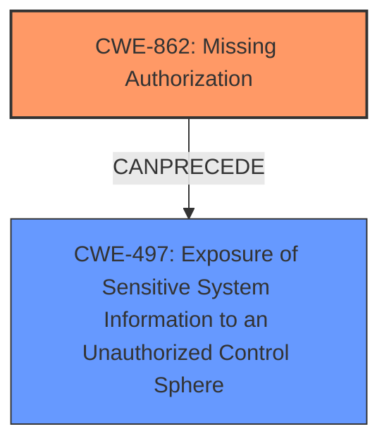

# Enhanced Analysis for CVE-2021-21636

# Summary

| CWE ID | CWE Name | Confidence | CWE Abstraction Level | CWE Vulnerability Mapping Label | CWE-Vulnerability Mapping Notes |
|---|---|---|---|---|---|
| CWE-862 | Missing Authorization | 1.0 | Class | Allowed-with-Review | Primary CWE: The product does not perform an authorization check when an actor attempts to access a resource or perform an action. |
| CWE-497 | Exposure of Sensitive System Information to an Unauthorized Control Sphere | 0.7 | Base | Allowed | Secondary CWE: The product does not properly prevent sensitive system-level information from being accessed by unauthorized actors. |

## Evidence and Confidence

*   **Confidence Score:** 0.9
*   **Evidence Strength:** HIGH

## Relationship Analysis
The primary CWE is CWE-862 **Missing Authorization**, which is a Class-level CWE. It represents a general lack of authorization checking. While it is a class, the evidence strongly supports the **missing permission check**, making it a reasonable choice.
CWE-497 **Exposure of Sensitive System Information to an Unauthorized Control Sphere** is a Base-level CWE. It describes the impact of the missing authorization, specifically, that credential IDs are exposed.



## Vulnerability Chain
The chain of events is as follows:
1.  **Root Cause:** CWE-862 **Missing Authorization** - The plugin lacks a permission check on an HTTP endpoint.
2.  **Impact:** CWE-497 **Exposure of Sensitive System Information to an Unauthorized Control Sphere** - Attackers with Overall/Read permissions can enumerate credential IDs.

## Summary of Analysis
The analysis is based on the provided vulnerability description and supporting CVE details. The key evidence is the "**missing permission check**" which directly aligns with CWE-862. The impact of this **missing permission check** is the ability for attackers to enumerate credentials IDs, aligning with CWE-497 **Exposure of Sensitive System Information to an Unauthorized Control Sphere**.

The relationship graph shows how the **missing authorization** leads to the exposure of sensitive information.

CWE-862 is chosen because it directly represents the root cause. While it is a Class-level CWE, the provided information doesn't allow for a more specific Base or Variant CWE to be selected, however the **missing permission check** is highly indicative of this CWE.

CWE-497 is included as a secondary CWE to highlight the impact of the vulnerability - the exposure of sensitive credential IDs.

Other CWEs Considered:

*   CWE-863 **Incorrect Authorization**: This was considered, but the description clearly states that the authorization check is *missing*, not incorrect.
*   CWE-522 **Insufficiently Protected Credentials**: This was considered but it is more related to storage or transmission of credentials, and in this vulnerability the **missing permission check** enables enumeration of the IDs.
*   CWE-319 **Cleartext Transmission of Sensitive Information**: This CWE relates to transmitting sensitive information in cleartext, which is not the case here. The credentials IDs are being enumerated due to a **missing permission check**.


## CWE Relationship Analysis

Current CWEs represent these abstraction levels: .


### Vulnerability Chain Analysis

**Chain starting from CWE-497:**
- 497 (Exposure of Sensitive System Information to an Unauthorized Control Sphere) - ROOT


**Chain starting from CWE-862:**
- 862 (Missing Authorization) - ROOT


### CWE Relationship Diagram

```mermaid
graph TD
    classDef primary fill:#f96,stroke:#333,stroke-width:2px
    classDef secondary fill:#69f,stroke:#333
    classDef tertiary fill:#9e9,stroke:#333
```