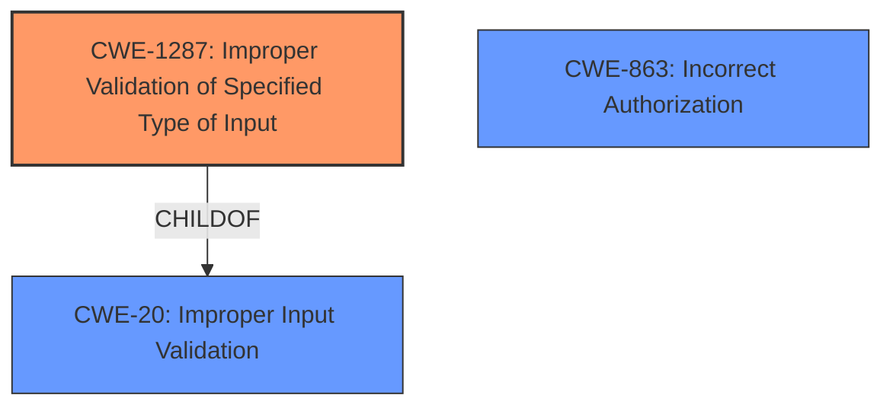

# Analysis for CVE-2021-21639

# Summary
| CWE ID | CWE Name | Confidence | CWE Abstraction Level | CWE Vulnerability Mapping Label | CWE-Vulnerability Mapping Notes |
|---|---|---|---|---|---|
| CWE-1287 | Improper Validation of Specified Type of Input | 0.9 | Base | Primary | Allowed |
| CWE-863 | Incorrect Authorization | 0.6 | Class | Secondary | Allowed-with-Review |

## Evidence and Confidence

*   **Confidence Score:** 0.8
*   **Evidence Strength:** HIGH

## Relationship Analysis
The primary CWE selected is CWE-1287, which is a Base level CWE and a child of CWE-20 (Improper Input Validation). CWE-863 is a Class level CWE that represents an authorization issue. The relationship between CWE-1287 and its parent CWE-20 indicates that the **improper validation** is a specific type of input validation issue. This influences the decision to select the more specific CWE-1287. There is no evidence of a chain relationship since we only have the rootcause.

## Vulnerability Chain
The vulnerability chain consists of the following:
1.  **Root Cause:** **Improper type validation** (CWE-1287) of the object created after loading data.
2.  **Impact:** Replacing a node with one of a different type.

## Summary of Analysis
Initially, the analysis focused on the **improper validation** aspect of the vulnerability. The vulnerability description clearly states that Jenkins **does not validate the type of object created**. The CVE Reference Links Content Summary confirms this, stating "The vulnerability stems from a lack of type validation" and "The core issue is the absence of proper type validation".

CWE-1287 (Improper Validation of Specified Type of Input) aligns perfectly with this description. It is a Base level CWE, which is preferred. The description of CWE-1287, "The product receives input that is expected to be of a certain type, but it does not validate or incorrectly validates that the input is actually of the expected type," directly matches the vulnerability.

CWE-863 (Incorrect Authorization) was considered because the attacker requires "Computer/Configure" permission. However, the root cause is the **missing type validation**, not an authorization flaw. The authorization is a prerequisite for exploiting the vulnerability, not the vulnerability itself.

Therefore, the final decision is to assign CWE-1287 as the primary CWE, with a confidence score of 0.9. The selection is based on direct evidence from the vulnerability description and the alignment of CWE-1287's description with the **root cause** of the vulnerability.

Relevant CWE Information:

# Enhanced Context (25 CWEs)
The following CWEs were identified as potentially relevant to this vulnerability:

## CWE-1289: Improper Validation of Unsafe Equivalence in Input
**Abstraction Level**: Base
**Similarity Score**: 0.81
**Source**: dense

**Description**:
The product receives an input value that is used as a resource identifier or other type of reference, but it does not validate or incorrectly validates that the input is equivalent to a potentially-unsafe value.

**Mapping Guidance**:
- Usage: Allowed
- Rationale: This CWE entry is at the Base level of abstraction, which is a preferred level of abstraction for mapping to the root causes of vulnerabilities.

CWE-1289 was considered but not selected because the vulnerability is not related to equivalence of input to unsafe values but rather type validation.

## CWE-345: Insufficient Verification of Data Authenticity
**Abstraction Level**: Class
**Similarity Score**: 0.78
**Source**: dense

**Description**:
The product does not sufficiently verify the origin or authenticity of data, in a way that causes it to accept invalid data.

**Mapping Guidance**:
- Usage: Discouraged
- Rationale: This CWE entry is a level-1 Class (i.e., a child of a Pillar). It might have lower-level children that would be more appropriate

CWE-345 was considered but not selected because the vulnerability is not related to verifying the authenticity of the data itself.

## CWE-73: External Control of File Name or Path
**Abstraction Level**: Base
**Similarity Score**: 0.78
**Source**: dense

**Description**:
The product allows user input to control or influence paths or file names that are used in filesystem operations.

**Mapping Guidance**:
- Usage: Allowed
- Rationale: This CWE entry is at the Base level of abstraction, which is a preferred level of abstraction for mapping to the root causes of vulnerabilities.

CWE-73 was considered but not selected because the vulnerability is not related to filename or path manipulation.

## CWE-1286: Improper Validation of Syntactic Correctness of Input
**Abstraction Level**: Base
**Similarity Score**: 0.78
**Source**: dense

**Description**:
The product receives input that is expected to be well-formed - i.e., to comply with a certain syntax - but it does not validate or incorrectly validates that the input complies with the syntax.

**Mapping Guidance**:
- Usage: Allowed
- Rationale: This CWE entry is at the Base level of abstraction, which is a preferred level of abstraction for mapping to the root causes of vulnerabilities.

CWE-1286 was considered but not selected because the vulnerability is not about the syntactic correctness of input but rather the type.

## CWE-41: Improper Resolution of Path Equivalence
**Abstraction Level**: Base
**Similarity Score**: 0.78
**Source**: dense

**Description**:
The product is vulnerable to file system contents disclosure through path equivalence. Path equivalence involves the use of special characters in file and directory names. The associated manipulations are intended to generate multiple names for the same object.

**Mapping Guidance**:
- Usage: Allowed
- Rationale: This CWE entry is at the Base level of abstraction, which is a preferred level of abstraction for mapping to the root causes of vulnerabilities.

CWE-41 was considered but not selected because the vulnerability is not related to path equivalence.

## CWE-807: Reliance on Untrusted Inputs in a Security Decision
**Abstraction Level**: Base
**Similarity Score**: 0.78
**Source**: dense

**Description**:
The product uses a protection mechanism that relies on the existence or values of an input, but the input can be modified by an untrusted actor in a way that bypasses the protection mechanism.

**Mapping Guidance**:
- Usage: Allowed
- Rationale: This CWE entry is at the Base level of abstraction, which is a preferred level of abstraction for mapping to the root causes of vulnerabilities.

CWE-807 was considered but not selected because there is no mention of protection mechanism being bypassed.

## CWE-295: Improper Certificate Validation
**Abstraction Level**: Base
**Similarity Score**: 0.78
**Source**: dense

**Description**:
The product does not validate, or incorrectly validates, a certificate.

**Mapping Guidance**:
- Usage: Allowed
- Rationale: This CWE entry is at the Base level of abstraction, which is a preferred level of abstraction for mapping to the root causes of vulnerabilities.

CWE-295 was considered but not selected because the vulnerability is not related to certificate validation.

## CWE-297: Improper Validation of Certificate with Host Mismatch
**Abstraction Level**: Variant
**Similarity Score**: 0.78
**Source**: dense

**Description**:
The product communicates with a host that provides a certificate, but the product does not properly ensure that the certificate is actually associated with that host.

**Mapping Guidance**:
- Usage: Allowed
- Rationale: This CWE entry is at the Variant level of abstraction, which is a preferred level of abstraction for mapping to the root causes of vulnerabilities.

CWE-297 was considered but not selected because the vulnerability is not related to certificate validation.

## CWE-668: Exposure of Resource to Wrong Sphere
**Abstraction Level**: Class
**Similarity Score**: 0.77
**Source**: dense

**Description**:
The product exposes a resource to the wrong control sphere, providing unintended actors with inappropriate access to the resource.

**Mapping Guidance**:
- Usage: Discouraged
- Rationale: CWE-668 is high-level and is often misused as a catch-all when lower-level CWE IDs might be applicable. It is sometimes used for low-information vulnerability reports [REF-1287]. It is a level-1 Class (i.e., a child of a Pillar). It is not useful for trend analysis.

CWE-668 was considered but not selected because it's a high-level CWE and a more specific CWE is applicable.