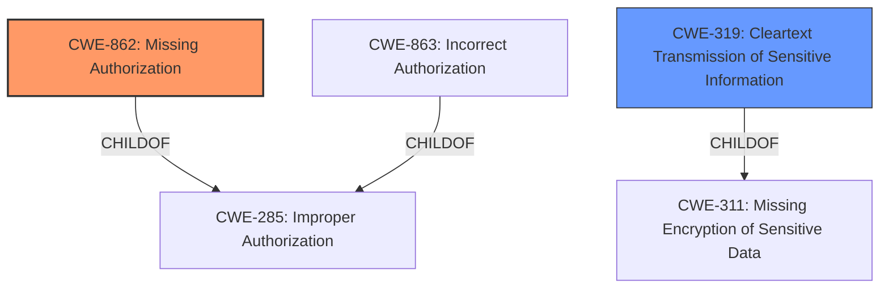

# Analysis for CVE-2021-21663

# Summary
| CWE ID  | CWE Name                        | Confidence | CWE Abstraction Level | CWE Vulnerability Mapping Label | CWE-Vulnerability Mapping Notes |
| :------- | :------------------------------ | :--------- | :-------------------- | :------------------------------ | :------------------------------ |
| CWE-862 | Missing Authorization           | 0.9        | Class                 | Allowed-with-Review              | Primary CWE                     |
| CWE-319 | Cleartext Transmission of Sensitive Information | 0.7        | Base                 | Allowed              | Secondary CWE                     |

## Evidence and Confidence

*   **Confidence Score:** 0.8
*   **Evidence Strength:** HIGH

## Relationship Analysis
The primary relationship influencing the selection was the ChildOf relationship, specifically how CWE-862 (Missing Authorization) and CWE-863 (Incorrect Authorization) are children of CWE-285 (Improper Authorization). Given the vulnerability description's focus on a **missing permission check**, CWE-862 was more appropriate than CWE-863 because there was no authorization check performed at all. Also, the relationships of CWE-319 with CWE-311 helped confirm the selection of CWE-319.

## Vulnerability Chain
The vulnerability chain begins with the **missing permission check** (CWE-862). This allows an attacker with Overall/Read permission to connect to an attacker-specified URL using attacker-specified credentials IDs. Ultimately, this leads to the capture of username/password credentials stored in Jenkins, which are then transmitted in cleartext (CWE-319).

## Summary of Analysis
The initial analysis strongly pointed towards CWE-862 (Missing Authorization) due to the explicit mention of a **missing permission check** in the vulnerability description and the CVE reference. The vulnerability description key phrases also clearly highlight this **missing permission check** as the root cause. The CVE reference summary further validates this by stating that the XebiaLabs XL Deploy Plugin "does not perform a proper permission check." The retriever results also list CWE-862 as the top candidate. Further, an attacker specified URL captures the username and password in clear text which means that they are transmitted in cleartext over the communication channel.

The decision to select CWE-862 and CWE-319 is based on the evidence provided and the CWE specifications. CWE-862 represents the root cause of the vulnerability, while CWE-319 represents the immediate impact. The selected CWEs are at the optimal level of specificity, accurately reflecting the nature of the weakness.

Relevant CWE Information:

# Enhanced Context (25 CWEs)

## CWE-319: Cleartext Transmission of Sensitive Information
**Abstraction Level**: Base
**Similarity Score**: 0.80
**Source**: dense

**Description**:
The product transmits sensitive or security-critical data in cleartext in a communication channel that can be sniffed by unauthorized actors.

**Mapping Guidance**:
- Usage: Allowed
- Rationale: This CWE entry is at the Base level of abstraction, which is a preferred level of abstraction for mapping to the root causes of vulnerabilities.

## CWE-862: Missing Authorization
**Abstraction Level:** Class
**Status:** Incomplete

### Description
The product does not perform an authorization check when an actor attempts to access a resource or perform an action.

### Observed Examples
- **CVE-2022-24730:** Go-based continuous deployment product does not check that a user has certain privileges to update or create an app, allowing adversaries to read sensitive repository information
- **CVE-2009-3168:** Web application does not restrict access to admin scripts, allowing authenticated users to reset administrative passwords.
- **CVE-2009-3597:** Web application stores database file under the web root with insufficient access control (CWE-219), allowing direct request.